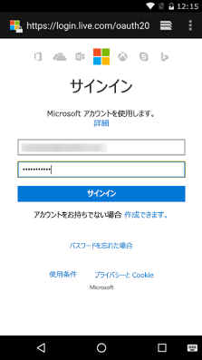

# <a name="get-started-with-microsoft-graph-in-an-android-app"></a><span data-ttu-id="983e5-101">Android アプリで Microsoft Graph を使ってみる</span><span class="sxs-lookup"><span data-stu-id="983e5-101">Get started with Microsoft Graph in an Android app</span></span>

> <span data-ttu-id="983e5-p101">**エンタープライズのお客様向けにアプリを作成していますか?**エンタープライズのお客様が、<a href="https://azure.microsoft.com/en-us/documentation/articles/active-directory-conditional-access-device-policies/" target="_newtab">条件付きのデバイスへのアクセス</a>のようなエンタープライズ モビリティ セキュリティの機能をオンにしている場合、アプリが動作しない可能性があります。その場合、気がつかないまま、お客様の側でエラーが発生してしまう可能性があります。</span><span class="sxs-lookup"><span data-stu-id="983e5-p101">**Building apps for enterprise customers?** Your app may not work if your enterprise customer turns on enterprise mobility security features like <a href="https://azure.microsoft.com/en-us/documentation/articles/active-directory-conditional-access-device-policies/" target="_newtab">conditional device access</a>. In this case, you may not know and your customers may experience errors.</span></span> 

> <span data-ttu-id="983e5-p102">**すべてのエンタープライズのお客様**の**すべてのエンタープライズ シナリオ**をサポートするには、Azure AD エンドポイントを使用し、[Azure 管理ポータル](https://aka.ms/aadapplist)でアプリを管理する必要があります。詳細については、「[Azure AD か Azure AD v2.0 エンドポイントかを決定する](../concepts/auth_overview.md#deciding-between-the-azure-ad-and-azure-ad-v20-endpoints)」を参照してください。</span><span class="sxs-lookup"><span data-stu-id="983e5-p102">To support **all enterprise customers** across **all enterprise scenarios**, you must use the Azure AD endpoint and manage your apps using the [Azure Management Portal](https://aka.ms/aadapplist). For more information, see [Deciding between the Azure AD and Azure AD v2.0 endpoints](../concepts/auth_overview.md#deciding-between-the-azure-ad-and-azure-ad-v20-endpoints).</span></span>

<span data-ttu-id="983e5-p103">この記事では、Azure AD v2.0 エンドポイントからアクセス トークンを取得し、Microsoft Graph を呼び出すために必要なタスクについて説明します。ここでは、[Android 用接続サンプル](https://github.com/microsoftgraph/android-java-connect-sample)のビルドの手順と、Android 用アプリで Microsoft Graph を使用するために実施する主要な概念について説明します。またこの記事では、[Microsoft Graph SDK for Android](https://github.com/microsoftgraph/msgraph-sdk-android) または未加工の REST 呼び出しを使用して Microsoft Graph にアクセスする方法についても説明します。</span><span class="sxs-lookup"><span data-stu-id="983e5-p103">This article describes the tasks required to get an access token from the Azure AD v2.0 endpoint and call Microsoft Graph. It walks you through building the [Connect Sample for Android](https://github.com/microsoftgraph/android-java-connect-sample) and explains the main concepts that you implement to use Microsoft Graph in your app for Android. The article also describes how to access Microsoft Graph by using either the [Microsoft Graph SDK for Android](https://github.com/microsoftgraph/msgraph-sdk-android) or raw REST calls.</span></span>

<span data-ttu-id="983e5-110">Android 用アプリで Microsoft Graph を使用するには、以下のスクリーンショットに示すような Microsoft のサインイン ページをユーザーに表示する必要があります。</span><span class="sxs-lookup"><span data-stu-id="983e5-110">To use Microsoft Graph in your app for Android, you need to show the Microsoft sign in page to your users, as shown in the following screenshot.</span></span>



<span data-ttu-id="983e5-p104">**アプリを作成してみたくありませんか。**この記事の基になっている [Android 用接続サンプル](https://github.com/microsoftgraph/android-java-connect-sample)をダウンロードすれば、すぐに始めることができます。</span><span class="sxs-lookup"><span data-stu-id="983e5-p104">**Don't feel like building an app?** Get up and running fast by downloading the [Connect Sample for Android](https://github.com/microsoftgraph/android-java-connect-sample) that this article is based on.</span></span>


## <a name="prerequisites"></a><span data-ttu-id="983e5-114">前提条件</span><span class="sxs-lookup"><span data-stu-id="983e5-114">Prerequisites</span></span>

<span data-ttu-id="983e5-115">開始するには、次のものが必要です。</span><span class="sxs-lookup"><span data-stu-id="983e5-115">To get started, you'll need:</span></span> 

- <span data-ttu-id="983e5-116">[Microsoft アカウント](https://www.outlook.com/)か[職場または学校アカウント](http://dev.office.com/devprogram)</span><span class="sxs-lookup"><span data-stu-id="983e5-116">A [Microsoft account](https://www.outlook.com/) or a [work or school account](http://dev.office.com/devprogram)</span></span>
- <span data-ttu-id="983e5-117">Android Studio 2.0 以降のバージョン</span><span class="sxs-lookup"><span data-stu-id="983e5-117">Android Studio 2.0 or newer version</span></span>


## <a name="configure-a-new-project"></a><span data-ttu-id="983e5-118">新規プロジェクトを構成する</span><span class="sxs-lookup"><span data-stu-id="983e5-118">Configure a new project</span></span>

<span data-ttu-id="983e5-119">[Android 用接続サンプル](https://github.com/microsoftgraph/android-java-connect-sample)をダウンロードしている場合は、この手順をスキップしてください。</span><span class="sxs-lookup"><span data-stu-id="983e5-119">If you have downloaded the [Connect Sample for Android](https://github.com/microsoftgraph/android-java-connect-sample), skip this step.</span></span> 

<span data-ttu-id="983e5-p105">Android Studio で新しいプロジェクトを開始します。ほとんどのウィザードで既定値のままにしておきますが、次のオプションを選択するようにしてください。</span><span class="sxs-lookup"><span data-stu-id="983e5-p105">Start a new project in Android Studio. You can leave the default values for most of the wizard, just make sure to choose the following options:</span></span>

* <span data-ttu-id="983e5-122">ターゲット Android デバイス - **携帯電話とタブレット**</span><span class="sxs-lookup"><span data-stu-id="983e5-122">Target Android Devices - **Phone and Tablet**</span></span>
    * <span data-ttu-id="983e5-123">最小 SDK - **API 16:Android 4.1 (Jelly Bean)**</span><span class="sxs-lookup"><span data-stu-id="983e5-123">Minimum SDK - **API 16: Android 4.1 (Jelly Bean)**</span></span>
* <span data-ttu-id="983e5-124">モバイルにアクティビティを追加 - **基本的なアクティビティ**</span><span class="sxs-lookup"><span data-stu-id="983e5-124">Add an Activity to Mobile - **Basic Activity**</span></span>
 
<span data-ttu-id="983e5-125">これにより、Android プロジェクトにアクティビティとユーザーの認証に使用できるボタンが追加されます。</span><span class="sxs-lookup"><span data-stu-id="983e5-125">This provides you with an Android project with an activity and a button that you can use to authenticate the user.</span></span>


## <a name="register-the-application"></a><span data-ttu-id="983e5-126">アプリケーションを登録する</span><span class="sxs-lookup"><span data-stu-id="983e5-126">Register the application</span></span>

<span data-ttu-id="983e5-127">接続サンプルをダウンロードした場合でも、新しいプロジェクトを作成した場合でも、[Microsoft アプリ登録ポータル](https://apps.dev.microsoft.com/)でアプリを登録する必要があります。</span><span class="sxs-lookup"><span data-stu-id="983e5-127">You need to register your app on the [Microsoft App Registration Portal](https://apps.dev.microsoft.com/) whether you've downloaded the connect sample or created a new project.</span></span>

<span data-ttu-id="983e5-p106">Microsoft アプリ登録ポータルでアプリを登録します。これにより、アプリの構成に使用するアプリ ID が生成されます。</span><span class="sxs-lookup"><span data-stu-id="983e5-p106">Register an app on the Microsoft App Registration Portal. This generates the app ID that you'll use to configure the app.</span></span>

1. <span data-ttu-id="983e5-130">個人用アカウント、あるいは職場または学校アカウントのいずれかを使用して、[Microsoft アプリ登録ポータル](https://apps.dev.microsoft.com/)にサインインします。</span><span class="sxs-lookup"><span data-stu-id="983e5-130">Sign into the [Microsoft App Registration Portal](https://apps.dev.microsoft.com/) using either your personal or work or school account.</span></span>

2. <span data-ttu-id="983e5-131">**[アプリの追加]** を選択します。</span><span class="sxs-lookup"><span data-stu-id="983e5-131">Choose **Add an app**.</span></span>

><span data-ttu-id="983e5-132">ヒント: [Android 用接続サンプル](https://github.com/microsoftgraph/android-java-connect-sample)をダウンロードし、その登録のみを行う場合は、**[作成]** ボタンを押す前に**[ガイド付きセットアップ]** のチェックを外してください。</span><span class="sxs-lookup"><span data-stu-id="983e5-132">Tip: If you have downloaded the [Connect Sample for Android](https://github.com/microsoftgraph/android-java-connect-sample) and are just creating a registration for it, uncheck **Guided Setup** before chosing the **Create** button.</span></span>

3. <span data-ttu-id="983e5-133">アプリの名前を入力して、**[作成]** を選択します。</span><span class="sxs-lookup"><span data-stu-id="983e5-133">Enter a name for the app, and choose **Create**.</span></span> 
    
    <span data-ttu-id="983e5-134">**ガイド付きセットアップ** のフローは次のようになります。</span><span class="sxs-lookup"><span data-stu-id="983e5-134">For the  **Guided Setup** flow:</span></span>
 
    <span data-ttu-id="983e5-p107">a.**[モバイルおよびデスクトップ アプリ]** を選択して、作成するアプリの種類を定義します。</span><span class="sxs-lookup"><span data-stu-id="983e5-p107">a. Choose **Mobile and Desktop App** to define the kind of app you are creating.</span></span>

    <span data-ttu-id="983e5-p108">b.**[Android]** を選択して、使用しているモバイル テクノロジを定義します。</span><span class="sxs-lookup"><span data-stu-id="983e5-p108">b. Choose **Android** to define the mobile technology you are using.</span></span>

    <span data-ttu-id="983e5-p109">c.最初のトピックを確認し、終了したら、ページの最後にある**[セットアップ]** ボタンをクリックします。</span><span class="sxs-lookup"><span data-stu-id="983e5-p109">c. Review the introductory topic and when finished, click the **Setup** button at the end of the page.</span></span>

    <span data-ttu-id="983e5-p110">d.**[セットアップ]** の手順の説明に従って、MSAL ライブラリをアプリの build.gradle に追加します。</span><span class="sxs-lookup"><span data-stu-id="983e5-p110">d. Follow the instructions on the **Setup** step to add the MSAL library to your app build.gradle.</span></span>

    <span data-ttu-id="983e5-p111">e.**[ユーザー]** の手順の指示に従って、MSAL ロジックを新しいプロジェクトに追加します。</span><span class="sxs-lookup"><span data-stu-id="983e5-p111">e. Follow the directions on the **Use** step to add MSAL logic to your new project</span></span>

    <span data-ttu-id="983e5-p112">f.**[構成]**ページで、ポータルによって独自のアプリケーション ID が作成されています。これを使用してアプリを構成します。</span><span class="sxs-lookup"><span data-stu-id="983e5-p112">f. On the **Configure** page, the portal has created a unique application ID for you. Use it to configure your app.</span></span>

    <span data-ttu-id="983e5-148">ガイドなしのフローは次のようになります。</span><span class="sxs-lookup"><span data-stu-id="983e5-148">For the unguided flow:</span></span>

    <span data-ttu-id="983e5-149">登録ページが表示され、アプリのプロパティが一覧表示されます。</span><span class="sxs-lookup"><span data-stu-id="983e5-149">The registration page displays, listing the properties of your app.</span></span>

    <span data-ttu-id="983e5-p113">a.アプリケーション ID をコピーします。これは、アプリの一意識別子です。</span><span class="sxs-lookup"><span data-stu-id="983e5-p113">a. Copy the application ID. This is the unique identifier for your app.</span></span> 

    <span data-ttu-id="983e5-p114">b.**[プラットフォームの追加]** および **[ネイティブ アプリケーション]** を選択します。</span><span class="sxs-lookup"><span data-stu-id="983e5-p114">b. Choose **Add Platform** and **Native Application**.</span></span>

    > <span data-ttu-id="983e5-p115">**注:** アプリケーション登録ポータルでは、値 *msalENTER_YOUR_CLIENT_ID://auth* のリダイレクト URI が表示されます。組み込みリダイレクト URI は使用しないでください。[Android 用接続サンプル](https://github.com/microsoftgraph/android-java-connect-sample)には、このリダイレクト URI を必要とする MSAL 認証ライブラリが実装されています。[サポートされているサード パーティ製ライブラリ](https://docs.microsoft.com/en-us/azure/active-directory/develop/active-directory-v2-libraries#compatible-client-libraries)または **ADAL** ライブラリを使用している場合は、組み込みのリダイレクト URI を使用する必要があります。</span><span class="sxs-lookup"><span data-stu-id="983e5-p115">**Note:** The Application Registration Portal provides a Redirect URI with a value of *msalYOUR NEW APP ID://auth*. Do not use the built-in redirect URIs. The [Connect Sample for Android](https://github.com/microsoftgraph/android-java-connect-sample) implements the MSAL authentication library which requires this redirect URI. If using a [supported third party library](https://docs.microsoft.com/en-us/azure/active-directory/develop/active-directory-v2-libraries#compatible-client-libraries) or the **ADAL** library then you must use the built-in redirect URIs.</span></span>


    <span data-ttu-id="983e5-p116">a.委任されたアクセス許可を追加します。**profile**、**Mail.ReadWrite**、**Mail.Send**、**Files.ReadWrite**、**User.ReadBasic.All** が必要になります。</span><span class="sxs-lookup"><span data-stu-id="983e5-p116">a. Add delegated permissions. You'll need **profile**, **Mail.ReadWrite**, **Mail.Send**, **Files.ReadWrite**, and **User.ReadBasic.All**.</span></span> 
   
    <span data-ttu-id="983e5-p117">b.**[保存]** を選択します。</span><span class="sxs-lookup"><span data-stu-id="983e5-p117">b. Choose **Save**.</span></span>


## <a name="authenticate-the-user-and-get-an-access-token"></a><span data-ttu-id="983e5-163">ユーザーの認証とアクセス トークンの取得</span><span class="sxs-lookup"><span data-stu-id="983e5-163">Authenticate the user and get an access token</span></span>

> <span data-ttu-id="983e5-p118">**注:**アプリケーション登録ポータルから **[ガイド付きセットアップ]** のフローの指示に従って新しいアプリケーションを作成した場合は、これらの手順をスキップできます。Graph API の詳細については、「[Microsoft Graph SDK を使用して Microsoft Graph を呼び出す](#call-microsoft-graph-using-the-microsoft-graph-sdk)」に移動してください。</span><span class="sxs-lookup"><span data-stu-id="983e5-p118">**Note:** If you followed the instructions in the **Guided Setup** flow from the application registration portal to create a new application, you can skip these steps. Go to [Call Microsoft Graph using the Microsoft Graph SDK](#call-microsoft-graph-using-the-microsoft-graph-sdk) to learn more about the Graph API.</span></span>

<span data-ttu-id="983e5-166">追加した MSAL と Microsoft Graph コードについては、「[Android 用接続サンプル](https://github.com/microsoftgraph/android-java-connect-sample)」で説明します。</span><span class="sxs-lookup"><span data-stu-id="983e5-166">Let's walk through the [Connect Sample for Android](https://github.com/microsoftgraph/android-java-connect-sample) to learn about the MSAL and Microsoft Graph code we've added.</span></span>

### <a name="add-the-dependency-to-appbuildgradle"></a><span data-ttu-id="983e5-167">app/build.gradle に依存関係を追加する</span><span class="sxs-lookup"><span data-stu-id="983e5-167">Add the dependency to app/build.gradle</span></span>

<span data-ttu-id="983e5-168">アプリのモジュールで `build.gradle` ファイルを開き、次の依存関係を検索します。</span><span class="sxs-lookup"><span data-stu-id="983e5-168">Open the `build.gradle` file in the app module and find the following dependency:</span></span>

```gradle
    compile ('com.microsoft.identity.client:msal:0.1.+') {
        exclude group: 'com.android.support', module: 'appcompat-v7'
    }
    compile 'com.android.volley:volley:1.0.0'

```

### <a name="start-the-authentication-flow"></a><span data-ttu-id="983e5-169">認証フローの開始</span><span class="sxs-lookup"><span data-stu-id="983e5-169">Start the authentication flow</span></span>

1. <span data-ttu-id="983e5-170">**AuthenticationManager** ファイルを開きます。**PublicClientApplication** オブジェクトの宣言を検索し、次に **getInstance** メソッドでインスタンスを検索します。</span><span class="sxs-lookup"><span data-stu-id="983e5-170">Open the **AuthenticationManager** file and find the **PublicClientApplication** object declaration and then the instation in the **getInstance** method.</span></span>

   ```java
    private static PublicClientApplication mPublicClientApplication;
    ....

    public static synchronized AuthenticationManager getInstance() {
        if (INSTANCE == null) {
            INSTANCE = new AuthenticationManager();
            if (mPublicClientApplication == null) {
                mPublicClientApplication = new PublicClientApplication(Connect.getInstance());
            }
        }
        return INSTANCE;
    }

   ```


2. <span data-ttu-id="983e5-p119">**ConnectActivity** クラスで、**mConnectButton** のクリック イベントのイベント ハンドラーを検索します。**onClick** メソッドを検索して、関連するコードを確認します。</span><span class="sxs-lookup"><span data-stu-id="983e5-p119">In the **ConnectActivity** class, locate the event handler for the click event of the **mConnectButton**. Find the **onClick** method and review relevant code.</span></span>
  
    <span data-ttu-id="983e5-p120">**connect** メソッドは個人情報 (PII) のログ収集を有効にし、サンプルのヘルパー クラス **AuthenticationManager** のインスタンスを取得し、MSAL プラットフォームのオブジェクトのユーザー コレクションを取得します。ユーザーが存在しない場合、新しいユーザーは Azure AD の認証と承認フローに移動されます。それ以外の場合は、メッセージなしで認証トークンを取得します。</span><span class="sxs-lookup"><span data-stu-id="983e5-p120">The **connect** method enables personally identifyable information (PII) logging, gets an instance of the sample helper class **AuthenticationManager**, and gets the MSAL platform object users collection. If there are no users, the new user is taken to the Azure AD authentication and authorization flow. Otherwise, an authentication token is obtained silently.</span></span>

   ```java
    @Override
    public void onClick(View view) {
        ....
        connect();
    }

        private void connect() {

        if (mEnablePiiLogging) {
            Logger.getInstance().setEnablePII(true);
        } else {
            Logger.getInstance().setEnablePII(false);
        }

        AuthenticationManager mgr = AuthenticationManager.getInstance();

        List<User> users = null;

        try {
            users = mgr.getPublicClient().getUsers();

            if (users != null && users.size() == 1) {
                mUser = users.get(0);
                mgr.callAcquireTokenSilent(mUser, true, this);
            } else {
                mgr.callAcquireToken(
                        this,
                        this);
            }
        } catch (MsalClientException e) {
            Log.d(TAG, "MSAL Exception Generated while getting users: " + e.toString());

        } catch (IndexOutOfBoundsException e) {
            Log.d(TAG, "User at this position does not exist: " + e.toString());
        }
    }

   ```
3. <span data-ttu-id="983e5-p121">ユーザーが認証ダイアログを閉じたときに Azure AD によって生成された Azure AD のリダイレクト応答を処理するイベント ハンドラーを検索します。このハンドラーは、**ConnectActivity** クラスにあります。</span><span class="sxs-lookup"><span data-stu-id="983e5-p121">Find the event handler that processes the Azure AD redirect response generated by Azure AD when the user closes the authintication dialog. This handler is in the **ConnectActivity** class.</span></span>

   ```java
       /**
     * Handles redirect response from https://login.microsoftonline.com/common and
     * notifies the MSAL library that the user has completed the authentication
     * dialog
     * @param requestCode
     * @param resultCode
     * @param data
     */
    @Override
    protected void onActivityResult(int requestCode, int resultCode, Intent data) {
        super.onActivityResult(requestCode, resultCode, data);
        if (AuthenticationManager
                .getInstance()
                .getPublicClient() != null) {
            AuthenticationManager
                    .getInstance()
                    .getPublicClient()
                    .handleInteractiveRequestRedirect(requestCode, resultCode, data);
        }
    }

   ```    
3. <span data-ttu-id="983e5-178">Graph API の呼び出しで使用される認証トークンをキャッシュする、認証コールバック メソッドを検索します。</span><span class="sxs-lookup"><span data-stu-id="983e5-178">Find the authentication callback method that caches the authentication token that is used in Graph API calls.</span></span>

 

```java
    /* Callback used for interactive request.  If succeeds we use the access
         * token to call the Microsoft Graph. Does not check cache
         */
    private AuthenticationCallback getAuthInteractiveCallback() {
        return new AuthenticationCallback() {
            @Override
            public void onSuccess(AuthenticationResult authenticationResult) {
            /* Successfully got a token, call graph now */
                Log.d(TAG, "Successfully authenticated");
                Log.d(TAG, "ID Token: " + authenticationResult.getIdToken());

            /* Store the auth result */
                mAuthResult = authenticationResult;
                if (mActivityCallback != null)
                    mActivityCallback.onSuccess(mAuthResult);
            }

            @Override
            public void onError(MsalException exception) {
            /* Failed to acquireToken */
                Log.d(TAG, "Authentication failed: " + exception.toString());
                if (mActivityCallback != null)
                    mActivityCallback.onError(exception);
            }

            @Override
            public void onCancel() {
            /* User canceled the authentication */
                Log.d(TAG, "User cancelled login.");
            }
        };
    }

```
    
<span data-ttu-id="983e5-p122">接続サンプルのアプリでは、メインのアクティビティに **[接続]** ボタンがあります。初回使用時にボタンを押すと、デバイスのブラウザーを使用した認証ページがアプリに表示されます。次の手順は、認証サーバーがリダイレクト URI にコードを送信してアクセス トークンと交換する作業です。</span><span class="sxs-lookup"><span data-stu-id="983e5-p122">The connect sample app has a **Connect** button on the main activity. If you press the button, on first use, the app presents an authentication page using the device's browser. The next step is to handle the code that the authorization server sends to the redirect URI and exchange it for an access token.</span></span>

### <a name="exchange-the-authorization-code-for-an-access-token"></a><span data-ttu-id="983e5-182">認証コードとアクセス トークンの交換</span><span class="sxs-lookup"><span data-stu-id="983e5-182">Exchange the authorization code for an access token</span></span>

<span data-ttu-id="983e5-183">アクセス トークンと交換できるコードが含まれている認証サーバーの応答をアプリが処理できるようにする必要があります。</span><span class="sxs-lookup"><span data-stu-id="983e5-183">You need to make your app ready to handle the authorization server response, which contains a code that you can exchange for an access token.</span></span>

1. <span data-ttu-id="983e5-p123">Connect アプリがアプリケーション登録で構成されたリダイレクト URL への要求を処理できることを、Android システムに知らせる必要があります。これを行うには、**strings.xml** 文字列リソース ファイルを開き、次の子をプロジェクトの **\<application/\>** 要素に追加します。</span><span class="sxs-lookup"><span data-stu-id="983e5-p123">We need to tell the Android system that Connect app can handle requests to the redirect URL configured in the application registration. To do this open the **AndroidManifest** file and add the following children to the projects  **\<application/\>** element.</span></span>
   ```xml
   <!DOCTYPE resources [
       <!ENTITY clientId "ENTER_YOUR_CLIENT_ID">
       ]>

    ...
    <string name="client_Id">&clientId;</string>
    <string name="msalPrefix">msal&clientId;</string>

   ```

   <span data-ttu-id="983e5-186">文字列リソースは、**AndroidManifest.xml** ファイルで使用されます。</span><span class="sxs-lookup"><span data-stu-id="983e5-186">The string resources are used in the **AndroidManifest.xml** file.</span></span> <span data-ttu-id="983e5-187">**MSAL** ライブラリは、実行時にクライアント ID を読み込み、REST 応答を **BrowserTabActivity** に定義されているリダイレクト URL に返します。</span><span class="sxs-lookup"><span data-stu-id="983e5-187">The **MSAL** library reads the client ID at runtime and returns REST responses to the redirect URL defined for the **BrowserTabActivity**.</span></span>

    ```xml
        <uses-sdk tools:overrideLibrary="com.microsoft.identity.msal" />
        <application ...>
            ...
           <activity
               android:name="com.microsoft.identity.client.BrowserTabActivity">
               <intent-filter>
                   <action android:name="android.intent.action.VIEW" />
                   <category android:name="android.intent.category.DEFAULT" />
                   <category android:name="android.intent.category.BROWSABLE" />
                   <data android:scheme="@string/msalPrefix"
                       android:host="auth" />
               </intent-filter>
           </activity>
           <meta-data
               android:name="https://login.microsoftonline.com/common"
               android:value="authority string"/>
           <meta-data
               android:name="com.microsoft.identity.client.ClientId"
               android:value="@string/client_Id"/>
        </application>
    ```
2. <span data-ttu-id="983e5-p125">**MSAL**ライブラリは、登録ポータルによって割り当てられたアプリケーション ID にアクセスする必要があります。**MSAL ライブラリは、アプリケーション ID を「クライアント ID」として参照します**。これは、ライブラリのコンストラクターで渡したアプリケーション コンテキストからアプリケーション ID (クライアント ID) を取得します。</span><span class="sxs-lookup"><span data-stu-id="983e5-p125">The **MSAL** library needs access to the application Id assigned by the registration portal. **The MSAL library refers to the application Id as the "Client Id"**. It gets the application Id (Client Id) from the application context that you pass in the library constructor.</span></span> 

   ><span data-ttu-id="983e5-191">注:コンストラクターに文字列パラメーターを渡すことにより、実行時にクライアント ID を提供することもできます。</span><span class="sxs-lookup"><span data-stu-id="983e5-191">Note: You can also provide the client Id at run-time by passing a string parameter to the constructor.</span></span> 

3. <span data-ttu-id="983e5-p126">認証サーバーが応答を送信すると、アクティビティが呼び出されます。認証サーバーからの応答で、アクセス トークンを要求します。**AuthenticationManager** に移動し、クラス内で次のコードを検索します。</span><span class="sxs-lookup"><span data-stu-id="983e5-p126">The activity is invoked when the authorization server sends a response. Request an access token with the response from the authorization server. Go to your **AuthenticationManager** and find the following code in the class.</span></span>

   ```java
    /**
     * Authenticates the user and lets the user authorize the app for the requested permissions.
     * An authentication token is returned via the getAuthInteractiveCalback method
     * @param activity
     * @param authenticationCallback
     */
    public void connect(Activity activity, final MSALAuthenticationCallback authenticationCallback){
        mActivityCallback = authenticationCallback;
        mPublicClientApplication.acquireToken(
                activity, Constants.SCOPES, getAuthInteractiveCallback());
    }


     /* Callback used for interactive request.  If succeeds we use the access
         * token to call the Microsoft Graph. Does not check cache
         */
    private AuthenticationCallback getAuthInteractiveCallback() {
        return new AuthenticationCallback() {
            @Override
            public void onSuccess(AuthenticationResult authenticationResult) {
            /* Successfully got a token, call graph now */
                Log.d(TAG, "Successfully authenticated");
                Log.d(TAG, "ID Token: " + authenticationResult.getIdToken());

            /* Store the auth result */
                mAuthResult = authenticationResult;
                if (mActivityCallback != null)
                    mActivityCallback.onSuccess(mAuthResult);
            }

            @Override
            public void onError(MsalException exception) {
            /* Failed to acquireToken */
                Log.d(TAG, "Authentication failed: " + exception.toString());
                if (mActivityCallback != null)
                    mActivityCallback.onError(exception);
            }

            @Override
            public void onCancel() {
            /* User canceled the authentication */
                Log.d(TAG, "User cancelled login.");
            }
        };
    }

     /**
     * Returns the access token obtained in authentication
     *
     * @return mAccessToken
     */
    public String getAccessToken() throws AuthenticatorException, IOException, OperationCanceledException {
        return  mAuthResult.getAccessToken();
    }

   ```


## <a name="call-microsoft-graph"></a><span data-ttu-id="983e5-195">Microsoft Graph を呼び出す</span><span class="sxs-lookup"><span data-stu-id="983e5-195">Call Microsoft Graph</span></span>
<span data-ttu-id="983e5-196">[Microsoft Graph SDK](#call-microsoft-graph-using-the-microsoft-graph-sdk) または [Microsoft Graph REST API](#call-microsoft-graph-using-the-microsoft-graph-rest-api) を使用して、Microsoft Graph を呼び出すことができます。</span><span class="sxs-lookup"><span data-stu-id="983e5-196">You can [use the Microsoft Graph SDK](#call-microsoft-graph-using-the-microsoft-graph-sdk) or the [Microsoft Graph REST API](#call-microsoft-graph-using-the-microsoft-graph-rest-api) to call Microsoft Graph.</span></span>

### <a name="call-microsoft-graph-using-the-microsoft-graph-sdk"></a><span data-ttu-id="983e5-197">Microsoft Graph SDK を使用して Microsoft Graph を呼び出す</span><span class="sxs-lookup"><span data-stu-id="983e5-197">Call Microsoft Graph using the Microsoft Graph SDK</span></span>
<span data-ttu-id="983e5-p127">[Microsoft Graph SDK for Android](https://github.com/microsoftgraph/msgraph-sdk-android) では、要求をビルドして Microsoft Graph からの結果を処理するクラスを作成できます。以下の手順に従って Microsoft Graph SDK を使用します。</span><span class="sxs-lookup"><span data-stu-id="983e5-p127">The [Microsoft Graph SDK for Android](https://github.com/microsoftgraph/msgraph-sdk-android) provides classes that build requests and process results from Microsoft Graph. Follow these steps to use the Microsoft Graph SDK.</span></span>

1. <span data-ttu-id="983e5-p128">アプリにインターネット アクセス許可を付与します。**AndroidManifest** ファイルを開き、マニフェスト要素に次の子を追加します。</span><span class="sxs-lookup"><span data-stu-id="983e5-p128">Add Internet permissions to your app. Open the **AndroidManifest** file and add the following child to the manifest element.</span></span>
    ```xml
    <uses-permission android:name="android.permission.INTERNET" />
    <uses-permission android:name="android.permission.ACCESS_NETWORK_STATE" />
    <uses-permission android:name="android.permission.READ_EXTERNAL_STORAGE" />
    <uses-permission android:name="android.permission.WRITE_EXTERNAL_STORAGE" />

    ```

2. <span data-ttu-id="983e5-202">Microsoft Graph SDK および GSON に依存関係を追加します。</span><span class="sxs-lookup"><span data-stu-id="983e5-202">Add dependencies to the Microsoft Graph SDK and GSON.</span></span>
   ```gradle
    compile 'com.microsoft.graph:msgraph-sdk-android:1.3.2'
    compile 'com.google.code.gson:gson:2.7'
   ```


3. <span data-ttu-id="983e5-p129">**uthenticateRequest** ヘルパー メソッドを使用して、新しい要求に認証トークンを追加します。このメソッドは同じメソッドを Microsoft Graph 認証の **IAuthenticationProvider** インターフェイスから実装します</span><span class="sxs-lookup"><span data-stu-id="983e5-p129">Add authentication token to new requests using the **uthenticateRequest** helper method. This method implements the same method from the Microsoft Graph Authentication **IAuthenticationProvider** interface</span></span>
    
   ```java
    /**
     * Appends an access token obtained from the {@link AuthenticationManager} class to the
     * Authorization header of the request.
     * @param request
     */
    @Override
    public void authenticateRequest(IHttpRequest request)  {
        try {
            request.addHeader("Authorization", "Bearer "
                    + AuthenticationManager.getInstance()
                    .getAccessToken());
            // This header has been added to identify this sample in the Microsoft Graph service.
            // If you're using this code for your project please remove the following line.
            request.addHeader("SampleID", "android-java-connect-sample");
        } catch (AuthenticatorException e) {
            e.printStackTrace();
        } catch (IOException e) {
            e.printStackTrace();
        }  catch (OperationCanceledException e) {
            e.printStackTrace();
        } catch (NullPointerException e) {
            e.printStackTrace();
        }
    }
   ```

4. <span data-ttu-id="983e5-205">下書き電子メールを作成し、**GraphServiceController** ヘルパー クラスから次のヘルパー メソッドを使用して送信します。</span><span class="sxs-lookup"><span data-stu-id="983e5-205">Create a draft email and send it using the following helper methods from the **GraphServiceController** helper class.</span></span>

   ```java
    /**
     * Creates a draft email message using the Microsoft Graph API on Office 365. The mail is sent
     * from the address of the signed in user.
     *
     * @param senderPreferredName The mail senders principal user name (email addr)
     * @param emailAddress        The recipient email address.
     * @param subject             The subject to use in the mail message.
     * @param body                The body of the message.
     * @param callback            The callback method to invoke on completion of the POST request
     */
    public void createDraftMail(
            final String senderPreferredName,
            final String emailAddress,
            final String subject,
            final String body,
            ICallback<Message> callback
    ) {
        try {
            // create the email message
            Message message = createMessage(subject, body, emailAddress);
            mGraphServiceClient
                    .getMe()
                    .getMessages()
                    .buildRequest()
                    .post(message, callback);

        } catch (Exception ex) {
            showException(ex, "exception on send mail","Send mail failed", "The send mail method failed");
        }
    }

        /**
     * Creates a new Message object 
     */
    Message createMessage(
            String subject,
            String body,
            String address) {

        if (address == null || address.isEmpty()) {
            throw new IllegalArgumentException("The address parameter can't be null or empty.");
        } else {
            // perform a simple validation of the email address
            String addressParts[] = address.split("@");
            if (addressParts.length != 2 || addressParts[0].length() == 0 || addressParts[1].indexOf('.') == -1) {
                throw new IllegalArgumentException(
                        String.format("The address parameter must be a valid email address {0}", address)
                );
            }
        }
        Message message = new Message();
        EmailAddress emailAddress = new EmailAddress();
        emailAddress.address = address;
        Recipient recipient = new Recipient();
        recipient.emailAddress = emailAddress;
        message.toRecipients = Collections.singletonList(recipient);
        ItemBody itemBody = new ItemBody();
        itemBody.content = body;
        itemBody.contentType = BodyType.html;
        message.body = itemBody;
        message.subject = subject;
        return message;
    }
    /**
     * Sends a draft message to the specified recipients
     *
     * @param messageId String. The id of the message to send
     * @param callback
     */
    public void sendDraftMessage(String messageId,
                                 ICallback<Void> callback) {
        try {

            mGraphServiceClient
                    .getMe()
                    .getMessages(messageId)
                    .getSend()
                    .buildRequest()
                    .post(callback);

        } catch (Exception ex) {
            showException(ex, "exception on send draft message ","Send draft mail failed", "The send draft mail method failed");
        }
    }

   ```
### <a name="call-microsoft-graph-using-the-microsoft-graph-rest-api"></a><span data-ttu-id="983e5-206">Microsoft Graph REST API を使用して Microsoft Graph を呼び出す</span><span class="sxs-lookup"><span data-stu-id="983e5-206">Call Microsoft Graph using the Microsoft Graph REST API</span></span>
<span data-ttu-id="983e5-p130">[Microsoft Graph REST API](http://developer.microsoft.com/en-us/graph/docs) は 1 つの REST API エンドポイントを介して複数の API を Microsoft クラウド サービスから公開するものです。以下の手順に従って、REST API を使用します。</span><span class="sxs-lookup"><span data-stu-id="983e5-p130">The [Microsoft Graph REST API](http://developer.microsoft.com/en-us/graph/docs) exposes multiple APIs from Microsoft cloud services through a single REST API endpoint. Follow these steps to use the REST API.</span></span>

1. <span data-ttu-id="983e5-p131">アプリにインターネット アクセス許可を付与します。**AndroidManifest** ファイルを開き、マニフェスト要素に次の子を追加します。</span><span class="sxs-lookup"><span data-stu-id="983e5-p131">Add Internet permissions to your app. Open the **AndroidManifest** file and add the following child to the manifest element.</span></span>
    ```xml
    <uses-permission android:name="android.permission.INTERNET" />
    ```

2. <span data-ttu-id="983e5-211">Volley HTTP ライブラリへの依存関係を追加します。</span><span class="sxs-lookup"><span data-stu-id="983e5-211">Add a dependency to the Volley HTTP library.</span></span>

    ```gradle
    compile 'com.android.volley:volley:1.0.0'
    ```
   
3. <span data-ttu-id="983e5-p132">行 `String accessToken = tokenResponse.accessToken;` を次のコードに置き換えます。**\<YOUR_EMAIL_ADDRESS\>** とマークされているプレースホルダーに電子メール アドレスを挿入します。</span><span class="sxs-lookup"><span data-stu-id="983e5-p132">Replace the line `String accessToken = tokenResponse.accessToken;` with the following code. Insert your email address in the placeholder marked with **\<YOUR_EMAIL_ADDRESS\>**.</span></span>
   ```java
    final String accessToken = tokenResponse.accessToken;

    final RequestQueue queue = Volley.newRequestQueue(getApplicationContext());
    String url ="https://graph.microsoft.com/v1.0/me/sendMail";
    final String body = "{" +
        "  Message: {" +
        "    subject: 'Sent using the Microsoft Graph REST API'," +
        "    body: {" +
        "      contentType: 'text'," +
        "      content: 'This is the email body'" +
        "    }," +
        "    toRecipients: [" +
        "      {" +
        "        emailAddress: {" +
        "          address: '<YOUR_EMAIL_ADDRESS>'" +
        "        }" +
        "      }" +
        "    ]}" +
        "}";

    final StringRequest stringRequest = new StringRequest(Request.Method.POST, url,
        new Response.Listener<String>() {
            @Override
            public void onResponse(String response) {
                Log.d("Response", response);
            }
        },
        new Response.ErrorListener() {
            @Override
            public void onErrorResponse(VolleyError error) {
                Log.d("ERROR","error => " + error.getMessage());
            }
        }
    ) {
        @Override
        public Map<String, String> getHeaders() throws AuthFailureError {
            Map<String,String> params = new HashMap<>();
            params.put("Authorization", "Bearer " + accessToken);
            params.put("Content-Length", String.valueOf(body.getBytes().length));
            return params;
        }
        @Override
        public String getBodyContentType() {
            return "application/json";
        }
        @Override
        public byte[] getBody() throws AuthFailureError {
            return body.getBytes();
        }
    };

    AsyncTask.execute(new Runnable() {
        @Override
        public void run() {
            queue.add(stringRequest);
        }
    });
   ```

## <a name="run-the-app"></a><span data-ttu-id="983e5-214">アプリの実行</span><span class="sxs-lookup"><span data-stu-id="983e5-214">Run the app</span></span>
<span data-ttu-id="983e5-215">Android アプリを試す準備ができました。</span><span class="sxs-lookup"><span data-stu-id="983e5-215">You're ready to try your Android app.</span></span>

1. <span data-ttu-id="983e5-216">Android エミュレーターを起動するか、物理デバイスをコンピューターに接続します。</span><span class="sxs-lookup"><span data-stu-id="983e5-216">Start your Android emulator or connect your physical device to your computer.</span></span>
2. <span data-ttu-id="983e5-217">Android Studio で、Shift キーを押しながら F10 キーを押してアプリを実行します。</span><span class="sxs-lookup"><span data-stu-id="983e5-217">In Android Studio, press Shift + F10 to run your app.</span></span>
3. <span data-ttu-id="983e5-218">配置ダイアログ ボックスから、Android のエミュレーターまたはデバイスを選択します。</span><span class="sxs-lookup"><span data-stu-id="983e5-218">Choose your Android emulator or device from the deployment dialog box.</span></span>
4. <span data-ttu-id="983e5-219">メインのアクティビティ内のフローティング アクション ボタンをタップします。</span><span class="sxs-lookup"><span data-stu-id="983e5-219">Tap the Floating Action Button on the main activity.</span></span>
5. <span data-ttu-id="983e5-220">個人用あるいは職場または学校アカウントでサインインし、要求されたアクセス許可を付与します。</span><span class="sxs-lookup"><span data-stu-id="983e5-220">Sign in with your personal or work or school account and grant the requested permissions.</span></span>
6. <span data-ttu-id="983e5-221">アプリの選択ダイアログで、アプリをタップして続行します。</span><span class="sxs-lookup"><span data-stu-id="983e5-221">In the app selection dialog, tap your app to continue.</span></span>

<span data-ttu-id="983e5-p133">["Microsoft Graph を呼び出す"](#call-microsoft-graph)で構成した電子メール アドレスの受信トレイを確認します。アプリへのサインインに使用したアカウントからのメールを受信しているはずです。</span><span class="sxs-lookup"><span data-stu-id="983e5-p133">Check the inbox of the email address that you configured in [Call Microsoft Graph](#call-microsoft-graph). You should have an email from the account that you used to sign in to the app.</span></span>

## <a name="next-steps"></a><span data-ttu-id="983e5-224">次の手順</span><span class="sxs-lookup"><span data-stu-id="983e5-224">Next steps</span></span>
- <span data-ttu-id="983e5-225">[Microsoft Graph エクスプローラー](https://developer.microsoft.com/graph/graph-explorer)を試してみましょう。</span><span class="sxs-lookup"><span data-stu-id="983e5-225">Try out the [Microsoft Graph explorer](https://developer.microsoft.com/graph/graph-explorer).</span></span>
- <span data-ttu-id="983e5-226">[Android 用のスニペットのサンプル](https://github.com/microsoftgraph/android-java-snippets-sample)で一般的な操作の例を見つけるか、GitHub で別の [Android サンプル](https://github.com/microsoftgraph?utf8=%E2%9C%93&query=android)を探します。</span><span class="sxs-lookup"><span data-stu-id="983e5-226">Find examples of common operations in the [Snippets Sample for Android](https://github.com/microsoftgraph/android-java-snippets-sample), or explore our other [Android samples](https://github.com/microsoftgraph?utf8=%E2%9C%93&query=android) on GitHub.</span></span>


## <a name="see-also"></a><span data-ttu-id="983e5-227">関連項目</span><span class="sxs-lookup"><span data-stu-id="983e5-227">See also</span></span>
- [<span data-ttu-id="983e5-228">Android 用 Microsoft Graph SDK</span><span class="sxs-lookup"><span data-stu-id="983e5-228">Microsoft Graph SDK for Android</span></span>](https://github.com/microsoftgraph/msgraph-sdk-android) 
- [<span data-ttu-id="983e5-229">Microsoft Graph を呼び出すためのトークンの取得</span><span class="sxs-lookup"><span data-stu-id="983e5-229">Get access tokens to call Microsoft Graph</span></span>](https://developer.microsoft.com/en-us/graph/docs/concepts/auth_overview)
- [<span data-ttu-id="983e5-230">ユーザーの代わりにアクセスを取得</span><span class="sxs-lookup"><span data-stu-id="983e5-230">Get access on behalf of a user</span></span>](https://developer.microsoft.com/en-us/graph/docs/concepts/auth_v2_user)
- [<span data-ttu-id="983e5-231">ユーザーなしでアクセスを取得</span><span class="sxs-lookup"><span data-stu-id="983e5-231">Get access without a user</span></span>](https://developer.microsoft.com/en-us/graph/docs/concepts/auth_v2_service)
