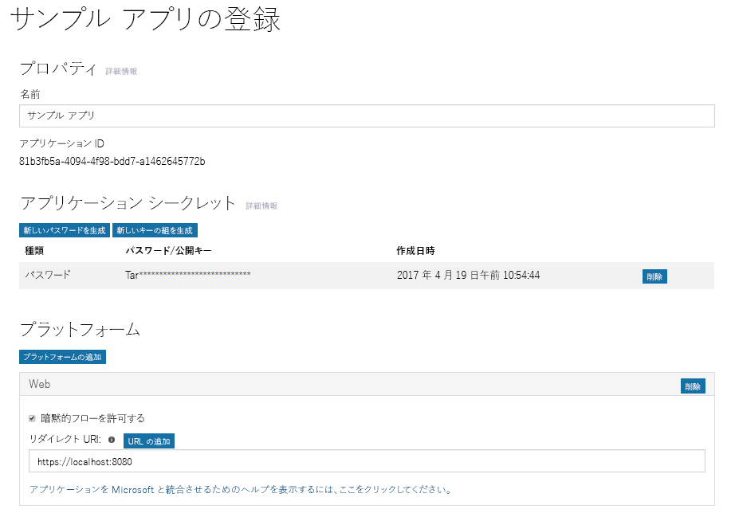

# アプリを Azure AD v2.0 エンドポイントに登録する

アプリは、Azure AD に登録する必要があります。アプリを登録すると、トークンの取得のための Azure AD での認証でアプリケーションが使用する一意のアプリケーション ID と他の値が確定します。Azure AD v2.0 エンドポイントの場合は、[Microsoft アプリ登録ポータル](https://apps.dev.microsoft.com)でアプリを登録します。アプリを登録するには、Microsoft アカウントのほか、職場または学校のアカウントを使用できます。開発するアプリケーションの種類によっては、アプリケーションの認証と承認の設定で 1 つまたは複数のプロパティをコピーする必要があります。 

> **注:** この記事では、主にアプリケーションの Azure AD v2.0 のエンドポイントへの登録ついて説明します。Azure AD のエンドポイントへのアプリケーションの登録に関する詳細は「[Azure AD エンドポイントについて考慮すべき事項](#azure-ad-endpoint-considerations)」を参照してください。
> 
> あらかじめ Microsoft Azure ポータルに登録済みのアプリはアプリ登録ポータルには表示されないため、ご注意ください。 それらのアプリは Azure ポータルで管理します。 

次のスクリーンショットは、パスワードと暗黙的フローを使用して構成された Web アプリの登録の例を示しています。

アプリを登録するには、以下の手順に従います。アプリの承認を設定するときには、指定された値をコピーして使用してください。

1. [Microsoft アプリ登録ポータル](https://apps.dev.microsoft.com/)にサインインします。
   
    Microsoft アカウントのほか、職場または学校のアカウントを使用してサインインできます。 

2. **[アプリの追加]** を選択します。
    > 注:職場または学校のアカウントを使用してサインインした場合は、署名する場合は、**統合アプリケーション**の **[アプリの追加]** ボタンを選択します。 

3. アプリの名前を入力して、**[アプリケーションの作成]** を選択します。

    登録ページが表示され、アプリのプロパティが一覧表示されます。

4. アプリケーション ID をコピーします。これは、アプリの一意識別子です。

    アプリを構成するには、アプリケーション ID を使用します。

5. **[プラットフォーム]** で、**[プラットフォームの追加]** を選び、アプリに適したプラットフォームを選びます。
    
    **ネイティブまたはモバイル アプリケーションでは**

    1. **[ネイティブ アプリケーション]** を選択します。

    2. **[組み込みリダイレクト URI]** の値をコピーします。このアプリを構成するため、後でこの値が必要になります。

        リダイレクト URI は、アプリケーションに提供される一意の URI であり、その URI に送信されたメッセージはそのアプリケーションだけに送信されます。 

    **Web アプリの場合**:

    1. **[Web]** を選びます。

    2. 使用している認証フローの種類によっては、**[暗黙的フローを許可する]** チェック ボックスが選択されていることを確認する必要があります。 
        
        **[暗黙的フローを許可する]** オプションにより、OpenID Connect ハイブリッド フローと暗黙的フローが有効になります。ハイブリッド フローにより、アプリはサインイン情報 (ID トークン) と成果物 (この場合は認証コード) の両方を受け取れるようになり、アプリはアクセス トークンを取得するときにこれらを使用できます。ハイブリッド フローは、OWIN OpenID Connect ミドルウェアが使用する既定のフローです。シングル ページ アプリ (SPA) では、アプリは暗黙的フローにより、サインイン情報とアクセス トークンを受け取ることができます。 

    3. リダイレクト URL を指定します。
        
        リダイレクト URL は、Azure AD v2.0 エンドポイントが認証要求処理を完了した際に呼び出す、アプリ内の場所です。

    4. **[アプリケーション シークレット]** で、**[新しいパスワードを生成する]** を選びます。**[新しいパスワードが生成されました]** ダイアログ ボックスからアプリケーション シークレットをコピーします。
        > **重要**:**[新しいパスワードが生成されました]** ダイアログを閉じる前に、アプリケーションの機密情報をコピーする必要があります。ダイアログ ボックスを閉じた後は、機密情報は取得できません。 
            
6. **[保存]** を選択します。

以下の表に、さまざまな種類のアプリケーションの設定とコピーに必要となるプロパティを示します。_割り当て済み_とは、Azure AD で割り当てられた値を使用する必要があることを示します。

| アプリの種類 | プラットフォーム | アプリケーション ID | アプリケーション シークレット | リダイレクト URI/URL | 暗黙的フロー 
| --- | --- | --- | --- | --- | --- |
| ネイティブ/モバイル | ネイティブ | 割り当て済み  | いいえ | 割り当て済み | いいえ |
| Web App | Web | 割り当て済み | はい | はい | 省略可能  既定で、Open ID Connect ミドルウェアでハイブリッド フローを使用する (はい) | 
| シングル ページ アプリ (SPA) | Web | 割り当て済み | はい | はい | はい   SPA で Open ID Connect 暗黙的フローを使用する |
| サービス/デーモン | Web | 割り当て済み | はい | はい | いいえ |

管理者の同意エクスペリエンスを提供するアプリケーションでは、応答を送信するために Azure AD のリダイレクト URL がもう一つ必要となることがあります。

アプリケーション登録ポータルとアプリケーション設定のプロパティに関する詳細は「[アプリの登録リファレンス](https://docs.microsoft.com/ja-JP/azure/active-directory/develop/active-directory-v2-registration-portal)」を参照してください。  

## Azure AD エンドポイントに関して考慮すべき事項

[Azure ポータル](https://aka.ms/aadapplist)は Azure AD エンドポイントのアプリを登録するために使用します。v 2.0 エンドポイントの場合と同様、アプリケーション ID、アプリケーションの機密情報、リダイレクト URI と URL などを設定します。ただし、これには注意すべき重要な違いがいくつかあります。 

- アプリケーションの登録には、職場または学校のアカウントのみを使用できます。
- アプリケーションには、プラットフォームごとのアプリケーション ID が必要です。
- アプリケーションがマルチ テナント アプリケーションの場合は、ポータルでマルチ テナントとなるよう明示的に設定する必要があります。
- アプリケーションがポータルで必要とするすべてのアクセス許可 (Microsoft Graph アクセス許可を含む) を事前に設定しておく必要があります。 

Azure ポータルを使用してアプリケーションを追加する方法の詳細については「[アプリを Azure Active Directory v2.0 エンドポイントに登録する](https://docs.microsoft.com/ja-JP/azure/active-directory/develop/quickstart-v2-register-an-app)」を参照してください。
