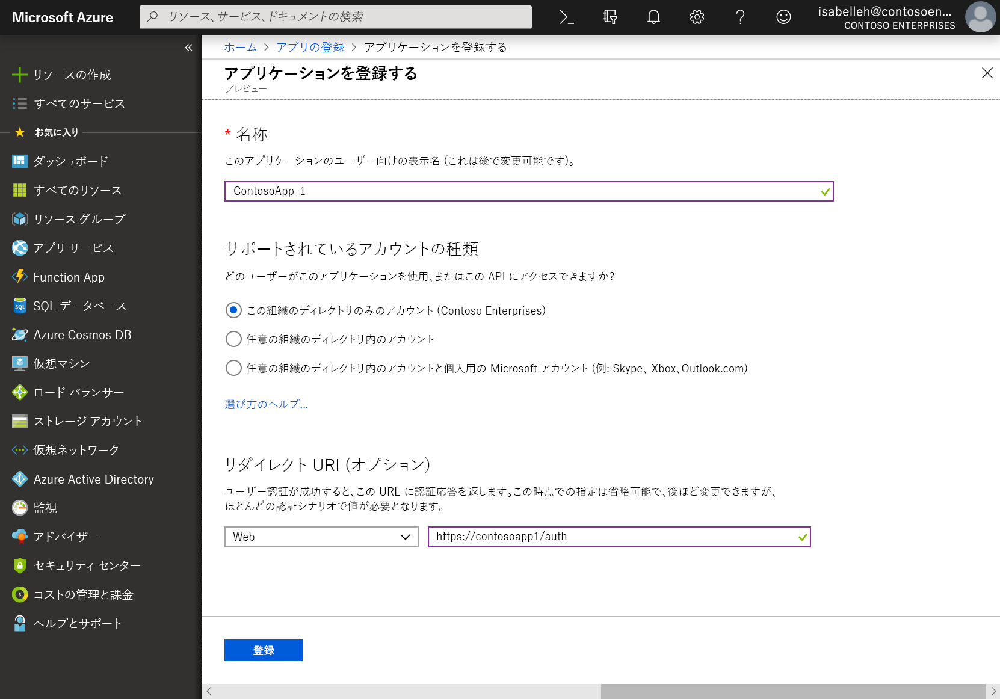
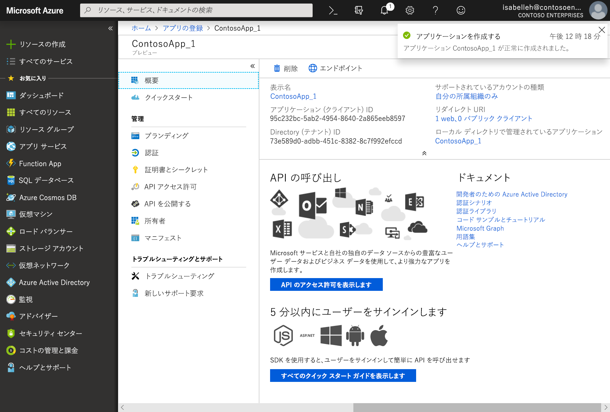

# Microsoft ID プラットフォームにアプリケーションを登録する

このページでは、Azure ポータルで**アプリの登録**エクスペリエンスを使用してアプリケーションを追加、登録し、Microsoft ID プラットフォームと統合して、Microsoft Graph を呼び出せるようにする方法を説明します。 

> [!VIDEO https://www.youtube-nocookie.com/embed/93j0MmRruFo]

## Microsoft Azure portal を使用して新しいアプリケーションを登録する

1. 職場または学校のアカウントか、個人の Microsoft アカウントを使用して、[Azure ポータル](https://portal.azure.com)にサインインします。
1. ご利用のアカウントで複数のテナントにアクセスできる場合は、右上でアカウントを選択し、ポータルのセッションを目的の Azure AD テナントに設定します。
1. 左側のナビゲーション ウィンドウで、[**Azure Active Directory**] サービスを選択し、[**アプリの登録] > [新規登録**] の順に選択します。
1. [**アプリケーションの登録**] ページが表示されたら、以下のアプリケーションの登録情報を入力します。

   - **名前** - アプリのユーザーに表示されるわかりやすいアプリケーション名を入力します。
   - **サポートされているアカウントの種類** - アプリケーションでサポートするアカウントを選択します。

       | サポートされているアカウントの種類 | 説明 |
       |-------------------------|-------------|
       | **この組織のディレクトリ内のアカウントのみ** | 基幹業務 (LOB) アプリケーションを作成している場合は、このオプションを選択します。 アプリケーションをディレクトリに登録していない場合、このオプションは選択できません。  このオプションは、Azure AD のシングルテナントにのみマッピングします。  これは、ディレクトリの外部にアプリを登録している場合を除き、既定のオプションです。 アプリがディレクトリの外部に登録されている場合、既定のオプションは Azure AD マルチテナントと個人の Microsoft アカウントです。 |
       | **組織のディレクトリ内のアカウント** | 企業および教育機関のすべてのユーザーを対象とする場合は、このオプションを選択します。  このオプションは、Azure AD のマルチテナントにのみマッピングします。  アプリを Azure AD のシングルテナントとしてのみ登録した場合は、[**認証**] ブレードを使用して、Azure AD マルチテナントに更新し、シングルテナントに戻すことができます。 |
       | **組織のディレクトリ内のアカウントと個人用 Microsoft アカウント** | 最も広い範囲の顧客を対象とする場合は、このオプションを選択します。  このオプションは、Azure AD マルチテナントと個人用 Microsoft アカウントにマッピングします。  アプリを Azure AD マルチテナントと個人用 Microsoft アカウントとして登録した場合は、UI でこれを変更できません。 代わりに、アプリケーション マニフェスト エディターを使用して、サポートされているアカウントの種類を変更する必要があります。 |

   - **リダイレクト URI (オプション) ** - 構築しているアプリの種類として **Web** または **パブリック クライアント (モバイルとデスクトップ)** を選択し、アプリケーションのリダイレクト URI (または応答 URL) を入力します。
       - Web アプリケーションの場合は、アプリのベース URL を指定します。 たとえば、`http://localhost:31544` はローカル マシンで実行されている Web アプリの URL になる場合があります。 ユーザーはこの URL を使用して、Web クライアント アプリケーションにサインインします。
       - パブリック クライアント アプリケーションの場合は、トークンの応答を返す際に Azure AD が使用する URI を指定します。 `myapp://auth` などのアプリケーションに固有の値を入力します。

     Web アプリケーションまたはネイティブ アプリケーションの具体的な例を見るには、「[クイック スタート](https://docs.microsoft.com/azure/active-directory/develop/#quickstarts)」を参照してください。

1. 終了したら、[**登録**] を選択します。

    

Azure AD によりアプリに一意のアプリケーション (クライアント) ID が割り当てられ、アプリケーションの [**概要**] ページに移動します。 アプリケーションにさらに機能を追加するには、ブランディング、証明書と秘密情報、API アクセス許可など、その他の構成オプションを選択できます。

## プラットフォーム固有のプロパティ

以下の表に、さまざまな種類のアプリケーションの設定とコピーに必要となるプロパティを示します。_割り当て済み_とは、Azure AD で割り当てられた値を使用する必要があることを示します。

| アプリの種類 | プラットフォーム | アプリケーション (クライアント) ID | クライアントの秘密情報 | リダイレクト URI/URL | 暗黙的フロー 
| --- | --- | --- | --- | --- | --- |
| ネイティブ/モバイル | ネイティブ | 割り当て済み  | いいえ | 割り当て済み | いいえ |
| Web App | Web | 割り当て済み | はい | はい | 省略可能  既定で、Open ID Connect ミドルウェアでハイブリッド フローを使用する (はい) | 
| シングル ページ アプリ (SPA) | Web | 割り当て済み | はい | はい | はい   SPA で Open ID Connect 暗黙的フローを使用する |
| サービス/デーモン | Web | 割り当て済み | はい | はい | いいえ |

## 次の手順

- [アクセス許可と同意](https://docs.microsoft.com/azure/active-directory/develop/v2-permissions-and-consent)に関する詳細を確認するか、「Microsoft Graph [アクセス許可のリファレンス](permissions-reference.md)」を表示します。
- アプリケーション登録で他の構成機能 (認証情報やアクセス許可など) を有効にするには、他のテナントのユーザー サインインを有効にし、以下のクイックスタートを参照してください。
  - [クライアント アプリケーションを構成して Web API にアクセスする](https://docs.microsoft.com/azure/active-directory/develop/quickstart-configure-app-access-web-apis)
  - [アプリケーションを構成して Web API を公開する](https://docs.microsoft.com/azure/active-directory/develop/quickstart-configure-app-expose-web-apis)
  - [アプリケーションがサポートしているアカウントを変更する](https://docs.microsoft.com/azure/active-directory/develop/quickstart-modify-supported-accounts)
- [[クイック スタート](https://docs.microsoft.com/azure/active-directory/develop/#quickstarts)] を選択して、迅速にアプリを構築し、トークンの取得、トークンの更新、ユーザーへのサインイン、一部のユーザー情報の表示といった機能を追加します。
- 登録されたアプリケーションを表す 2 つの Azure AD オブジェクトと、両者間の関係の詳細については、「[アプリケーション オブジェクトとサービス プリンシパル オブジェクト](https://docs.microsoft.com/azure/active-directory/develop/app-objects-and-service-principals)」へ。
- アプリ開発の際に使用するブランディング ガイドラインの詳細については、「[アプリケーションのブランド化ガイドライン](https://docs.microsoft.com/azure/active-directory/develop/howto-add-branding-in-azure-ad-apps)」へ。
