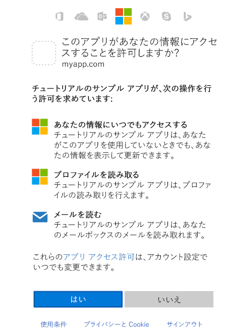

# <a name="get-access-on-behalf-of-a-user"></a><span data-ttu-id="00f94-106">ユーザーの代わりにアクセスを取得</span><span class="sxs-lookup"><span data-stu-id="00f94-106">Get access on behalf of a user</span></span>
<span data-ttu-id="00f94-p102">Microsoft Graph を使用してユーザーの代理としてリソースを読み取り/書き込みするには、Azure AD からアクセス トークンを取得し、Microsoft Graph に送信する要求にトークンを添付する必要があります。アクセス トークンの取得に使用する認証フローは、開発しているアプリの種類と、OpenID Connect を使用してユーザーがアプリにサインインするかどうかによって異なります。ネイティブ アプリ、モバイル アプリ、一部の Web アプリで使用される一般的なフローの 1 つに、OAuth 2.0 認証コードの付与フローがあります。このトピックでは、このフローの使用例について説明します。</span><span class="sxs-lookup"><span data-stu-id="00f94-p102">To use Microsoft Graph to read and write resources on behalf of a user, your app must get an access token from Azure AD and attach the token to requests that it sends to Microsoft Graph. The exact authentication flow that you will use to get access tokens will depend on the kind of app you are developing and whether you want to use OpenID Connect to sign the user in to your app. One common flow used by native and mobile apps and also by some Web apps is the OAuth 2.0 authorization code grant flow. In this topic, we will walk through an example using this flow.</span></span> 

## <a name="authentication-and-authorization-steps"></a><span data-ttu-id="00f94-111">認証および承認の手順</span><span class="sxs-lookup"><span data-stu-id="00f94-111">Authentication and Authorization steps</span></span>

<span data-ttu-id="00f94-112">Azure AD v2.0 エンドポイントからアクセス トークンを取得するために OAuth 2.0 認証コードの付与フローを使用する際に必要な基本手順は次のとおりです。</span><span class="sxs-lookup"><span data-stu-id="00f94-112">The basic steps required to use the OAuth 2.0 authorization code grant flow to get an access token from the Azure AD v2.0 endpoint are:</span></span>

1. <span data-ttu-id="00f94-113">Azure AD にアプリを登録する。</span><span class="sxs-lookup"><span data-stu-id="00f94-113">Register your app with Azure AD.</span></span> 
2. <span data-ttu-id="00f94-114">承認を取得する。</span><span class="sxs-lookup"><span data-stu-id="00f94-114">Get authorization.</span></span> 
3. <span data-ttu-id="00f94-115">アクセス トークンを取得する。</span><span class="sxs-lookup"><span data-stu-id="00f94-115">Get an access token.</span></span>
4. <span data-ttu-id="00f94-116">アクセス トークンを使用して Microsoft Graph を呼び出す。</span><span class="sxs-lookup"><span data-stu-id="00f94-116">Call Microsoft Graph with the access token.</span></span>
5. <span data-ttu-id="00f94-117">更新トークンを使用して新しいアクセス トークンを取得する。</span><span class="sxs-lookup"><span data-stu-id="00f94-117">Use a refresh token to get a new access token.</span></span>

## <a name="1-register-your-app"></a><span data-ttu-id="00f94-118">1.アプリを登録する</span><span class="sxs-lookup"><span data-stu-id="00f94-118">1. Register your app</span></span>
<span data-ttu-id="00f94-p103">Azure v2.0 エンドポイントを使用するには、[Microsoft アプリ登録ポータル](https://apps.dev.microsoft.com/)でアプリを登録する必要があります。アプリを登録するには、Microsoft アカウントのほか、職場または学校のアカウントを使用できます。</span><span class="sxs-lookup"><span data-stu-id="00f94-p103">To use the Azure v2.0 endpoint, you must register your app at the [Microsoft App Registration Portal](https://apps.dev.microsoft.com/). You can use either a Microsoft account or a work or school account to register an app.</span></span> 

<span data-ttu-id="00f94-p104">次のスクリーンショットは、Web アプリの登録例を示しています。</span><span class="sxs-lookup"><span data-stu-id="00f94-p104">The following screenshot shows an example Web app registration. </span></span>

<span data-ttu-id="00f94-123">OAuth 2.0 認証コードの付与フローを使用するようにアプリを構成するには、アプリの登録時に次の値を保存する必要があります。</span><span class="sxs-lookup"><span data-stu-id="00f94-123">To configure an app to use the OAuth 2.0 authorization code grant flow, you'll need to save the following values when registering the app:</span></span>

- <span data-ttu-id="00f94-124">アプリ登録ポータルによって割り当てられたアプリケーション ID。</span><span class="sxs-lookup"><span data-stu-id="00f94-124">The Application ID assigned by the app registration portal.</span></span>
- <span data-ttu-id="00f94-p105">アプリケーション シークレット。パスワードか、公開鍵/秘密鍵のペア (証明書) のいずれか。ネイティブ アプリの場合、これは必須ではありません。</span><span class="sxs-lookup"><span data-stu-id="00f94-p105">An Application Secret, either a password or a public/private key pair (certificate). This is not required for native apps.</span></span> 
- <span data-ttu-id="00f94-127">Azure AD からの応答を受信するためのリダイレクト URL。</span><span class="sxs-lookup"><span data-stu-id="00f94-127">A Redirect URL for your app to receive responses from Azure AD.</span></span>

<span data-ttu-id="00f94-128">Microsoft アプリ登録ポータルを使用してアプリを構成する手順については、「[アプリを登録する](./auth-register-app-v2.md)」を参照してください。</span><span class="sxs-lookup"><span data-stu-id="00f94-128">For steps on how to configure an app using the Microsoft App Registration Portal, see [Register your app](./auth-register-app-v2.md).</span></span>

## <a name="2-get-authorization"></a><span data-ttu-id="00f94-129">2.承認を取得する</span><span class="sxs-lookup"><span data-stu-id="00f94-129">2. Get authorization</span></span>
<span data-ttu-id="00f94-p106">多くの OpenID Connect および OAuth 2.0 フローのアクセス トークンを取得するための最初の手順は、ユーザーを Azure AD v2.0 `/authorize` エンドポイントにリダイレクトすることです。Azure AD はユーザーをサインインし、アプリの要求するアクセス許可にユーザーが同意していることを確認します。承認コードの付与フローでは、同意が得られた後、Azure AD が authorization_code をアプリに返します。アプリは、このコードを Azure AD v2.0 `/token` エンドポイントでアクセス トークンと引き換えることができます。</span><span class="sxs-lookup"><span data-stu-id="00f94-p106">The first step to getting an access token for many OpenID Connect and OAuth 2.0 flows is to redirect the user to the Azure AD v2.0 `/authorize` endpoint. Azure AD will sign the user in and ensure their consent for the permissions your app requests. In the authorization code grant flow, after consent is obtained, Azure AD will return an authorization_code to your app that it can redeem at the Azure AD v2.0 `/token` endpoint for an access token.</span></span>

### <a name="authorization-request"></a><span data-ttu-id="00f94-133">承認要求</span><span class="sxs-lookup"><span data-stu-id="00f94-133">Authorization request</span></span> 
<span data-ttu-id="00f94-134">`/authorize` エンドポイントへの要求例を次に示します。</span><span class="sxs-lookup"><span data-stu-id="00f94-134">The following shows an example request to the `/authorize` endpoint.</span></span> 

<span data-ttu-id="00f94-p107">Azure AD v2.0 エンドポイントでは、`scope` パラメーターを使用してアクセス許可が要求されます。この例では、要求された Microsoft Graph のアクセス許可は_ User.Read _と _Mail.Read_ です。これにより、アプリはサインインしたユーザーのプロファイルとメールを読むことができます。_offline\_access_ アクセス許可が要求されるので、アプリは更新トークンを取得できます。更新トークンは、現在のトークンが期限切れになったときに新しいアクセス トークンを取得するために使用できます。</span><span class="sxs-lookup"><span data-stu-id="00f94-p107">With the Azure AD v2.0 endpoint, permissions are requested using the `scope` parameter. In this example, the Microsoft Graph permissions requested are for _User.Read_ and _Mail.Read_, which will allow the app to read the profile and mail of the signed-in user. The _offline\_access_ permission is requested so that the app can get a refresh token, which it can use to get a new access token when the current one expires.</span></span> 

```
// Line breaks for legibility only

https://login.microsoftonline.com/{tenant}/oauth2/v2.0/authorize?
client_id=6731de76-14a6-49ae-97bc-6eba6914391e
&response_type=code
&redirect_uri=http%3A%2F%2Flocalhost%2Fmyapp%2F
&response_mode=query
&scope=offline_access%20user.read%20mail.read
&state=12345
```
| <span data-ttu-id="00f94-138">パラメーター</span><span class="sxs-lookup"><span data-stu-id="00f94-138">Parameter</span></span> |  | <span data-ttu-id="00f94-139">説明</span><span class="sxs-lookup"><span data-stu-id="00f94-139">Description</span></span> |
| --- | --- | --- |
| <span data-ttu-id="00f94-140">tenant</span><span class="sxs-lookup"><span data-stu-id="00f94-140">tenant</span></span> |<span data-ttu-id="00f94-141">必須出席者</span><span class="sxs-lookup"><span data-stu-id="00f94-141">required</span></span> |<span data-ttu-id="00f94-p108">要求のパスで `{tenant}` 値を使用して、アプリケーションにサインインできるユーザーを制御できます。許可される値は、Microsoft のアカウントと職場または学校のアカウントの両方に `common`、職場または学校のアカウントのみに `organizations`、Microsoft のアカウントのみに `consumers`。また、テナント ID やドメイン名などのテナント識別子が含まれています。詳細については、[プロトコルの基本情報](https://docs.microsoft.com/azure/active-directory/develop/active-directory-v2-protocols#endpoints)を参照してください。</span><span class="sxs-lookup"><span data-stu-id="00f94-p108">The `{tenant}` value in the path of the request can be used to control who can sign into the application.  The allowed values are `common` for both Microsoft accounts and work or school accounts, `organizations` for work or school accounts only, `consumers` for Microsoft accounts only, and tenant identifiers such as the tenant ID or domain name.  For more detail, see [protocol basics](https://docs.microsoft.com/azure/active-directory/develop/active-directory-v2-protocols#endpoints).</span></span> |
| <span data-ttu-id="00f94-145">client_id</span><span class="sxs-lookup"><span data-stu-id="00f94-145">client_id</span></span> |<span data-ttu-id="00f94-146">必須</span><span class="sxs-lookup"><span data-stu-id="00f94-146">required</span></span> |<span data-ttu-id="00f94-147">登録ポータル ([apps.dev.microsoft.com](https://apps.dev.microsoft.com/?referrer=https://azure.microsoft.com/documentation/articles&deeplink=/appList)) でアプリに割り当てられたアプリケーション ID。</span><span class="sxs-lookup"><span data-stu-id="00f94-147">The Application ID that the registration portal ([apps.dev.microsoft.com](https://apps.dev.microsoft.com/?referrer=https://azure.microsoft.com/documentation/articles&deeplink=/appList)) assigned your app.</span></span> |
| <span data-ttu-id="00f94-148">response_type</span><span class="sxs-lookup"><span data-stu-id="00f94-148">response_type</span></span> |<span data-ttu-id="00f94-149">必須</span><span class="sxs-lookup"><span data-stu-id="00f94-149">required</span></span> |<span data-ttu-id="00f94-150">認可コードのフローに `code` を含める必要があります。</span><span class="sxs-lookup"><span data-stu-id="00f94-150">Must include `code` for the authorization code flow.</span></span> |
| <span data-ttu-id="00f94-151">redirect_uri</span><span class="sxs-lookup"><span data-stu-id="00f94-151">redirect_uri</span></span> |<span data-ttu-id="00f94-152">推奨</span><span class="sxs-lookup"><span data-stu-id="00f94-152">recommended</span></span> |<span data-ttu-id="00f94-p109">アプリの redirect_uri。アプリが認証応答を送受信できる場所。アプリ登録ポータルに登録した redirect_uri のいずれかと正確に一致する必要があります。ただし、URL エンコードされている必要があります。ネイティブとモバイル アプリの場合は、既定値の `https://login.microsoftonline.com/common/oauth2/nativeclient` を使用する必要があります。</span><span class="sxs-lookup"><span data-stu-id="00f94-p109">The redirect_uri of your app, where authentication responses can be sent and received by your app.  It must exactly match one of the redirect_uris you registered in the app registration portal, except it must be URL encoded.  For native and mobile apps, you should use the default value of `https://login.microsoftonline.com/common/oauth2/nativeclient`.</span></span> |
| <span data-ttu-id="00f94-156">スコープ</span><span class="sxs-lookup"><span data-stu-id="00f94-156">scope</span></span> |<span data-ttu-id="00f94-157">必須出席者</span><span class="sxs-lookup"><span data-stu-id="00f94-157">required</span></span> |<span data-ttu-id="00f94-p110">ユーザーが同意する必要がある Microsoft Graph のアクセス許可のスペースで区切った一覧。これには OpenID スコープも含まれている場合があります。</span><span class="sxs-lookup"><span data-stu-id="00f94-p110">A space-separated list of the Microsoft Graph permissions that you want the user to consent to. This may also include OpenID scopes.</span></span> |
| <span data-ttu-id="00f94-160">response_mode</span><span class="sxs-lookup"><span data-stu-id="00f94-160">response_mode</span></span> |<span data-ttu-id="00f94-161">推奨</span><span class="sxs-lookup"><span data-stu-id="00f94-161">recommended</span></span> |<span data-ttu-id="00f94-p111">結果のトークンをアプリに送信するために使用するメソッドを指定します。`query` または `form_post` にできます。</span><span class="sxs-lookup"><span data-stu-id="00f94-p111">Specifies the method that should be used to send the resulting token back to your app.  Can be `query` or `form_post`.</span></span> |
| <span data-ttu-id="00f94-164">state</span><span class="sxs-lookup"><span data-stu-id="00f94-164">state</span></span> |<span data-ttu-id="00f94-165">推奨</span><span class="sxs-lookup"><span data-stu-id="00f94-165">recommended</span></span> |<span data-ttu-id="00f94-p112">トークン応答でも返される要求に含まれている値。任意のコンテンツの文字列にすることができます。ランダムに生成された一意の値は、通常、[クロスサイト リクエスト フォージェリ攻撃を防止する](https://tools.ietf.org/html/rfc6749#section-10.12)ために使用されます。state は、使用していたページまたはビューなど、認証要求が発生する前の、アプリでのユーザーの状態に関する情報をエンコードするためにも使用されます。</span><span class="sxs-lookup"><span data-stu-id="00f94-p112">A value included in the request that will also be returned in the token response.  It can be a string of any content that you wish.  A randomly generated unique value is typically used for [preventing cross-site request forgery attacks](https://tools.ietf.org/html/rfc6749#section-10.12).  The state is also used to encode information about the user's state in the app before the authentication request occurred, such as the page or view they were on.</span></span> |

> <span data-ttu-id="00f94-p113">**重要**:Microsoft Graph では、アプリケーションのアクセス許可と委任されたアクセス許可という 2 種類のアクセス許可を公開しています。サインインしたユーザーが実行するアプリの場合は、`scope` パラメーターで、委任されたアクセス許可を要求します。これらのアクセス許可は、サインインしたユーザーの権限をアプリに委任し、Microsoft Graph を呼び出したときに、サインインしたユーザーとして動作できるようにします。Microsoft Graph で使用できるアクセス許可の詳細については、「[アクセス許可のリファレンス](./permissions-reference.md)」を参照してください。</span><span class="sxs-lookup"><span data-stu-id="00f94-p113">**Important**: Microsoft Graph exposes two kinds of permissions: application and delegated. For apps that run with a signed-in user, you request delegated permissions in the `scope` parameter. These permissions delegate the privileges of the signed-in user to your app, allowing it to act as the signed-in user when making calls to Microsoft Graph. For more detailed information about the permissions available through Microsoft Graph, see the [Permissions reference](./permissions-reference.md).</span></span>
 
### <a name="consent-experience"></a><span data-ttu-id="00f94-174">同意エクスペリエンス</span><span class="sxs-lookup"><span data-stu-id="00f94-174">Consent experience</span></span>

<span data-ttu-id="00f94-p114">この時点で、ユーザーは Azure AD で認証するための資格情報の入力を求められます。v2.0 エンドポイントは、ユーザーが `scope` クエリ パラメーターに示されているアクセス許可に同意したことを確認します。ユーザーがこれらのアクセス許可のいずれかに同意していない場合と、管理者が組織内のすべてのユーザーに代わって同意していない場合、Azure AD はユーザーに対して必要なアクセス許可に同意するよう求めます。</span><span class="sxs-lookup"><span data-stu-id="00f94-p114">At this point, the user will be asked to enter their credentials to authenticate with Azure AD. The v2.0 endpoint will also ensure that the user has consented to the permissions indicated in the `scope` query parameter.  If the user has not consented to any of those permissions and if an administrator has not previously consented on behalf of all users in the organization, Azure AD will ask the user to consent to the required permissions.</span></span>  

<span data-ttu-id="00f94-178">Microsoft アカウントの同意ダイアログの例を次に示します。</span><span class="sxs-lookup"><span data-stu-id="00f94-178">Here is an example of the consent dialog presented for a Microsoft account:</span></span>



> <span data-ttu-id="00f94-p115">**試してみましょう** Microsoft アカウントや Azure AD の職場または学校のアカウントを所有している場合は、下のリンクをクリックして試してみてください。サインイン後、ブラウザーは `https://localhost/myapp/` にリダイレクトされ、アドレスバーに `code` が表示されます。</span><span class="sxs-lookup"><span data-stu-id="00f94-p115">**Try** If you have a Microsoft account or an Azure AD work or school account, you can try this for yourself by clicking on the link below. After signing in, your browser should be redirected to `https://localhost/myapp/` with a `code` in the address bar.</span></span>
> 
> <span data-ttu-id="00f94-182"><a href="https://login.microsoftonline.com/common/oauth2/v2.0/authorize?client_id=6731de76-14a6-49ae-97bc-6eba6914391e&response_type=code&redirect_uri=http%3A%2F%2Flocalhost%2Fmyapp%2F&response_mode=query&scope=offline_access%20user.read%20mail.read&state=12345" target="_blank">https://login.microsoftonline.com/common/oauth2/v2.0/authorize...</a></span><span class="sxs-lookup"><span data-stu-id="00f94-182"><a href="https://login.microsoftonline.com/common/oauth2/v2.0/authorize?client_id=6731de76-14a6-49ae-97bc-6eba6914391e&response_type=code&redirect_uri=http%3A%2F%2Flocalhost%2Fmyapp%2F&response_mode=query&scope=offline_access%20user.read%20mail.read&state=12345" target="_blank">https://login.microsoftonline.com/common/oauth2/v2.0/authorize...</a></span></span>

### <a name="authorization-response"></a><span data-ttu-id="00f94-183">承認応答</span><span class="sxs-lookup"><span data-stu-id="00f94-183">Authorization response</span></span>
<span data-ttu-id="00f94-p116">ユーザーがアプリがリクエストした権限に同意した場合、応答には `code` パラメーターに承認コードが含まれます。上記の要求に対して成功した応答の例を次に示します。要求の `response_mode` パラメーターが `query` に設定されているため、応答はリダイレクト URL のクエリ文字列で返されます。</span><span class="sxs-lookup"><span data-stu-id="00f94-p116">If the user consents to the permissions your app requested, the response will contain the authorization code in the `code` parameter. Here is an example of a successful response to the request above. Because the `response_mode` parameter in the request was set to `query`, the response is returned in the query string of the redirect URL.</span></span>

```
GET https://localhost/myapp/?
code=M0ab92efe-b6fd-df08-87dc-2c6500a7f84d
&state=12345
```
| <span data-ttu-id="00f94-187">パラメーター</span><span class="sxs-lookup"><span data-stu-id="00f94-187">Parameter</span></span> | <span data-ttu-id="00f94-188">説明</span><span class="sxs-lookup"><span data-stu-id="00f94-188">Description</span></span> |
| --- | --- |
| <span data-ttu-id="00f94-189">code</span><span class="sxs-lookup"><span data-stu-id="00f94-189">code</span></span> |<span data-ttu-id="00f94-p117">アプリが要求した authorization_code。アプリは、認証コードを使用してターゲット リソースのアクセス トークンを要求できます。authorization_code は非常に短期間であり、通常は約 10 分後に期限が切れます。</span><span class="sxs-lookup"><span data-stu-id="00f94-p117">The authorization_code that the app requested. The app can use the authorization code to request an access token for the target resource.  Authorization_codes are very short lived, typically they expire after about 10 minutes.</span></span> |
| <span data-ttu-id="00f94-193">state</span><span class="sxs-lookup"><span data-stu-id="00f94-193">state</span></span> |<span data-ttu-id="00f94-p118">state パラメーターが要求に含まれている場合は、同じ値が応答に表示されます。アプリは要求と応答の state 値が同じであることを確認する必要があります。</span><span class="sxs-lookup"><span data-stu-id="00f94-p118">If a state parameter is included in the request, the same value should appear in the response. The app should verify that the state values in the request and response are identical.</span></span> |

## <a name="3-get-a-token"></a><span data-ttu-id="00f94-196">3.トークンを取得する</span><span class="sxs-lookup"><span data-stu-id="00f94-196">3. Get a token</span></span>
<span data-ttu-id="00f94-197">アプリは前の手順で受け取った承認 `code` を使用して、`/token` エンドポイントに `POST` 要求を送信することにより、アクセス トークンを要求します。</span><span class="sxs-lookup"><span data-stu-id="00f94-197">Your app uses the authorization `code` received in the previous step to request an access token by sending a `POST` request to the `/token` endpoint.</span></span>

### <a name="token-request"></a><span data-ttu-id="00f94-198">トークン要求</span><span class="sxs-lookup"><span data-stu-id="00f94-198">Token request</span></span>
```
// Line breaks for legibility only

POST /common/oauth2/v2.0/token HTTP/1.1
Host: https://login.microsoftonline.com
Content-Type: application/x-www-form-urlencoded

client_id=6731de76-14a6-49ae-97bc-6eba6914391e
&scope=user.read%20mail.read
&code=OAAABAAAAiL9Kn2Z27UubvWFPbm0gLWQJVzCTE9UkP3pSx1aXxUjq3n8b2JRLk4OxVXr...
&redirect_uri=http%3A%2F%2Flocalhost%2Fmyapp%2F
&grant_type=authorization_code
&client_secret=JqQX2PNo9bpM0uEihUPzyrh    // NOTE: Only required for web apps
```

| <span data-ttu-id="00f94-199">パラメーター</span><span class="sxs-lookup"><span data-stu-id="00f94-199">Parameter</span></span> |  | <span data-ttu-id="00f94-200">説明</span><span class="sxs-lookup"><span data-stu-id="00f94-200">Description</span></span> |
| --- | --- | --- |
| <span data-ttu-id="00f94-201">tenant</span><span class="sxs-lookup"><span data-stu-id="00f94-201">tenant</span></span> |<span data-ttu-id="00f94-202">必須出席者</span><span class="sxs-lookup"><span data-stu-id="00f94-202">required</span></span> |<span data-ttu-id="00f94-p119">要求のパスで `{tenant}` 値を使用して、アプリケーションにサインインできるユーザーを制御できます。許可される値は、Microsoft のアカウントと職場または学校のアカウントの両方に `common`、職場または学校のアカウントのみに `organizations`、Microsoft のアカウントのみに `consumers`。また、テナント ID やドメイン名などのテナント識別子が含まれています。詳細については、[プロトコルの基本情報](https://docs.microsoft.com/azure/active-directory/develop/active-directory-v2-protocols#endpoints)を参照してください。</span><span class="sxs-lookup"><span data-stu-id="00f94-p119">The `{tenant}` value in the path of the request can be used to control who can sign into the application.  The allowed values are `common` for both Microsoft accounts and work or school accounts, `organizations` for work or school accounts only, `consumers` for Microsoft accounts only, and tenant identifiers such as the tenant ID or domain name.  For more detail, see [protocol basics](https://docs.microsoft.com/azure/active-directory/develop/active-directory-v2-protocols#endpoints).</span></span> |
| <span data-ttu-id="00f94-206">client_id</span><span class="sxs-lookup"><span data-stu-id="00f94-206">client_id</span></span> |<span data-ttu-id="00f94-207">必須</span><span class="sxs-lookup"><span data-stu-id="00f94-207">required</span></span> |<span data-ttu-id="00f94-208">登録ポータル ([apps.dev.microsoft.com](https://apps.dev.microsoft.com/?referrer=https://azure.microsoft.com/documentation/articles&deeplink=/appList)) でアプリに割り当てられたアプリケーション ID。</span><span class="sxs-lookup"><span data-stu-id="00f94-208">The Application ID that the registration portal ([apps.dev.microsoft.com](https://apps.dev.microsoft.com/?referrer=https://azure.microsoft.com/documentation/articles&deeplink=/appList)) assigned your app.</span></span> |
| <span data-ttu-id="00f94-209">grant_type</span><span class="sxs-lookup"><span data-stu-id="00f94-209">grant_type</span></span> |<span data-ttu-id="00f94-210">必須</span><span class="sxs-lookup"><span data-stu-id="00f94-210">required</span></span> |<span data-ttu-id="00f94-211">認可コードのフローの `authorization_code` になる必要があります。</span><span class="sxs-lookup"><span data-stu-id="00f94-211">Must be `authorization_code` for the authorization code flow.</span></span> |
| <span data-ttu-id="00f94-212">scope</span><span class="sxs-lookup"><span data-stu-id="00f94-212">scope</span></span> |<span data-ttu-id="00f94-213">必須出席者</span><span class="sxs-lookup"><span data-stu-id="00f94-213">required</span></span> |<span data-ttu-id="00f94-p120">スコープのスペースで区切られた一覧。この区間で要求されたスコープは、最初の (承認) 区間で要求されたスコープと同じか、サブセットである必要があります。この要求で指定されたスコープが複数のリソース サーバーにまたがる場合、v2.0 エンドポイントは最初のスコープで指定されたリソースのトークンを返します。</span><span class="sxs-lookup"><span data-stu-id="00f94-p120">A space-separated list of scopes.  The scopes requested in this leg must be equivalent to or a subset of the scopes requested in the first (authorization) leg.  If the scopes specified in this request span multiple resource servers, then the v2.0 endpoint will return a token for the resource specified in the first scope.</span></span> |
| <span data-ttu-id="00f94-217">code</span><span class="sxs-lookup"><span data-stu-id="00f94-217">code</span></span> |<span data-ttu-id="00f94-218">必須</span><span class="sxs-lookup"><span data-stu-id="00f94-218">required</span></span> |<span data-ttu-id="00f94-219">フローの最初の区間で取得した authorization_code。</span><span class="sxs-lookup"><span data-stu-id="00f94-219">The authorization_code that you acquired in the first leg of the flow.</span></span> |
| <span data-ttu-id="00f94-220">redirect_uri</span><span class="sxs-lookup"><span data-stu-id="00f94-220">redirect_uri</span></span> |<span data-ttu-id="00f94-221">必須</span><span class="sxs-lookup"><span data-stu-id="00f94-221">required</span></span> |<span data-ttu-id="00f94-222">authorization_code の取得に使用されたものと同じ redirect_uri 値。</span><span class="sxs-lookup"><span data-stu-id="00f94-222">The same redirect_uri value that was used to acquire the authorization_code.</span></span> |
| <span data-ttu-id="00f94-223">client_secret</span><span class="sxs-lookup"><span data-stu-id="00f94-223">client_secret</span></span> |<span data-ttu-id="00f94-224">Web アプリに必須。</span><span class="sxs-lookup"><span data-stu-id="00f94-224">required for web apps</span></span> |<span data-ttu-id="00f94-p121">アプリのアプリ登録ポータルで作成したアプリケーション シークレット。client_secrets はデバイスに確実に保存できないため、ネイティブ アプリでは使用しないでください。Web アプリと Web API に必須。これには、サーバー側に client_secret を安全に保存する機能があります。</span><span class="sxs-lookup"><span data-stu-id="00f94-p121">The application secret that you created in the app registration portal for your app.  It should not be used in a native app, because client_secrets cannot be reliably stored on devices.  It is required for web apps and web APIs, which have the ability to store the client_secret securely on the server side.</span></span> |

### <a name="token-response"></a><span data-ttu-id="00f94-228">トークンの応答</span><span class="sxs-lookup"><span data-stu-id="00f94-228">Token response</span></span>
<span data-ttu-id="00f94-229">アクセス トークンはアプリに対して不透明ですが、応答には、そのアクセス トークンが `scope` パラメーターに適しているアクセス許可の一覧が含まれています。</span><span class="sxs-lookup"><span data-stu-id="00f94-229">Although the access token is opaque to your app, the response contains a list of the permissions that the access token is good for in the `scope` parameter.</span></span> 

```
{
    "token_type": "Bearer",
    "scope": "user.read%20Fmail.read",
    "expires_in": 3600,
    "access_token": "eyJ0eXAiOiJKV1QiLCJhbGciOiJSUzI1NiIsIng1dCI6Ik5HVEZ2ZEstZnl0aEV1Q...",
    "refresh_token": "AwABAAAAvPM1KaPlrEqdFSBzjqfTGAMxZGUTdM0t4B4..."
}
```
| <span data-ttu-id="00f94-230">パラメーター</span><span class="sxs-lookup"><span data-stu-id="00f94-230">Parameter</span></span> | <span data-ttu-id="00f94-231">説明</span><span class="sxs-lookup"><span data-stu-id="00f94-231">Description</span></span> |
| --- | --- |
| <span data-ttu-id="00f94-232">token_type</span><span class="sxs-lookup"><span data-stu-id="00f94-232">token_type</span></span> |<span data-ttu-id="00f94-p122">トークンの種類の値を示します。Azure AD がサポートしている種類はベアラーのみです。</span><span class="sxs-lookup"><span data-stu-id="00f94-p122">Indicates the token type value. The only type that Azure AD supports is Bearer</span></span> |
| <span data-ttu-id="00f94-235">スコープ</span><span class="sxs-lookup"><span data-stu-id="00f94-235">scope</span></span> |<span data-ttu-id="00f94-236">access_token が有効な Microsoft Graph のアクセス許可のスペースで区切った一覧。</span><span class="sxs-lookup"><span data-stu-id="00f94-236">A space separated list of the Microsoft Graph permissions that the access_token is valid for.</span></span> |
| <span data-ttu-id="00f94-237">expires_in</span><span class="sxs-lookup"><span data-stu-id="00f94-237">expires_in</span></span> |<span data-ttu-id="00f94-238">アクセス トークンの有効期間 (秒単位)。</span><span class="sxs-lookup"><span data-stu-id="00f94-238">How long the access token is valid (in seconds).</span></span> |
| <span data-ttu-id="00f94-239">access_token</span><span class="sxs-lookup"><span data-stu-id="00f94-239">access_token</span></span> |<span data-ttu-id="00f94-p123">要求されたアクセス トークン。アプリはこのトークンを、Microsoft Graph の呼び出しで使用できます。</span><span class="sxs-lookup"><span data-stu-id="00f94-p123">The requested access token. Your app can use this token to call Microsoft Graph.</span></span> |
| <span data-ttu-id="00f94-242">refresh_token</span><span class="sxs-lookup"><span data-stu-id="00f94-242">refresh_token</span></span> |<span data-ttu-id="00f94-243">OAuth 2.0 の更新トークン。</span><span class="sxs-lookup"><span data-stu-id="00f94-243">An OAuth 2.0 refresh token.</span></span> <span data-ttu-id="00f94-244">アプリはこのトークンを使用して、現在のアクセス トークンの有効期限が切れた後、追加のアクセス トークンを取得します。</span><span class="sxs-lookup"><span data-stu-id="00f94-244">Your app can use this token to acquire additional access tokens after the current access token expires.</span></span>  <span data-ttu-id="00f94-245">更新トークンは有効期限が長く、長期間にわたってリソースへのアクセスを保持するために使用できます。</span><span class="sxs-lookup"><span data-stu-id="00f94-245">Refresh tokens are long-lived, and can be used to retain access to resources for extended periods of time.</span></span>  <span data-ttu-id="00f94-246">詳細については、「[Azure Active Directory v2.0 トークン リファレンス](https://docs.microsoft.com/azure/active-directory/develop/active-directory-v2-tokens)」を参照してください。</span><span class="sxs-lookup"><span data-stu-id="00f94-246">For more detail, refer to the [v2.0 token reference](https://docs.microsoft.com/azure/active-directory/develop/active-directory-v2-tokens).</span></span> |

## <a name="4-use-the-access-token-to-call-microsoft-graph"></a><span data-ttu-id="00f94-247">4.アクセス トークンを使用して、Microsoft Graph を呼び出す</span><span class="sxs-lookup"><span data-stu-id="00f94-247">4. Use the access token to call Microsoft Graph</span></span>

<span data-ttu-id="00f94-p125">アクセス トークンの取得後は、そのトークンを使用して (トークンを要求の `Authorization` ヘッダーに含める)、Microsoft Graph を呼び出すことができます。次の要求は、サインインしたユーザーのプロファイルを取得します。</span><span class="sxs-lookup"><span data-stu-id="00f94-p125">Once you have an access token, you can use it to call Microsoft Graph by including it in the `Authorization` header of a request. The following request gets the profile of the signed-in user.</span></span>

```
GET https://graph.microsoft.com/v1.0/me 
Authorization: Bearer eyJ0eXAiO ... 0X2tnSQLEANnSPHY0gKcgw
Host: graph.microsoft.com

```
<span data-ttu-id="00f94-250">正常な応答は次のようになります (一部の応答ヘッダーは削除されています)。</span><span class="sxs-lookup"><span data-stu-id="00f94-250">A successful response will look similar to this (some response headers have been removed):</span></span>

```
HTTP/1.1 200 OK
Content-Type: application/json;odata.metadata=minimal;odata.streaming=true;IEEE754Compatible=false;charset=utf-8
request-id: f45d08c0-6901-473a-90f5-7867287de97f
client-request-id: f45d08c0-6901-473a-90f5-7867287de97f
OData-Version: 4.0
Duration: 727.0022
Date: Thu, 20 Apr 2017 05:21:18 GMT
Content-Length: 407

{
    "@odata.context":"https://graph.microsoft.com/v1.0/$metadata#users/$entity",
    "id":"12345678-73a6-4952-a53a-e9916737ff7f",
    "businessPhones":[
        "+1 555555555"
    ],
    "displayName":"Chris Green",
    "givenName":"Chris",
    "jobTitle":"Software Engineer",
    "mail":null,
    "mobilePhone":"+1 5555555555",
    "officeLocation":"Seattle Office",
    "preferredLanguage":null,
    "surname":"Green",
    "userPrincipalName":"ChrisG@contoso.onmicrosoft.com"
}
```

## <a name="5-use-the-refresh-token-to-get-a-new-access-token"></a><span data-ttu-id="00f94-251">5.更新トークンを使用して新しいアクセス トークンを取得する</span><span class="sxs-lookup"><span data-stu-id="00f94-251">5. Use the refresh token to get a new access token</span></span>

<span data-ttu-id="00f94-p126">アクセス トークンの保存期間は短く、リソースへのアクセスを続行するには期限が切れた後で更新する必要があります。これは、`/token` エンドポイントに別の `POST` 要求を送信することで行うことができます。今回は、`code` の代わりに `refresh_token` を提供します。</span><span class="sxs-lookup"><span data-stu-id="00f94-p126">Access tokens are short lived, and you must refresh them after they expire to continue accessing resources.  You can do so by submitting another `POST` request to the `/token` endpoint, this time providing the `refresh_token` instead of the `code`.</span></span>

### <a name="request"></a><span data-ttu-id="00f94-254">要求</span><span class="sxs-lookup"><span data-stu-id="00f94-254">Request</span></span>
```
// Line breaks for legibility only

POST /common/oauth2/v2.0/token HTTP/1.1
Host: https://login.microsoftonline.com
Content-Type: application/x-www-form-urlencoded

client_id=6731de76-14a6-49ae-97bc-6eba6914391e
&scope=user.read%20mail.read
&refresh_token=OAAABAAAAiL9Kn2Z27UubvWFPbm0gLWQJVzCTE9UkP3pSx1aXxUjq...
&redirect_uri=http%3A%2F%2Flocalhost%2Fmyapp%2F
&grant_type=refresh_token
&client_secret=JqQX2PNo9bpM0uEihUPzyrh      // NOTE: Only required for web apps
```

| <span data-ttu-id="00f94-255">パラメーター</span><span class="sxs-lookup"><span data-stu-id="00f94-255">Parameter</span></span> |  | <span data-ttu-id="00f94-256">説明</span><span class="sxs-lookup"><span data-stu-id="00f94-256">Description</span></span> |
| --- | --- | --- |
| <span data-ttu-id="00f94-257">client_id</span><span class="sxs-lookup"><span data-stu-id="00f94-257">client_id</span></span> |<span data-ttu-id="00f94-258">必須</span><span class="sxs-lookup"><span data-stu-id="00f94-258">required</span></span> |<span data-ttu-id="00f94-259">登録ポータル ([apps.dev.microsoft.com](https://apps.dev.microsoft.com/?referrer=https://azure.microsoft.com/documentation/articles&deeplink=/appList)) でアプリに割り当てられたアプリケーション ID。</span><span class="sxs-lookup"><span data-stu-id="00f94-259">The Application ID that the registration portal ([apps.dev.microsoft.com](https://apps.dev.microsoft.com/?referrer=https://azure.microsoft.com/documentation/articles&deeplink=/appList)) assigned your app.</span></span> |
| <span data-ttu-id="00f94-260">grant_type</span><span class="sxs-lookup"><span data-stu-id="00f94-260">grant_type</span></span> |<span data-ttu-id="00f94-261">必須</span><span class="sxs-lookup"><span data-stu-id="00f94-261">required</span></span> |<span data-ttu-id="00f94-262">`refresh_token` である必要があります。</span><span class="sxs-lookup"><span data-stu-id="00f94-262">Must be `refresh_token`.</span></span> |
| <span data-ttu-id="00f94-263">scope</span><span class="sxs-lookup"><span data-stu-id="00f94-263">scope</span></span> |<span data-ttu-id="00f94-264">必須出席者</span><span class="sxs-lookup"><span data-stu-id="00f94-264">required</span></span> |<span data-ttu-id="00f94-p127">アクセス許可 (scope) のスペースで区切られた一覧。要求されたアクセス許可は、元の authorization_code 要求で要求されたアクセス許可と同じか、サブセットである必要があります。</span><span class="sxs-lookup"><span data-stu-id="00f94-p127">A space-separated list of permissions (scopes).  The permissions requested must be equivalent to or a subset of the permissions requested in the original authorization_code request.</span></span> |
| <span data-ttu-id="00f94-267">refresh_token</span><span class="sxs-lookup"><span data-stu-id="00f94-267">refresh_token</span></span> |<span data-ttu-id="00f94-268">必須</span><span class="sxs-lookup"><span data-stu-id="00f94-268">required</span></span> |<span data-ttu-id="00f94-269">トークン要求の間に取得した refresh_token。</span><span class="sxs-lookup"><span data-stu-id="00f94-269">The refresh_token that you acquired during the token request.</span></span> |
| <span data-ttu-id="00f94-270">redirect_uri</span><span class="sxs-lookup"><span data-stu-id="00f94-270">redirect_uri</span></span> |<span data-ttu-id="00f94-271">必須</span><span class="sxs-lookup"><span data-stu-id="00f94-271">required</span></span> |<span data-ttu-id="00f94-272">authorization_code の取得に使用されたものと同じ redirect_uri 値。</span><span class="sxs-lookup"><span data-stu-id="00f94-272">The same redirect_uri value that was used to acquire the authorization_code.</span></span> |
| <span data-ttu-id="00f94-273">client_secret</span><span class="sxs-lookup"><span data-stu-id="00f94-273">client_secret</span></span> |<span data-ttu-id="00f94-274">Web アプリに必須。</span><span class="sxs-lookup"><span data-stu-id="00f94-274">required for web apps</span></span> |<span data-ttu-id="00f94-p128">アプリのアプリ登録ポータルで作成したアプリケーション シークレット。client_secrets はデバイスに確実に保存できないため、ネイティブ アプリでは使用しないでください。Web アプリと Web API に必須。これには、サーバー側に client_secret を安全に保存する機能があります。</span><span class="sxs-lookup"><span data-stu-id="00f94-p128">The application secret that you created in the app registration portal for your app.  It should not be used in a native app, because client_secrets cannot be reliably stored on devices.  It is required for web apps and web APIs, which have the ability to store the client_secret securely on the server side.</span></span> |

### <a name="response"></a><span data-ttu-id="00f94-278">応答</span><span class="sxs-lookup"><span data-stu-id="00f94-278">Response</span></span>
<span data-ttu-id="00f94-279">正常なトークン応答は、次のようになります。</span><span class="sxs-lookup"><span data-stu-id="00f94-279">A successful token response will look similar to the following.</span></span>

```
{
    "access_token": "eyJ0eXAiOiJKV1QiLCJhbGciOiJSUzI1NiIsIng1dCI6Ik5HVEZ2ZEstZnl0aEV1Q...",
    "token_type": "Bearer",
    "expires_in": 3599,
    "scope": "user.read%20mail.read",
    "refresh_token": "AwABAAAAvPM1KaPlrEqdFSBzjqfTGAMxZGUTdM0t4B4...",
}
```
| <span data-ttu-id="00f94-280">パラメーター</span><span class="sxs-lookup"><span data-stu-id="00f94-280">Parameter</span></span> | <span data-ttu-id="00f94-281">説明</span><span class="sxs-lookup"><span data-stu-id="00f94-281">Description</span></span> |
| --- | --- |
| <span data-ttu-id="00f94-282">access_token</span><span class="sxs-lookup"><span data-stu-id="00f94-282">access_token</span></span> |<span data-ttu-id="00f94-p129">要求されたアクセス トークン。アプリはこのトークンを Microsoft Graph の呼び出しで使用できます。</span><span class="sxs-lookup"><span data-stu-id="00f94-p129">The requested access token. The app can use this token in calls to Microsoft Graph.</span></span> |
| <span data-ttu-id="00f94-285">token_type</span><span class="sxs-lookup"><span data-stu-id="00f94-285">token_type</span></span> |<span data-ttu-id="00f94-p130">トークンの種類の値を示します。Azure AD がサポートしている種類はベアラーのみです。</span><span class="sxs-lookup"><span data-stu-id="00f94-p130">Indicates the token type value. The only type that Azure AD supports is Bearer</span></span> |
| <span data-ttu-id="00f94-288">expires_in</span><span class="sxs-lookup"><span data-stu-id="00f94-288">expires_in</span></span> |<span data-ttu-id="00f94-289">アクセス トークンの有効期間 (秒単位)。</span><span class="sxs-lookup"><span data-stu-id="00f94-289">How long the access token is valid (in seconds).</span></span> |
| <span data-ttu-id="00f94-290">scope</span><span class="sxs-lookup"><span data-stu-id="00f94-290">scope</span></span> |<span data-ttu-id="00f94-291">access_token が有効なアクセス許可 (scope)。</span><span class="sxs-lookup"><span data-stu-id="00f94-291">The permissions (scopes) that the access_token is valid for.</span></span> |
| <span data-ttu-id="00f94-292">refresh_token</span><span class="sxs-lookup"><span data-stu-id="00f94-292">refresh_token</span></span> |<span data-ttu-id="00f94-p131">新しい OAuth 2.0 の更新トークン。更新トークンを可能な限り長く有効にしておくために、古い更新トークンをこの新しく取得した更新トークンと置き換える必要があります。</span><span class="sxs-lookup"><span data-stu-id="00f94-p131">A new OAuth 2.0 refresh token. You should replace the old refresh token with this newly acquired refresh token to ensure your refresh tokens remain valid for as long as possible.</span></span> |

## <a name="supported-app-scenarios-and-additional-resources"></a><span data-ttu-id="00f94-295">サポートされているアプリのシナリオと追加のリソース</span><span class="sxs-lookup"><span data-stu-id="00f94-295">Supported app scenarios and additional resources</span></span>
<span data-ttu-id="00f94-296">Microsoft Graph は、次に示す種類のアプリから、ユーザーの代わりに呼び出すことができます。</span><span class="sxs-lookup"><span data-stu-id="00f94-296">You can call Microsoft Graph on behalf of a user from the following kinds of apps:</span></span> 

- <span data-ttu-id="00f94-297">ネイティブ/モバイル アプリ</span><span class="sxs-lookup"><span data-stu-id="00f94-297">Native/Mobile apps</span></span> 
- <span data-ttu-id="00f94-298">Web アプリ</span><span class="sxs-lookup"><span data-stu-id="00f94-298">Web apps</span></span>
- <span data-ttu-id="00f94-299">シングル ページ アプリ (SPA)</span><span class="sxs-lookup"><span data-stu-id="00f94-299">Single page apps (SPA)</span></span>
- <span data-ttu-id="00f94-p132">バックエンドの Web API。たとえば、ネイティブ アプリなどのクライアント アプリが Web API のバックエンドで機能を実装するシナリオなどの場合。Azure AD v2.0 エンドポイントでは、クライアント アプリとバックエンドの Web API の両方に同じアプリケーション ID が必要です。</span><span class="sxs-lookup"><span data-stu-id="00f94-p132">Back-end Web APIs: For example, in scenarios where a client app, like a native app, implements functionality in a Web API back end. With the Azure AD v2.0 endpoint, both the client app and the back-end Web API must have the same Application ID.</span></span> 

<span data-ttu-id="00f94-302">Azure AD v2.0 のエンドポイントでサポートされているアプリの種類の詳細については、「[Azure Active Directory v2.0 エンドポイントのアプリの種類](https://docs.microsoft.com/azure/active-directory/develop/active-directory-v2-flows)」を参照してください。</span><span class="sxs-lookup"><span data-stu-id="00f94-302">For more information about supported app types with the Azure AD v2.0 endpoint, see [Types of apps](https://docs.microsoft.com/azure/active-directory/develop/active-directory-v2-flows).</span></span>

> <span data-ttu-id="00f94-p133">**注**:[スタンドアロンの Web API](https://docs.microsoft.com/azure/active-directory/develop/active-directory-v2-limitations#restrictions-on-app-types) からの Microsoft Graph の呼び出しは、現在 Azure AD v2.0 エンドポイントではサポートされていません。このシナリオでは、Azure AD エンドポイントを使用する必要があります。</span><span class="sxs-lookup"><span data-stu-id="00f94-p133">**Note**: Calling Microsoft Graph from a [standalone web API](https://docs.microsoft.com/azure/active-directory/develop/active-directory-v2-limitations#restrictions-on-app-types) is not currently supported by the Azure AD v2.0 endpoint. For this scenario, you need to use the Azure AD endpoint.</span></span>

<span data-ttu-id="00f94-305">Azure AD v2.0 エンドポイントからユーザーに代わって Microsoft Graph にアクセスする方法の詳細については、次を参照してください。</span><span class="sxs-lookup"><span data-stu-id="00f94-305">For more information about getting access to Microsoft Graph on behalf of a user from the Azure AD v2.0 endpoint:</span></span>

- <span data-ttu-id="00f94-306">プロトコルのドキュメントへのリンクや、さまざまな種類のアプリでの作業の開始についての記事は、「[Microsoft アカウント ユーザーおよび Azure AD ユーザーによる単一アプリでのサインイン](https://docs.microsoft.com/azure/active-directory/develop/active-directory-appmodel-v2-overview)」を参照してください。</span><span class="sxs-lookup"><span data-stu-id="00f94-306">For links to protocol documentation and getting started articles for different kinds of apps, see the [Azure AD v2.0 endpoint documentation](https://docs.microsoft.com/azure/active-directory/develop/active-directory-appmodel-v2-overview).</span></span> 
- <span data-ttu-id="00f94-307">認証フローの詳細な説明については、「[v2.0 プロトコル - OAuth 2.0 と OpenID Connect](https://docs.microsoft.com/azure/active-directory/develop/active-directory-v2-protocols)」を参照してください。</span><span class="sxs-lookup"><span data-stu-id="00f94-307">For detailed explanations of authentication flows, see [v2.0 protocols](https://docs.microsoft.com/azure/active-directory/develop/active-directory-v2-protocols).</span></span>
- <span data-ttu-id="00f94-308">推奨される Azure AD v2.0 の認証ライブラリ (Microsoft およびサード パーティ) と Azure AD v2.0 用ミドルウェアの詳細については、「[Azure Active Directory v2.0 認証ライブラリ](https://docs.microsoft.com/azure/active-directory/develop/active-directory-v2-libraries)」を参照してください。</span><span class="sxs-lookup"><span data-stu-id="00f94-308">For more information about recommended Microsoft and third-party authentication libraries and server middleware for Azure AD v2.0, see [Azure Active Directory v2.0 authentication libraries](https://docs.microsoft.com/azure/active-directory/develop/active-directory-v2-libraries).</span></span>

## <a name="azure-ad-endpoint-considerations"></a><span data-ttu-id="00f94-309">Azure AD エンドポイントに関して考慮すべき事項</span><span class="sxs-lookup"><span data-stu-id="00f94-309">Azure AD endpoint considerations</span></span>
<span data-ttu-id="00f94-p134">Azure AD エンドポイントと Azure AD v2.0 エンドポイントの使用には、いくつかの違いがあります。次に例を示します。</span><span class="sxs-lookup"><span data-stu-id="00f94-p134">There are several differences between using the Azure AD endpoint and the Azure AD v2.0 endpoint. For example:</span></span>

- <span data-ttu-id="00f94-p135">アプリは [Azure ポータル](https://portal.azure.com)を使用して構成します。Azure ポータルでアプリを構成する方法の詳細については、「[Azure Active Directory とアプリケーションの統合：アプリケーションの追加](https://docs.microsoft.com/azure/active-directory/develop/active-directory-integrating-applications#adding-an-application)」を参照してください。</span><span class="sxs-lookup"><span data-stu-id="00f94-p135">You use the [Azure portal](https://portal.azure.com) to configure your app. For more information about configuring apps with the Azure portal, see [Integrating applications with Azure Active Directory: Adding an application](https://docs.microsoft.com/azure/active-directory/develop/active-directory-integrating-applications#adding-an-application)</span></span>
- <span data-ttu-id="00f94-314">アプリには、プラットフォームごとのアプリケーション ID (クライアント ID) が必要です。</span><span class="sxs-lookup"><span data-stu-id="00f94-314">Your app will require a different application ID (client ID) for each platform.</span></span>
- <span data-ttu-id="00f94-315">アプリがマルチ テナント アプリの場合は、[Azure ポータル](https://portal.azure.com)でマルチ テナントとなるよう明示的に設定する必要があります。</span><span class="sxs-lookup"><span data-stu-id="00f94-315">If your app is a multi-tenant app, you must explicitly configure it to be multi-tenant at the [Azure portal](https://portal.azure.com).</span></span>
- <span data-ttu-id="00f94-p136">Azure AD エンドポイントでは、アプリに必要なすべてのアクセス許可を開発者が構成する必要があります。Azure AD エンドポイントは、動的 (増分) の同意をサポートしていません。</span><span class="sxs-lookup"><span data-stu-id="00f94-p136">With the Azure AD endpoint, all permissions that your app needs must be configured by the developer. The Azure AD endpoint does not support dynamic (incremental) consent.</span></span>
- <span data-ttu-id="00f94-p137">Azure AD エンドポイントは、承認とトークンの要求に `resource` パラメーターを使用して、アクセス許可が必要な Microsoft Graph などのリソースを指定します。エンドポイントは `scope` パラメーターをサポートしていません。</span><span class="sxs-lookup"><span data-stu-id="00f94-p137">The Azure AD endpoint uses a `resource` parameter in authorization and token requests to specify the resource, such as Microsoft Graph, for which it wants permissions. The endpoint does not support the `scope` parameter.</span></span> 
- <span data-ttu-id="00f94-p138">Azure AD エンドポイントは、管理者の同意用に特定のエンドポイントを公開しません。その代わりに、アプリは承認要求で `prompt=admin_consent`パラメーターを使用して、組織の管理者の同意を取得します。詳細については、「[Azure Active Directory とアプリケーションの統合](https://docs.microsoft.com/azure/active-directory/develop/active-directory-integrating-applications)」の「**実行時の Azure AD 同意フレームワークのトリガー**」を参照してください。</span><span class="sxs-lookup"><span data-stu-id="00f94-p138">The Azure AD endpoint does not expose a specific endpoint for administrator consent. Instead apps use the `prompt=admin_consent` parameter in the authorization request to obtain administrator consent for an organization. For more information, see **Triggering the Azure AD consent framework at runtime** in [Integrating applications with Azure Active Directory](https://docs.microsoft.com/azure/active-directory/develop/active-directory-integrating-applications).</span></span>

<span data-ttu-id="00f94-323">Azure AD エンドポイントからユーザーに代わって Microsoft Graph にアクセスする方法の詳細については、次を参照してください。</span><span class="sxs-lookup"><span data-stu-id="00f94-323">For more information about getting access to Microsoft Graph on behalf of a user from the Azure AD endpoint:</span></span>

- <span data-ttu-id="00f94-p139">さまざまな種類のアプリで Azure AD エンドポイントを使用する方法の詳細については、「[開発者のための Azure Active Directory](https://docs.microsoft.com/azure/active-directory/develop/active-directory-developers-guide)」の**作業開始**リンクを参照してください。このガイドには、Azure AD エンドポイントでサポートされている、さまざまな種類のアプリの概要トピック、コードのチュートリアル、およびプロトコルのドキュメントへのリンクが含まれています。</span><span class="sxs-lookup"><span data-stu-id="00f94-p139">For information about using the Azure AD endpoint with different kinds of apps, see the **Get Started** links in the [Azure Active Directory developers guide](https://docs.microsoft.com/azure/active-directory/develop/active-directory-developers-guide). The guide contains links to overview topics, code walk-throughs, and protocol documentation for different kinds of app supported by the Azure AD endpoint.</span></span>
- <span data-ttu-id="00f94-326">Azure AD エンドポイントで使用可能な Active Directory 認証ライブラリ (ADAL) とサーバー ミドルウェアの詳細については、「[Azure Active Directory 認証ライブラリ](https://docs.microsoft.com/azure/active-directory/develop/active-directory-authentication-libraries)」を参照してください。</span><span class="sxs-lookup"><span data-stu-id="00f94-326">For information about the Active Directory Authentication Library (ADAL) and server middleware available for use with the Azure AD endpoint, see [Azure Active Directory Authentication Libraries](https://docs.microsoft.com/azure/active-directory/develop/active-directory-authentication-libraries).</span></span>

