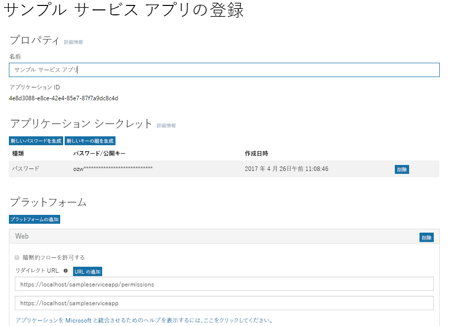
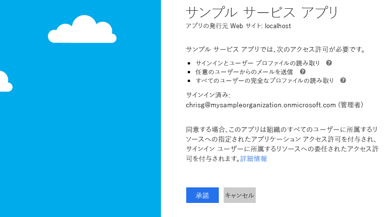

# <a name="get-access-without-a-user"></a>ユーザーなしでアクセスを取得
一部のアプリでは、ユーザーの代わりに独自の ID を使用して Microsoft Graph を呼び出します。多くの場合、これらは、サインインしたユーザーが存在しないサーバー上で実行される、バックグラウンド サービスかデーモンです。この種のアプリの例として、夜間に起動して実行される電子メール アーカイブ サービスがあります。場合によっては、サインインしているユーザーが存在するアプリでも、独自の ID で Microsoft Graph を呼び出す必要があります。たとえば、サインインしたユーザーが所有している組織内の特権よりも高い特権を必要とする機能をアプリが使用する必要がある場合があります。  

独自の ID で Microsoft Graph を呼び出すアプリは、OAuth 2.0 クライアント資格情報の付与フローを使用して、Azure AD からアクセス トークンを取得します。このトピックでは、サービスを構成し、OAuth クライアント資格情報の付与フローを使用して、アクセス トークンを取得する基本的な手順について説明します。 

## <a name="authentication-and-authorization-steps"></a>認証および承認の手順
サービスを構成し、サービスが独自の ID で Microsoft Graph を呼び出すために使用できる Azure AD v2.0 エンドポイントからトークンを取得するために必要となる、基本的な手順は次のとおりです。

1. アプリを登録する。
2. アプリで Microsoft Graph のアクセス許可を構成する。
3. 管理者の同意を取得する。
4. アクセス トークンを取得する。
5. アクセス トークンを使用して、Microsoft Graph を呼び出す。

## <a name="1-register-your-app"></a>1.アプリを登録する
Azure v2.0 エンドポイントで認証するには、まずアプリを [Microsoft アプリ登録ポータル](https://apps.dev.microsoft.com/) で登録する必要があります。アプリを登録するには、Microsoft アカウントのほか、職場または学校のアカウントを使用できます。 

次のスクリーンショットは、バックグラウンド サービス用に構成された Web アプリの登録を示しています。

独自の ID で Microsoft Graph を呼び出すサービスの場合は、Web プラットフォーム用のアプリを登録して、次の値をコピーする必要があります。

- アプリ登録ポータルによって割り当てられたアプリケーション ID。
- アプリケーション シークレット。パスワードか、公開鍵/秘密鍵のペア (証明書) のいずれか。
- Azure AD からトークンの応答を受け取るためのサービスのリダイレクト URL。
- アプリに管理者の同意を要求する機能が実装されている場合は、サービスが管理者の同意の応答を受信するためのリダイレクト URL。  

Microsoft アプリ登録ポータルを使用してアプリを構成する手順については、「[アプリを登録する](./auth_register_app_v2.md)」を参照してください。

OAuth 2.0 クライアント資格情報の付与フローでは、Azure AD によって割り当てられたアプリケーション ID と、ポータルを使用して作成したアプリケーション シークレットを使用して、アプリが Azure AD v2.0 `/token` エンドポイントで直接認証されます。 

## <a name="2-configure-permissions-for-microsoft-graph"></a>2.Microsoft Graph のアクセス許可を構成する
独自の ID で Microsoft Graph を呼び出すアプリの場合、Microsoft Graph はアプリケーションのアクセス許可を公開します。(Microsoft Graph は、ユーザーに代わって Microsoft Graph を呼び出すアプリの委任されたアクセス許可も公開します。)アプリに必要なアプリケーションのアクセス許可は、アプリを登録する時点で事前に構成します。アプリケーションのアクセス許可には常に管理者の同意が必要です。管理者は、組織にアプリがインストールされるときに [Azure ポータル](https://portal.azure.com)を使用してこれらのアクセス許可に同意するか、構成済みのアクセス許可に管理者が同意することによりアプリでサインアップ エクスペリエンスを提供することができます。管理者の同意が Azure AD によって記録されると、アプリは再度同意を要求する必要なしにトークンを要求できます。Microsoft Graph で使用できるアクセス許可の詳細については、「[アクセス許可のリファレンス](./permissions_reference.md)」を参照してください。

[Microsoft アプリ登録ポータル](https://apps.dev.microsoft.com/)でアプリのアプリケーション アクセス許可を構成するには、**[Microsoft Graph]** の下で **[アプリケーションのアクセス許可]** の隣にある **[追加]** を選択し、**[アクセス許可の選択]** ダイアログでアプリに必要なアクセス許可を選択します。

次のスクリーンショットは、Microsoft Graph のアプリケーションのアクセス許可に対する **[アクセス許可の選択]** ダイアログを示しています。 

![Microsoft Graph のアプリケーションのアクセス許可に対する [アクセス許可の選択] ダイアログ。](./images/v2-application-permissions.png)

> **重要**:アプリで必要になるアクセス許可の、最低限の権限セットを構成することをお勧めします。これにより、アクセス許可の長大なリストに同意を求めるものよりも快適なエクスペリエンスを管理者に提供できます。
>

## <a name="3-get-administrator-consent"></a>3.管理者の同意を取得する
管理者に任せて [Azure ポータル](https://portal.azure.com)でアプリケーションに必要なアクセス許可を付与することができます。ただし、多くの場合、Azure AD v2.0 `/adminconsent` エンドポイントを使用して管理者にサインアップ エクスペリエンスを提供するほうが優れた選択肢になります。 

### <a name="request"></a>要求
```
// Line breaks are for legibility only.

GET https://login.microsoftonline.com/{tenant}/adminconsent?
client_id=6731de76-14a6-49ae-97bc-6eba6914391e
&state=12345
&redirect_uri=http://localhost/myapp/permissions
```

| パラメーター | 条件 | 説明 |
| --- | --- | --- |
| tenant |必須 |アクセス許可の要求元のディレクトリ テナント。これは、GUID またはフレンドリ名の形式で指定できます。ユーザーが所属しているテナントがわからないときに、そのユーザーを任意のテナントでサインインさせる場合は、`common` を使用します。 |
| client_id |必須 |[アプリケーション登録ポータル](https://apps.dev.microsoft.com/)でアプリに割り当てられたアプリケーション ID。 |
| redirect_uri |必須 |アプリが処理するために応答を送信するリダイレクト URI。URL でエンコードされている必要があることを除き、ポータルに登録したリダイレクト URI のいずれかに完全に一致する必要があります。また追加のパス セグメントを含めることができます。 |
| state |推奨 |トークン応答でも返される、要求に含まれている値。任意のコンテンツの文字列にすることができます。state は、使用していたページまたはビューなど、認証要求が発生する前の、アプリでのユーザーの状態に関する情報をエンコードするために使用されます。 |

### <a name="administrator-consent-experience"></a>管理者の同意エクスペリエンス
`/adminconsent` エンドポイントへの要求では、Azure AD はテナント管理者のみがサインインして要求を完了できるように強制します。管理者は、アプリ登録ポータルでユーザーがアプリに対して要求したすべてのアプリケーションのアクセス許可を承認するよう求められます。Azure AD が管理者に提示する同意ダイアログの例を次に示します。



### <a name="response"></a>応答
管理者がアプリケーションのアクセス許可を承認した場合、成功応答は次のようになります。

```
GET http://localhost/myapp/permissions?tenant=a8990e1f-ff32-408a-9f8e-78d3b9139b95&state=state=12345&admin_consent=True
```

| パラメーター | 説明 |
| --- | --- |
| tenant |要求されたアクセス許可をアプリケーションに付与したディレクトリ テナント (GUID 形式)。 |
| state |トークン応答でも返される、要求に含まれている値。任意のコンテンツの文字列にすることができます。state は、使用していたページまたはビューなど、認証要求が発生する前の、アプリでのユーザーの状態に関する情報をエンコードするために使用されます。 |
| admin_consent |**true** に設定します。 |


> **お試しください** 次の要求をブラウザーに貼り付けて、これを試してみることができます。Azure AD テナントのグローバル管理者としてサインインすると、アプリの管理者の同意ダイアログが表示されます。(これは、上記の同意ダイアログのスクリーンショットのアプリとは別のアプリになります。)
> 

```
https://login.microsoftonline.com/common/adminconsent?client_id=6731de76-14a6-49ae-97bc-6eba6914391e&state=12345&redirect_uri=http://localhost/myapp/permissions
```

## <a name="4-get-an-access-token"></a>4.アクセス トークンを取得する
OAuth 2.0 クライアント資格情報の付与フローでは、アプリの登録時に保存したアプリケーション ID とアプリケーション シークレットの値を使用して、Azure AD v2.0 `/token` エンドポイントからアクセス トークンを直接要求します。

トークン要求の `scope` パラメーターの値として `https://graph.microsoft.com/.default` を渡すことにより、事前構成済みのアクセス許可を指定します。詳細については、次のトークン要求の `scope` パラメーターの説明を参照してください。

### <a name="token-request"></a>トークン要求
POST 要求を `/token` v2.0 エンドポイントに送信して、アクセス トークンを取得します。

```
POST /{tenant}/oauth2/v2.0/token HTTP/1.1
Host: login.microsoftonline.com
Content-Type: application/x-www-form-urlencoded

client_id=535fb089-9ff3-47b6-9bfb-4f1264799865&scope=https%3A%2F%2Fgraph.microsoft.com%2F.default&client_secret=qWgdYAmab0YSkuL1qKv5bPX&grant_type=client_credentials
```

| パラメーター | 条件 | 説明 |
| --- | --- | --- |
| tenant |必須 |アクセス許可の要求元のディレクトリ テナント。これは、GUID またはフレンドリ名の形式で指定できます。 |
| client_id |必須 |アプリの登録時に [Microsoft アプリ登録ポータル](https://apps.dev.microsoft.com)が割り当てたアプリケーション ID。 |
| scope |必須 |この要求で `scope` パラメーターに渡される値は、必要なリソースのリソース識別子 (アプリケーション ID の URI) である必要があります (`.default` サフィックス付き)。Microsoft Graph の場合、値は `https://graph.microsoft.com/.default` です。この値は、アプリに構成したすべてのアプリケーションのアクセス許可のうち、使用するリソースに関連付けられたアクセス許可のトークンを発行するように v2.0 エンドポイントに通知します。 |
| client_secret |必須 |アプリケーション登録ポータルでアプリ用に生成したアプリケーション シークレット。 |
| grant_type |必須 |`client_credentials` である必要があります。 |

#### <a name="token-response"></a>トークンの応答
成功応答は、次のようになります。

```
{
  "token_type": "Bearer",
  "expires_in": 3599,
  "access_token": "eyJ0eXAiOiJKV1QiLCJhbGciOiJSUzI1NiIsIng1dCI6Ik1uQ19WWmNBVGZNNXBP..."
}
```

| パラメーター | 説明 |
| --- | --- |
| access_token |要求されたアクセス トークン。アプリはこのトークンを Microsoft Graph の呼び出しで使用できます。 |
| token_type |トークンの種類の値を示します。Azure AD がサポートしている種類は `bearer` のみです。 |
| expires_in |アクセス トークンの有効期間 (秒単位)。 |

## <a name="5-use-the-access-token-to-call-microsoft-graph"></a>5.アクセス トークンを使用して、Microsoft Graph を呼び出す

アクセス トークンの取得後は、そのトークンを使用して (トークンを要求の `Authorization` ヘッダーに含める)、Microsoft Graph を呼び出すことができます。次の要求は、特定のユーザーのプロファイルを取得します。この API を呼び出すには、アプリに _User.Read.All_ アクセス許可が必要です。

```
GET https://graph.microsoft.com/v1.0/user/12345678-73a6-4952-a53a-e9916737ff7f 
Authorization: Bearer eyJ0eXAiO ... 0X2tnSQLEANnSPHY0gKcgw
Host: graph.microsoft.com

```
正常な応答は次のようになります (一部の応答ヘッダーは削除されています)。

```
HTTP/1.1 200 OK
Content-Type: application/json;odata.metadata=minimal;odata.streaming=true;IEEE754Compatible=false;charset=utf-8
request-id: f45d08c0-6901-473a-90f5-7867287de97f
client-request-id: f45d08c0-6901-473a-90f5-7867287de97f
OData-Version: 4.0
Duration: 309.0273
Date: Wed, 26 Apr 2017 19:53:49 GMT
Content-Length: 407

{
    "@odata.context":"https://graph.microsoft.com/v1.0/$metadata#users/$entity",
    "id":"12345678-73a6-4952-a53a-e9916737ff7f",
    "businessPhones":[
        "+1 555555555"
    ],
    "displayName":"Chris Green",
    "givenName":"Chris",
    "jobTitle":"Software Engineer",
    "mail":null,
    "mobilePhone":"+1 5555555555",
    "officeLocation":"Seattle Office",
    "preferredLanguage":null,
    "surname":"Green",
    "userPrincipalName":"ChrisG@contoso.onmicrosoft.com"
}
```

## <a name="supported-app-scenarios-and-resources"></a>サポートされているアプリのシナリオとリソース
独自の ID で Microsoft Graph を呼び出すアプリは、次に示す 2 つのカテゴリのいずれかに分類されます。

- サインインしたユーザーが存在しないサーバーで実行されるバックグラウンド サービス (デーモン)。
- サインインしたユーザーは存在するが、独自の ID でも Microsoft Graph を呼び出すアプリ (たとえば、ユーザーの特権よりも高い特権を必要とする機能を使用するため)。

独自の ID で Microsoft Graph を呼び出すアプリは、OAuth 2.0 クライアント資格情報の付与を使用して Azure AD で認証し、トークンを取得します。v2.0 エンドポイントの場合は、次のリソースを使用して、このシナリオについてさらに詳しく調べることができます。

- エラーへの対応を含む、クライアント資格情報の付与フローの完全な処理については、「[Azure Active Directory v2.0 と OAuth 2.0 クライアント資格情報フロー](https://docs.microsoft.com/azure/active-directory/develop/active-directory-v2-protocols-oauth-client-creds)」を参照してください。 
- サービスから Microsoft Graph を呼び出すサンプルについては、GitHub の「[v2.0 デーモンのサンプル](https://github.com/Azure-Samples/active-directory-dotnet-daemon-v2)」を参照してください。
- 推奨される Azure AD v2.0 の認証ライブラリ (Microsoft およびサード パーティ) の詳細については、「[Azure Active Directory v2.0 認証ライブラリ](https://docs.microsoft.com/azure/active-directory/develop/active-directory-v2-libraries)」を参照してください。

## <a name="azure-ad-endpoint-considerations"></a>Azure AD エンドポイントに関して考慮すべき事項
Azure AD エンドポイントを使用している場合、アプリの構成方法と Azure AD へのサインイン方法にはいくつかの違いがあります。

- アプリは [Azure ポータル](https://portal.azure.com)を使用して構成します。Azure ポータルでアプリを構成する方法の詳細については、「[Azure Active Directory とアプリケーションの統合：アプリケーションの追加](https://docs.microsoft.com/azure/active-directory/develop/active-directory-integrating-applications#adding-an-application)」を参照してください。
- アプリがマルチ テナント アプリの場合は、[Azure ポータル](https://portal.azure.com)でマルチ テナントとなるよう明示的に設定する必要があります。
- 管理者の同意エンドポイント (`/adminconsent`) はありません。その代わりに、同意要求に `prompt=admin_consent` パラメーターを追加することで、アプリは実行時に管理者の同意を要求できます。詳細については、「[Azure Active Directory とアプリケーションの統合](https://docs.microsoft.com/azure/active-directory/develop/active-directory-integrating-applications)」の「**実行時の Azure AD 同意フレームワークのトリガー**」を参照してください。
- 承認とトークン要求のパラメーターは異なります。たとえば、Azure AD エンドポイント要求には、`scope` パラメーターはありません。その代わりに、`resource` パラメーターを使用して、承認 (管理者の同意用) またはトークンが要求されているリソース (`resource=https://graph.microsoft.com`) の URI を指定します。

Azure AD エンドポイントの場合は、次のリソースを使用して、このシナリオについてさらに詳しく調べることができます。

- クライアント資格情報の付与フローの概要、サンプル、詳細な処理へのクイック リンクについては、「[開発者のための Azure Active Directory](https://docs.microsoft.com/azure/active-directory/develop/active-directory-developers-guide)」の**作業の開始セクション**の**サービス間**を参照してください。
- Azure AD エンドポイントの場合は、Azure Active Directory 認証ライブラリ (ADAL) を使用して Azure AD からトークンを取得できます。ADAL は、.NET、iOS、Android、JavaScript、Java、および Node.js を含む、いくつかのプラットフォームで利用できます。Azure AD エンドポイント向けの ADAL と、その他の Microsoft 認証ライブラリの詳細については、「[Azure Active Directory 認証ライブラリ](https://docs.microsoft.com/azure/active-directory/develop/active-directory-authentication-libraries)」を参照してください。 

 