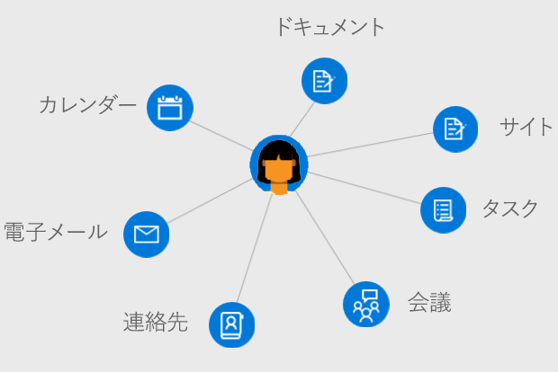

# Microsoft Graph におけるユーザーの概要

ユーザーは、Microsoft Graph における Azure Active Directory (Azure AD) の職場または学校のユーザー アカウント、または Microsoft アカウントの表現です。 Microsoft Graph の **user** リソースは、ユーザーと関連性のあるリレーションシップやリソースにアクセスする際に使用できるハブです。

## ユーザー中心のアプリケーションを開発する

Microsoft Graph を使用して、サインインしているユーザーと文脈上関連性のあるリレーションシップ、ドキュメント、連絡先、およびユーザー設定にアクセスできます。 **user** リソースを使用すると、追加の呼び出しを実行せずにユーザー リソースにアクセスして操作したり、特定の認証情報を調べたり、他の Microsoft Graph リソースに対して直接クエリを発行したりできます。

ユーザーの情報やデータにアクセスするには、[ユーザーの代わりにアクセスを取得する](auth-v2-user.md)必要があります。 [管理者の同意](permissions-reference.md)を得てアプリケーションを認証することにより、ユーザーに関連する幅広いエンティティを操作および更新できます。

### 組織の管理

組織内に新しいユーザーを作成したり、既存のユーザーのリソースやリレーションシップを更新したりします。 Microsoft Graph を使用して、次のユーザー管理タスクを実行できます。 

- 作成または Azure AD 組織内のユーザーを作成または削除する。
- ユーザーのグループ メンバーシップを一覧表示し、ユーザーがグループのメンバーであるかどうかを確認する。
- ユーザーへの報告やユーザーへの管理者の割り当てを行うユーザーを一覧表示する。
- ユーザーの写真をアップロードまたは取得する。

### 予定表とタスクの操作

ユーザーの予定表やユーザーに関連付けられている予定表グループを表示、照会、更新できます。次のような操作が含まれます。

- ユーザーの予定表でイベントを一覧表示し、作成する。
- ユーザーに割り当てられたタスクを表示する。
- 一連のユーザーのために空いている会議時間を検索する。
- ユーザーの予定表に設定されたリマインダーの一覧を取得する。

### メールの管理と連絡先の処理

ユーザーのメール設定と連絡先リストを構成し、ユーザーの代わりにメールを送信できます。次のような操作が含まれます。

- メール メッセージを一覧表示し、新しいメールを送信する。
- ユーザーの連絡先を作成および一覧表示し、連絡先をフォルダーに整理する。
- メールボックスのフォルダーと設定を取得し、更新する。

### ユーザーのインサイトを使用したアプリの強化

ユーザーに関連するドキュメントや連絡先のうち、最近使用したものや人気上昇中のものを奨励することで、アプリケーションの関連性を最大化します。 Microsoft Graph を使用して次のことができます。

- ユーザーが最近表示および変更したドキュメントを返す。
- ユーザーのアクティビティで人気上昇中のドキュメントやサイトを返す。
- ユーザーがメールや OneDrive for Business で共有しているドキュメントを一覧表示する。

## API リファレンス
このサービスの API リファレンスをお探しですか?

- [Microsoft Graph v1.0 の Users API](/graph/api/resources/users?view=graph-rest-1.0)
- [Microsoft Graph ベータ版の Users API](/graph/api/resources/users?view=graph-rest-beta)

## 次のステップ

- [ユーザーの操作](/graph/api/resources/users?view=graph-rest-1.0)方法の詳細を確認する
- [Graph エクスプローラー](https://developer.microsoft.com/graph/graph-explorer)の **user** リソースを使用して自分自身のデータを調べる
- [ユーザーの代わりに](auth-v2-user.md)、または[管理者の同意を得てデーモンまたはサービスとして](auth-v2-service.md) Microsoft Graph を使用して認証します。
- [Azure AD API](/graph/api/resources/azure-ad-overview?view=graph-rest-1.0) を使用してユーザーのアクセス制御とポリシーを設定する
- アプリからユーザー データにアクセスするために必要な[権限](permissions-reference.md)を確認する 
<!-- This isn't really a next step; let's remove to keep the list of links concise.>
- Stay up to date with Microsoft Graph [changelog](changelog.md).
-->
