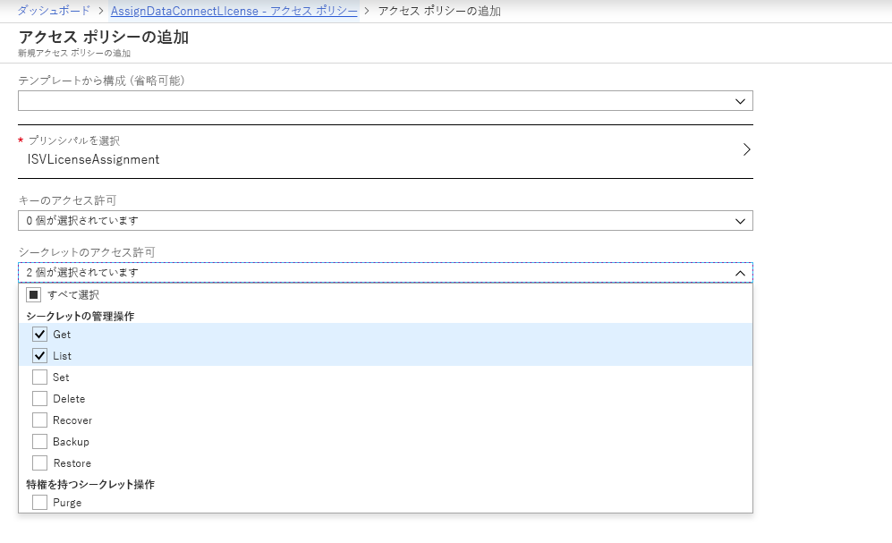
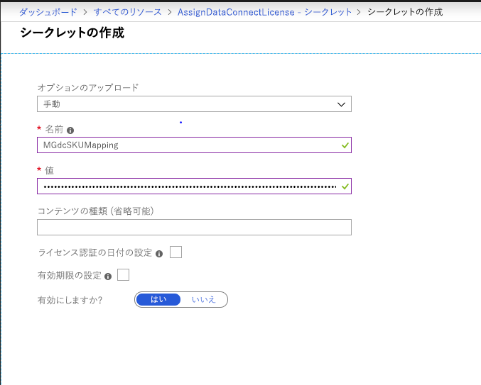

# <a name="microsoft-graph-data-connect-policies-and-licensing"></a>Microsoft Graph データ接続のポリシーとライセンス

Microsoft Graph データ接続は、[Azure マネージド アプリケーション](https://docs.microsoft.com/ja-JP/azure/managed-applications/overview)を使用して、ユーザーがソリューションを作成し、顧客の Azure 環境にそのソリューションをデプロイできるようにしています。 マネージド アプリケーションを使用すると、特定の Azure ポリシーをサポートできるため、ユーザーが作成したアプリケーションを使用する顧客に対して、一層の信頼性と快適性を提供できます。 さらに、データ接続を介してアプリケーションがデータにアクセスできるようにするには、ユーザーが Microsoft からライセンスを購入し、ユーザー自身の組織またはユーザーのアプリケーションをインストールする組織にライセンスを適用する必要があります。

## <a name="policies"></a>ポリシー

Office 365 のデータを使用して構築された Azure マネージド アプリケーションでは、次の Azure ポリシーがサポートされています。

- [ADLS Gen1 暗号化必須ポリシー](https://docs.microsoft.com/ja-JP/azure/azure-policy/scripts/enforce-datalakestore-encryption)

Azure Marketplace の発行時にポリシーのいずれかを選択する場合、そのポリシーのコンプライアンスの状態が確認され、アプリケーションのすべてのインストールに対して適用されます。 選択され、準拠していることが確認されたポリシーすべては、データ要求の一部として、データの承認者に表示されます。 ポリシーのコンプライアンス違反は、パイプラインの実行が失敗し、データ抽出が停止する原因となります。

その他のポリシーに関してサポートをご希望の場合は、[UserVoice](https://microsoftgraph.uservoice.com/forums/920506-microsoft-graph-feature-requests?category_id=359581) からお知らせください。

## <a name="licensing"></a>ライセンス

Microsoft Graph データ接続ツールセットには、Workplace Analytics からアクセスできます。これは、ユーザーごとに 1 か月単位でライセンスされます。  Workplace Analytics を使用する組織は、社内または独立系ソフトウェア ベンダー (ISV) によって開発されたアプリケーションに組織の大規模なデータへのアクセスを付与し管理することによって、Office 365 のデータからさらに多くの分析情報を得ることができます。 購入方法を含む詳細については、[Workplace Analytics 製品ページ](https://products.office.com/ja-JP/business/workplace-analytics)をご覧ください。

ISV を対象として、Workplace Analytics を購入していない顧客向けにアプリケーションを構築するためのオプションも用意されています。 これには、そのアプリケーションが Microsoft Graph データ接続を介してアクセスするすべてのユーザーに関連付けるのに十分なライセンスを、そのアプリケーションを購入する顧客ごとに ISV が購入する必要があります。 このオプションは、Workplace Analytics のライセンスと併用できます。 ISV は、Microsoft Graph データ接続のライセンスのインスタンスを、顧客による各インストールと関連付けるための手順を実行する必要があります。

### <a name="isvs-using-the-microsoft-graph-data-connect-license"></a>Microsoft Graph データ接続のライセンスを使用する ISV
データ接続のライセンスを使用する ISV は、ライセンスの割り当てを保存および処理するために [Azure Key Vault](https://azure.microsoft.com/ja-JP/services/key-vault/) を利用する必要があります。 したがって、[Key Vault を作成する](https://docs.microsoft.com/ja-JP/azure/key-vault/quick-create-portal)ことが必要になります。 作成中、Key Vault の URI 値をメモしてください。 この値は、Key Vault を参照するアプリケーション定義で使用されます。 Key Vault を作成したら、アプリケーションの ARM テンプレートの Source Linked Service で使用される SPN が Key Vault にアクセスできていることを確認します。 これを行うには、Key Vault インスタンスの **[アクセス ポリシー]** ウィンドウに移動し、SPN によって参照されるアプリケーション用のアクセス ポリシーを作成して、そのアプリケーションに **Get** と **List** のアクセス許可を割り当てます。 



Microsoft Graph データ接続の組織へのライセンスの割り当ては、Key Vault ではシークレットとして提供されます。 これを行うには、以下のようにします。
1. Key Vault に移動し、**[生成/インポート]** で手動シークレットを作成します。 シークレットの名前は **MGdcSKUMapping** とする必要があります。また、シークレットの値には、テナントの ID とそのテナントに割り当てられているライセンス数を次の形式で含める必要があります。

`{"tenantId1" : 20, "tenantId2" : 35, "tenantId3" : 12}`

2. 値を設定したら、有効になっていることを確認し、**[作成]** を選択して、デプロイを開始します。 



3. また、作成した Key Vault を参照するアプリケーションの ARM テンプレートを更新する必要もあります。 これには、**LicenseKeyVaultUri** プロパティに、Key Vault の作成時にメモした **KeyVaultUri** 値を入力します。 このプロパティは、次に示すように、アプリケーションの ARM テンプレートの Source Linked Service で提供されます。 

```
"properties": {
        "type": "Office365",
            "description": "Source O365 linked service",
            "typeProperties": {
                   "office365tenantId": "[subscription().tenantId]",
        "PrivacyPolicyUri": "http://www.wkw.com/privacy",
        "TermsOfUseUri": "http://www.wkw.com/tos",
        "servicePrincipalId": "[variables('sourceLinkedServicePrincipalId')]",
        "servicePrincipalKey": {
                           "type": "SecureString",
                "value": "[variables('sourceLinkedServicePrincipalKey')]"
        },
        "servicePrincipalTenantId": "[variables('sourceLinkedServicePrincipalTenantId')]",
        "LicenseKeyVaultUri": "<KeyVaultUri>",
            }
    }
```

データ接続は、各パイプラインを実行する前に、Key Vault のシークレットを参照します。 各ユーザーにデータを提供するのに十分なライセンスが組織に割り当てられていない場合、または Key Vault にアクセスできない場合、パイプラインは失敗します。 

## <a name="next-steps"></a>次のステップ
その他のポリシーに関してサポートをご希望の場合は、[UserVoice](https://microsoftgraph.uservoice.com/forums/920506-microsoft-graph-feature-requests?category_id=359581) からお知らせください。 購入方法を含む Workplace Analytics の詳細については、[Workplace Analytics 製品ページ](https://products.office.com/ja-JP/business/workplace-analytics)をご覧ください。
