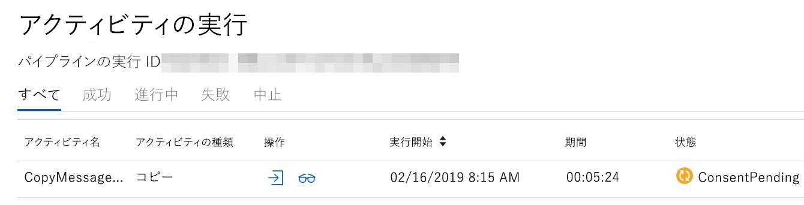

# Microsoft Graph データ接続を使用するためのヒントTips for using Microsoft Graph data connect

Microsoft Graph データ接続を使用することにより、Microsoft Graph の膨大なデータセットへのマネージド アクセスを提供できるアプリケーションの開発が可能になります。Microsoft Graph data connect allows developers to create applications that customers can provide managed access to their at-scale Microsoft Graph datasets. この記事では、データ接続機能を活用するのに役立つヒントをご紹介します。This article provides tips that will help you take advantage of the data connect feature. Microsoft Graph データ接続の概要については、「[Microsoft Graph データ接続の概要](data-connect-concept-overview.md)」を参照してください。For an introduction to Microsoft Graph data connect, see the [Overview](data-connect-concept-overview.md) article.

## Microsoft Graph データ接続は適切な選択かIs Microsoft Graph data connect right for you?

データ接続と Microsoft Graph API は、双方がアクセスする基になるデータは同じですが、アクセス方法は大きく異なります。Data connect and the Microsoft Graph APIs provide access to the same underlying data but in very different ways. データ接続は、大量のデータを一括して抽出するように設計されています。これに対して、Microsoft Graph API は、個別のデータ セットにリアルタイムにアクセスするのにより適しています。Data connect is designed to extract large amounts of data in bulk while the Microsoft Graph APIs are more suitable for accessing discrete sets of data in real time. 両者を組み合わせて使用するのが適切な場合もあります。In some cases, it might even make sense to combine them. たとえば、去年のメール データをまず抽出する際にはデータ接続を使用し、次に、リアルタイムに作業を進めながらメールを分析する際に Microsoft Graph API を使用するといった方法が考えられます。For example, you might want use data connect to do an initial extraction of the last year of email data, and then use the Microsoft Graph APIs to analyze emails in real time moving forward. データ接続と Microsoft Graph API は、用途が異なる別なツールです。Data connect and the Microsoft Graph APIs are different tools for different jobs. 実現したいシナリオに最適なアクセス方法はどちらかを検討することが大切です。It's important to think about which access method best fits your scenario.

## イニシャル オーバーヘッドを予測するExpect an initial overhead

データ接続は大量のデータを一括して抽出するように設計されているため、データを抽出できるようになる前に、ある程度のオーバーヘッドが発生します。Because data connect is designed to extract large amounts of data in bulk, some overhead is incurred before the data can be extracted. このオーバーヘッドは約 45 分です。つまり、データ サイズに関わりなくすべてのパイプラインで、その程度の時間が最低必要になります。This overhead is around 45 minutes, meaning all pipelines will take at least that long regardless of the data size. 大量のデータ処理の代償としてこれが無視できる場合もありますが、実現したいシナリオにとってその時間が許容できないものである場合は、Microsoft Graph API を活用するアプローチの方が望ましい可能性があります。This might be a negligible cost for large amounts of data, but if this time is unacceptable for your scenario, the Microsoft Graph APIs might provide a better approach.

## データは組織のサブスクリプション内に保持する必要があるData must stay within the organization's subscription

データ接続パイプラインは、Azure サブスクリプション内で実行されるデータ統合サービスである Azure Data Factory によってオーケストレーションされます。Data connect pipelines are orchestrated by Azure Data Factory, a data integration service that runs in an Azure subscription. その Azure サブスクリプションは、[1 つのみの Office 365 テナントに関連付け](https://docs.microsoft.com/ja-JP/azure/active-directory/fundamentals/active-directory-how-subscriptions-associated-directory)られています。The Azure subscription is [associated with exactly one Office 365 tenant](https://docs.microsoft.com/ja-JP/azure/active-directory/fundamentals/active-directory-how-subscriptions-associated-directory). このため、データは、関連付けられている Azure サブスクリプションにまず渡される必要があります。This way, the data must initially flow to an associated Azure subscription. さらに最小化や集計を行うことにより、データは他でも利用できるようになります。After further minimalization and aggregation, the data can be used elsewhere.

Office 365 データの抽出に他のユーザーが使用できるアプリを構築したい場合は、そのアプリを [Azure マネージド アプリケーション](https://docs.microsoft.com/ja-JP/azure/managed-applications/overview)としてパッケージ化し、Azure Marketplace に公開できます。If you want to build an app for others to use to extract their Office 365 data, you can package the app as an [Azure managed application](https://docs.microsoft.com/ja-JP/azure/managed-applications/overview) and publish it to the Azure Marketplace. そうすることにより、ユーザーはそのアプリを自分の Azure サブスクリプションにデプロイでき、自分のテナントに含まれるデータにそのアプリでアクセスできるようになります。Then someone can deploy your app into their own Azure subscription, and the app can access data in their tenant. 

## サービス プリンシパルの使用Use of service principals

Data Factory パイプラインを作成する際に、Office 365 にリンクされたサービスに対して、サービス プリンシパルを提供することが必要になります。When creating the Data Factory pipeline, you will have to provide a service principal to the Office 365 linked service. Azure では、サービス プリンシパルは、アプリケーションまたはサービス (つまり、ユーザーではない) を表すセキュリティ ID です。In Azure, a service principal is a security identity that represents an application/service (as opposed to a user). データ接続は、Office 365 データへの承認されたアクセスを取得する際に、その ID としてサービス プリンシパルを使用します。Data connect uses this service principal as its identity when getting authorized access to your Office 365 data.
他のユーザーが自分のテナントで使用できる Azure マネージド アプリケーションを作成する場合も、そのアプリが使用するサービス プリンシパルをアプリの発行元が提供します。If you create an Azure Managed Application for others to use in their tenants, you'll still provide a service principal for the app to use. このサービス プリンシパルは、発行元のテナント内に置かれます。This service principal will exist in your (the publisher's) tenant. ただし、アプリで他のサービス プリンシパルが必要になる場合は、インストールしたユーザーが自分のテナント内にサービス プリンシパルを作成します。However, if the app needs other service principals, your customer (the installer) will create them in their own tenant. たとえば、Data Factory パイプラインが Azure のストレージ リソースにアクセスすることが必要になる場合があります。For example, your Data Factory pipeline will likely need access to a storage resource in Azure. ユーザーは、パイプラインが使用するストレージ アカウントへのアクセス許可を指定したサービス プリンシパルを作成します。The customer would create the service principal with permissions to the storage account for the pipeline to use.

## 保留中の特権アクセス管理要求を確認するCheck for pending Privileged Access Management requests

管理者が特権アクセス管理 (PAM) 要求を許可してからでなければ、データ接続はデータをコピーできません。Before data connect can copy your data, an administrator must approve a Privileged Access Management (PAM) request. PAM は、Office 365 でデータへのデータ パイプライン アクセスを承認するために使用されるメカニズムです。PAM is the mechanism used to authorize your data pipeline access to the data in Office 365. 初めてパイプラインをトリガーする際に、PAM は Office 365 管理者 (または指定された代理人) がそのアクセス要求を承認するまで待機します。The first time you trigger a pipeline, it will wait on an Office 365 administrator (or appointed delegate) to approve the access request. パイプラインの状態は "**処理中**" と表示されますが、次のスクリーンショットに示すように、基になるコピー アクティビティは、承認がなされるまで **ConsentPending** の状態になります。Although the pipeline status shows **In progress**, the underlying copy activity will have a status of **ConsentPending** until approval is granted, as shown in the following screenshot.

開発中、特にパイプラインを変更した後は、パイプラインの実行が **ConsentPending** で停止しないことを確認なさるようにお勧めします。During development, it's a good idea to make sure your pipeline runs aren't stuck on **ConsentPending**, especially after you make a change to your pipeline. たとえば、スキーマに別のフィールドを追加すると、次にパイプラインを実行する時に、承認を必要とする新しい PAM 要求が発行されます。For example, if you add an additional field to the schema, the next pipeline run will issue a new PAM request that has to be approved. 承認を待機しているパイプラインの処理をただ待っていては、時間が無駄になってしまいます。Don't waste time waiting on a pipeline that's waiting for your approval.

## Office 365 管理ポータルから PAM 要求を承認するApprove PAM requests via Office 365 admin portal

データ接続の説明書には、PowerShell や PAM UX を使用して PAM 要求を承認する方法が説明されています。The data connect documentation shows you how to use PowerShell and the PAM UX to approve PAM requests. PAM UX を使用して承認するには、[Office 365 管理ポータル](https://admin.microsoft.com/Adminportal/Home?source=applauncher#/Settings/PrivilegedAccess)の PAM インターフェイスに移動します。To approve using the PAM UX, visit the PAM interface in the [Office 365 admin portal](https://admin.microsoft.com/Adminportal/Home?source=applauncher#/Settings/PrivilegedAccess). このポータルを使用すると、簡単でわかりやすい方法で PAM 要求を表示して、要求を承認、拒否、取り消すことができます。The portal provides an easy and user-friendly way to view and approve/deny/revoke PAM requests. ポータルへのリンクは、**[設定]** > **[サービスとアドイン]** > **[Microsoft Graph データ接続]** の順に選択すると、[Microsoft Graph データ接続のアドイン] にあります。You can find a link to it in the Microsoft Graph data connect add-in under **Settings** > **Services & Add-ins** > **Microsoft Graph data connect**.

## PAM 要求を承認するため、第 2 のユーザーを使用するUse a second user to approve PAM requests

パイプラインを実行して PAM 要求をトリガーする場合、そのパイプラインが使用するサービス プリンシパルを所有するユーザー アカウントに、その要求は関連付けられます。When you run a pipeline and trigger a PAM request, the request is attached to your user account that owns the service principal used by the pipeline. このアカウントが、開発者が設定した承認者グループに属する場合でも、PAM 要求の承認にそのアカウントを使用することはできません。これは、自己承認が許可されていないためです。But even if this account is part of the approver group you set up, you can't use it to approve the PAM request because self-approvals are not allowed. 実行しようとすると、PAM ポータルに "要求元と承認者が同じです。If you try, you'll get an error message in the PAM portal: "Requestor and approver are the same. 自己承認は許可されていません" というエラー メッセージが表示されます。Self-approval is not allowed." 開発向けに、要求を承認する管理者に加えて、第 2 のアカウントを作成できます。For development, you'll want to have a second account in addition to the admin who approves requests. 提出者と承認者の双方に、アクティブな Exchange Online アカウントが必要です。Both the submitter and the approver must have active Exchange Online accounts.

## 必要に応じて重複するメールを削除するDeduplicate emails when needed

`Message` データセットからメールを抽出する際に、同じメールの JSON オブジェクトが複数存在することがよくあります。When you extract emails from the `Message` dataset, there will often be multiple JSON objects for the same email. このような重複は、メールが複数の宛先に送信された場合、各受信者のメールボックスにそのメールのコピーが存在することが原因です。These duplicates exist because when an email is sent to multiple people, there is a copy of the email in every recipient's mailbox. データセットは各メールボックスから抽出されるため、全ユーザーのコピーがすべて含まれることになります。Because the dataset is extracted from every mailbox, it will contain all copies across users. 一部のシナリオではコピーをすべて保持する必要がありますが、そうでなければ、重複を削除できます。In some scenarios, it might be necessary to keep every copy but in others, you may want to remove the duplicates.
エクスポートされた JSON オブジェクトの重複は、メッセージの `internetMessageId` に基づいて削除できます。`internetMessageId` が同じメッセージが 2 つあれば、それらは同一インスタンスの重複するコピーです。You can deduplicate the exported JSON objects based on the `internetMessageId` of the messages: Two messages with the same `internetMessageId` are duplicate copies of the same instance. 重複は異なる BLOB に存在することもあるので、BLOB ごとに重複を削除するのではなく、すべての BLOB を対象に重複を削除する必要があります。Because the duplicates can exist in different blobs, you must deduplicate across all blobs rather than deduplicating in each blob separately.

## puser フィールドを使用して関連するユーザーを特定するUse puser field to determine the relevant user

抽出したデータには、対応する Microsoft Graph API を使用する時点では存在しないメタ プロパティがいくつか含まれます。The extracted data includes some meta properties that don't exist when using the corresponding Microsoft Graph APIs. 特に `puser` フィールドは、データの抽出元ユーザーを特定するのに役立ちます。Specifically, the `puser` field can be useful for determining which user the data was extracted from. 同じメールのコピー 2 つが異なるメールボックスにあるシナリオでは、`puser` フィールドを使用することで、どちらのコピーがどのメールボックスから抽出されたかを特定できます。In the scenario where you have two copies of the same email in different mailboxes, you can use the `puser` field to determine which copy came from which mailbox.
`puser` フィールドは、`Manager` データセットなどのデータセットにも役立ちます。The `puser` field is also useful for datasets such as the `Manager` dataset. エクスポートされた JSON にはマネージャーに関する情報が含まれますが、この情報が役立つのはそのマネージャーが誰のマネージャーであるかを知っている場合に限られます。The exported JSON will contain information about a manager, but this is only useful if you know whose manager they are. `puser` フィールドから、その JSON オブジェクトが一致するのは誰のマネージャーであるかを確認できます。The `puser` field will tell you whose manager that JSON object corresponds to.

## 次のステップNext Steps

機能に関するリクエストがあれば、[UserVoice](https://microsoftgraph.uservoice.com/forums/920506-microsoft-graph-feature-requests?category_id=359581) からお寄せください。Reach out on [UserVoice](https://microsoftgraph.uservoice.com/forums/920506-microsoft-graph-feature-requests?category_id=359581) for feature requests. 
