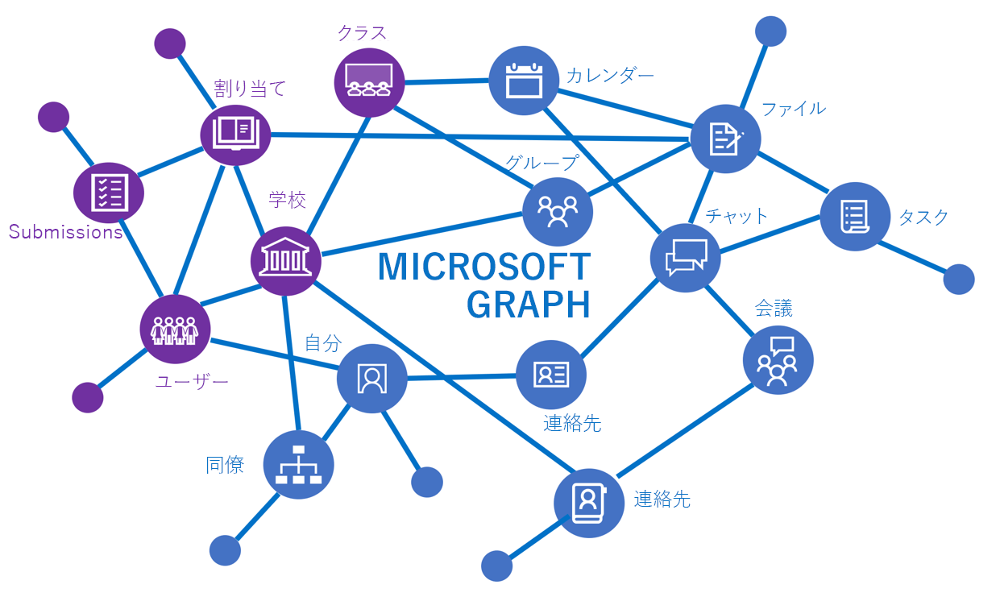
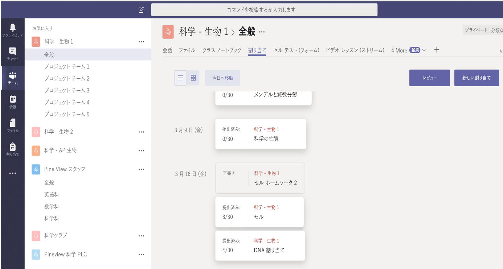

# 教育機関向け API の概要

Microsoft Graph の教育機関向け API は、教育のさまざまなシナリオに関係する情報によって Office 365 のリソースを拡張します。それには、学校、クラス、ユーザー (学生と教師)、課題、および提出に関する情報が含まれます。 これにより、学校やクラスルームのさまざまなシナリオのための教育関連リソースの統合ソリューションを容易に構築できます。

Microsoft Graph の教育機関向け API は、クラス、学校、ユーザー、課題、提出などの情報へのアクセスを提供します。

## 教育のシナリオを統合する理由

### クラスの名簿を認識するアプリケーションのビルド

教育関連のソフトウェア開発者の多くは、クラス名簿がアプリケーション実行に必要な情報の重要な部分の 1 つであるが、多くの場合は学校の学生情報システム (SIS) の内部にしまい込まれているという事実に早い段階で気付いています。 教師が新しいアプリケーションをクラスルームに導入しようとする場合、手動で名簿データをアプリケーションにインポートするために多くの時間を費やすことになります。 多くの ISV では、SIS に接続して名簿データをインポートすることによりこの問題に対処しています。 何百とある学生情報システムで、それぞれ独自の書式が使用されているということが課題となります。 [Microsoft School Data Sync](https://sds.microsoft.com/) と名簿 API を組み合わせることにより、アプリケーション開発者と学校がこの課題に対処できます。

名簿 API で可能になるシナリオのいくつかを次に示します:

- [学校内の全クラスを取得する](https://developer.microsoft.com/en-us/graph/docs/api-reference/v1.0/api/educationschool_list_classes)
- [クラス内の全ユーザーを取得する](https://developer.microsoft.com/en-us/graph/docs/api-reference/v1.0/api/educationclass_list_members)
- [教師の担当する全クラスを取得する](https://developer.microsoft.com/en-us/graph/docs/api-reference/v1.0/api/educationuser_list_classes)

### Microsoft Teams を使用して割り当てタブでクラス割り当てを作成する

割り当て API を使用することにより、クラス割り当てを管理する Web アプリを作成し、新しいカスタム タブ上でアプリを Microsoft Teams に統合することができます。  

Office 365 の Microsoft Teams は、会話、コンテンツ、およびアプリを、クラスルールのための 1 つの場所にまとめるデジタル ハブです。 Microsoft Teams は、タブ、コネクタ、およびボットの作成など、[豊富な機能拡張ポイントのセット](https://docs.microsoft.com/en-us/microsoftteams/platform/concepts/apps/apps-overview)を提供します。 それらの機能拡張ポイントでは、Microsoft Graph の教育機関向け API を呼び出すことにより、課題や提出を処理することができます。 機能拡張ポイントを他の Microsoft Graph API や、課題と提出の API により有効にすることによって、さらに総合的なエクスペリエンスを構築します。

教育機関向けに、教育機関のクラス (チーム) のコンテキストで Microsoft Teams カスタム タブが開かれており、作成や配布から、評価やフィードバックに至るまで、エンドツーエンドの割り当てフローを意味ある方法で管理できます。 これは、Microsoft Teams で時間が節約され、日常的な作業が簡素化されることのほんの一例に過ぎません。この例の場合、教職員は雑務から解放されて学生に注意を集中できます。

次の図に、**理科 - 生物 1** のクラス用の課題カスタム タブで課題を管理するための Web アプリを示します。

割り当て API により、Microsoft Teams 外でアプリが課題サービスと対話処理を実行できます。 配布、期限、評価は Microsoft Teams によって処理される一方、システムには、学生のための機能豊富な学習エクスペリエンスが用意されています。
割り当て API によって有効になるシナリオ例のいくつかを次に示します:

- [アプリケーションにリンクした課題を追加する](https://developer.microsoft.com/en-us/graph/docs/api-reference/beta/api/educationclass_post_assignments) 
- [アプリケーションにリンクした課題について個々の学生に評価を割り当てる](https://developer.microsoft.com/en-us/graph/docs/api-reference/beta/api/educationsubmission_update)
- [割り当てとその期限を示す学生ダッシュボードを作成する](https://developer.microsoft.com/en-us/graph/docs/api-reference/beta/api/educationclass_list_assignments)

### 学校管理者が、学校データ同期管理 (プレビュー) を使用して ID および名簿の同期を管理できるようにする

[学校データ同期](https://sds.microsoft.com/)は、Azure Active Directory (Azure AD) および Office 365 により、学生の ID と名簿データを学生情報システムからインポートし、同期するプロセスを自動化するのに役立ちます。 情報が同期されると、名簿 API を使用することにより、名簿情報をアプリケーションに読み込むことができます。 学校の学生情報システムと学校データ同期との統合処理を担当するシステム統合担当者は、Microsoft Graph で [SDS 管理 API](https://developer.microsoft.com/en-us/graph/docs/api-reference/beta/resources/educationsynchronizationprofile) を使用することにより、CSV ファイルまたはサポートされている SIS API コネクタのいずれかからの同期処理をセットアップすることができます。

学校データ同期管理 API では、同期管理のためのエンドツーエンドのシナリオがサポートされています。たとえば:

- [自動的に同期を開始する同期ファイルを作成する](https://developer.microsoft.com/en-us/graph/docs/api-reference/beta/api/educationsynchronizationprofile_post)
- [一時停止](https://developer.microsoft.com/en-us/graph/docs/api-reference/beta/api/educationsynchronizationprofile_pause)、[再開](https://developer.microsoft.com/en-us/graph/docs/api-reference/beta/api/educationsynchronizationprofile_resume)、および[リセット](https://developer.microsoft.com/en-us/graph/docs/api-reference/beta/api/educationsynchronizationprofile_reset)の操作により同期ライフサイクルを管理する

## 次の手順

- 教育機関向け API を初めて使用する場合は、以下を参照してください:
    - [名簿 API を使用する](https://developer.microsoft.com/en-us/graph/docs/api-reference/v1.0/resources/education-overview)
    - [割り当て API を使用する](https://developer.microsoft.com/en-us/graph/docs/api-reference/beta/resources/educationassignment)
    - [SDS 管理 API を使用する](https://developer.microsoft.com/en-us/graph/docs/api-reference/beta/resources/educationsynchronizationprofile)
- [Graph Explorer](https://developer.microsoft.com/en-us/graph/graph-explorer) で教育機関向け API を試す。
- 次の教育関連サンプルについて調べる:
    - [SSO および名簿管理についての .NET サンプル](https://github.com/OfficeDev/O365-EDU-AspNetMVC-Samples)
    - [SSO および名簿管理についての Angular ノード サンプル](https://github.com/OfficeDev/O365-EDU-AngularNodeJS-Samples)   
    - [SSO および名簿管理についての Python サンプル](https://github.com/OfficeDev/O365-EDU-Python-Samples)
    - [SSO および名簿管理についての PHP サンプル](https://github.com/OfficeDev/O365-EDU-PHP-Samples)
    - [プロファイル管理 API のサンプル](https://github.com/OfficeDev/O365-EDU-SDS-AspNetMVC-Samples) 

 

