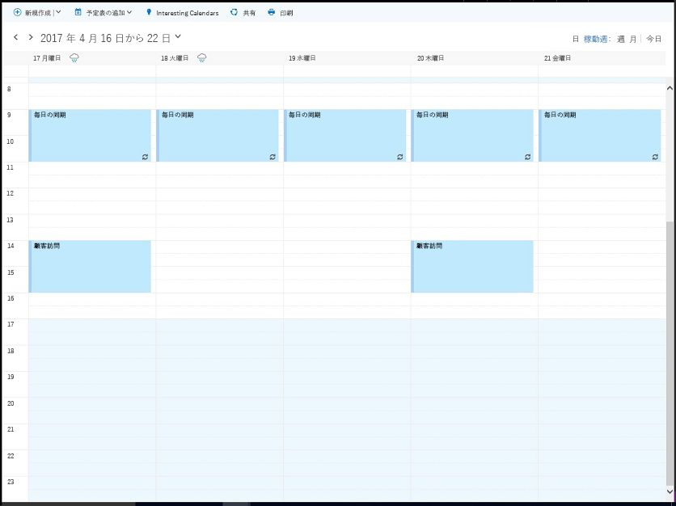
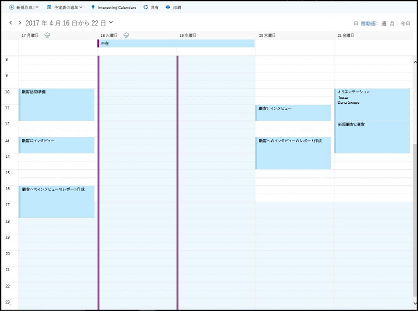

# <a name="find-possible-meeting-times-on-the-outlook-calendar"></a><span data-ttu-id="5aa21-104">開催可能な会議日時を Outlook カレンダーで検索する</span><span class="sxs-lookup"><span data-stu-id="5aa21-104">Find possible meeting times on the Outlook calendar</span></span>

<span data-ttu-id="5aa21-p102">職場や学校では、集まるための共通の時間と場所を探して頻繁にオーバーヘッドが発生します。Microsoft Graph アプリケーションでは、[findMeetingTimes](/graph/api/user-findmeetingtimes?view=graph-rest-1.0) を使用して、時間、場所、他の制約を満たす開催可能な会議日時を特定できます。</span><span class="sxs-lookup"><span data-stu-id="5aa21-p102">In a workplace or school, looking for a common time and place to meet often incurs overhead. Microsoft Graph applications can use [findMeetingTimes](/graph/api/user-findmeetingtimes?view=graph-rest-1.0) to identify any possible meeting times that satisfy time, location, and other constraints.</span></span>   

<span data-ttu-id="5aa21-p103">**findMeetingTimes** アクションでは、会議の日付/時刻範囲、期間、任意出席者または必須出席者、アクティビティの性質 (**activityDomain**) などの条件を指定できます。アクションでは、出席者と開催者の通常の勤務スケジュールと空き時間情報が考慮され、参加者とアクティビティの種類に適した時間が提案されます。たとえば、業務関連のアクティビティは常に開催者と出席者の勤務時間中に行われるように提案され、必須出席者が出席可能な提案は候補リストの上位に表示されます。</span><span class="sxs-lookup"><span data-stu-id="5aa21-p103">The **findMeetingTimes** action lets you specify conditions such as the meeting date/time range, duration, optional or required attendees, and nature of the activity (**activityDomain**). The action takes into account the attendees' and organizer's normal work schedules and free/busy status, and suggests times that are appropriate for the participants and type of activity. For instance, suggestions for a work-related activity always occur during the work hours of the organizer and attendees, and suggestions where required attendees are available are ordered higher up in the suggested list.</span></span>

<span data-ttu-id="5aa21-p104">Office 365 では、勤務時間とタイム ゾーンをメールボックスごとに構成できます。**findMeetingTimes** アクションは、開催者と出席者間のタイム ゾーンの違いを処理します。既定では、**findMeetingTimes** は UTC で提案を返します。次の要求ヘッダーを使用すると、**findMeetingTimes** は特定のタイム ゾーンで表された提案を返すようになります。</span><span class="sxs-lookup"><span data-stu-id="5aa21-p104">In Office 365, work hours and time zones are configurable per mailbox. The **findMeetingTimes** action handles time zone variations among the organizer and attendees. By default, **findMeetingTimes** returns suggestions in UTC. You can use the following request header to have **findMeetingTimes** return suggestions expressed in a specific time zone.</span></span>
```
Prefer: outlook.timezone="{time-zone-string}}"
```

<span data-ttu-id="5aa21-114">大規模な会議で特に便利な機能として、定足数のパーセンテージ (**minimumAttendeePercentage**) を指定して、最低限の出席者の空き時間を満たす場合にのみ、**findMeetingTimes** が提案を返すようにできます。</span><span class="sxs-lookup"><span data-stu-id="5aa21-114">Especially useful for larger meetings, you can specify a percentage (**minimumAttendeePercentage**) for a quorum and have **findMeetingTimes** return suggestions only if that minimum attendee availability is met.</span></span>

<span data-ttu-id="5aa21-p105">**findMeetingTimes** が会議日時をまったく提案できない場合は、開催者や必須出席者が出席できないなどの特定の理由 (**emptySuggestionsReason**) を示します。この値に基づいて、パラメーターをさらに調整して、**findMeetingTimes** をもう一度呼び出すことができます。</span><span class="sxs-lookup"><span data-stu-id="5aa21-p105">If **findMeetingTimes** cannot suggest any meeting times, it indicates a specific reason (**emptySuggestionsReason**), such as the organizer or a required attendee not available. Based on this value, you can better adjust the parameters and call **findMeetingTimes** again.</span></span>

><span data-ttu-id="5aa21-117">**注** **findMeetingTimes** アクションは、現在 Office 365 の職場または学校のメールボックスで使用できますが、個人用 outlook.com のメールボックスでは使用できません。</span><span class="sxs-lookup"><span data-stu-id="5aa21-117">**Note** The **findMeetingTimes** action is currently available to Office 365 work or school mailboxes, but not personal, outlook.com mailboxes.</span></span>

## <a name="example"></a><span data-ttu-id="5aa21-118">例</span><span class="sxs-lookup"><span data-stu-id="5aa21-118">Example</span></span>

<span data-ttu-id="5aa21-p106">次の例は、**findMeetingTimes** を使用して、2 人のユーザーが数時間会合するための可能な時間を返す方法を示しています。これには、ユーザーの空き時間と勤務スケジュール、および時間内に不在である出席者が考慮されています。この会議の出席者は 2 人のユーザーのみであるため、提案には 100% の出席が必要です。ユーザーの空き時間スケジュールを次に示します。</span><span class="sxs-lookup"><span data-stu-id="5aa21-p106">The following example shows how to use **findMeetingTimes** to return possible times for 2 users to meet for a couple of hours, taking into account the users' free/busy and work schedules, and the attendee being away for part of the time. Because there are only 2 users for this meeting, suggestions require 100% attendance. The following shows the users' free/busy schedule.</span></span>

### <a name="organizers-calendar"></a><span data-ttu-id="5aa21-122">開催者のカレンダー</span><span class="sxs-lookup"><span data-stu-id="5aa21-122">Organizer's calendar</span></span>

<span data-ttu-id="5aa21-123"></span><span class="sxs-lookup"><span data-stu-id="5aa21-123"></span></span>

### <a name="attendees-calendar"></a><span data-ttu-id="5aa21-124">出席者のカレンダー</span><span class="sxs-lookup"><span data-stu-id="5aa21-124">Attendee's calendar</span></span>

<span data-ttu-id="5aa21-125"></span><span class="sxs-lookup"><span data-stu-id="5aa21-125"></span></span>

<span data-ttu-id="5aa21-126">この例では、**findMeetingTimes** の呼び出しを 2 回行います。</span><span class="sxs-lookup"><span data-stu-id="5aa21-126">The example makes 2 calls to **findMeetingTimes**:</span></span>

1. <span data-ttu-id="5aa21-p107">最初の呼び出しは、4 月 18 日から 20 日の日付の範囲を検索します。出席者が 4 月 18 日から 19 日は不在であり、4 月 20 日には共通の空き時間がないため、最初の呼び出しは提案を返しません (理由 (**emptySuggestionsReason**): 出席者が参加できない)。</span><span class="sxs-lookup"><span data-stu-id="5aa21-p107">The first call looks in the date range of April 18-20. As the attendee is out-of-office on April 18-19, and there is no commonly available time on April 20, the first call returns no suggestions with the reason (**emptySuggestionsReason**) that attendees are not available.</span></span>
2. <span data-ttu-id="5aa21-129">2 番目の呼び出しは、4 月 21 日の空き時間を検索し、午後 2 時から 4 時の提案を返します。</span><span class="sxs-lookup"><span data-stu-id="5aa21-129">The second call looks for availability on April 21 and returns a suggestion of 2-4pm.</span></span>

<span data-ttu-id="5aa21-p108">**findMeetingTimes** への 2 回の呼び出しには、次のパラメーターが含まれます。**findMeetingTimes** のすべての[パラメーター](/graph/api/user-findmeetingtimes?view=graph-rest-1.0#request-body)は省略可能です。</span><span class="sxs-lookup"><span data-stu-id="5aa21-p108">The two calls to **findMeetingTimes** include the following parameters. All [parameters](/graph/api/user-findmeetingtimes?view=graph-rest-1.0#request-body) for **findMeetingTimes** are optional.</span></span>

- <span data-ttu-id="5aa21-132">**attendees**: 1 人の出席者、Samantha Booth を **type** プロパティの `required` として設定します</span><span class="sxs-lookup"><span data-stu-id="5aa21-132">**attendees**: one attendee, Samantha Booth, set as `required` for the **type** property</span></span>
- <span data-ttu-id="5aa21-133">**locationConstraint**: 場所の提案は必要ありません</span><span class="sxs-lookup"><span data-stu-id="5aa21-133">**locationConstraint**: does not require any location suggestion</span></span>
- <span data-ttu-id="5aa21-134">**timeConstraint**: 最初の呼び出しは、4 月 18 日午前 9 時から 4 月 20 日午後 5 時までの日付/時間範囲を検索します。最初の呼び出しが日時を提案することに失敗した後、2 番目の呼び出しは 4 月 21 日の午前 9 時から午後 5 時で検索します。</span><span class="sxs-lookup"><span data-stu-id="5aa21-134">**timeConstraint**: the first call looks in the date/time range of April 18, 9am to April 20, 5pm; after the first call fails to suggest any times, the second call looks at April 21, 9am to 5pm</span></span>
- <span data-ttu-id="5aa21-135">**meetingDuration**: 2 時間</span><span class="sxs-lookup"><span data-stu-id="5aa21-135">**meetingDuration**: two hours</span></span>
- <span data-ttu-id="5aa21-136">**returnSuggestionReasons**: この例では、各提案に対する理由が必要です</span><span class="sxs-lookup"><span data-stu-id="5aa21-136">**returnSuggestionReasons**: this example requires a reason for each suggestion</span></span>
- <span data-ttu-id="5aa21-137">**minimumAttendeePercentage**:100% (出席者が提案された時間に出席できる必要があるため)</span><span class="sxs-lookup"><span data-stu-id="5aa21-137">**minimumAttendeePercentage**: 100%, as the attendee must be able to attend for any suggested time</span></span>

### <a name="first-request"></a><span data-ttu-id="5aa21-138">最初の要求</span><span class="sxs-lookup"><span data-stu-id="5aa21-138">First request</span></span>

<span data-ttu-id="5aa21-139">4 月 18 日から 20 日で両方のユーザーが 2 時間空いている時間帯を検索します。</span><span class="sxs-lookup"><span data-stu-id="5aa21-139">Look for a 2-hour free time slot for both users over April 18-20.</span></span>

<!-- {
  "blockType": "ignored",
  "name": "findmeetingtimes_example_first"
}-->
```http
POST https://graph.microsoft.com/v1.0/me/findMeetingTimes
Prefer: outlook.timezone="Pacific Standard Time"
Content-type: application/json

{ 
  "attendees": [ 
    { 
      "type": "required",  
      "emailAddress": { 
        "name": "Samantha Booth",
        "address": "samanthab@contoso.onmicrosoft.com" 
      } 
    }
  ],  
  "locationConstraint": { 
    "isRequired": false,  
    "suggestLocation": false,  
    "locations": [ 
      { 
        "resolveAvailability": false,
        "displayName": "Conf room Hood" 
      } 
    ] 
  },  
  "timeConstraint": {
    "activityDomain":"work", 
    "timeslots": [ 
      { 
        "start": { 
          "dateTime": "2017-04-18T09:00:00",  
          "timeZone": "Pacific Standard Time" 
        },  
        "end": { 
          "dateTime": "2017-04-20T17:00:00",  
          "timeZone": "Pacific Standard Time" 
        } 
      } 
    ] 
  },  
  "meetingDuration": "PT2H",
  "returnSuggestionReasons": true,
  "minimumAttendeePercentage": 100
}
```

### <a name="first-response"></a><span data-ttu-id="5aa21-140">最初の応答</span><span class="sxs-lookup"><span data-stu-id="5aa21-140">First response</span></span>
<span data-ttu-id="5aa21-141">4 月 18 日から 20 日の勤務時間中に両方のユーザーが出席可能な 2 時間の時間帯はありません。</span><span class="sxs-lookup"><span data-stu-id="5aa21-141">There is no 2-hour time slot during the work hours of April 18-20 when both users are available.</span></span>
<!-- {
  "blockType": "ignored",
  "truncated": true,
  "@odata.type": "microsoft.graph.meetingTimeSuggestionsResult",
  "isCollection": false
} -->
```http
HTTP/1.1 200 OK
Content-type: application/json
Preference-Applied: outlook.timezone="Pacific Standard Time"
Content-Length: 184

{
    "@odata.context":"https://graph.microsoft.com/v1.0/$metadata#microsoft.graph.meetingTimeSuggestionsResult",
    "emptySuggestionsReason":"AttendeesUnavailable",
    "meetingTimeSuggestions":[

    ]
}
```

### <a name="second-request"></a><span data-ttu-id="5aa21-142">2 番目の要求</span><span class="sxs-lookup"><span data-stu-id="5aa21-142">Second request</span></span>
<span data-ttu-id="5aa21-143">4 月 21 日の 2 時間の時間帯を検索します。</span><span class="sxs-lookup"><span data-stu-id="5aa21-143">Look for a 2-hour time slot on April 21.</span></span>
<!-- {
  "blockType": "ignored",
  "name": "findmeetingtimes_example_second"
}-->
```http
POST https://graph.microsoft.com/v1.0/me/findMeetingTimes
Prefer: outlook.timezone="Pacific Standard Time"
Content-type: application/json

{ 
  "attendees": [ 
    { 
      "type": "required",  
      "emailAddress": { 
        "name": "Samantha Booth",
        "address": "samanthab@contoso.onmicrosoft.com" 
      } 
    }
  ],  
  "locationConstraint": { 
    "isRequired": false,  
    "suggestLocation": false,  
    "locations": [ 
      { 
        "resolveAvailability": false,
        "displayName": "Conf room Hood" 
      } 
    ] 
  },  
  "timeConstraint": {
    "activityDomain":"work", 
    "timeslots": [ 
      { 
        "start": { 
          "dateTime": "2017-04-21T09:00:00",  
          "timeZone": "Pacific Standard Time" 
        },  
        "end": { 
          "dateTime": "2017-04-21T17:00:00",  
          "timeZone": "Pacific Standard Time" 
        } 
      } 
    ] 
  },  
  "meetingDuration": "PT2H",
  "returnSuggestionReasons": true,
  "minimumAttendeePercentage": 100
}
```

### <a name="second-response"></a><span data-ttu-id="5aa21-144">2 番目の応答のサンプル</span><span class="sxs-lookup"><span data-stu-id="5aa21-144">Second response</span></span>
<span data-ttu-id="5aa21-145">2 番目の **findMeetingTimes** 要求は、両方のユーザーが会合するために 4 月 21 日午後 2 時から 4 時を提案します。</span><span class="sxs-lookup"><span data-stu-id="5aa21-145">The second **findMeetingTimes** request suggests April 21, 2-4pm for both users to meet.</span></span>
<!-- {
  "blockType": "ignored",
  "truncated": true,
  "@odata.type": "microsoft.graph.meetingTimeSuggestionsResult",
  "isCollection": false
} -->
```http
HTTP/1.1 200 OK
Content-type: application/json
Preference-Applied: outlook.timezone="Pacific Standard Time"
Content-Length: 714

{
    "@odata.context":"https://graph.microsoft.com/v1.0/$metadata#microsoft.graph.meetingTimeSuggestionsResult",
    "emptySuggestionsReason":"",
    "meetingTimeSuggestions":[
        {
            "confidence":100.0,
            "organizerAvailability":"free",
            "suggestionReason":"Suggested because it is one of the nearest times when all attendees are available.",
            "meetingTimeSlot":{
                "start":{
                    "dateTime":"2017-04-21T14:00:00.0000000",
                    "timeZone":"Pacific Standard Time"
                },
                "end":{
                    "dateTime":"2017-04-21T16:00:00.0000000",
                    "timeZone":"Pacific Standard Time"
                }
            },
            "attendeeAvailability":[
                {
                    "availability":"free",
                    "attendee":{
                        "type":"required",
                        "emailAddress":{
                            "address":"samanthab@contoso.onmicrosoft.com"
                        }
                    }
                }
            ],
            "locations":[
                {
                    "displayName":"Conf room Hood"
                }
            ]
        }
    ]
}
```


## <a name="next-steps"></a><span data-ttu-id="5aa21-146">次の手順</span><span class="sxs-lookup"><span data-stu-id="5aa21-146">Next steps</span></span>

<span data-ttu-id="5aa21-p109">一部の出席者が会議に出席できない場合があります。**minimumAttendeePercentage** オプション パラメーターを指定することにより、出席の_確実性_が特定のパーセンテージに達すると、**findMeetingTimes** で時間を提案することができます。[会議の提案の確実性](/graph/api/user-findmeetingtimes?view=graph-rest-1.0#the-confidence-of-a-meeting-suggestion)と他の[パラメーター](/graph/api/user-findmeetingtimes?view=graph-rest-1.0#request-body)の詳細を参照し、より大規模な会議に対して必要に応じて適用します。</span><span class="sxs-lookup"><span data-stu-id="5aa21-p109">There are times when not all attendees can attend a meeting. You can have **findMeetingTimes** suggest a time if the _confidence_ for attendance reaches a certain percentage, by specifying the **minimumAttendeePercentage** optional parameter. Learn more about the [confidence of a meeting suggestion](/graph/api/user-findmeetingtimes?view=graph-rest-1.0#the-confidence-of-a-meeting-suggestion) and other [parameters](/graph/api/user-findmeetingtimes?view=graph-rest-1.0#request-body), and apply them as appropriate for meetings of larger sizes.</span></span>

<span data-ttu-id="5aa21-150">会議日時の提案を取得した後、次のことを行うことができます。</span><span class="sxs-lookup"><span data-stu-id="5aa21-150">After getting meeting time suggestions, you may want to:</span></span>

1. <span data-ttu-id="5aa21-151">[イベントを作成し、会議出席依頼として送信する](/graph/api/user-post-events?view=graph-rest-1.0)</span><span class="sxs-lookup"><span data-stu-id="5aa21-151">[Create an event and send it as a meeting request](/graph/api/user-post-events?view=graph-rest-1.0).</span></span>
2. <span data-ttu-id="5aa21-152">イベントに[添付ファイルを追加する](/graph/api/event-post-attachments?view=graph-rest-1.0)</span><span class="sxs-lookup"><span data-stu-id="5aa21-152">[Add an attachment](/graph/api/event-post-attachments?view=graph-rest-1.0) to the event.</span></span>

<span data-ttu-id="5aa21-153">詳細については、「[Outlook カレンダーとの統合](outlook-calendar-concept-overview.md)」を参照してください。</span><span class="sxs-lookup"><span data-stu-id="5aa21-153">Find out more about [integrating with Outlook calendar](outlook-calendar-concept-overview.md).</span></span>
