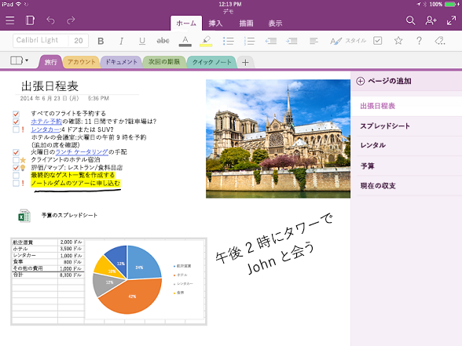

# OneNote API の概要OneNote API overview

OneNote は、顧客が Web、電話、タブレット、またはデスクトップ上で文字、スケッチ、音声を入力することで、家庭、学校、または職場用のアイデアやメモを追跡できるデジタル ノートブックです。OneNote is a digital notebook that lets customers track ideas and notes for home, school, or work, by typing, sketching, or voice, on the web, phone, tablet, or desktop. 自由にメモを整理し、デバイスを切り替えて作業の中断箇所から再開し、他のユーザーとリアルタイムでメモの共同作業を行えます。They can freely organize notes, switch devices and pick up where they left off, and collaborate on notes with others in real time.

## OneNote と統合する理由Why integrate with OneNote?

アプリを OneNote に統合すると、複数のプラットフォームで利用できる便利な機能を作成し、世界中の数百万人のユーザーに届けることができます。By integrating your apps with OneNote, you can create empowering experiences across multiple platforms that reach millions of users worldwide. Microsoft Graph を使用して OneNote のノートブック、セクション、ページにアクセスし、ユーザーによるアイデアや情報の計画や整理を支援するソリューションを作成することができます。You can use Microsoft Graph to access notebooks, sections, and pages in OneNote to create solutions that help your users plan and organize ideas and information.

### メモやアイデアを収集して整理するCollect and organize notes and ideas  

コンテンツを追加したり、アレンジしたりできるキャンバスとして OneNote を使用します。Use OneNote as a canvas where users can add and arrange their content. Microsoft Graph を使用すると、学生がメモを取って調査すること、家族が計画とアイデアを共有すること、買い物客が画像を共有することを可能にするアプリを簡単に作成できます。Microsoft Graph makes it easy to write apps that enable students to take notes and do research, families to share plans and ideas, or shoppers to share pictures. アプリでは、みんなが必要とする情報を集め、OneNote に送り、それらを整理することができます。Your app can grab the information people want, send it to OneNote, and then help them organize it.

### さまざまな形式で情報をキャプチャするCapture information in many formats

HTML、埋め込み画像 (ローカルやパブリック URL にある)、ビデオ、オーディオ、メール メッセージ、その他の一般的なファイル タイプをキャプチャします。Capture HTML, embed images (sourced locally or at a public URL), video, audio, email messages, and other common file types. OneNote では、Web ページや PDF ファイルをスナップショットとして表示することもできます。OneNote can even render webpages and PDF files as snapshots. Microsoft Graph は、OneNote ページ レイアウト用に標準 HTML および CSS のセットをサポートします。そのため、表、インライン イメージ、基本書式を使用して思いどおりの外観を実現できます。Microsoft Graph supports a set of standard HTML and CSS for OneNote page layout, so you can use tables, inline images, and basic formatting to get the look you want. 

### OneNote エコシステムを使用して、コア シナリオを強化するUse the OneNote ecosystem to enhance your core scenarios

その他の強力な OneNote の機能を利用できます。Tap into other powerful OneNote features. この Microsoft Graph の OneNote API では、イメージに対する OCR の実行、フルテキスト検索のサポート、クライアントの自動同期、イメージの処理、名刺キャプチャ、オンライン製品一覧やレシピ一覧の抽出などを実行できます。The OneNote APIs in Microsoft Graph run OCR on images, support full-text search, auto-syncs clients, process images, and extract business card captures and online product and recipe listings. メモや軽量メディアのクラウドでのデジタル メモリ ストアとして、またはドメイン固有データのデータ フィードとして OneNote を使用します。Use OneNote as your digital memory store in the cloud for notes and lightweight media, or as a data feed for domain-specific data. 

### すべての主要プラットフォームの数百万人に上る OneNote ユーザーが利用できる
Reach millions of OneNote users on all major platforms

OneNote を使用すると、アプリの使用量が増加します。Use OneNote to increase your app usage. OneNote は新しい Windows デバイスにプレインストールされており、ほとんどのプラットフォームでオンライン、および Office 365 の一部として利用可能です。OneNote is preinstalled on new Windows devices, and is available for most platforms, online, and as part of Office 365. 機能の豊富な OneNote 環境を利用するアプリを公開すると、広範なクロスプラットフォーム市場の潜在的な可能性にアクセスできるようになります。When you publish apps that use the feature-rich OneNote environment, you have access to broad cross-platform market potential.

<!-- Might be good to show a few examples of Microsoft Graph API calls here, similar to what we have in the featured scenarios topic: featured_scenarios..md You could have an H2 section called "What can I do with OneNote APIs in Microsoft Graph?"-->

## Microsoft Graph の OneNote API で実行できることWhat can I do with OneNote APIs in Microsoft Graph?

OneNote のリソースの操作で最もよく使用される要求の一部を次に示します。The following are some of the most popular requests for working with OneNote resources.

|操作Operation|URLURL|
|:--------|:--|
|自分のノートブックを取得するGET my notebooks|[https://graph.microsoft.com/v1.0/me/onenote/notebooks](https://developer.microsoft.com/graph/graph-explorer?request=me/onenote/notebooks&version=1.0)|
|自分のセクションを取得するGET my sections|[https://graph.microsoft.com/v1.0/me/onenote/sections](https://developer.microsoft.com/graph/graph-explorer?request=me/onenote/sections&version=1.0)|
|自分のページを取得するGET my pages|[https://graph.microsoft.com/v1.0/me/onenote/pages](https://developer.microsoft.com/graph/graph-explorer?request=me/onenote/pages&version=1.0)|

## OneNote API に関する詳細情報Learn more about OneNote APIs

OneNote のコンテンツ更新機能については、Microsoft Graph API の詳細情報をご覧ください。Take an in-depth look at Microsoft Graph APIs to learn about the OneNote content updating capabilities. 次の一覧の各トピックは、新しい OneNote ページを作成し、既存のページを新しいコンテンツで更新する方法を示しています。The topics in the following list show you how to create new OneNote pages and update existing pages with new content. Microsoft Graph を使用した OneNote ノートブックの更新に関するベスト プラクティスも参照してください。You'll also learn about best practices in using Microsoft Graph to update OneNote notebooks. 

### OneNote での作業Work with OneNote

* [OneNote REST API を使用するUse the OneNote REST API](/graph/api/resources/onenote-api-overview?view=graph-rest-1.0)
* [ベスト プラクティスBest practices](onenote-best-practices.md)
* [ブランドのガイドラインBranding guidelines](onenote-branding.md)
* [OneNote クライアントを開くOpen the OneNote client](open-onenote-client.md)
* [OneNote ページでノート シールを使用するUse note tags in OneNote pages](onenote-note-tags.md)
* [Microsoft Graph の OneNote API のエラー コードError codes for OneNote APIs in Microsoft Graph](onenote-error-codes.md)

### OneNote ページでの作業Work with OneNote pages

* [OneNote ページの入出力 HTMLInput and output HTML in OneNote pages](onenote-input-output-html.md)
* [Microsoft Graph によって OneNote コンテンツと構造を取得するGet OneNote content and structure with Microsoft Graph](onenote-get-content.md)
* [OneNote ページを作成するCreate OneNote pages](onenote-create-page.md)
* [OneNote ページ コンテンツを更新するUpdate OneNote page content](onenote-update-page.md)

### OneNote ページ コンテンツを使用するWork with OneNote page content

* [OneNote ページで絶対配置要素を作成するCreate absolute positioned elements in OneNote pages](onenote-abs-pos.md)
* [OneNote ページに画像、ビデオ、ファイルを追加するAdd images, videos, and files to OneNote pages](onenote-images-files.md)
* [OneNote API div タグを使用してキャプチャからデータを抽出するUse OneNote API div tags to extract data from captures](onenote-extract-data.md)

## 関連項目See also
OneNote サービス固有の REST エンドポイントにのみ公開されている、OneNote その他の機能の一部について説明します。Find out about a few other OneNote features that are exposed only on the OneNote service-specific REST endpoint.

- [OneNote の開発OneNote development](https://docs.microsoft.com/ja-JP/previous-versions/office/office-365-api/how-to/onenote-landing)
- [クラス ノートブックの操作Work with class notebooks](https://docs.microsoft.com/ja-JP/previous-versions/office/office-365-api/how-to/onenote-classnotebook)
- [非同期クラス ノートブックの操作Work with asynchronous class notebooks](https://docs.microsoft.com/ja-JP/previous-versions/office/office-365-api/how-to/onenote-classnotebook-asynchronous)
- [スタッフ ノートブックの操作Work with staff notebooks](https://docs.microsoft.com/ja-JP/previous-versions/office/office-365-api/how-to/onenote-staffnotebook)
- [ノートブック、セクション、ページのコピーCopy notebooks, sections, and pages](https://docs.microsoft.com/ja-JP/previous-versions/office/office-365-api/how-to/onenote-copy)
- [OneNote エンティティのアクセス許可を管理するManage permissions on OneNote entities](https://docs.microsoft.com/ja-JP/previous-versions/office/office-365-api/how-to/onenote-manage-perms)
- [Web ページで OneNote 保存ダイアログを使用するUse the OneNote save dialog on your webpages](https://docs.microsoft.com/ja-JP/previous-versions/office/office-365-api/how-to/onenote-save-dialog)
- [Webhooks の購読Subscribe to webhooks](https://docs.microsoft.com/ja-JP/previous-versions/office/office-365-api/how-to/onenote-sync)

## API リファレンスAPI reference
このサービスの API リファレンスをお探しですか?Looking for the API reference for this service?

- [Microsoft Graph v1.0 の OneNote APIOneNote API in Microsoft Graph v1.0](/graph/api/resources/onenote-api-overview?view=graph-rest-1.0)
- [Microsoft Graph ベータ版の OneNote APIOneNote API in Microsoft Graph beta](/graph/api/resources/onenote-api-overview?view=graph-rest-beta)

## 次のステップNext steps

[Microsoft Graph Explorer](https://developer.microsoft.com/graph/graph-explorer) を使用して、自分の OneNote ノートブックで OneNote API を試してみます。Use the [Microsoft Graph Explorer](https://developer.microsoft.com/graph/graph-explorer) to try out the OneNote APIs with your own OneNote notebooks.

Graph Explorer から OneNote API 呼び出しを行うには、左側の列にある **[その他のサンプルを表示]** を選択します。To make OneNote API calls from the Graph Explorer, choose **Show more samples** in the column on the left. メニューを使用して、OneNote を **[オン]** に切り替えます。Use the menu to toggle OneNote **On**. また、適切なアクセス許可を有効にする必要があります。You will also need to enable the appropriate permissions. 左側のメニューのアカウント名の下で、**[アクセス許可の修正]** を選択します。Under your account name in the menu on the left, choose **modify permissions**. OneNote のアクセス許可の詳細については、「[メモのアクセス許可](permissions-reference.md#notes-permissions)」を参照してください。For more information about OneNote permissions, see [Notes permissions](permissions-reference.md#notes-permissions).

Microsoft Graph の OneNote API を使い始めるには、[OneNote 参照コンテンツ](/graph/api/resources/onenote-api-overview?view=graph-rest-1.0)に関する記事をご覧ください。To get started with OneNote APIs in Microsoft Graph, see the [OneNote reference content](/graph/api/resources/onenote-api-overview?view=graph-rest-1.0).

