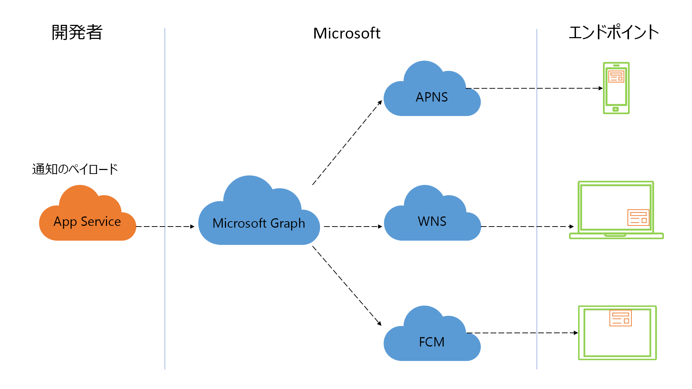

# Microsoft Graph 通知を使用して、人中心の通知エクスペリエンスを有効にする

通知は、アプリケーション ユーザーと再びやり取りするのに最も効果的な方法の 1 つです。 優れた通知エクスペリエンスによってほぼリアルタイムにアプリケーション ユーザーとのコミュニケーション チャンネルを開くことができます。これにより、適切なタイミングでアプリケーションの使用が促進され、ユーザーの生産性が向上し、重要なイベントや必要なアクションが通知されます。

今日、ユーザーはさまざまなプラットフォームやフォーム ファクターを経由してアプリケーションやサービスにアクセスできます。 このようなデバイスの組み合わせでは、マルチプラットフォームの通知システムを理解してサポートし、ユーザーをエンドポイントにマッピングし、デバイス間で通知状態を維持する必要があります。 

他のほとんどの通知システムでは、プラットフォーム固有のプッシュ通知システムを理解してターゲットにする必要はありませんが、それでも各デバイスをターゲットにするように設計されています。 Microsoft Graph 通知は人中心のアプローチを提供します。これにより、あらゆるデバイス エンドポイントでユーザーをターゲットにすることができます。

## Microsoft Graph の通知機能を統合する理由

Microsoft Graph の通知は、アプリケーションに 4 つの主要な利点をもたらすユーザー中心の通知プラットフォームを提供します。

### さまざまなエンドポイント間で通知配信ができるように、簡単にユーザーをターゲットとして設定する

通知 API を使用して、個人の Microsoft アカウント、職場または学校の Azure Active Directory (Azure AD) アカウントをターゲットとして通知を配信できます。 この通知はプラットフォームにより、Windows UWP、Android、iOS を含む、アプリケーションまたはサービスを実行しているすべてのユーザーのエンドポイントに配信されます。 この機能は、適切な通知がどこにいても確実に到達できるようにすることで、アウトリーチを最大化します。

### エンドポイント全体にわたって通知を簡単に管理する

クライアント アプリケーションで [Microsoft Graph 通知クライアント SDK](https://github.com/microsoft/project-rome) を使用すると、通知の状態を更新し、更新後の状態をすべてのエンドポイントで同期できます。 たとえば、ユーザーがあるデバイスで通知に対して操作 (開封済みまたは破棄済みとしてマークするなど) を行った場合、この状態変更が他のすべてのエンドポイントに伝播されます。 Microsoft Graph の通知 API は、一元管理された方法でユーザーの通知の状態を追跡します。したがって簡単かつ確実に、1 回処理された通知をすべての場所で非表示にできます。これにより、冗長性を最小限に抑え、優れたカスタマー エクスペリエンスを確保します。

### 通知状態と履歴を取得する

通知 API を使用して、ユーザー定義の期間 (最大 30 日間) に基づく通知履歴を取得できます。 開封済みまたは破棄済みとしてマークされた通知でも、履歴から取得してアプリ内の通知履歴で表示でき、また分析情報とインテリジェンスを組み合わせることもできます。

### プライバシーとコンプライアンス

Microsoft Graph 通知は、ISO 27001、ISO 27018、EUMC、HIPAA、SOC 1、SOC 2、そして GDPR など、ほとんどの企業のコンプライアンス要件を満たします。

## 開始するには?

はじめに、「[統合の概要](notifications-integration-e2e-overview.md)」セクションを参照し、アプリケーション内にユーザー中心の通知を統合する方法を確認してください。
