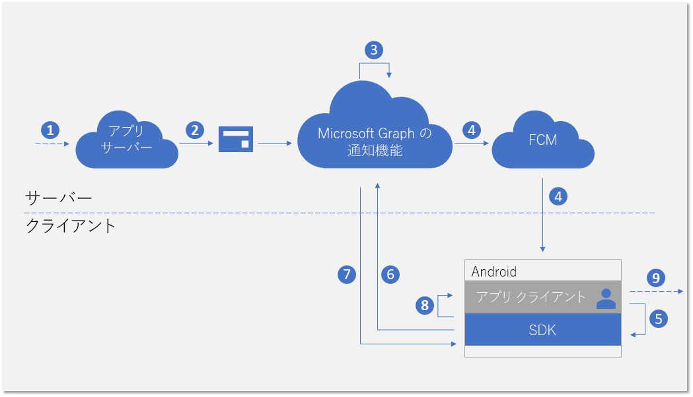
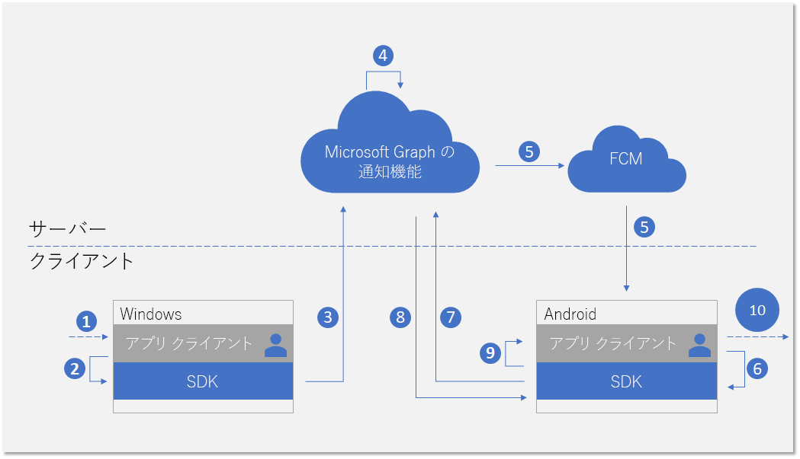

# <a name="integrate-your-android-app-with-the-client-side-sdk-for-user-notifications"></a>ユーザー通知用に Android アプリをクライアント側のSDKと統合する

Azure ポータルで[アプリを登録](notifications-integration-app-registration.md)し、パートナー デベロッパー センターで[クロスデバイス エクスペリエンス](notifications-integration-cross-device-experiences-onboarding.md)を始めたら、次の手順では、クライアント側の SDK forAndroid とクライアント アプリケーションを統合します。  

アプリは、クライアント側の SDK を使い、現在サインインしているユーザーを対象にアプリケーション サーバーから発行された通知の受信を開始するために必要な登録の手順を実行できます。 するとSDKは、新しい受信通知の受信、全てを無視するなどのシナリオを実現する通知状態の管理、全ての通知履歴の取得などを含むクライアント側の通知を管理します。 

## <a name="new-incoming-notification-flow"></a>新しい受信通知のフロー

新しい受信通知を受け取ると、次の図のようなデータ フローが表示されます。



プロセスには、いくつかのコンポーネントが含まれます:

* アプリケーション サーバー - アプリケーションのバック エンド
* アプリケーション クライアント - アプリケーションのフロント エンド (UWP アプリ、Android アプリ、または iOS アプリ)
* Microsoft Graph の通知 - デバイスおよびプラットフォームを跨ぐアプリケーション クライアントの異なるインスタンス間でのユーザー通知の発行と格納、同期を可能にするサービス コンポーネント
* FCM - Firebase Cloud Messaging のことで、Google Play サービスの一部として Android が提供するプッシュ通知サービス。 Microsoft Graph の通知は、このサービスを使用して、ユーザーの通知データの変更について Android アプリ クライアントに通知します。  

この図は次の手順を示します。 

1. アプリケーションのロジックです。 この手順では、ユーザーに発行される通知のトリガーを取り込みます。 これは、アプリケーション固有のロジックであり、新しいカレンダー イベントやタスクの割り当て、またはアプリケーション サービス がユーザーに通知したいことなど、Microsoft Graph での他の何かに関するイベントやデータの更新をすることができます。
2. アプリケーション サーバーでは、Microsoft Graph の通知 API 経由で対象のユーザーに通知を発行します。 詳細については、[サーバー側との統合](notifications-integrating-app-server.md)を参照してください。
3. 新しい通知を含む web リクエストを受信すると、Microsoft Graph の通知はこのアプリとユーザー向けに、通知の内容をクラウドで安全に保持します。
4. このユーザーが通知を受け取るための各アプリケーション クライアント インスタンスのサブスクリプションには、Microsoft Graph の通知がオペレーティング システムによって提供されるネイティブ プッシュ サービスを使用して、アプリのクライアントに通知を送信します。 この場合、アプリケーションは Android アプリであり、[FCM データメッセージ](https://firebase.google.com/docs/cloud-messaging/concept-options)を使用して信号を送信します。 
5. 受信プッシュ通知によって通知がアプリケーションに送られた後、アプリケーションはユーザー通知ストア内の変更の取得を SDK に求めます。 
6. SDK は、Microsoft Graph 内で、ユーザー通知ストアとの安全で準拠した接続を確立します。
7. SDK は、データの変更 (この場合は新しい通知のコンテンツ) を取得します。 
8. 変更が正常に取得された後、アプリに通知するためのイベントコールバックが SDK で発生します。 
9. アプリケーションのロジックです。 この手順では、使用しているアプリがイベントコールバック内で何を選択しているかを確認します。 通常、ローカルのアプリデータが変更され、ローカルの UI 更新が発生します。 この場合、アプリは通常、通知コンテンツをユーザーに通知するトースト通知ポップアップを作成します。

## <a name="notification-update-flow"></a>通知の更新フロー

Microsoft Graph の通知を使用するための主な利点の 1 つは、通知が安全にクラウドで保持され、ステートフル リソース タイプ に変更できることです。 したがって、アプリケーションはクロスデバイス シナリオにおいて、サインインした同じユーザーに対して、異なるデバイス間で通知の正しい状態を管理して同期することができます。 通知が消去としてマークされている場合、または1つのデバイスで既読になっている場合は、その他のデバイスにリアルタイムで通知されます。 "一度処理すれば、すべての場所で消去される" ということが、ユーザーの通知体験の一部として実現されます。 

次の図は、通知の状態を変更したり、一つのデバイスでの通知を削除したり、別のデバイスで状態の変更または削除を受信/処理するためのデータフローを示しています。



フローの2番目の部分の通知は、新しい受信通知の処理の流れと似ています。 これは仕様によるものです。SDK のプログラミング パターンは、アプリケーション クライアントがすべての種類のユーザー通知データの変更 (新規着信通知、通知状態の変更、通知の削除) を同様に処理できるように設計されています。  

この図は次の手順を示します。

1. アプリケーションのロジックです。 何らかのものが、通知を変更または削除するトリガーとなります。 通常、あらゆるイベントが通知を変更するトリガーになります。 
2. 通知を更新または削除するためにクライアント SDK を呼び出すアプリ。 現在、状態の変更に関して2つのプロパティ - **userActionState**と**readstate** -が公開されていますが、アプリケーションはこれらの状態とそれらを更新する必要があるときを定義できます。 たとえば、ユーザーが通知ポップアップを終了したときに、**userActionState**を更新して、表示しないようにすることができます。 ユーザーが通知ポップアップをクリックしてアプリを起動し、対応するアプリのコンテンツを使用しているときに、**userActionState**をアクティブ化し、**readState**を読み取りに更新できます。 
3. 通知を更新または削除するために対応する API が呼び出された後、SDK は、クラウド内のユーザー通知ストアに送信して、同じサインインユーザーの他のアプリクライアントインスタンスにこの変更をファンアウトします。 
4. クライアントから更新/削除要求を受信すると、Microsoft Graph の通知は通知ストアを更新して、この変更をサブスクライブしている他のアプリ クライアント インスタンスを識別します。
5. 各アプリケーションの クライアント サブスクリプションには、Microsoft Graph の通知がオペレーティング システムによって提供されるネイティブ プッシュ サービスを使用して、アプリのクライアントに通知を送信します。 この場合、これは Android アプリであり、[FCM データメッセージ](https://firebase.google.com/docs/cloud-messaging/concept-options)を使用して信号を送信します。 
6. 受信プッシュ通知によって通知がアプリケーションに送られた後、アプリケーションはユーザー通知ストア内の変更の取得を SDK に求めます。 
7. SDK は、Microsoft Graph 内で、ユーザー通知ストアとの安全で準拠した接続を確立します。
8. SDK によってデータが変更されます。この場合では、変更内容は通知状態の更新または通知の削除です。 
9. 変更が正常に取得された後、アプリに通知するためのイベントコールバックが SDK で発生します。 
10. アプリケーションのロジックです。 この手順では、使用しているアプリがイベントコールバック内で何を選択しているかを確認します。 通常、ローカルのアプリデータが変更され、ローカルの UI 更新が発生します。 この場合、通知の更新があるため、アプリはローカルに UI を更新して状態の変更を反映させる必要があります。 たとえば、通知がアクティブ化されている場合、Android 通知トレイ内の対応する通知メッセージを削除すると、"一度処理すれば、すべての場所で消去" することができます。 

Microsoft Graph の通知の詳細については、[Microsoft Graph の通知の概要](notifications-concept-overview.md)を参照してください。 全てを Microsoft Graph の通知と統合するために必要な手順の詳細については、Microsoft Graph の通知の[統合の概要](notifications-integration-e2e-overview.md)を参照してください。

## <a name="development-environment-and-requirements"></a>開発環境と要件

Microsoft Graph の通知を使用するには、Android アプリ開発 IDE と、サポートされているアーキテクチャの 1 つ (**armeabi-v7a**、**arm64-v8a**、**x86**、または **x86_64**) を備えた Android デバイス、またはエミュレーターが必要です。 システムは Android 4.4.2 以降を実行している必要があります。

## <a name="adding-the-sdk-to-your-project"></a>プロジェクトに SDK を追加する

プロジェクトのルートにある *build.gradle* ファイルに、次のリポジトリ参照を挿入します。

```Java
allprojects {
    repositories {
    jcenter()
    maven { url 'https://maven.google.com' }
    maven { url 'https://projectrome.bintray.com/maven/' }
    }
}
```

次に、プロジェクトフォルダーにある _build.gradle_ ファイルに次の依存関係を挿入します。

```Java
dependencies { 
    ...
    implementation 'com.microsoft.connecteddevices:connecteddevices-sdk:+'
}
```

アプリで ProGuard を使用したい場合は、これらの新しい API の ProGuard ルールを追加してください。 プロジェクトの *App* フォルダに *proguard-rules.txt* というファイルを作成し、[ProGuard_Rules_for_Android_Rome_SDK.txt](https://github.com/Microsoft/project-rome/blob/master/Android/ProGuard_Rules_for_Android_Rome_SDK.txt) の内容を貼り付けます。
プロジェクトの *AndroidManifest.xml* ファイルで、`manifest` 要素内に次の権限を追加します (まだ存在しない場合)。 これにより、インターネットに接続してデバイス上で Bluetooth 検出を有効にする権限がアプリケーションに与えられます。
Bluetooth 関連の権限は、Bluetooth 検出を使用する場合にのみ必要であり、接続されているデバイス プラットフォームの他の機能には必要ありません。 また、`ACCESS_COARSE_LOCATION`は Android SDK 21 以降でのみ必須です。 Android SDK 23 以降では、実行時に位置アクセスを許可するようにユーザーに要求する必要もあります。

```xml
<uses-permission android:name="android.permission.INTERNET" />
<uses-permission android:name="android.permission.BLUETOOTH" />
<uses-permission android:name="android.permission.BLUETOOTH_ADMIN" />
<uses-permission android:name="android.permission.ACCESS_COARSE_LOCATION" />
<uses-permission android:name="android.permission.ACCESS_NETWORK_STATE" />
```
次に、接続デバイス機能を配置するアクティビティのクラスに移動します。 次の名前空間をインポートします。

```java
import com.microsoft.connecteddevices;
import com.microsoft.connecteddevices.userdata;
import com.microsoft.connecteddevices.userdata.usernotifications;
```

## <a name="initializing-the-connected-device-platforms"></a>Connected Device Platforms の初期化

クライアント側のSDKは、Connected Device Platforms と呼ばれるインフラストラクチャの上に構築されています。 機能を使用するには、アプリ内でプラットフォームを初期化する必要があります。 この初期化手順は、通知シナリオを実行する前に必須であるため、メインクラス **OnCreate** メソッド内で実行する必要があります。

[**ConnectedDevicesPlatform**](https://docs.microsoft.com/ja-JP/java/api/com.microsoft.connecteddevices.connecteddevicesplatform?view=rome-android-latest) クラスをインスタンス化して、プラットフォームを構築および初期化する必要があります。 これを行う前に、プラットフォームが起動した後、イベントが発生する可能性があるため、イベント ハンドラーを接続してください。 

```java
ConnectedDevicesPlatform platform = new ConnectedDevicesPlatform(context);

platform.getAccountManager().accessTokenRequested().subscribe((accountManager, args) -> onAccessTokenRequested(accountManager, args));
platform.getAccountManager().accessTokenInvalidated().subscribe((accountManager, args) -> onAccessTokenInvalidated(accountManager, args));
platform.getNotificationRegistrationManager().notificationRegistrationStateChanged().subscribe((notificationRegistrationManager, args) -> onNotificationRegistrationStateChanged(notificationRegistrationManager, args));

platform.start();
```

### <a name="handling-account-access-token"></a>アカウント アクセス トークンの処理

新しい受信通知のコンテンツの取得、通知の状態の更新など、SDK が行うすべての Web の呼び出しは、ユーザーのデータに対する読み取りと書き込みであり、そのため常に有効な アクセス トークン を要求します。 プラットフォームが初期化された後に、ユーザーのアクセストークンが正常に機能するために、SDK は次のイベント - アクセス トークン が要求または無効化されたときに呼び出された - の処理を必要とします。 

#### <a name="accesstokenrequested"></a>accessTokenRequested 

完全に実装するには、[Android サンプルアプリ](https://github.com/Microsoft/project-rome/blob/release/1.3.0/Android/samples/graphnotificationssample/app/src/main/java/com/microsoft/connecteddevices/graphnotifications/ConnectedDevicesManager.java)を参照してください。 

```Java
private void onAccessTokenRequested(ConnectedDevicesAccountManager sender, ConnectedDevicesAccessTokenRequestedEventArgs args) {
    ConnectedDevicesAccessTokenRequest request = args.getRequest();
    List<String> scopes = request.getScopes();

    // We always need to complete the request, even if a matching account is not found
    if (account == null) {
        request.completeWithErrorMessage("The app could not find a matching ConnectedDevicesAccount to get a token");
        return;
    }

    // Complete the request with a token
    account.getAccessTokenAsync(scopes)
        .thenAcceptAsync((String token) -> {
            request.completeWithAccessToken(token);
        }).exceptionally(throwable -> {
            request.completeWithErrorMessage("The Account could not return a token with those scopes");
            return null;
    });
}
```

#### <a name="accesstokeninvalidated"></a>accessTokenInvalidated

完全に実装するには、[Android サンプルアプリ](https://github.com/Microsoft/project-rome/blob/release/1.3.0/Android/samples/graphnotificationssample/app/src/main/java/com/microsoft/connecteddevices/graphnotifications/ConnectedDevicesManager.java)を参照してください。 

```Java
private void onAccessTokenInvalidated(ConnectedDevicesAccountManager sender, ConnectedDevicesAccessTokenInvalidatedEventArgs args, List<Account> accounts) {
    Log.i(TAG, "Token invalidated for account: " + args.getAccount().getId());
}

```

### <a name="handling-push-registration-expiration"></a>プッシュ登録の有効期限を処理する 

Microsoft Graph の通知は、FCM、Androidのネイティブのプッシュ プラットフォームを使用して、ユーザー通知のデータ変更をクライアント アプリケーションに通知します。 これは、新しい受信通知がアプリサーバーから発行されている場合、またはクロスデバイス シナリオにおいてサインインした同じユーザーの別のデバイスで通知の状態が更新された場合に発生します。 

したがって、データ通知メッセージが正常に送信されることを許可する有効なFCMトークンが必要です。 次のイベントコールバックでは、FCM プッシュトークンの有効期限を処理します。 

#### <a name="notificationregistrationstatechanged"></a>notificationRegistrationStateChanged

完全に実装するには、[Android サンプルアプリ](https://github.com/Microsoft/project-rome/blob/release/1.3.0/Android/samples/graphnotificationssample/app/src/main/java/com/microsoft/connecteddevices/graphnotifications/ConnectedDevicesManager.java)を参照してください。 

## <a name="signing-in-your-user"></a>ユーザーにサインインする

Microsoft Graph 内の他の多くのリソースタイプと同様に、Microsoft Graph の通知は、ユーザーを中核として一元化されます。 アプリでサブスクライブし、サインインしたユーザーへの通知を受信できるようにするには、最初に登録プロセスで使用する有効な OAuth トークンを入手する必要があります。 OAuth トークンを生成および管理する方法を選択できます。 サンプルアプリは ADAL を使用しました。 

Microsoft アカウント を使用している場合は、サインイン リクエストに次の許可を含める必要があります:`wl.offline_access"`, `ccs.ReadWrite`, `wns.connect`, `asimovrome.telemetry`, `https://activity.windows.com/UserActivity.ReadWrite.CreatedByApp`。 

Azure AD アカウントを使用している場合は、次の対象ユーザーをリクエストする必要があります:`https://cdpcs.access.microsoft.com`。

## <a name="adding-the-user-account-to-the-platform"></a>プラットフォームにユーザーアカウントを追加する 

サインインしたユーザーアカウントを SDK に登録する必要があります。これには、FCM を経由して最初のプッシュ通知を受信するためのアカウントの追加とプッシュ チャネルの登録が含まれます。 

```Java
public AsyncOperation<Boolean> prepareAccountAsync(final Context context) {
    // Accounts can be in 3 different scenarios:
    // 1: cached account in good standing (initialized in the SDK and our token cache).
    // 2: account missing from the SDK but present in our cache: Add and initialize account.
    // 3: account missing from our cache but present in the SDK. Log the account out async

    // Subcomponents (e.g. UserDataFeed) can only be initialized when an account is in both the app cache
    // and the SDK cache.
    // For scenario 1, initialize our subcomponents.
    // For scenario 2, subcomponents will be initialized after InitializeAccountAsync registers the account with the SDK.
    // For scenario 3, InitializeAccountAsync will unregister the account and subcomponents will never be initialized.
    switch (mState) {
        // Scenario 1
        case IN_APP_CACHE_AND_SDK_CACHE:
            mUserNotificationsManager = new UserNotificationsManager(context, mAccount, mPlatform);
            return registerAccountWithSdkAsync();
        // Scenario 2
        case IN_APP_CACHE_ONLY: {
            // Add the this account to the ConnectedDevicesPlatform.AccountManager
            return mPlatform.getAccountManager().addAccountAsync(mAccount).thenComposeAsync((ConnectedDevicesAddAccountResult result) -> {
                // We failed to add the account, so exit with a failure to prepare bool
                if (result.getStatus() != ConnectedDevicesAccountAddedStatus.SUCCESS) {
                    result.getStatus());
                    return AsyncOperation.completedFuture(false);
                }

                // Set the registration state of this account as in both app and sdk cache
                mState = AccountRegistrationState.IN_APP_CACHE_AND_SDK_CACHE;
                mUserNotificationsManager = new UserNotificationsManager(context, mAccount, mPlatform);
                return registerAccountWithSdkAsync();
            });
        }
        // Scenario 3
        case IN_SDK_CACHE_ONLY:
            // Remove the account from the SDK since the app has no knowledge of it
            mPlatform.getAccountManager().removeAccountAsync(mAccount);
            // This account could not be prepared
            return AsyncOperation.completedFuture(false);
        default:
            // This account could not be prepared
            Log.e(TAG, "Failed to prepare account " + mAccount.getId() + " due to unknown state!");
            return AsyncOperation.completedFuture(false);
    }
}
```

```Java
public AsyncOperation<Boolean> registerAccountWithSdkAsync() {
    if (mState != AccountRegistrationState.IN_APP_CACHE_AND_SDK_CACHE) {
        AsyncOperation<Boolean> toReturn = new AsyncOperation<>();
        toReturn.completeExceptionally(new IllegalStateException("Cannot register this account due to bad state: " + mAccount.getId()));
        return toReturn;
    }

    // Grab the shared GCM/FCM notification token from this app's BroadcastReceiver
    return RomeNotificationReceiver.getNotificationRegistrationAsync().thenComposeAsync((ConnectedDevicesNotificationRegistration notificationRegistration) -> {
        // Perform the registration using the NotificationRegistration
        return mPlatform.getNotificationRegistrationManager().registerAsync(mAccount, notificationRegistration)
            .thenComposeAsync((result) -> {
                if (result.getStatus() == ConnectedDevicesNotificationRegistrationStatus.SUCCESS) {
                    Log.i(TAG, "Successfully registered account " + mAccount.getId() + " for cloud notifications");
                } else {
                    // It would be a good idea for apps to take a look at the different statuses here and perhaps attempt some sort of remediation.
                    // For example, token request failed could mean that the user needs to sign in again. An app could prompt the user for this action 
                    // and retry the operation afterwards.
                    Log.e(TAG, "Failed to register account " + mAccount.getId() + " for cloud notifications!");
                    return AsyncOperation.completedFuture(false);
                }

                return mUserNotificationsManager.registerForAccountAsync();
            });
    });
}
```

## <a name="subscribing-to-receive-users-notifications"></a>ユーザーの通知を受信するためのサブスクライブ 

このログイン ユーザーのアプリケーションのため、**UserDataFeed** オブジェクトをインスタンス化する必要があります。 アプリケーションは、[クロスデバイス エクスペリエンスの開始](notifications-integration-cross-device-experiences-onboarding.md)に指定したクロスプラットフォームアプリ ID によって識別されます。

```Java
public UserNotificationsManager(@NonNull Context context, @NonNull ConnectedDevicesAccount account, @NonNull ConnectedDevicesPlatform platform)
{
    Context context = new Context;
    UserDataFeed feed = UserDataFeed.getForAccount(account, platform, Secrets.APP_HOST_NAME);
    UserNotificationChannel channel = new UserNotificationChannel(feed);
    UserNotificationReader reader = channel.createReader();
    reader.dataChanged().subscribe((reader, aVoid) -> readFromCache(reader));
    }
}
```

## <a name="receiving-and-managing-user-notifications"></a>ユーザー通知を受信および管理する

このトピックの前のフロー図では、アプリサーバーからの新しい受信通知や、別のアプリケーションクライアントインスタンスから開始された通知の更新または削除を処理するためのプログラミングパターンを示しています。 これらのデータの変更を処理する手順は次のとおりです。 

### <a name="handling-incoming-push-notification-signal"></a>受信プッシュ通知シグナルの処理

全ての種類のユーザー通知データの変更について、プッシュ通知としてアプリクライアントに配信されるシグナルが生成されます。 Android アプリの場合、信号は FCM プッシュ データ メッセージとして配信されます。 データ メッセージ シグナルを受信するには、アプリが**TryParse**を呼び出し、実際のデータ変更のためのSDKによる Microsoft Graph の通知サービスからの取得をトリガーします。

```Java
public void onMessageReceived(RemoteMessage message) {
    Map data = message.getData();
    ConnectedDevicesNotification notification = ConnectedDevicesNotification.tryParse(data);

    if (notification != null) {
        try {
            ConnectedDevicesPlatform platform = ConnectedDevicesManager.getConnectedDevicesManager(getApplicationContext()).getPlatform();

            // NOTE: it may be useful to attach completion to this async in order to know when the notification is done being processed.
            // This would be a good time to stop a background service or otherwise cleanup.
            platform.processNotificationAsync(notification);
        } catch (Exception e) {
            Log.e(TAG, "Failed to process FCM notification" + e.getMessage());
        }
    }
}
```

### <a name="handling-user-notification-data-changes"></a>ユーザー通知のデータ変更の処理

SDK がデータ変更の取得を正常に完了すると、イベントコールバックが起こり、アプリクライアントが通知の作成、更新、または削除を処理することが想定されます。

```Java
private void readFromCache(final UserNotificationReader reader)
{
    reader.readBatchAsync(Long.MAX_VALUE).thenAccept(notifications -> {
        synchronized (this) {
            for (final UserNotification notification : notifications) {
                if (notification.getStatus() == UserNotificationStatus.ACTIVE) {
                    removeIf(mNewNotifications, item -> notification.getId().equals(item.getId()));

                    if (notification.getUserActionState() == UserNotificationUserActionState.NO_INTERACTION) {
                        mNewNotifications.add(notification);
                        if (notification.getReadState() != UserNotificationReadState.READ) {
                            clearNotification(mContext.getApplicationContext(), notification.getId());
                            addNotification(mContext.getApplicationContext(), notification.getContent(), notification.getId());
                        }
                    } else {
                        clearNotification(mContext.getApplicationContext(), notification.getId());
                    }

                    removeIf(mHistoricalNotifications, item -> notification.getId().equals(item.getId()));
                    mHistoricalNotifications.add(0, notification);
                } else {
                    removeIf(mNewNotifications, item -> notification.getId().equals(item.getId()));
                    removeIf(mHistoricalNotifications, item -> notification.getId().equals(item.getId()));
                    clearNotification(mContext.getApplicationContext(), notification.getId());
                }
            }
        }

    });
}
```

### <a name="update-state-of-a-notification"></a>通知の更新状態

このアプリクライアントインスタンスから通知状態が変更された場合 (たとえば、このデバイスのトースト通知ポップアップがユーザーによって有効化された場合)、アプリは 同じユーザーが使用する全てのデバイスでこの状態の変更を同期するために、SDK を呼び出して通知の状態を更新する必要があります。 

```Java
notification.setUserActionState(UserNotificationUserActionState.ACTIVATED);
notification.saveAsync().whenCompleteAsync((userNotificationUpdateResult, throwable) -> {
    if (throwable == null && userNotificationUpdateResult != null && userNotificationUpdateResult.getSucceeded()) {
        Log.d(TAG, "Successfully activated the notification");
    }
});

```

### <a name="delete-a-notification"></a>通知を削除する

このアプリクライアントインスタンスから通知の削除が行われた場合 (たとえば、この通知に対応するタスクが完了とマークされ、アプリのデータベースから削除された場合)、アプリは同じユーザーが使用する全てのデバイスでこの削除の操作を同期するために、SDK を呼び出して通知を削除する必要があります。 

通知は、有効期限が切れているか、明示的に削除された場合にのみ、ユーザー通知ストアから削除されます。 **Useractionstate**のセマンティック定義はアプリケーション自体によって定義されているため、**Useractionstate**を消去するよう更新しても、ユーザー通知は削除されません。

```Java
channel.deleteUserNotificationAsync(notification.getId()).whenCompleteAsync((userNotificationUpdateResult, throwable) -> {
    if (throwable == null && userNotificationUpdateResult != null && userNotificationUpdateResult.getSucceeded()) {
        Log.d(TAG, "Successfully deleted the notification");
    }
});
```

## <a name="see-also"></a>関連項目

- SDK の通知機能に関連する API のフルセットの [API リファレンス](https://docs.microsoft.com/ja-JP/windows/project-rome/notifications/api-reference-for-android)です。 
- Android アプリの[クライアント側のサンプル](https://github.com/Microsoft/project-rome/tree/master/Android/samples/graphnotificationssample)です。
- 通知を発行するための[アプリサーバーのサンプル](notifications-integrating-app-server.md)です。 
