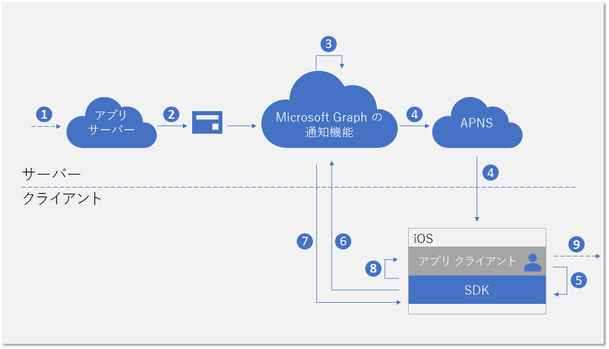
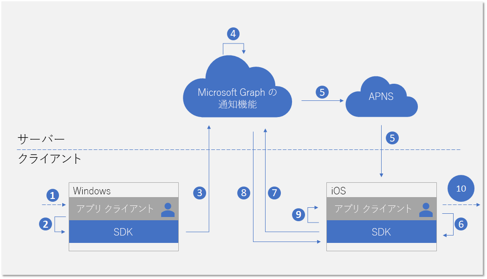

# <a name="integrate-your-ios-app-with-the-client-side-sdk-for-user-notifications"></a>ユーザー通知用に iOS アプリをクライアント側のSDKと統合する

Azure ポータルで[アプリを登録](notifications-integration-app-registration.md)し、パートナー デベロッパー センターで[クロスデバイス体験](notifications-integration-cross-device-experiences-onboarding.md)を始めたら、次の手順では、クライアント側の SDK foriOS とクライアント アプリケーションを統合します。  

アプリは、クライアント側の SDK を使い、現在サインインしているユーザーを対象にアプリケーション サーバーから発行された通知の受信を開始するために必要な登録の手順を実行できます。 するとSDKは、新しい受信通知の受信、全てを無視するなどのシナリオを実現する通知状態の管理、全ての通知履歴の取得などを含むクライアント側の通知を管理します。 

## <a name="new-incoming-notification-flow"></a>新しい受信通知のフロー

新しい受信通知を受け取ると、次の図のようなデータ フローが表示されます。



プロセスには、いくつかのコンポーネントが含まれます:

* アプリケーション サーバー - アプリケーションのバック エンド
* アプリケーション クライアント - アプリケーションのフロント エンド (UWP アプリ、Android アプリまたは iOS アプリ)
* Microsoft Graph notifications - デバイスおよびプラットフォームを跨ぐアプリケーション クライアント の異なるインスタンス間でのユーザー通知の発行と格納、同期を可能にするサービス コンポーネント
* APNs - Apple for ios アプリによって提供される Apple プッシュ通知サービスです。 Microsoft Graph notifications は、このサービスを使用して、ユーザーの通知データの変更についてiOS アプリ クライアントに通知します。  

この図は次の手順を示します。 

1. アプリケーションのロジックです。 この手順では、ユーザーに発行される通知のトリガーを取り込みます。 これは、アプリケーション固有のロジックであり、新しいカレンダー イベントやタスクの割り当て、またはアプリケーション サービス がユーザーに通知したいことなど、Microsoft Graph での他の何かに関するイベントやデータの更新をすることができます。
2. アプリケーション サーバーでは、Microsoft Graph notifications API 経由で対象のユーザーに通知を発行します。 詳細については、[サーバー側との統合](notifications-integrating-app-server.md)を参照してください。
3. 新しい通知を含む web リクエストを受信すると、Microsoft Graph notifications はこのアプリとユーザー向けに、通知の内容をクラウドで安全に保持します。
4. このユーザーが通知を受け取るための各アプリケーション クライアント インスタンスのサブスクリプションには、Microsoft Graph notifications がオペレーティング システムによって提供されるネイティブ プッシュ サービスを使用して、アプリのクライアントに通知を送信します。 この例ではアプリケーションはiOS のアプリで、 [APNs バック グラウンド更新の通知] を使用して通知を送ります。 
5. 受信プッシュ通知によって通知がアプリケーションに送られた後、アプリケーションはユーザー通知ストア内の変更の取得を SDK に求めます。 
6. SDK は、Microsoft Graph 内で、ユーザー通知ストアとの安全で準拠した接続を確立します。
7. SDK は、データの変更 (この場合は新しい通知のコンテンツ) を取得します。 
8. 変更が正常に取得された後、アプリに通知するためのイベントコールバックが SDK で発生します。 
9. アプリケーションのロジックです。 この手順では、使用しているアプリがイベントコールバック内で何を選択しているかを確認します。 通常、ローカルのアプリデータが変更され、ローカルの UI 更新が発生します。 この場合、アプリは通常、通知コンテンツをユーザーに通知する iOS アラートを作成します。

## <a name="notification-update-flow"></a>通知の更新フロー

Microsoft Graph notifications を使用するための主な利点の 1 つは、通知が安全にクラウドで保持され、ステートフル リソース タイプ に変更できることです。 したがって、アプリケーションはクロスデバイス シナリオにおいて、サインインした同じユーザーに対して、異なるデバイス間で通知の正しい状態を管理して同期することができます。 通知が消去としてマークされている場合、または1つのデバイスで既読になっている場合は、その他のデバイスにリアルタイムで通知されます。 "一度処理すれば、すべての場所で消去される" ということが、ユーザーの通知体験の一部として実現されます。 

次の図は、通知の状態を変更したり、一つのデバイスでの通知を削除したり、別のデバイスで状態の変更または削除を受信/処理するためのデータフローを示しています。



フローの2番目の部分の通知は、新しい受信通知の処理の流れと似ています。 これは仕様によるものです。 SDK のプログラミングパターンは、あらゆる種類のユーザー通知データの変更 (新規に受信した通知、通知状態の変更、通知の削除など)をアプリケーションクライアントが同じような方法で処理できるように設計されています。  

この図は次の手順を示します。

1. アプリケーションのロジックです。 何らかのものが、通知を変更または削除するトリガーとなります。 通常、あらゆるイベントが通知を変更するトリガーになります。 
2. 通知を更新または削除するためにクライアント SDK を呼び出すアプリ。 現在、状態の変更に関して2つのプロパティ - **userActionState**と**readstate** -が公開されていますが、アプリケーションはこれらの状態とそれらを更新する必要があるときを定義できます。 たとえば、ユーザーが通知ポップアップを終了したときに、**userActionState**を更新して、表示しないようにすることができます。 ユーザーが通知ポップアップをクリックしてアプリを起動し、対応するアプリのコンテンツを使用しているときに、**userActionState**をアクティブ化し、**readState**を読み取りに更新できます。 
3. 通知を更新または削除するために対応する API が呼び出された後、SDK は、クラウド内のユーザー通知ストアに送信して、同じサインインユーザーの他のアプリクライアントインスタンスにこの変更をファンアウトします。 
4. クライアントから更新/削除要求を受信すると、Microsoft Graph notifications は通知ストアを更新して、この変更をサブスクライブしている他のアプリ クライアント インスタンスを識別します。
5. 各アプリケーションの クライアント サブスクリプションには、Microsoft Graph notifications がオペレーティング システムによって提供されるネイティブ プッシュ サービスを使用して、アプリのクライアントに通知を送信します。 この例では、iOS のアプリで、 [APNs バック グラウンド更新の通知](https://developer.apple.com/library/archive/documentation/NetworkingInternet/Conceptual/RemoteNotificationsPG/CreatingtheNotificationPayload.html#//apple_ref/doc/uid/TP40008194-CH10-SW8)を使用して通知を送ります。 
6. 受信プッシュ通知によって通知がアプリケーションに送られた後、アプリケーションはユーザー通知ストア内の変更の取得を SDK に求めます。 
7. SDK は、Microsoft Graph 内で、ユーザー通知ストアとの安全で準拠した接続を確立します。
8. SDK によってデータが変更されます。この場合では、変更内容は通知状態の更新または通知の削除です。 
9. 変更が正常に取得された後、アプリに通知するためのイベントコールバックが SDK で発生します。 
10. アプリケーションのロジックです。 この手順では、使用しているアプリがイベントコールバック内で何を選択しているかを確認します。 通常、ローカルのアプリデータが変更され、ローカルの UI 更新が発生します。 この場合、通知の更新があるため、アプリはローカルに UI を更新して状態の変更を反映させる必要があります。 たとえば、通知がアクティブ化されている場合、iOS 通知センター内の対応するアラート UI を削除すると、"一度処理すれば、すべての場所で消去" することができます。 

Microsoft Graph 通知の詳細については、[Microsoft Graph Notifications の概要](notifications-concept-overview.md)を参照してください。 全てを Microsoft Graph notifications と統合するために必要な手順の詳細については、Microsoft Graph notifications の[統合の概要](notifications-integration-e2e-overview.md)を参照してください。

## <a name="adding-the-sdk-to-your-project"></a>プロジェクトに SDK を追加する

Connected Devices Platform にiOS アプリを追加する最も簡単な方法は、[CocoaPods](https://cocoapods.org/) 依存管理マネージャーを使用することです。 iOS プロジェクトの*Podfile*に移動し、次のエントリを挿入します。

```ObjectiveC
platform :ios, "10.0"
workspace 'iOSSample'

target 'iOSSample' do
  # Uncomment the next line if you're using Swift or would like to use dynamic frameworks
  # use_frameworks!

    pod 'ProjectRomeSdk'

  # Pods for iOSSample
```

> [!NOTE]
> CocoaPodを使用するには、プロジェクトで _.xcworkspace_ ファイルを使用する必要があります。

## <a name="initializing-the-connected-device-platforms"></a>Connected Device Platforms の初期化

クライアント側のSDKは、Connected Device Platforms と呼ばれるインフラストラクチャの上に構築されています。 機能を使用するには、アプリ内でプラットフォームを初期化する必要があります。 この初期化手順は、通知シナリオを実行する前に必須であるため、**AppDelegate** メソッド内で実行する必要があります。


  [
  **MCDConnectedDevicesPlatform**](https://docs.microsoft.com/ja-JP/windows/project-rome/objectivec-api/connecteddevices/mcdconnecteddevicesplatform) クラスをインスタンス化して、プラットフォームを構築および初期化する必要があります。 これを行う前に、プラットフォームが起動した後、イベントが発生する可能性があるため、以下のようにイベントハンドラーを接続してください。  

```ObjectiveC
MCDConnectedDevicesPlatform* platform = [MCDConnectedDevicesPlatform new];
        
[platform.accountManager.accessTokenRequested subscribe:^(MCDConnectedDevicesAccountManager* _Nonnull manager, MCDConnectedDevicesAccessTokenRequestedEventArgs* _Nonnull args) {
    // implement the callback;
}];
        
[self.platform.accountManager.accessTokenInvalidated
    subscribe:^(MCDConnectedDevicesAccountManager* _Nonnull manager __unused,
        MCDConnectedDevicesAccessTokenInvalidatedEventArgs* _Nonnull request) {
    // implement the callback;
}];
        
[self.platform.notificationRegistrationManager.notificationRegistrationStateChanged subscribe:^(MCDConnectedDevicesNotificationRegistrationManager* _Nonnull manager __unused, MCDConnectedDevicesNotificationRegistrationStateChangedEventArgs* _Nonnull args) {
    // implement the callback
}];
        
[platform start];
```

### <a name="handling-account-access-token"></a>アカウント アクセス トークンの処理

新しい受信通知のコンテンツの取得、通知の状態の更新など、SDK が行うすべての web の呼び出しは、ユーザーのデータに対する読み取りと書き込みであり、そのため常に有効な アクセス トークン を要求します。 プラットフォームが初期化された後に、ユーザーのアクセストークンが正常に機能するために、SDK は次のイベント - アクセス トークン が要求または無効化されたときに呼び出された - の処理を必要とします。 

#### <a name="accesstokenrequested"></a>accessTokenRequested

完全に実装するには、 [iOS サンプルアプリ](https://github.com/Microsoft/project-rome/blob/master/iOS/samples/GraphNotifications/GraphNotificationsSample/ConnectedDevicesPlatformManager.m)を参照してください。 

#### <a name="accesstokeninvalidated"></a>accessTokenInvalidated

完全に実装するには、 [iOS サンプルアプリ](https://github.com/Microsoft/project-rome/blob/master/iOS/samples/GraphNotifications/GraphNotificationsSample/ConnectedDevicesPlatformManager.m)を参照してください。 

```ObjectiveC
[platform.accountManager.accessTokenInvalidated
    subscribe:^(MCDConnectedDevicesAccountManager* _Nonnull manager __unused,
        MCDConnectedDevicesAccessTokenInvalidatedEventArgs* _Nonnull request) {
}];
```

### <a name="handling-push-registration-expiration"></a>プッシュ登録の有効期限を処理する 

Microsoft Graph notifications は、Apn、iOSのネイティブのプッシュ プラットフォームを使用して、ユーザー通知のデータ変更をクライアント アプリケーションに通知します。 これは、新しい受信通知がアプリサーバーから発行されている場合、またはクロスデバイス シナリオにおいてサインインした同じユーザーの別のデバイスで通知の状態が更新された場合に発生します。 

このような理由から、バックグラウンドでの更新通知を正常に受信するための有効な APNs トークンが必要です。 次のイベントコールバックでは、APNs プッシュトークンの有効期限を処理します。 

#### <a name="notificationregistrationstatechanged"></a>notificationRegistrationStateChanged

完全に実装するには、 [iOS サンプルアプリ](https://github.com/Microsoft/project-rome/blob/master/iOS/samples/GraphNotifications/GraphNotificationsSample/ConnectedDevicesPlatformManager.m)を参照してください。 

## <a name="signing-in-your-user"></a>ユーザーにサインインする

Microsoft Graph 内の他の多くのリソースタイプと同様に、Microsoft Graph notifications は、ユーザーを中核として一元化されます。 アプリでサブスクライブし、サインインしたユーザーへの通知を受信できるようにするには、最初に登録プロセスで使用する有効な OAuth トークンを入手する必要があります。 OAuth トークンを生成および管理する方法を選択できます。 サンプルアプリは ADAL を使用します。 

Microsoft アカウント を使用している場合は、サインイン リクエストに次の許可を含める必要があります:`wl.offline_access"`, `ccs.ReadWrite`, `wns.connect`, `asimovrome.telemetry`, `https://activity.windows.com/UserActivity.ReadWrite.CreatedByApp`。 

Azure AD アカウントを使用している場合は、次の対象ユーザーをリクエストする必要があります:`https://cdpcs.access.microsoft.com`。

## <a name="adding-the-user-account-to-the-platform"></a>プラットフォームにユーザーアカウントを追加する 

サインインしたユーザーアカウントを SDK に登録する必要があります。 これは、アカウントの追加と、 APN を通じて初期通知を受信するプッシュチャネルの登録を伴います。 詳細については、サンプルの[prepareAccountAsync](https://github.com/Microsoft/project-rome/blob/master/iOS/samples/GraphNotifications/GraphNotificationsSample/ConnectedDevicesPlatformManager.m) メソッドを参照してください。

```ObjectiveC
MCDConnectedDevicesPlatform* platform = [MCDConnectedDevicesPlatform new];
MCDConnectedDevicesAccount* mcdAccount = [MCDConnectedDevicesAccount new];

[platform.accountManager addAccountAsync:mcdAccount callback:adapter]; 
```

## <a name="subscribing-to-receive-users-notifications"></a>ユーザーの通知を受信するためのサブスクライブ 

このサインインユーザーのアプリケーションのため、**UserDataFeed** オブジェクトをインスタンス化する必要があります。 アプリケーションは、[クロスデバイス エクスペリエンスの開始時](notifications-integration-cross-device-experiences-onboarding.md)に指定したクロスプラットフォームアプリ ID によって識別されます。

```ObjectiveC
// Initialize the feed and subscribe for notifications
MCDUserDataFeed* feed = [MCDUserDataFeed getForAccount:account
                        platform:platform
                        activitySourceHost:APP_HOST_NAME];

NSArray<MCDUserDataFeedSyncScope*>* syncScopes = @[ [MCDUserNotificationChannel syncScope] ];
[feed subscribeToSyncScopesAsync:syncScopes
        callback:^(BOOL success __unused, NSError* _Nullable error __unused) {
    // Start syncing down notifications
    [feed startSync];
}];
```

## <a name="receiving-and-managing-user-notifications"></a>ユーザー通知を受信および管理する

このトピックの前のフロー図では、アプリサーバーからの新しい受信通知や、別のアプリケーションクライアントインスタンスから開始された通知の更新または削除を処理するためのプログラミングパターンを示しています。 これらのデータの変更を処理する手順は次のとおりです。 

### <a name="handling-incoming-push-notification-signal"></a>受信プッシュ通知シグナルの処理

全ての種類のユーザー通知データの変更について、プッシュ通知としてアプリクライアントに配信されるシグナルが生成されます。 iOS アプリの場合、シグナルは APNs バックグラウンド更新通知として配信されます。 データ メッセージ シグナルを受信するには、アプリが**TryParse**を呼び出し、実際のデータ変更のためのSDKによる Microsoft Graph notifications サービスからの取得をトリガーします。

```ObjectiveC
// App running in background and received a push notification, launched by user tapping the alert view
MCDConnectedDevicesNotification* notification = [MCDConnectedDevicesNotification tryParse:notificationInfo];
if (notification != nil) {
    [_platformManager.platform processNotificationAsync:notification
            completion:^(NSError* error __unused) {
        // NOTE: it may be useful to attach completion to this async in order to know when the
        // notification is done being processed.
        // This would be a good time to stop a background service or otherwise cleanup.
    }];
} else {
    NSLog(@"Remote notification is not for ConnectedDevicesPlatform, skip processing");
}
```

### <a name="handling-user-notification-data-changes"></a>ユーザー通知のデータ変更の処理

SDK がデータ変更を正常に取得すると、イベントコールバックが起こり、アプリクライアントが通知の作成、更新、または削除を処理することが想定されます。

```ObjectiveC
[reader readBatchAsyncWithMaxSize:100 completion:^(NSArray<MCDUserNotification *> * _Nullable notifications,
                                                    NSError * _Nullable error) {
    if (error) {
    } else {
        for (MCDUserNotification* notification in self.notifications) {
        // Handle notification change based on change type;
        }
        }
    }
}];
```

### <a name="update-state-of-a-notification"></a>通知の更新状態

このアプリクライアントインスタンスから通知状態が変更された場合 (たとえば、このデバイスのトースト通知ポップアップがユーザーによって有効化された場合)、アプリは 同じユーザーが使用する全てのデバイスでこの状態の変更を同期するために、SDK を呼び出して通知の状態を更新する必要があります。 

```ObjectiveC
- (void)dismissNotification:(MCDUserNotification*)notification {
    if (notification.userActionState == MCDUserNotificationUserActionStateNoInteraction) {
        [self dismissNotificationFromTrayWithId:notification.notificationId];
        notification.userActionState = MCDUserNotificationUserActionStateDismissed;
        [notification saveAsync:^(__unused MCDUserNotificationUpdateResult * _Nullable result, __unused NSError * _Nullable error) {
        // handle result;
         }];
    }
}
```

### <a name="delete-a-notifications"></a>通知を削除する

このアプリクライアントインスタンスから通知の削除が行われた場合 (たとえば、この通知に対応するタスクが完了とマークされ、アプリのデータベースから削除された場合)、アプリは同じユーザーが使用する全てのデバイスでこの削除の操作を同期するために、SDK を呼び出して通知を削除する必要があります。 

通知は、有効期限が切れているか、明示的に削除された場合にのみ、ユーザー通知ストアから削除されます。 **Useractionstate**のセマンティック定義はアプリケーション自体によって定義されているため、**Useractionstate**を消去するよう更新しても、ユーザー通知は削除されません。

```Obj-C
- (void)deleteNotification:(MCDUserNotification*)notification {
    [_channel deleteUserNotificationAsync:notification.notificationId
     completion:^(__unused MCDUserNotificationUpdateResult* _Nullable result, NSError* _Nullable error) {
        // handle result;
     }];
}
```

## <a name="see-also"></a>関連項目

- SDK の通知機能に関連する API のフルセットの [API リファレンス](https://docs.microsoft.com/ja-JP/windows/project-rome/notifications/api-reference-for-ios/)です。 
- Android アプリの[クライアント側のサンプル](https://github.com/Microsoft/project-rome/tree/master/iOS/samples/GraphNotifications)です。
- 通知を発行するための[アプリサーバーのサンプル](notifications-integrating-app-server.md)です。 
