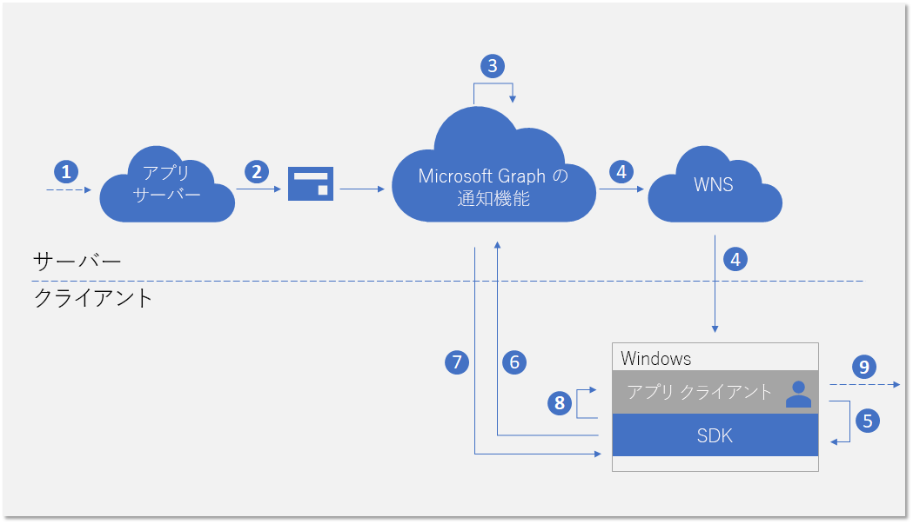
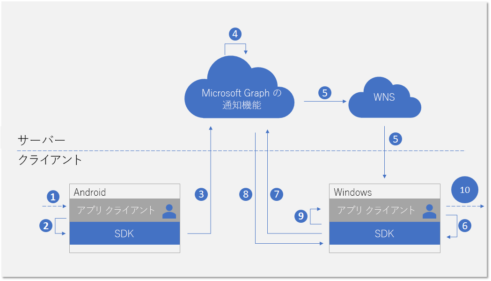
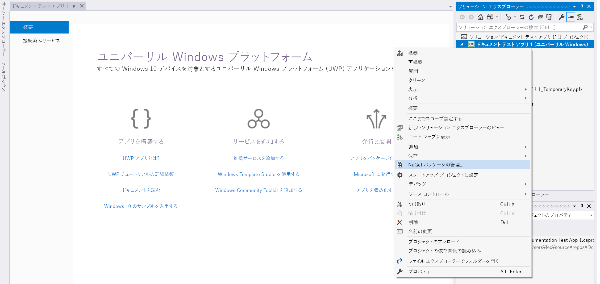
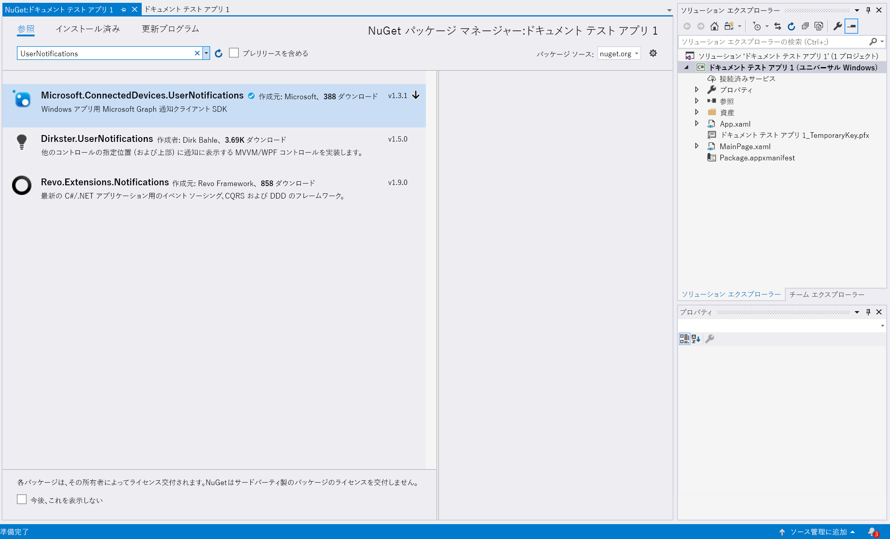

# <a name="integrate-your-windows-uwp-app-with-the-client-side-sdk-for-user-notifications"></a>Windows UWP アプリをユーザー通知用のクライアント側 SDK と統合する

Azure Portal で[アプリを登録](notifications-integration-app-registration.md)してから、パートナー デベロッパー センターで[クロスデバイス エクスペリエンス](notifications-integration-cross-device-experiences-onboarding.md)を開始したら、その次の手順として、Windows UWP 対応のクライアント側 SDK をクライアント アプリケーションに統合します。  

クライアント側 SDK を使用することで、アプリは、アプリケーション サーバーから現在サインインしているユーザーを対象に発行された通知の受信を開始するために必要な登録手順を実行できるようになります。 その後で、この SDK はクライアント側での通知の管理を実行します。これには、新しい着信通知の受信、すべて消去のようなシナリオを実現するための通知状態の管理、および完全な通知履歴の取得が含まれます。 

## <a name="new-incoming-notification-flow"></a>新しい着信通知のフロー

次の図は、新しい着信通知を受信する際のデータ フローを示しています。



このプロセスには、いくつかのコンポーネントが関与します。

* アプリケーション サーバー: アプリケーションのバックエンド
* アプリケーション クライアント: アプリケーションのフロント エンド (UWP アプリ、Android アプリ、または iOS アプリ)
* Microsoft Graph 通知: 複数のデバイスおよびプラットフォームに渡って異なるアプリ クライアントのインスタンス間で、ユーザー通知の発行、保存、および同期を可能にするサービス コンポーネント
* WNS: クライアントにシグナルを送信するために Microsoft Graph 通知で使用される Windows プッシュ通知サービス

この図は、次の手順を示しています。 

1. アプリケーションのロジック。 この手順では、ユーザーに通知を発行するトリガーになるものを取り込みます。 これは、アプリケーション固有のロジックであり、Microsoft Graph の別のもの (予定表イベントやタスクの割り当てなど) に関するイベントまたはデータの更新になることも、それとは別にアプリ サービスでユーザーに通知しようとしているものになることもあります。
2. アプリケーション サーバーから対象ユーザーへの通知は、Microsoft Graph 通知 API 経由で発行されます。 詳細については、[サーバー側との統合](notifications-integrating-app-server.md)を参照してください。
3. 新しい通知が含まれている Web 要求を受信すると、Microsoft Graph 通知は、このアプリとユーザーのためにクラウドで通知の内容を安全に保持します。
4. このユーザーの通知を受信するためにサブスクライブしているアプリのクライアント インスタンスごとに、Microsoft Graph 通知は、オペレーティング システムが提供するネイティブのプッシュ サービスによって、アプリのクライアントに通知するためのシグナルを送信します。 ここでは、このアプリケーションは Windows 上の UWP アプリであり、シグナルの送信には [WNS プッシュ直接通知](https://docs.microsoft.com/ja-JP/windows/uwp/design/shell/tiles-and-notifications/raw-notification-overview)が使用されます。 
5. 着信プッシュ通知によるシグナルを受信したアプリケーションは、ユーザー通知ストアでの変更についてフェッチするように SDK に求めます。 
6. SDK は、Microsoft Graph 内で、ユーザー通知ストアとの安全で準拠した接続を確立します。
7. SDK は、データの変更 (この場合は新しい通知の内容) を取得します。 
8. 変更が正常に取得された後、アプリに通知するためのイベント コールバックが SDK で発生します。 
9. アプリケーションのロジック。 この手順では、アプリがイベント コールバック内で実行する内容を取得します。 通常、ローカルのアプリ データが変更され、ローカルの UI 更新が発生します。 この場合、通常、アプリは通知内容をユーザーに知らせるトースト通知ポップアップを作成します。

## <a name="notification-update-flow"></a>通知の更新フロー

Microsoft Graph 通知を使用する主な利点の 1 つは、通知が安全にクラウドで保持され、ステートフル リソース タイプに変更できることです。 そのため、アプリケーションはクロスデバイス シナリオにおいて、サインインしている同一のユーザーに対して、異なるデバイス間で通知の正しい状態を管理および同期できます。 あるデバイスで通知が消去または既読になったときには、その他のデバイスにリアルタイムで通知されます。 "一度処理すれば、すべての場所で消去される" ということが、ユーザーの通知体験の一部として実現されます。 

次の図は、あるデバイスで通知状態の変更や通知の削除があり、その状態の変更や削除を別のデバイスで受信/処理する場合のデータ フローを示しています。



このフローの 2 番目の部分は、新しい着信通知の処理のフローと似ています。 これは仕様によるものです。SDK のプログラミング パターンでは、あらゆる種類のユーザー通知データの変更 (新規に受信した通知、通知状態の変更、通知の削除など) をアプリケーション クライアントが同じような方法で処理できるように設計されています。  

この図は、次の手順を示しています。

1. アプリケーションのロジック。 何らかのものが、通知の変更または削除をトリガーします。 一般に、あらゆるイベントが通知を変更するトリガーになり得ます。 
2. 通知を更新または削除するクライアント SDK のアプリによる呼び出し。 現在、状態の変更に関して 2 つのプロパティ (**userActionState** および **readState**) が公開されていますが、こうした状態とその状態の更新時期はアプリケーションで定義できます。 たとえば、ユーザーが通知ポップアップを消去したときには、**userActionState** が消去済み (Dismissed) になるように更新します。 ユーザーが通知ポップアップをクリックして、それに対応するアプリのコンテンツを利用するアプリを起動したときに、**userActionState** をアクティブ化済み (Activated) に更新し、**readState** を読み取り (Read) に更新します。 
3. 通知を更新または削除するために対応する API が呼び出された後、SDK は、クラウド内のユーザー通知ストアに送信して、この変更をサインインしている同一ユーザーの別のアプリクライアント インスタンスに展開します。 
4. クライアントから更新/削除要求を受信した Microsoft Graph 通知は、通知ストアを更新して、この変更をサブスクライブしている別のアプリ クライアント インスタンスを特定します。
5. アプリ クライアントのサブスクリプションごとに、Microsoft Graph 通知は、アプリ クライアントに通知するシグナルを送信します。このとき、オペレーティング システムによって提供されるネイティブ プッシュ サービスが使用されます。 ここでは、このアプリが Windows 上の UWP アプリであるため、シグナルの送信には [WNS プッシュ直接通知](https://docs.microsoft.com/ja-JP/windows/uwp/design/shell/tiles-and-notifications/raw-notification-overview)が使用されます。 
6. 着信プッシュ通知によるシグナルを受信したアプリケーションは、ユーザー通知ストアでの変更についてフェッチするように SDK に求めます。 
7. SDK は、Microsoft Graph 内で、ユーザー通知ストアとの安全で準拠した接続を確立します。
8. SDK によってデータが変更されます。ここでは、変更内容は通知状態の更新または通知の削除です。 
9. 変更が正常に取得された後、アプリに通知するためのイベント コールバックが SDK で発生します。 
10. アプリケーションのロジック。 この手順では、アプリがイベント コールバック内で実行する内容を取得します。 通常、ローカルのアプリ データが変更され、ローカルの UI 更新が発生します。 ここでは、通知の更新があるため、アプリはローカルに UI を更新して状態の変更を反映させる必要があります。 たとえば、通知にアクティブ化済みのマークが付いている場合は、Windows アクション センター内で対応するトースト通知ポップアップを削除することで、"一度処理すれば、すべての場所で消去" を実現できます。 

Microsoft Graph 通知の詳細については、 [Microsoft Graph 通知の概要](notifications-concept-overview.md)を参照してください。 Microsoft Graph 通知と統合するために必要なすべての手順の詳細については、Microsoft Graph 通知の[統合の概要](notifications-integration-e2e-overview.md)を参照してください。

## <a name="adding-the-sdk-to-your-project"></a>プロジェクトに SDK を追加する

Windows の場合、このクライアント側 SDK は Windows オペレーティング システムに付属していない NuGet パッケージです。 この API は C#、C++、および WinJS で利用できます。 

Windows アプリ用 Microsoft Graph 通知 SDK に対応する NuGet パッケージを [nuget](https://www.nuget.org/packages/Microsoft.ConnectedDevices.UserNotifications) からダウンロードします。または、Visual Studio で次の手順を使用して、アプリ ソリューションからパッケージをダウンロードします。 

Visual Studio で、プロジェクトを右クリックしてコンテキスト メニューを表示し、**[NuGet パッケージの管理]** をクリックします。



**[ブラウザー]** タブに移動して、Microsoft.ConnectedDevices.UserNotifications を検索します。



検索結果に、Microsoft Graph 通知のクライアント側 SDK が表示されます。 **[インストール]** ボタンをクリックして、インストールします。 


インストールの完了後、このパッケージがソリューション エクスプローラーの **[参照設定]** に表示されます。 

UWP アプリからの NuGet パッケージの組み込みと利用に関する詳細については、次を参照してください。

* 
  [nuget.org からのパッケージの使用](https://docs.microsoft.com/ja-JP/azure/devops/artifacts/nuget/upstream-sources?view=vsts&tabs=new-nav)
* 
  [クイックスタート: パッケージのインストールと使用 (Visual Studio)](https://docs.microsoft.com/ja-JP/nuget/quickstart/install-and-use-a-package-in-visual-studio)


## <a name="initializing-the-connected-device-platforms"></a>Connected Device Platforms の初期化

クライアント側 SDK は、Connected Device Platforms と呼ばれるインフラストラクチャの上に構築されています。 どの機能を使用するにしても、まず、このプラットフォームをアプリで初期化する必要があります。 この初期化手順は、通知シナリオの実行前に必要になるため、メイン クラスの **OnLaunched** メソッドまたは **onActivated** メソッドに配置する必要があります。

このプラットフォームの構築と初期化のために、**ConnectedDevicesPlatform** クラスをインスタンス化する必要があります。 その前に、次に示すようにイベント ハンドラーがフックされていることを確認してください。これは、プラットフォームの起動後に、イベントがトリガーされる可能性があるためです。 


```C#
var platform = new ConnectedDevicesPlatform();
platform.AccountManager.AccessTokenRequested += AccountManager_AccessTokenRequestedAsync;
platform.AccountManager.AccessTokenInvalidated += AccountManager_AccessTokenInvalidated;
platform.NotificationRegistrationManager.NotificationRegistrationStateChanged += NotificationRegistrationManager_NotificationRegistrationStateChanged;
platform.Start();
```

### <a name="handling-account-access-token"></a>アカウント アクセス トークンの処理

新しい着信通知のコンテンツの取得、通知状態の更新など、SDK で実行されるすべての Web 呼び出しは、ユーザーのデータに対する読み取りと書き込みになるため、常に有効なアクセス トークンが必要になります。 この SDK は、次のイベント (アクセス トークンが要求されたとき、または無効化されたときに起動されるイベント) の処理を必要とします。これにより、プラットフォームの初期化後に、ユーザーのアクセス トークンが正常に処理されるようにします。 

#### <a name="accountmanageraccesstokenrequestedasync"></a>AccountManager_AccessTokenRequestedAsync

完全な実装については、[Windows アプリのサンプル](https://github.com/Microsoft/project-rome/blob/master/Windows/samples/GraphNotificationsSample/ConnectedDevicesManager.cs)を参照してください。 

```C#
private async void AccountManager_AccessTokenRequestedAsync(ConnectedDevicesAccountManager sender, ConnectedDevicesAccessTokenRequestedEventArgs args)
{
    private List<Account> accounts = new List<Account>();
    var account = accounts.Find((x) => x.EqualsTo(args.Request.Account));
    if (account != null)
    {
        try
        {
            var accessToken = await account.GetAccessTokenAsync(args.Request.Scopes);
            args.Request.CompleteWithAccessToken(accessToken);
        }
        catch (Exception ex)
        {
            args.Request.CompleteWithErrorMessage(ex.Message);
        }
    }
}
```

#### <a name="accountmanageraccesstokeninvalidated"></a>AccountManager_AccessTokenInvalidated

完全な実装については、[Windows アプリのサンプル](https://github.com/Microsoft/project-rome/blob/master/Windows/samples/GraphNotificationsSample/ConnectedDevicesManager.cs)を参照してください。 

```C#
private void AccountManager_AccessTokenInvalidated(ConnectedDevicesAccountManager sender, ConnectedDevicesAccessTokenInvalidatedEventArgs args)
{
    Logger.Instance.LogMessage($"Token Invalidated. AccountId: {args.Account.Id}, AccountType: {args.Account.Id}, scopes: {string.Join(" ", args.Scopes)}");
}
```

### <a name="handling-push-registration-expiration"></a>プッシュ登録の有効期限を処理する 

Microsoft Graph 通知では、Windows のネイティブ プッシュ プラットフォームである WNS を使用して、ユーザー通知データの変更時にクライアント アプリケーションにシグナルを送信します。 これは、新しい着信通知がアプリ サーバーから発行されたときや、クロスデバイス シナリオでサインインしている同一ユーザーの別のデバイスで通知状態が更新されたときに発生します。 

そのため、直接プッシュ通知を正常に伝達できる有効な WNS チャネルが必要になります。 次のイベント コールバックでは、WNS プッシュ チャネルの有効期限切れを処理ます。 

#### <a name="notificationregistrationmanagernotificationregistrationstatechanged"></a>NotificationRegistrationManager_NotificationRegistrationStateChanged

完全な実装については、[Windows アプリのサンプル](https://github.com/Microsoft/project-rome/blob/master/Windows/samples/GraphNotificationsSample/ConnectedDevicesManager.cs)を参照してください。 

```C#
private async void NotificationRegistrationManager_NotificationRegistrationStateChanged(ConnectedDevicesNotificationRegistrationManager sender, ConnectedDevicesNotificationRegistrationStateChangedEventArgs args)
{
    if ((args.State == ConnectedDevicesNotificationRegistrationState.Expired) || (args.State == ConnectedDevicesNotificationRegistrationState.Expiring))
    {
        var account = m_accounts.Find((x) => x.EqualsTo(args.Account));
        if (account != null)
        {
            await account.RegisterAccountWithSdkAsync();
        }
    }
}
```

## <a name="signing-in-your-user"></a>ユーザーをサインインする

Microsoft Graph通知は、その他の Microsoft Graph の多くのリソース タイプと同様に、ユーザーが中心になります。 サインインしているユーザーの通知にアプリでサブスクライブして受信を開始するには、まず、登録プロセスで使用する有効な OAuth トークンを取得する必要があります。 OAuth トークンの生成方法と管理方法、は適切なものを選択できます。 サンプル アプリでは ADAL を使用します。 

Microsoft アカウントを使用している場合は、サインイン要求に次のアクセス許可を含める必要があります: `wl.offline_access"`、`ccs.ReadWrite`、`wns.connect`、`asimovrome.telemetry`、および `https://activity.windows.com/UserActivity.ReadWrite.CreatedByApp`。 

Azure AD アカウントを使用している場合は、次の対象ユーザーを要求する必要があります: `https://cdpcs.access.microsoft.com`。


## <a name="adding-the-user-account-to-the-platform"></a>プラットフォームにユーザー アカウントを追加する 

サインインしているユーザーのアカウントを SDK に登録する必要があります。 これには、アカウントの追加と、WNS を通じた初期通知を受信するプッシュ チャネルの登録が伴われます。 

```C#
var account = new ConnectedDevicesAccount(accountId, accountType);           
var addResult = await platform.AccountManager.AddAccountAsync(account);
if (addResult.Status != ConnectedDevicesAccountAddedStatus.Success)
{
    throw new Exception("Add account failed with " + addResult.Status + "!");
}            

var pushChannel = await PushNotificationChannelManager.CreatePushNotificationChannelForApplicationAsync();
ConnectedDevicesNotificationRegistration registration = new ConnectedDevicesNotificationRegistration();
registration.Type = ConnectedDevicesNotificationType.WNS;
registration.Token = pushChannel.Uri;
var registerResult = await platform.NotificationRegistrationManager.RegisterAsync(account, registration);
if (registerResult.Status != ConnectedDevicesNotificationRegistrationStatus.Success)
{
    throw new Exception("Register push channel failed with " + registerResult.Status + "!");
}
```

## <a name="subscribing-to-receive-users-notifications"></a>ユーザーの通知を受信するためのサブスクライブ 

このサインインしているユーザーのアプリケーション用に、**UserDataFeed** オブジェクトをインスタンス化する必要があります。 アプリケーションは、[クロスデバイス エクスペリエンスの開始時](notifications-integration-cross-device-experiences-onboarding.md)に指定したクロスプラットフォーム アプリ ID によって識別されます。

```C#
UserDataFeed feed = UserDataFeed.GetForAccount(account, platform, "YOUR_HOST_HERE");

var scopes = new List<UserDataFeedSyncScope> { UserNotificationChannel.SyncScope };
var subscribeResult = await feed.SubscribeToSyncScopesAsync(scopes);
if (!subscribeResult)
{
    throw new Exception("Subsribe failed!");
}
var channel = new UserNotificationChannel(feed);
var reader = channel.CreateReader();
reader.DataChanged += Reader_DataChanged;
```

## <a name="receiving-and-managing-user-notifications"></a>ユーザー通知を受信および管理する

このトピックの前半のフロー図では、アプリ サーバーからの新しい着信通知や、別のアプリケーション クライアント インスタンスで開始された通知の更新または削除を処理するためのプログラミング パターンを示しました。 このようなデータの変更を処理する手順は次のとおりです。 

### <a name="handling-incoming-push-notification-signal"></a>着信プッシュ通知シグナルの処理

すべての種類のユーザー通知データの変更について、アプリ クライアントにプッシュ通知として配信されるシグナルが生成されます。 Windows UWP アプリの場合、このシグナルは WNS プッシュ直接通知として配信されます。 直接プッシュ シグナルの受信時に、アプリでは、**TryParse** を呼び出すことで、Microsoft Graph 通知サービスから実際のデータの変更についてフェッチする SDK をトリガーする必要があります。

```C#
public async Task ReceiveNotificationAsync(string content)
{
    ConnectedDevicesNotification notification = ConnectedDevicesNotification.TryParse(content);
    if (notification != null)
    {
        await platform.ProcessNotificationAsync(notification);
    }
}
```

### <a name="handling-user-notification-data-changes"></a>ユーザー通知のデータ変更の処理

SDK によってデータ変更が正常にフェッチされると、イベント コールバックが呼び出され、アプリ クライアントによる通知の作成、更新、または削除の処理が求められます。

```C#
private async void Reader_DataChanged(UserNotificationReader reader, object args)
{
    var notifications = await reader.ReadBatchAsync(UInt32.MaxValue);

    foreach (var notification in notifications)
    {
        // Handle notification changes based on change type;
    }
}
```


### <a name="update-state-of-a-notification"></a>通知の更新状態

このアプリ クライアントのインスタンスから通知状態の変更が開始された場合 (たとえば、このデバイスのトースト通知ポップアップをユーザーが有効化した場合)、アプリでは、この状態の変更を同じユーザーが使用するすべてのデバイスで同期するために、SDK を呼び出して通知の状態を更新する必要があります。 

```C#
notification.UserActionState = UserNotificationUserActionState.Activated;
await notification.SaveAsync();
```

### <a name="delete-a-notification"></a>通知を削除する

このアプリ クライアントのインスタンスから通知の削除が開始された場合 (たとえば、この通知に対応するタスクに完了のマークが付けられ、アプリのデータベースから通知が削除された場合)、アプリでは、この削除の操作を同じユーザーが使用するすべてのデバイスで同期するために、SDK を呼び出して通知を削除する必要があります。 

通知は、有効期限が切れているか、明示的に削除された場合にのみ、ユーザー通知ストアから削除されます。 **UserActionState** のセマンティック定義はアプリケーション自体によって定義されているため、**UserActionState** が消去済み (Dismissed) になるように更新しても、ユーザー通知は削除されません。

```C#
await channel.DeleteUserNotificationAsync(notification.Id);
```

## <a name="see-also"></a>関連項目

- SDK の通知機能に関連する API のフルセットについての [API リファレンス](https://docs.microsoft.com/ja-JP/windows/project-rome/notifications/api-reference-for-windows/)。 
- Windows UWP アプリについての[クライアント側サンプル](https://github.com/Microsoft/project-rome/tree/master/Windows/samples/GraphNotificationsSample)。
- 通知の発行についての[アプリサーバーのサンプル](notifications-integrating-app-server.md)。 
