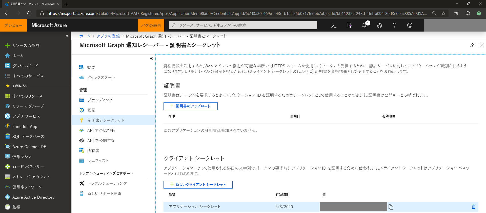
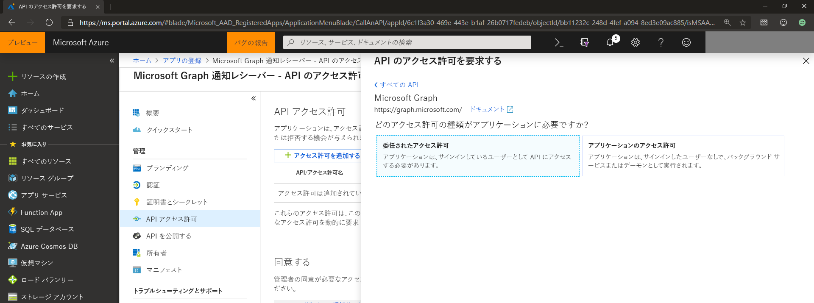
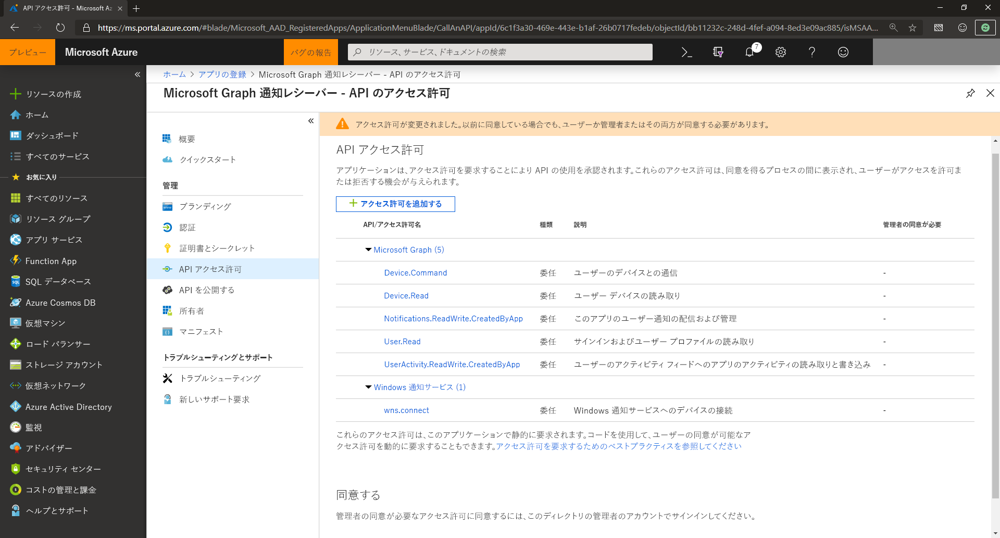

# Microsoft Graph 通知のためのアプリの登録と API アクセス許可を管理するManage app registration and API permission for Microsoft Graph notifications

Microsoft Graph 通知と統合するアプリケーション サービスのためには、Microsoft アカウントあるいは職場や学校のアカウントをサポートする Microsoft ID プラットフォームでアプリを登録する必要があり、必要な API アクセス許可を宣言する必要があります。In order for your application service to integrate with Microsoft Graph notifications, you need to register your app with the Microsoft identity platform to support Microsoft accounts or work or school accounts, and declare the API permissions that are required.

## Microsoft アカウントあるいは職場や学校のアカウントをサポートするアプリを登録します。Register your app to support Microsoft accounts or work or school accounts

[Microsoft Azure portal](https://portal.azure.com/#home) で、Microsoft アカウントあるいは職場や学校のアカウントをサポートするアプリを登録します。Register your application on the [Microsoft Azure portal](https://portal.azure.com/#home) to support Microsoft accounts or work or school accounts. [Microsoft アプリケーション ポータル](https://apps.dev.microsoft.com/)で、以前アプリケーションを登録したことがある場合、新機能と改善された機能の Azure portal エクスペリエンスに既存のアプリが表示されます。If you’ve previously registered your application on the [Microsoft Application Portal](https://apps.dev.microsoft.com/), your existing apps will show up in the new and improved Azure portal experience.

アプリの登録の方法については、[Microsoft ID プラットフォームへのアプリケーションの登録](auth-register-app-v2.md)に関するページを参照してください。For information about how to register your apps, see [Register an application with the Microsoft identity platform](auth-register-app-v2.md). 

> [!NOTE]
> Microsoft アカウントを持っていないが使用したい場合には、 [Microsoft アカウント](https://account.microsoft.com/account) ページを参照してください。If you don't already have a Microsoft account and would like to use one, go to the [Microsoft account](https://account.microsoft.com/account) page. 職場または学校のアカウントで、認証と ID フレームワークとして Azure AD v1.0 使用する必要があるアプリを作成する場合は、 [Azure Active Directory 認証ライブラリ](https://docs.microsoft.com/azure/active-directory/develop/active-directory-authentication-libraries)を参照してください。If you're writing an app that needs to use Azure AD v1.0 as an authentication and identity framework for work or school accounts, see [Azure Active Directory Authentication Libraries](https://docs.microsoft.com/azure/active-directory/develop/active-directory-authentication-libraries). 新しく収束された Microsoft ID プラットフォーム (バージョン 2.0) について学んだり利用に関心がある場合は、 [Microsoft アイデンティティ プラットフォームのエンドポイントと Azure AD v1.0 エンドポイントを比較する](https://docs.microsoft.com/ja-JP/azure/active-directory/develop/azure-ad-endpoint-comparison)を参照してください。If you’re interested in learning about or using the new converged Microsoft identity platform (v2.0), see [Comparing the Microsoft identity platform endpoint and Azure AD v1.0 endpoint](https://docs.microsoft.com/en-us/azure/active-directory/develop/azure-ad-endpoint-comparison).

アプリを登録すると、アプリケーション ID/ クライアント ID がいろいろと便利になります。When you register your app, keep the application ID/client ID somewhere handy. [Microsoft パートナー センター](https://partner.microsoft.com/)でさまざまなデバイスの操作でのアプリケーションを登録するときに、この ID が後で必要になります。 You'll need this ID later when you register your application for cross-device experiences in the [Microsoft Partner Center](https://partner.microsoft.com/).

## アプリ証明書とシークレットApp certificates and secrets

アプリケーションを識別し、認証トークンを取得するときに認証を有効にするには、独自の証明書をアップロードしたり、Azure portal の**証明書とシークレット**に移動して新しいクライアント シークレットを作成することもできます。To enable your application to identify and authenticate itself when obtaining auth tokens, you can either upload your own certificate or create a new client secret by going to **Certificates & secrets** in the Azure portal.
    

    
> [!NOTE]
> 新しいクライアント シークレットの生成を選択する場合は、必ずをコピーして、安全な場所に保管してください。If you opt to generate a new client secret, be sure to copy and keep it in a safe place. ポータルから脱退したら、もう一度アクセスすることはできません。You won’t be able to access it again after you leave the portal.

## API アクセス許可Configure API permissions

Microsoft Graph の通知を使用するために追加の許可を追加する必要があります。You'll need to add additional permissions in order to use Microsoft Graph notifications. [**アクセス許可を追加**]を選択し、Microsoft Api で [**Microsoft Graph**]を選択してから、[**アクセス許可を委任**] を選択します。Choose **Add a permission**, and under Microsoft APIs, select **Microsoft Graph**, and then select **Delegated permissions**.
    

    
以下のアクセス許可を追加します。Add the following permissions:

- User.Read - ユーザーにサインインするアプリケーションを許可するUser.Read - allows your application to sign-in your user

- Device.Read - デバイスのユーザーの一覧の ID を許可するDevice.Read - allows identification of a user’s list of devices

- Device.Command - ユーザーのデバイスとの通信を許可するDevice.Command - allows communication to a user’s device

- UserActivity.ReadWrite.CreatedByApp - 通知を取得するためのアプリのサブスクリプションを許可するUserActivity.ReadWrite.CreatedByApp - allows app subscription for notification retrieval

- Notifications.ReadWrite.CreatedByApp - アクセスと配信の通知を許可するNotifications.ReadWrite.CreatedByApp - allows notification access and delivery

- wns.connect - windows の通知サービスへの接続を許可するwns.connect - allows connecting to windows notification service

## 次の手順Next steps

  [アクセス許可と同意](https://docs.microsoft.com/ja-JP/azure/active-directory/develop/v2-permissions-and-consent)に関する詳細を確認する、または「Microsoft Graph [アクセス許可のリファレンス](https://docs.microsoft.com/ja-JP/graph/permissions-reference)」を参照します。Learn more about [permissions and consent](https://docs.microsoft.com/en-us/azure/active-directory/develop/v2-permissions-and-consent) or view the Microsoft Graph [permissions reference](https://docs.microsoft.com/en-us/graph/permissions-reference).

これで、アプリの登録が完了しました。デバイス間の操作性のためのアプリケーションをセットアップし、Microsoft Graph 経由で送信される通知を行うためと、対応するアプリ プラットフォームを対象にするために[パートナー センター](https://partner.microsoft.com/)に移動します。Now that you’ve registered your app, go to the [Partner Center](https://partner.microsoft.com/) to set up your application for cross-device experiences and to target your corresponding app platforms for notifications sent via Microsoft Graph. 詳細については、[クロスデバイス エクスペリエンスに参加する](notifications-integration-cross-device-experiences-onboarding.md)を参照してください。For details, see [Onboarding to cross-device experiences](notifications-integration-cross-device-experiences-onboarding.md). 
