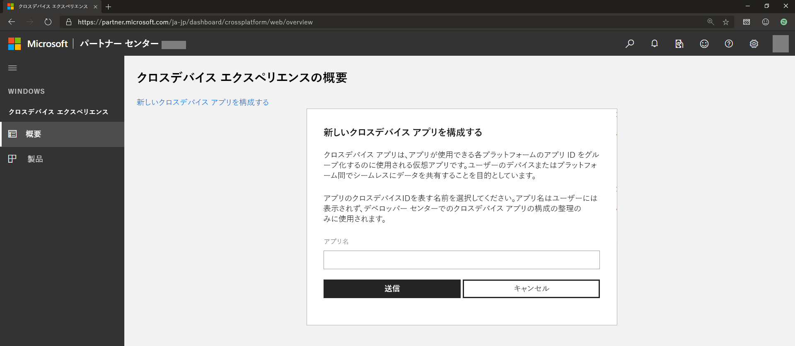
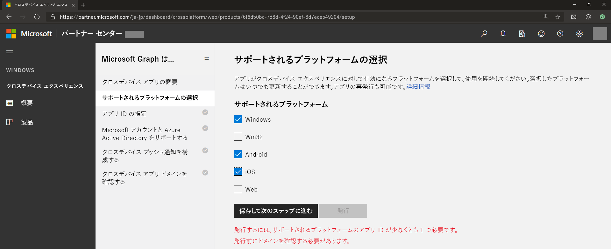
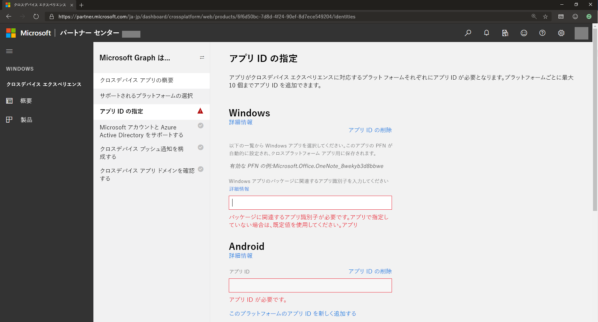
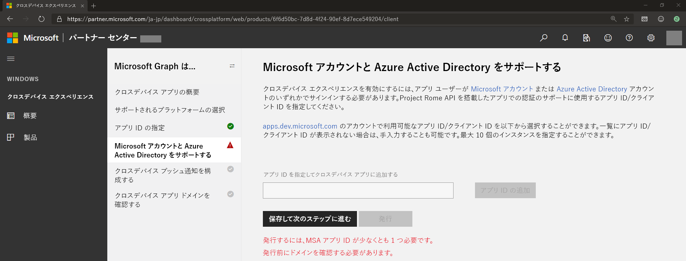
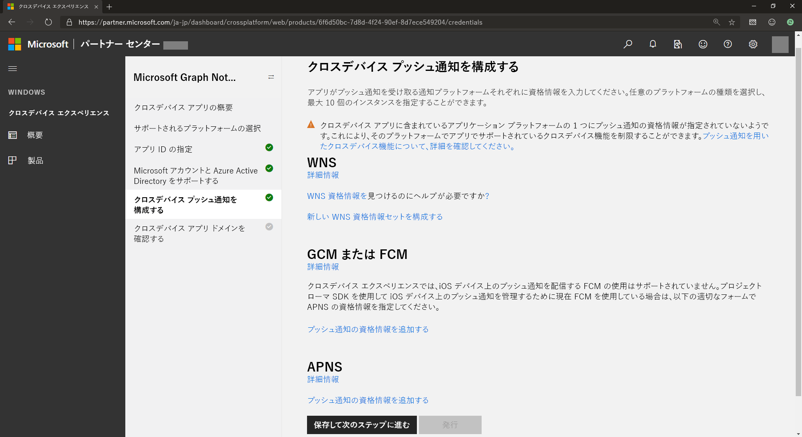
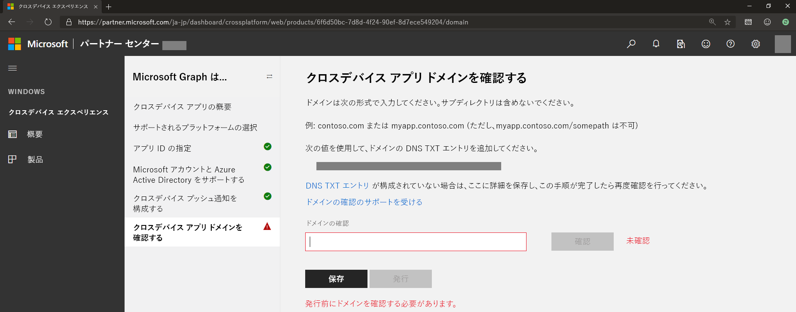

# Microsoft Graph notifications のクロスデバイス エクスペリエンス を開始するOnboarding to cross-device experiences for Microsoft Graph notifications

[Azure ポータルでのアプリの登録](notifications-integration-app-registration.md)に加えて、各オペレーティングシステム (Windows、iOS、Android) に対応するネイティブプッシュ通知サービスを介して Microsoft Graph が通知を送信することを承認するために、アプリケーションにクロスプラットフォーム アプリケーション id やクロスプラットフォーム プッシュ通知認証情報などのクロスデバイス情報を登録する必要があります。In addition to [app registration on Azure Portal](notifications-integration-app-registration.md), your application needs to register cross-device information such as cross-platform application id and cross-platform push credentials in order to authorizes Microsoft Graph to send notifications via native push notification services that correspond to each operating system: Windows, iOS, and Android. これは、[パートナー センターのダッシュボード (旧 Windows デベロッパー センター ダッシュボード) ](https://partner.microsoft.com/dashboard/)を通して行います。This is done through [Partner Center dashboard (formerly Windows Dev Center dashboard)](https://partner.microsoft.com/dashboard/). 

> [!NOTE]
> まだ Windows 開発者アカウントを持っていない場合は、アカウントを作成してください。If you don’t already have a Windows developer account, you’ll need to create one. 詳細については、[「開発者アカウントを開く」](https://docs.microsoft.com/ja-JP/windows/uwp/publish/opening-a-developer-account)を参照してください。For details, see [Opening a developer account](https://docs.microsoft.com/en-us/windows/uwp/publish/opening-a-developer-account). Windows UWP アプリケーションの構築を計画していない場合でも、この操作を行う必要があります。You need to do this even if you don’t plan to build a Windows UWP application. 学校または職場のアプリケーションをエンタープライズの一部として構築している場合は、エンタープライズ送信の管理に使用する適切な Azure AD アカウントと開発者アカウントを関連付けることができます。If you’re building a school or work application as part of an enterprise, you can associate your developer account with the appropriate Azure AD account that is used for managing your enterprise submissions. 詳細については、[「パートナーセンターアカウントに Azure Active Directory を関連付ける」](https://docs.microsoft.com/ja-JP/windows/uwp/publish/associate-azure-ad-with-partner-center)を参照してください。For details, see [Associate Azure Active Directory with your Partner Center account](https://docs.microsoft.com/en-us/windows/uwp/publish/associate-azure-ad-with-partner-center).

まず、Windows 開発者アカウントを使用して[パートナーセンターのダッシュボード](https://partner.microsoft.com/en-us/dashboard)にサインインします (Azure AD アカウントを使用することはできません)。To get started, sign in to the [Partner Center dashboard](https://partner.microsoft.com/en-us/dashboard) using your Windows developer account (you cannot use an Azure AD account):

1.  左のメニューで\*\* [クロスデバイスエクスペリエンス]\*\* に移動し、 **[新しいクロスデバイスアプリの構成]** を選択して、次のスクリーンショットのようにアプリ名を入力します。On the left menu, go to **Cross-Device Experiences**, select **Configuring a new cross-device app**, and provide your app name, as shown in the following screenshot.

2.  アプリのプレゼンスがあり、サポートされているすべてのプラットフォームを選択し、通知を受信できるようにします。Select all supported platforms where your app will have a presence and be enabled to receive notifications. 表示されているように、Windows、Android、iOS でサポートされているプラットフォームから選択できます。You can select from supported platforms that include Windows, Android, and iOS, as shown. 

3.  表示されているように、アプリにプレゼンスがある場合は、それぞれのプラットフォームのアプリ ID を指定します。Provide app IDs for each of the platforms where your app has a presence, as shown.

 

> [!NOTE] 
> プラットフォームごとに異なる Id を10まで追加することができます。これは、同じアプリまたは異なるアプリの複数のバージョンがある場合に、アプリサーバーによって送信された同じユーザー宛の通知を受信できるようにするためです。You can add different IDs (up to ten) per platform – this is in case you have multiple versions of the same app, or even different apps, that want to be able to receive the same notification sent by your app server and targeted to the same user.

4.  Microsoft アカウント または Azure AD アプリの登録からアプリ ID を指定または選択します。Provide or select the app ID from Microsoft account and/or Azure AD app registration. このクライアント ID は、Azure ポータルでの登録時に取得した Microsoft アカウント または Azure AD アプリの登録に対応しています。This client ID corresponds to the Microsoft account or Azure AD app registration that you obtained when you register in the Azure Portal.

5.  Microsoft Graph notifications は、すべての主要なプラットフォーム上で、それぞれのネイティブ通知プラットフォームを使用して、アプリケーションの クライアント エンドポイント、つまり WNS (Windows UWP 用)、FCM (Android 用)、および APNS (iOS) に通知を送信します。Microsoft Graph notifications use each of the native notification platforms on all major platforms to send notifications to the app client endpoints, namely, WNS (for Windows UWP), FCM (for Android), and APNS (for iOS). 次に示すように、ユーザー宛の通知を発行するときに Microsoft Graph notifications がアプリサーバーに通知を送信できるように、これらの通知プラットフォームに認証情報を指定します。Provide your credentials for these notification platforms to enable Microsoft Graph notifications to deliver notifications for your app server when you publish user-targeted notifications, as shown.

 

> [!NOTE]
> Windows UWP アプリの場合は、WNS プッシュ通知を有効にして Microsoft Graph notificationsを使用する必要があります。For Windows UWP apps, enabling WNS push notification is a prerequisite to using Microsoft Graph notifications. 詳しくは、[「 WNS の概要 」](https://docs.microsoft.com/ja-JP/windows/uwp/design/shell/tiles-and-notifications/windows-push-notification-services--wns--overview)をご覧ください。For details, see [WNS overview](https://docs.microsoft.com/en-us/windows/uwp/design/shell/tiles-and-notifications/windows-push-notification-services--wns--overview). 開始後は、接続したデバイスプラットフォームにパートナーセンター経由でプッシュ認証情報を指定できます。After you onboard, you can provide push credentials via Partner Center to the Connected Device Platform.

6.  このドメインの所有権がアプリケーションにあることを証明するための検証プロセスとして機能する クロスデバイス アプリドメイン を確認します。Verify your cross-device app domain, which serves as a verification process to prove that your application has ownership of this domain. これは、次に示すように、登録したアプリケーションのクロスデバイスアプリ id として動作します。This acts like a cross-device app identity for the application or applications you registered, as shown.
    
    

手順は以上です。That’s it! 通知を受信するアプリケーションが登録されました。You've now registered your applications to receive notifications. 次に、 [Microsoft Graph notifications SDK](https://github.com/microsoft/project-rome)をお使いのプラットフォームのプロジェクトに追加し、統合を開始します。Next, add the [Microsoft Graph notifications SDK](https://github.com/microsoft/project-rome) to your project on your platform of choice and start integrating. 
