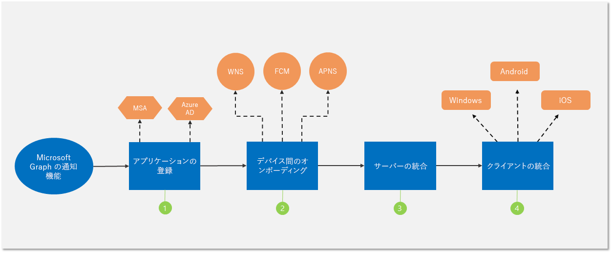

# Microsoft Graph の通知機能を統合するIntegrate with Microsoft Graph notifications

次の図に示されているように、いくつかの簡単な手順で、アプリと Microsoft Graph の通知を統合することができます。You can integrate your apps with Microsoft Graph notifications with a few simple steps, as shown in the following diagram.

1.  アプリケーションを Microsoft Azure ポータルに[登録](notifications-integration-app-registration.md)します。 Register a new application in the Azure portal

2.  クロス プラットフォームのアプリケーション ID とプッシュ通知認証情報を取得するために、パートナー センター/Windows デベロッパー センターに[参加](notifications-integration-cross-device-experiences-onboarding.md)します。[Onboard](notifications-integration-cross-device-experiences-onboarding.md) to Partner Center/Windows Dev Center for cross-platform application identity and push notification credentials.

3.  Microsoft Graph を経由して通知を送信するように[アプリケーション サーバーを設定](notifications-integrating-app-server.md)します。[Set up your app server](notifications-integrating-app-server.md) to send notifications via Microsoft Graph.

4.  [Microsoft Graph 通知クライアント SDK](https://github.com/microsoft/project-rome) を Windows、Android、または iOS アプリに[統合](notifications-integrating-with-windows.md)して、通知を受信および管理します。[Integrate](notifications-integrating-with-windows.md) the [Microsoft Graph notifications client SDK](https://github.com/microsoft/project-rome) into your Windows, Android, or iOS app clients to receive and manage notifications.
