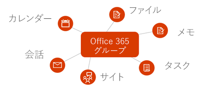
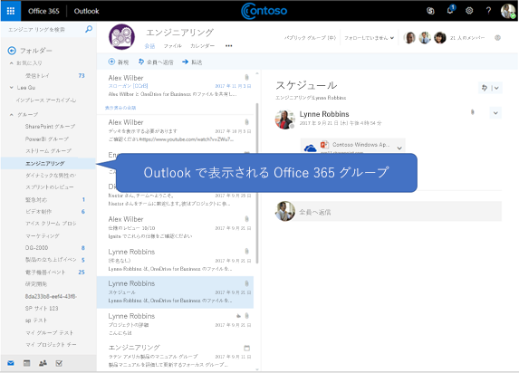

# Microsoft Graph での Office 365 グループの概要

Office 365 グループは、ユーザーが会話、ファイル、ノート、予定表、プラン、その他の多くのアセットを共有するための基本メンバーシップ サービスを提供します。 

## Office 365 グループを統合する理由   

グループは、さまざまなサービスを通じたユーザーのコラボレーションおよび統合を可能にし、タスクの計画、共同作業、教育、その他における豊富なシナリオをサポートするための基盤を形成します。 Office 365 グループを統合することにより、何百万というユーザーが Office 365 スイートでのさまざまなエクスペリエンスやその他の間で移行するのをアプリケーションでサポートすることができます。  
 
### さまざまなサービスの間の共同作業を容易にするためにグループを作成する 
 
Microsoft Graph API を使用することにより、コラボレーションのライフサイクルを通じてグループを作成、管理、または削除することができます。 たとえば次のことを実行できます。  
 
- [グループ作成](/graph/api/group-post-groups?view=graph-rest-1.0) API を使用することにより、新しいグループを提供する。 そのグループは、Outlook、SharePoint、Microsoft Teams、Planner、さらには Microsoft Stream など、一定の範囲のアプリケーションで利用できます。 Microsoft Graph は、それら互いに接続されているサービスを通じて同期を保つことにより、グループの全メンバーに対してアクセスをシームレスに提供します。  
 
    **あらゆる Office 365 グループは、Office 365 のサービスの既定セットに統合されています**

      

- グループを自分の[お気に入り](/graph/api/group-addfavorite?view=graph-rest-1.0)の 1 つとして指定したり、必要に応じて[自分のお気に入りから削除](/graph/api/group-removefavorite?view=graph-rest-1.0)したりする。 
- カスタム アプリケーションでグループ会話を[作成](/graph/api/group-post-conversations?view=graph-rest-1.0)、[取得](/graph/api/group-get-conversation?view=graph-rest-1.0)、または[削除](/graph/api/group-delete-conversation?view=graph-rest-1.0)する。 
- グループ予定表で予定表[イベント](/graph/api/resources/event?view=graph-rest-1.0)をスケジューリングする。 
- ドキュメント ライブラリの[リスト](/graph/api/list-list?view=graph-rest-1.0)や[サブサイト](/graph/api/site-list-subsites?view=graph-rest-1.0)など、グループに関連する [SharePoint サイト](/graph/api/resources/site?view=graph-rest-1.0)についての情報を取得する。 
- Planner で、グループによって所有される[プランを作成](/graph/api/planner-post-buckets?view=graph-rest-1.0)する。 プランは、[複数バケットを通じて整理](/graph/api/planner-post-buckets?view=graph-rest-1.0)できる[タスクを作成](/graph/api/planner-post-tasks?view=graph-rest-1.0)できるようにすることにより、共同作業を追跡するためのビジュアルな手段を提供します。 
- グループに関連する [OneNote](/graph/api/resources/onenote?view=graph-rest-1.0) ノートブックにアクセスします。それは、会議のメモを収集し、アイデアを整理するために使用できます。 
  
    **Web における Outlook での Office 365 のグループおよび会話**

     

- [Microsoft Teams でグループを有効にする](/graph/api/team-put-teams?view=graph-rest-beta) (プレビュー) ことにより、グループ メンバーが永続的チャットに参加できるようにする。  
- [グループを削除する](/graph/api/group-delete?view=graph-rest-1.0) グループが削除されると、関連するすべてのコンテンツも削除されるため、サイト、会話、プランが孤立することはありません。 
 
### グループ メンバーシップをシームレスに管理する 
 
Office 365 グループとは、Microsoft サービス内またはアプリ内のリソースへのアクセスを共有しているユーザーの集合です。 グループ メンバーシップは一元的に集中管理されるため、メンバーシップに変更が加えられると、そのグループに関連するすべてのサービスに影響があります。 Microsoft Graph を使用することにより、グループ メンバーシップに関する次のタスクを実行できます:
 
- 既存のグループのメンバーを[追加](/graph/api/group-post-members?view=graph-rest-1.0)したり[削除](/graph/api/group-delete-members?view=graph-rest-1.0)したりする。 
- グループの[所有者の一覧](/graph/api/group-list-owners?view=graph-rest-1.0)または[メンバーの一覧](/graph/api/group-list-members?view=graph-rest-1.0)を取得する。 これは、グループ コンテンツにアクセスできるユーザー、またはグループの更新や参加依頼の承認などの管理作業を実行することが必要になる可能性のあるユーザーと通信するのに役立ちます。 
- [グループ更新](/graph/api/group-update?view=graph-rest-1.0)操作により、グループ コンテンツが同じ組織内のどのユーザーにも表示されるようにグループを**パブリック**として指定したり、グループ コンテンツがメンバーにのみ表示されるようにグループを**プライベート**として指定したりする。 
- グループ所有者の一覧から、特定のグループの所有者責任に参加しなくなった[所有者を削除する](/graph/api/group-delete-owners?view=graph-rest-1.0)。 
 
### グループ ポリシーの設定値を確立して維持する 
 
1 つの組織内で作成されるグループの数が増えてきた場合、Microsoft Graph では、グループの使用状況やライフサイクルを管理するための機能がサポートされています。 組織内のすべてのグループを通じて、グループ ポリシーを適用することができます。 Microsoft Graph API を使用することにより、次のことを実行できます:

- 幅広い範囲の[グループ ポリシー設定値](/graph/api/resources/groupsetting?view=graph-rest-1.0)を構成する。これは、所有者によって更新されるのでない限りグループを自動削除したり、Office 365 グループに対して名前付けポリシーを適用したりするなどの動作を定義するのに役立ちます。 
- 期限切れの近いグループを[更新](/graph/api/group-renew?view=graph-rest-1.0)することにより、チームのメンバーが、共同作業でコンテンツにアクセスし続けられるようにする。 確立されている期限切れポリシーに従ってグループが更新されない場合、そのグループは自動的に削除されます。 
- 削除されたグループを[復元する](/graph/api/directory-deleteditems-restore?view=graph-rest-1.0)。

## API リファレンス
このサービスの API リファレンスをお探しですか?

- [Microsoft Graph v1.0 のグループ API](/graph/api/resources/groups-overview?view=graph-rest-1.0)
- [Microsoft Graph ベータ版のグループ API](/graph/api/resources/groups-overview?view=graph-rest-beta)

## 次のステップ

- [Graph Explorer](https://developer.microsoft.com/graph/graph-explorer) で、サンプル API リクエストを試す。 
- Microsoft Graph で[グループ API を使用する](/graph/api/resources/groups-overview?view=graph-rest-1.0)方法に関する詳細を確認する。
