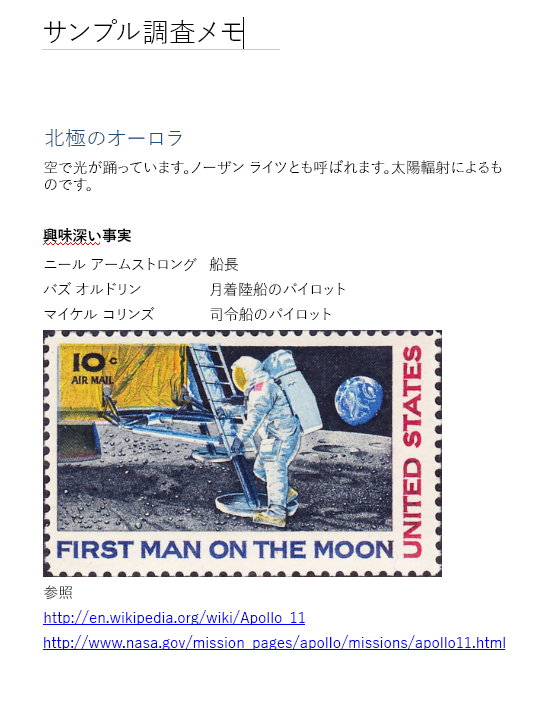

# <a name="input-and-output-html-in-onenote-pages"></a>OneNote ページの入出力 HTML

OneNote ページを[作成](../api-reference/v1.0/api/section_post_pages.md)または[更新](../api-reference/v1.0/api/page_update.md)する際に、ページ コンテンツと構造を定義する HTML を*入力 HTML* と呼びます。 

[ページ コンテンツを取得](../api-reference/v1.0/api/page_get.md)すると返される HTML を*出力 HTML* と呼びます。 出力 HTML は入力 HTML と同じにはなりません。

Microsoft Graph の OneNote API は、入力 HTML の意味的コンテンツと基本的構造を保持しますが、その HTML を、[サポートされている HTML 要素および CSS プロパティ](https://msdn.microsoft.com/en-us/office/office365/howto/onenote-create-page#supported-html)のセットに変換します。 API はさらに、OneNote 機能をサポートするカスタム属性も追加します。
 
この資料では、入力 HTML と出力 HTML の主な要素と属性について説明します。ページ コンテンツを作成または更新する場合には入力 HTMLについて、返されるページ コンテンツを解析する場合には出力 HTML について理解することは役立ちます。 

## <a name="body-element"></a>body 要素
ページ本文の HTML コンテンツは、画像やファイルのリソースなどを含むページのコンテンツと構造を表します。 入力および出力 HTML では、**body** 要素に次の属性を含めることができます。

**入力属性**

|入力属性|説明|
|:------|:------|
| data-absolute-enabled | [絶対位置で配置](https://msdn.microsoft.com/en-us/office/office365/howto/onenote-abs-pos)された要素を入力本文でサポートするかどうかを示します。 |
| style | <p>本文の CSS の [style](#styles) プロパティ。 出力 HTML では、入力設定がインラインで、適切な子要素で返される場合があります。</p><p>現在、**body** 要素では背景色はサポートされていません。</p> |
 

**出力属性**

|出力属性|説明|
|:------|:------|
| data-absolute-enabled | [絶対位置で配置](https://msdn.microsoft.com/en-us/office/office365/howto/onenote-abs-pos)された要素を本文でサポートするかどうかを示します。 出力 HTML では常に **true** です。 |
| style | 本文の **font-family** および **font-size** プロパティ。 |


## <a name="div-elements"></a>div 要素
**div** 要素にはテキスト、画像、およびその他のコンテンツが含まれます。 入力 HTML と出力 HTML では、**div** 要素に次の属性を含めることができます。

**入力属性**

|入力属性|説明|
|:------|:------|
| data-id | 要素の参照。 [ページ コンテンツの更新](../api-reference/v1.0/api/page_update.md)に使用します。 |
| data-render-fallback | [抽出](https://msdn.microsoft.com/en-us/office/office365/howto/onenote-extract-data)が失敗した場合のフォールバック操作。**render** (既定) または **none**。 |
| data-render-method | [抽出](https://msdn.microsoft.com/en-us/office/office365/howto/onenote-extract-data)を実行するメソッド。たとえば: `extract.businesscard` または `extract.recipe`。 |
| data-render-src | [抽出](https://msdn.microsoft.com/en-us/office/office365/howto/onenote-extract-data)のコンテンツのソース。 |
| style | <p>div の位置、サイズ、フォント、および色のプロパティ:</p><p> - **position** (**absolute** のみ)、**left**、**top**、および **width**。 (div では height が自動構成されます。)<br />本文が `data-absolute-enabled="true"` に設定されていて、div が本文の直接の子の場合にのみ、[絶対位置](https://msdn.microsoft.com/en-us/office/office365/howto/onenote-abs-pos)の div の作成に使用されます。<br />例: `<div style="position:absolute;width:360px;top:350px;left:300px" ... />`</p><p> - 要素の CSS の [style](#styles) プロパティ。 出力 HTML では、これらの値が適切な子要素で、インラインで返されます。</p> |
 

Microsoft Graph の OneNote API は、すべての本文のコンテンツを 1 つ以上の div でラップします。 次の場合に、API は既定の div (`data-id="_default"` の属性に設定) を作成して、本文のコンテンツを含めます。

- 本文の入力要素の **data-absolute-enabled** 属性は省略されるか、**false** に設定されます。 この例では、すべてのコンテンツは既定位置の div に配置されています。

- 本文の入力要素の **data-absolute-enabled** 属性は** true** ですが、入力 HTML は、[絶対位置に配置された](https://msdn.microsoft.com/en-us/office/office365/howto/onenote-abs-pos)&nbsp;** div**、**img**、または **object** 要素ではない直接の子を含んでいます。 この例では、[絶対位置に配置された](https://msdn.microsoft.com/en-us/office/office365/howto/onenote-abs-pos)&nbsp;** div**、**img**、または **object** 要素ではない直接の子が、既定位置の div に配置されています。


**出力属性**

|出力属性|説明|
|:------|:------|
| data-id | 要素の参照。 [ページ コンテンツの更新](../api-reference/v1.0/api/page_update.md)に使用します。 |
| id | 要素の一意の生成された ID。 `includeIDs=true` クエリ オプションを使用した場合に、[ページの *content* エンドポイントに対する GET 要求](../api-reference/v1.0/api/page_get.md)から返されます。 [ページ コンテンツの更新](../api-reference/v1.0/api/page_update.md)に使用します。 |
| style | div の位置とサイズのプロパティ。 |
 
### <a name="non-contributing-divs"></a>作用していない div
入力 HTML の **div** 要素がページ構造に作用しておらず、OneNote が使用する情報を含んでいない場合、API は div のコンテンツを親または既定の div に移動します。 これを以下の例で説明します。

作用していない入れ子型の div を含む**入力 HTML**。

```html
<html>
    <head>
        <title>Page Title</title>
    </head>
    <body>
        <div>
            <p>Some text</p>
            <div>
                <p>More text inside a div that doesn't define page structure</p>
            </div>
        </div>
    </body>
</html>
```

**出力 HTML**

>**注:** div のコンテンツは親の div に移動し、入れ子状態の `<div>` タグが削除されました。 **data-id** などの意味情報が div に定義されていた場合は、div は保持されています (例: `<div data-id="keep-me">`)。

```html
<html htmlns="http://www.w3.org/1999/xhtml" lang="en-US">
    <head>
        <title>Page Title</title>
    </head>
    <body data-absolute-enabled="true" style="font-family:Calibri;font-size:11px">
        <div data-id="_default" style="position:absolute;left:48px;top:120px;width:624px">
            <p>Some text</p>
            <p>More text inside a nested div</p>
        </div>
    </body>
</html>
```


## <a name="img-elements"></a>img 要素
OneNote ページの画像は **img** 要素で表されます。 入力 HTML および出力 HTML では、**img** 要素に次の属性を含めることができます。

**入力属性**

|入力属性|説明|
|:------|:------|
| alt | 画像に指定された代替テキスト。 |
| data-id | 要素の参照。 [ページ コンテンツの更新](../api-reference/v1.0/api/page_update.md)に使用します。 |
| data-render-src |**data-render-src** か **src** のいずれかが必要です。<br/><br/>OneNote ページ上のビットマップ画像として表示する Web ページ。<br /> パブリック URL の場合は - `data-render-src="http://..."`。<br /> [マルチパート要求](../api-reference/v1.0/api/section_post_pages.md#example)の "Presentation" ブロックにある画像部分の場合は - `data-render-src="name:BlockName"`。<br/><br/>このメソッドは、OneNote ページで忠実に表示できるものよりも複雑な Web ページの場合や、ページにログイン資格情報が必要な場合に役立ちます。|
| data-tag | 要素の[ノート シール](https://msdn.microsoft.com/en-us/office/office365/howto/onenote-note-tags)。 |
| style |画像の位置とサイズのプロパティ: **position** (**absolute** のみ)、**left**、**top**、**width**、および **height**。<br/><br/>任意の画像のサイズを設定できます。 位置プロパティは、本文が `data-absolute-enabled="true"` に設定されていて、画像が本文の直接の子である場合にのみ、[絶対位置](https://msdn.microsoft.com/en-us/office/office365/howto/onenote-abs-pos)の画像の作成に使用されます。<br />例: ``<br/><br/>出力 HTML では、画像サイズは **width** 属性と **height** 属性で別々に返されます。 |
| src |**src** か **data-render-src** のいずれかが必要です。<br/><br/>OneNote ページに表示する画像。<br /> インターネットで一般に使用可能な画像の URL の場合は - `src="http://..."`。<br /> 画像を表すマルチパート要求の名前付き部分の場合は - `src="name:BlockName"`。|
| width、height | 画像の幅または高さ。ピクセル単位ですが px は付けません。 例: `width="400"` |
 
>**注:** OneNote API は入力画像の種類を自動的に検出し、それを **data-fullres-src-type** として出力 HTML に返します。 API は、**data-src-type** で最適化された画像の種類も返します。
 

**出力属性**

|出力属性|説明|
|:------|:------|
| alt | 画像に指定された代替テキスト。 |
| data-id | 要素の参照。 [ページ コンテンツの更新](../api-reference/v1.0/api/page_update.md)に使用します。 |
| data-index | 画像の位置。 [分割された画像](#split-images)をサポートします。 |
| data-fullres-src | 最初にページに埋め込まれていた画像リソースのバージョンのエンドポイント。 |
| data-fullres-src-type | **data-fullres-src** リソースのメディアの種類。たとえば、`image/png` または`image/jpeg`。 |
| data-options | ソースの種類。PDF ファイルの場合は **printout**、その他のファイルはいずれも **splitimage**。 **data-render-src** 属性で作成された、[分割された画像](#split-images)にのみ適用されます。 |
| data-render-original-src | ソース画像が公開されたインターネットの画像で、**data-render-src** 属性を付けて作成された場合の、画像の最初のソース URL。 |
| data-src-type | **src** リソースのメディアの種類。たとえば、`image/png` または`image/jpeg`。 |
| data-tag | 要素の[ノート シール](https://msdn.microsoft.com/en-us/office/office365/howto/onenote-note-tags)。 |
| id | 要素の一意の生成された ID。 `includeIDs=true` クエリ オプションを使用した場合に、[ページの *content* エンドポイントに対する GET 要求](../api-reference/v1.0/api/page_get.md)から返されます。 [ページ コンテンツの更新](../api-reference/v1.0/api/page_update.md)に使用します。 |
| src | Web ブラウザー、モバイル、およびタブレットのフォーム ファクター向けに最適化された画像リソースのバージョンのエンドポイント。 |
| style | 画像の位置のプロパティ。 |
| width、height | 画像の幅または高さ (ピクセル単位)。 |
 

### <a name="output-html-examples-for-images"></a>画像の出力 HTML の例
出力 **img** 要素には、以下に示す画像ファイルのリソースと画像の種類のエンドポイントが含まれています。 バイナリ コンテンツを取得するには、[画像リソースのエンドポイントに対して個別に GET 要求](../api-reference/v1.0/api/resource_get.md)を実行します。

```http

```

既定では、画像は、ページ コンテンツの残りの部分と同様、それらを取得するために承認を必要とするため、ブラウザーで直接表示されることはありません。 ページにある画像リソースへの公開 URL を取得するには、ページ コンテンツを取得する際に、クエリ文字列に **preAuthenticated=true** を含めます (例: `GET ../pages/{page-id}/content?preAuthenticated=true`)。 返される公開 URL は 1 時間有効です。 

**要求に _preAuthenticated=true_ が含まれる場合の、パブリック URL を使用する画像**

```html

```

次の例は、**img** 要素が出力 HTML に含む可能性がある情報を示しています。

**Web 対応の高解像度リソースがある画像**

```html

```

***data-render-src* 属性を使用して作成された画像**

```html

```

### <a name="split-images"></a>分割された画像

Web ページの URL または名前が付いた部分の **data-render-src** 属性を使用して作成された画像は、パフォーマンスと表示上の理由から、複数のコンポーネントの画像に分割されることがあります。 コンポーネントの画像には、すべて同じ **data-id** 値が割り当てられます。 各コンポーネントの画像には、元の垂直レイアウトを定義するゼロベースの data-index 属性があります。

**画像を 3 つのコンポーネントの画像に分割する**

```html
<div data-id="multi-component-image" style="position:absolute;left:48px;top:120px;width:624px">
    
    
    
</div>
```

ユーザーはページ上の画像を移動できるため、返されるインデックスの順序が乱れている場合があります。順序は、y 軸方向の競合がある場合、y 軸方向の上から下に 、続いて x 軸方向の左から右に並べ替えられます。

## <a name="iframe-elements"></a>iframe 要素
OneNote ページには、**iframe** 要素で表される埋め込みビデオを含めることができます。 

>**注:** [**object** 要素を使用してビデオ ファイルを添付](https://msdn.microsoft.com/en-us/office/office365/howto/onenote-images-files#files)することもできます。

**入力属性**

|入力属性|説明|
|:------|:------|
| data-original-src | 必須。 ビデオ ソースの URL。 [サポートされるビデオ ソースの一覧](https://msdn.microsoft.com/en-us/office/office365/howto/onenote-images-files#videos)を参照してください。 例: `data-original-src="https://www.youtube.com/watch?v=3Ztr44aKmQ8"` |
| width、height | iframe の幅と高さ (ピクセル単位)。 例: `width=300` |

**出力属性**

|出力属性|説明|
|:------|:------|
| data-original-src | ビデオ ソースの URL。 |
| src | OneNote ページに埋め込まれたビデオへのリンク。 |
| width、height | iframe の幅と高さ (ピクセル単位)。 例: `width=300` |
 
ビデオの**出力 HTML** の例

次に示すように、出力 **iframe** 要素には、ソース ページとビデオに関連付けられたエンドポイントが含まれています。 

```html
<iframe 
    width="340" height="280" 
    data-original-src="https://www.youtube.com/watch?v=3Ztr44aKmQ8" 
    src="https://www.youtube.com/embed/3Ztr44aKmQ8?feature=oembed&autoplay=true" />
``` 

## <a name="object-elements"></a>object 要素
OneNote ページには、**object** 要素で表される添付ファイルを含めることができます。 **object** 要素は、入力 HTML および出力 HTML に次の属性を含めることができます。

>**注:** ファイルが画像として送信され、**data-render-src** 属性を使用する場合、OneNote API はファイルのコンテンツを画像としてページに表示できます。 例: ``
 

**入力属性**

|入力属性|説明|
|:------|:------|
| data | 必須。 [マルチパート要求](../api-reference/v1.0/api/section_post_pages.md#example)のファイルを表す部分の名前。 |
| data-attachment | 必須。ファイル名。 |
| data-id | 要素の参照。 [ページ コンテンツの更新](../api-reference/v1.0/api/page_update.md)に使用します。 |
| style | <p>オブジェクトの位置とサイズのプロパティ: **position** (**absolute** のみ)、**left**、**top**、および **width**。</p><p>本文が `data-absolute-enabled="true"` に設定されていて、オブジェクトが本文の直接の子の場合にのみ、[絶対位置](https://msdn.microsoft.com/en-us/office/office365/howto/onenote-abs-pos)のオブジェクトの作成に使用されます。<br />例: `<object style="position:absolute;top:350px;left:300px" ... />`</p> |
| type | 必須。標準のメディア ファイルの型。既知のファイルの型では、OneNote ページにファイルの種類と関連付けられたアイコンが表示されます。未知のファイルの型では、汎用のファイル アイコンが表示されます。 |
<!--todo: add link to known file types--> 

**出力属性**

|出力属性|説明|
|:------|:------|
| data | ファイルのリソースのエンドポイント。 |
| data-attachment | ファイル名。 |
| data-id | 要素の参照。 [ページ コンテンツの更新](../api-reference/v1.0/api/page_update.md)に使用します。 |
| id | 要素の一意の生成された ID。 `includeIDs=true` クエリ オプションを使用した場合に、[ページの *content* エンドポイントに対する GET 要求](../api-reference/v1.0/api/page_get.md)から返されます。 [ページ コンテンツの更新](../api-reference/v1.0/api/page_update.md)に使用します。 |
| style | オブジェクトの位置のプロパティ。 |
| type | 標準のメディア ファイルの種類。 |
 

オブジェクトの**出力 HTML** の例

次に示すように、出力 **object** 要素には、ページ内のファイル リソースにリンクされたエンドポイントが含まれています。 バイナリ コンテンツを取得するには、これらの[ファイル リソースのエンドポイントに対して個別の GET 要求](../api-reference/v1.0/api/resource_get.md)を実行します。

```html
<object
    data="https://graph.microsoft.com/v1.0/me/onenote/resources/{file-id}/$value"
    data-attachment="fileName.pdf" 
    type="application/pdf" 
    [style="..."] />
``` 

## <a name="paragraphs-and-headings"></a>段落と見出し

段落、見出し、その他のテキストのコンテナーには、入力 HTML と出力 HTML の次の属性を含めることができます。

**入力属性**

|入力属性|説明|
|:------|:------|
| data-id | 要素の参照。 [ページ コンテンツの更新](../api-reference/v1.0/api/page_update.md)に使用します。 |
| data-tag | **p** 要素または **h1** - **h6** 要素上の[ノート シール](https://msdn.microsoft.com/en-us/office/office365/howto/onenote-note-tags)。 |
| style | 要素の CSS [style](#styles)のプロパティ。 |
 

**出力属性**

|出力属性|説明|
|:------|:------|
| data-id | 要素の参照。 [ページ コンテンツの更新](../api-reference/v1.0/api/page_update.md)に使用します。 |
| data-tag | **p** 要素または **h1** - **h6** 要素上の[ノート シール](https://msdn.microsoft.com/en-us/office/office365/howto/onenote-note-tags)。 |
| id | 要素の一意の生成された ID。 `includeIDs=true` クエリ オプションを使用した場合に、[ページの *content* エンドポイントに対する GET 要求](../api-reference/v1.0/api/page_get.md)から返されます。 [ページ コンテンツの更新](../api-reference/v1.0/api/page_update.md)に使用します。 |
| style | 要素の CSS [style](#styles)のプロパティ。 出力 HTML では、これらの値は、適切な子要素または **span** 要素でインラインで返すことができます。 |
 

次の例では、テキストのコンテナーおよび返される出力 HTML にスタイルを定義するさまざまな方法を使用する入力 HTML を示しています。

開始タグ内、および **span** 要素内に、インライン文字スタイルを使用して定義されたスタイル付き **入力 HTML**。

```html
<h1>Heading <i>One</i> text</h1>
<p style="font-size:8pt;color:green;font-family:Courier;text-align:center">Some text</p>
<p>Some <span  style="font-size:16px;color:#ff0000;font-family:Segoe UI Black">more</span> text</p>
``` 

**span** 要素でインライン CSS スタイルとして返される `<p>` 開始タグ内の `<i>` 文字スタイルとフォント設定を伴う**出力 HTML**。

```html
<h1 style="font-size:16pt;color:#1e4e79;margin-top:11pt;margin-bottom:11pt">Heading <span style="font-style:italic">One</span> text</h1>
<p style="text-align:center"><span style="font-family:Courier;font-size:8pt;color:green">Some text</span></p>
<p>Some <span style="font-family:Segoe UI Black;font-size:12pt;color:red">more</span> text</p>
``` 


## <a name="lists"></a>リスト
リストは、**li** 要素を含む **ol** 要素または **ul** 要素として表されます。

入力 HTML および出力 HTML には、リストとリスト項目に次の属性を含めることができます。

**入力属性**

|入力属性|説明|
|:------|:------|
| data-id | 要素の参照。 [ページ コンテンツの更新](../api-reference/v1.0/api/page_update.md)に使用します。 |
| data-tag | **ul**、**ol**、または **li** の各要素上の[ノート シール](https://msdn.microsoft.com/en-us/office/office365/howto/onenote-note-tags)。 |
| style | リストまたはリスト項目の **list-style-type** および CSS [style](#styles) のプロパティ。 |
 

**出力属性**

|出力属性|説明|
|:------|:------|
| data-id | 要素の参照。 [ページ コンテンツの更新](../api-reference/v1.0/api/page_update.md)に使用します。 |
| data-tag |  **li** 要素内の span 上の[ノート シール](https://msdn.microsoft.com/en-us/office/office365/howto/onenote-note-tags)。 |
| id | 要素の一意の生成された ID。 `includeIDs=true` クエリ オプションを使用した場合に、[ページの *content* エンドポイントに対する GET 要求](../api-reference/v1.0/api/page_get.md)から返されます。 [ページ コンテンツの更新](../api-reference/v1.0/api/page_update.md)に使用します。 |
| style | 要素の **list-style-type** および CSS の [style](#styles) のプロパティ。 出力 HTML では、リストレベル設定がリスト項目で返されます。 既定のプロパティは返されません。 |
 

Microsoft Graph の OneNote API では、次のリストのスタイルをサポートします。

|番号付きリスト|記号付きリスト|
|:------|:------|
| none | none |
| decimal (default) | disc (default) |
| lower-alpha | Circle |
| lower-roman | square |
| upper-alpha | &nbsp; |
| upper-roman | &nbsp; |
 
入力 HTML の **ol** 要素または **ul** 要素のリストにはグローバル スタイルを適用できますが、スタイルは **li** 要素で返されます。

**同種リスト スタイル**

この例は、**ol** 要素のリスト スタイルの種類と個々のリスト項目の CSS スタイルを設定する入力 HTML を示しています。

```html
<ol style="list-style-type:upper-roman;color:blue">
    <li style="font-weight:bold">Jacksonville</li>
    <li style="text-decoration:line-through">Orlando</li>
    <li style="font-family:Courier">Naples</li>
</ol>
``` 

これは出力 HTML です。 スタイルが個々の **li** 要素または **span** 要素で、インラインで返されることにご注意ください。

```html
<ol>
    <li style="list-style-type:upper-roman"><span style="color:blue;font-weight:bold">Jacksonville</span></li>
    <li style="list-style-type:upper-roman"><span style="color:blue;text-decoration:line-through">Orlando</span></li>
    <li style="list-style-type:upper-roman"><span style="font-family:Courier;color:blue">Naples</span></li>
</ol>
``` 

**可変のリスト スタイル**

この例は、**li** 要素にさまざまなリスト スタイルの種類を設定する入力 HTML を示しています。

```html
<ul style="font-style:italic">
    <li style="list-style-type:square">square style</li>
    <li style="list-style-type:circle">circle style</li>
    <li style="list-style-type:disc">disc style (default)</li>
</ul>
``` 

これは出力 HTML です。 スタイルが個々の **li** 要素または **span** 要素で、インラインで返されることに注意してください。

```html
<ul>
    <li style="list-style-type:square"><span style="font-style:italic">square style</span></li>
    <li style="list-style-type:circle"><span style="font-style:italic">circle style</span></li>
    <li><span style="font-style:italic">disc style (default)</span></li>
</ul>
``` 


## <a name="tables"></a>テーブル
テーブルは、**tr** 要素と **td** 要素を含めることができる **table** 要素として表されます。 入れ子のテーブルがサポートされています。

入力 HTML と出力 HTML では、テーブルに次の属性を含めることができます。 OneNote API では、**rowspan** 属性または **colspan** 属性はサポートしていません。 

**入力属性**

|入力属性|説明|
|:------|:------|
| data-id | 要素の参照。 [ページ コンテンツの更新](../api-reference/v1.0/api/page_update.md)に使用します。 |
| style | 要素の CSS の [style](#styles)のプロパティ、および:<br/> - **border**。 0px または 1px のいずれかにすることができます。<br /> - **width**。 **table** および **td** でサポートされます。ピクセル数またはページ幅のパーセンテージを使用します。<br />例: `width="100px"` または `width="60%"` |
 

**出力属性**

|出力属性|説明|
|:------|:------|
| data-id | 要素の参照。 [ページ コンテンツの更新](../api-reference/v1.0/api/page_update.md)に使用します。 |
| id | 要素の一意の生成された ID。 `includeIDs=true` クエリ オプションを使用した場合に、[ページの *content* エンドポイントに対する GET 要求](../api-reference/v1.0/api/page_get.md)から返されます。 [ページ コンテンツの更新](../api-reference/v1.0/api/page_update.md)に使用します。 |
| style | 要素の CSS [style](#styles)のプロパティ。 |
 

次の例では、さまざまな方法を使用してテーブルのスタイルと返される出力 HTML を定義する入力 HTML を示しています。

さまざまなレベルのオプション設定を伴う**入力 HTML**。

```html
<table style="border:0px;width:500px;background-color:green">
    <tr> 
        <td>Cell 1</td> 
        <td>Cell 2</td> 
        <td>Cell 3</td> 
    </tr> 
    <tr style="background-color:blue"> 
        <td style="text-align:right;background-color:red">Left</td> 
        <td style="text-align:center">Middle</td> 
        <td>Right</td> 
    </tr> 
</table>
```
 
**td** 要素でインラインで返される CSS スタイルを伴う**出力 HTML**。

```html
<table style="border:0px">
    <tr>
        <td style="background-color:green;width:166;border:0px">Cell 1</td>
        <td style="background-color:green;width:166;border:0px">Cell 2</td>
        <td style="background-color:green;width:166;border:0px">Cell 3</td>
    </tr>
    <tr>
        <td style="background-color:red;width:166;border:0px;text-align:right">Left</td>
        <td style="background-color:blue;width:166;border:0px;text-align:center">Middle</td>
        <td style="background-color:blue;width:166;border:0px">Right</td>
    </tr>
</table>
``` 


## <a name="styles"></a>Styles
Microsoft Graph の OneNote API は、ページ本文の要素 (**body**、**div**、**p**、**li**、**span** など) として、次に示すインライン CSS の **style** プロパティをサポートしています。

|プロパティ|例|
|:------|:------|
| background-color | `style="background-color:#66cc66"` (既定は white)<br />16 進数形式と名前付きの色の両方がサポートされています。 |
| color | `style="color:#ffffff"` (既定は black) |
| font-family | `style="font-family:Courier"` (既定は Calibri) |
| font-size | `style="font-size:10pt"` (既定は 11pt)<br />API は *pt* または *px* のフォント サイズを受け入れますが、*px* は *pt* に変換します。 10 進数の値は、最も近い n.0pt または n.5pt に四捨五入されます。 |
| font-style | `style="font-style:italic"` (標準または斜体のみ) |
| font-weight | `style="font-weight:bold"` (標準または太字のみ) |
| strike-through | `style="text-decoration:line-through"` |
| text-align | `style="text-align:center"` (ブロック要素の場合のみ) |
| text-decoration | `style="text-decoration:underline"` (なし、または下線のみ) |
 

次のインライン文字スタイルもサポートされています。

<table id="simpletable">
<tr>
<td id="simplecell">&lt;b&gt;</td>
<td id="simplecell">&lt;i&gt;</td>
<td id="simplecell">&lt;u&gt;</td>
</tr>
<tr>
<td id="simplecell">&lt;em&gt;</td>
<td id="simplecell">&lt;strong&gt;</td>
<td id="simplecell">&lt;strike&gt;</td>
</tr>
<tr>
<td id="simplecell">&lt;sup&gt;</td>
<td id="simplecell">&lt;sub&gt;</td>
<td id="simplecell">&lt;del&gt;</td>
</tr>
<tr>
<td id="simplecell">&lt;cite&gt;</td>
<td id="simplecell">&nbsp;</td>
<td id="simplecell">&nbsp;</td>
</tr>
</table>

 
## <a name="input-and-output-html-example"></a>入力 HTML と出力 HTML の例
次の画像は、Microsoft Graph で作成された簡単なページを示しています。



これは、ページを作成するためにメッセージ本文で送信された入力 HTML です。

```html
<html lang="en-US">
    <head>
        <title>Sample Study Notes</title>
        <meta name="created" content="2015-01-01T01:01"/>
    </head>
    <body>
        <h1>Aurora Borealis</h1>
        <p>Dancing lights in the sky. Also called <i>Northern Lights</i>. Caused by solar radiation.</p>
        <br />
        <p><b>Intersting facts</b></p>
        <table>
            <tr>
                <td>Neil Armstrong</td>
                <td>Commander</td>
            </tr>
            <tr>
                <td>Buzz Aldrin</td>
                <td>LM Pilot</td>
            </tr>
            <tr>
                <td>Michael Collins</td>
                <td>Command Module Pilot</td>
            </tr>
        </table>
        
        <p>References:</p>
        <p><a href="http://en.wikipedia.org/wiki/Apollo_11">http://en.wikipedia.org/wiki/Apollo_11</a></p>
        <p><a href="http://www.nasa.gov/mission_pages/apollo/missions/apollo11.html">http://www.nasa.gov/mission_pages/apollo/missions/apollo11.html</a></p>
    </body>
</html>
``` 

これは、[ページ コンテンツを取得](../api-reference/v1.0/api/page_get.md)するときに Microsoft Graph が返す出力 HTML です。

>**注:** [ページを作成する](../api-reference/v1.0/api/section_post_pages.md)ときや、[ページのメタデータを取得する](../api-reference/v1.0/api/page_get.md)ときに、API は **contentUrl** プロパティのページの*コンテンツ* エンドポイント URL を返します。

```html
<html htmlns="http://www.w3.org/1999/xhtml" lang="en-US">
    <head>
        <title>Sample Study Notes</title>
    </head>
    <body data-absolute-enabled="true" style="font-family:Calibri;font-size:11pt">
        <div data-id="_default" style="position:absolute;left:48px;top:120px;width:624px">
            <h1 style="font-size:16pt;color:#1e4e79;margin-top:11pt;margin-bottom:11pt">American History 101: Moon Landing</h1>
            <p>First moon landing - July 20, 1969 with Apollo 11 (Eagle)</p>
            <br />
            <p><span style="font-weight:bold">Apollo 11 Astronauts</span></p>
            <table style="border:0px">
                <tr>
                    <td style="border:0px">Neil Armstrong</td>
                    <td style="border:0px">Commander</td>
                </tr>
                <tr>
                    <td style="border:0px">Buzz Aldrin</td>
                    <td style="border:0px">LM Pilot</td>
                </tr>
                <tr>
                    <td style="border:0px">Michael Collins</td>
                    <td style="border:0px">Command Module Pilot</td>
                </tr>
            </table>
            <br />
            
            <p>References:</p>
            <p><a href="http://en.wikipedia.org/wiki/Apollo_11">http://en.wikipedia.org/wiki/Apollo_11</a></p>
            <p><a href="http://www.nasa.gov/mission_pages/apollo/missions/apollo11.html">http://www.nasa.gov/mission_pages/apollo/missions/apollo11.html</a></p>
        </div>
    </body>
</html>
``` 

## <a name="see-also"></a>関連項目

- [OneNote コンテンツと構造を取得する](../api-reference/v1.0/api/page_get.md)
- [OneNote ページの作成](../api-reference/v1.0/api/section_post_pages.md)
- [OneNote ページ コンテンツを更新する](../api-reference/v1.0/api/page_update.md)
- [画像とファイルを追加する](https://msdn.microsoft.com/en-us/office/office365/howto/onenote-note-tags)
