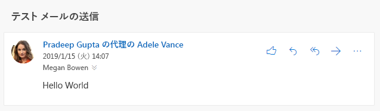

# <a name="send-outlook-messages-from-another-user"></a>別のユーザーを差出人として Outlook メッセージを送信する

Exchange Online で提供される[メールボックスのアクセス許可](/Exchange/recipients/mailbox-permissions)を使用すると、ユーザーは、他のユーザー、配布リスト、グループ、リソース、または共有メールボックスから送信されたものとして表示されるメールを送信することができます。 この機能は Microsoft Graph でもサポートされていますが、最終的な動作は、Exchange Online で付与される許可の種類およびメールの送信に使用する API の種類により異なります。

## <a name="permissions"></a>アクセス許可

別のユーザーを差出人としたメッセージ送信に適用されるアクセス許可には 2 種類あります。[Microsoft Graph のアクセス許可](permissions-reference.md)とメールボックスのアクセス許可です。

### <a name="microsoft-graph-permissions"></a>Microsoft Graph のアクセス許可

ユーザー トークンを使用するアプリケーションは、他のユーザーからメッセージを送信するために **Mail.Send.Shared** アクセス許可を使用します。

> [!NOTE]
> ユーザー トークンではなくアプリケーション トークンが使用され、管理者が **Mail.Send** アクセス許可に同意しているアプリケーションでは、ユーザーのメールボックスから通常の方法でメールを送信することで、組織内の任意のユーザーとしてメールを送信できます。

### <a name="mailbox-permissions"></a>メールボックスのアクセス許可

別のユーザーを差出人としたメッセージの送信の動作に影響を与えるアクセス許可には、次の 2 つがあります。**代理人として送信する**と**メールボックス所有者として送信する**です。 **Mail.Send.Shared** アクセス許可を使用してアプリケーションにサインインするユーザーは、このうち少なくとも 1 つのアクセス許可を送信元のメールボックス、グループ、または配布リストに付与しておく必要があります。

#### <a name="send-on-behalf"></a>代理人として送信する

このアクセス許可を使用する場合、メールの受信者の電子メール クライアントには、メッセージは、他のユーザーの代理としてアプリケーションのユーザーから送信されたものだと表示されます。



Microsoft Graph では、これは `sender` プロパティ (実際にメッセージを送信したユーザー) と `from` プロパティ (メッセージの送信者のように表示されるユーザーやグループなど) により公開れます。

```json
{
  "id": "AAMkAGE1...",
  "subject": "Send mail test",
  "sender": {
    "emailAddress": {
      "name": "Adele Vance",
      "address": "AdeleV@contoso.com"
    }
  },
  "from": {
    "emailAddress": {
      "name": "Pradeep Gupta",
      "address": "PradeepG@contoso.com"
    }
  }
}
```

ユーザーは [Outlook を使用](https://support.office.com/article/Allow-someone-else-to-manage-your-mail-and-calendar-41C40C04-3BD1-4D22-963A-28EAFEC25926)して、ユーザー自身のメールボックスへのアクセス許可を別のユーザーに付与することができます。 管理者は、[Office 365 管理センター](/office365/admin/add-users/give-mailbox-permissions-to-another-user?view=o365-worldwide)で、このアクセス許可をすべてのメールボックス、グループ、または配布リストにこのアクセス許可を付与ことができます。

#### <a name="send-as"></a>メールボックス所有者として送信する

このアクセス許可を使用する場合、別のユーザーとしてメッセージが送信されたことは表示されません。 `sender` プロパティと `from` プロパティで同じ値が使われます。

ユーザーは、自分のメールボックスにこのアクセス許可を付与することはできません。 管理者は、このアクセス許可を Office 365 管理センターで付与することができます。

## <a name="sending-with-microsoft-graph"></a>Microsoft Graph を使用して送信する

別のユーザーからメッセージを送信するには、[直接送信](/graph/api/user-sendmail?view=graph-rest-1.0)するか、または[下書きを作成](/graph/api/user-post-messages?view=graph-rest-1.0)しその後に[送信](/graph/api/message-send?view=graph-rest-1.0)します。

別のユーザーを差出人として送信するには、差出人の電子メール アドレスに送信する[メッセージ](/graph/api/resources/message?view=graph-rest-1.0)で `from` プロパティを設定します。 `sender` プロパティは、サインインしているユーザーに付与されているメールボックスへのアクセス許可に基づいて Microsoft Graph により適切に設定されるので、ユーザーがこのプロパティを設定する必要はありません。

たとえば、`sales@contoso.com` グループからメールを送信するには、メッセージを次のように構成します。

```json
{
  "subject": "January sales report",
  "toRecipients": [
    {
      "emailAddress": {
        "address": "MeganB@contoso.com"
      }
    }
  ],
  "from": [
    {
      "emailAddress": {
        "address": "sales@contoso.com"
      }
    }
  ]
}
```

## <a name="sent-items-behavior"></a>送信されたアイテムの動作

メッセージを送信後、送信したメッセージはメッセージを送信したユーザーの [送信済みアイテム] フォルダー、差出人ユーザーの [送信済みアイテム] フォルダー、またはその両方に保存できます。 どこにも保存されない場合もあります。

> [!NOTE]
> メールボックスを持たないアドレス (例: 配布リスト) からメッセージが送信する場合、差出人ユーザーの [送信済みアイテム] はありません。

- アプリケーションが `/me` エンドポイント (または `user-id` の部分がサインインしているユーザーに相当する `/users/{user-id}`) を使用して送信する場合、既定では、メッセージは送信ユーザーの [送信済みアイテム] フォルダーに保存されます。
- アプリケーションが、`user-id` の部分が差出人ユーザーに相当する `/users/{user-id}` を使用して送信する場合、規定では、メッセージは差出人ユーザーの [送信済みアイテム] フォルダーに保存されます。
    > [!IMPORTANT]
    > この方法で送信するためには、送信ユーザーは、**代理人として送信する**アクセス許可または**メールボックス所有者として送信する**アクセス許可に加え、**フル アクセス**のメールボックス アクセス許可を持っている必要があります。

既定の動作は、他の外部の要因によって変わります。

- 管理者は、差出人ユーザーのメールボックスで、[代理人から送信されたメッセージのコピーを必ず　[送信済みアイテム] フォルダーに保存する](/exchange/recipients-in-exchange-online/manage-user-mailboxes/automatically-save-sent-items-in-delegator-s-mailbox)ように更新できます。
- [メールの送信](/graph/api/user-sendmail?view=graph-rest-1.0)要求で `saveToSentItems` プロパティを `true` に設定することで、アイテムが [送信済みアイテム] フォルダーに保存されないようにできます。 ただし、管理者が "コピーを必ず保存する" 設定の構成を行っている場合、メッセージは引き続き差出人ユーザーの [送信済みアイテム] に保存されます。

## <a name="examples"></a>例

### <a name="example-1-successful-send-through-me-endpoint"></a>例 1: /me エンドポイントを使用した送信の成功

この例では、Adele Vance に、Allan Deyoung のメールボックスへの**代理人として送信する**アクセス許可が付与されています。

#### <a name="request"></a>要求

```http
POST /me/sendmail
Content-Type: application/json

{
  "message": {
    "subject": "Expense reports",
    "body": {
      "contentType": "text",
      "content": "Have you submitted your expense reports yet?"
    },
    "toRecipients": [
      {
        "emailAddress": {
          "address": "MeganB@contoso.com"
        }
      }
    ],
    "from": [
      {
        "emailAddress": {
          "address": "AllanD@contoso.com"
        }
      }
    ]
  }
}
```

#### <a name="response"></a>応答

```http
HTTP/1.1 202 Accepted
```

### <a name="example-2-unsuccessful-attempt-to-send-without-permissions"></a>例 2: アクセス許可がない状態での送信の失敗

この例では、Adele Vance は Patti Fernandez を差出人としてメールを送信しようとしていますが、**代理人として送信する**アクセス許可も**メールボックス所有者として送信する**アクセス許可も付与されていません。 応答には `ErrorSendAsDenied` エラーが含まれます。

<!-- markdownlint-disable MD024 -->

#### <a name="request"></a>要求

```http
POST /me/sendmail
Content-Type: application/json

{
  "message": {
    "subject": "Support ticket",
    "body": {
      "contentType": "text",
      "content": "I noticed you opened a support ticket yesterday..."
    },
    "toRecipients": [
      {
        "emailAddress": {
          "address": "MeganB@contoso.com"
        }
      }
    ],
    "from": [
      {
        "emailAddress": {
          "address": "PattiF@contoso.com"
        }
      }
    ]
  }
}
```

#### <a name="response"></a>応答

```http
HTTP/1.1 403 Forbidden
Content-Type: application/json

{
  "error": {
    "code": "ErrorSendAsDenied",
    "message": "The user account which was used to submit this request does not have the right to send mail on behalf of the specified sending account., Cannot submit message.",
    "innerError": {
      "request-id": "24e7991e-01ae-4cc2-8e06-532a96fd8948",
      "date": "2019-01-16T18:53:25"
    }
  }
}
```

## <a name="next-steps"></a>次の手順

詳細情報:

- [Outlook メールと統合する理由](outlook-mail-concept-overview.md)
- Microsoft Graph v1.0 の[メール API](/graph/api/resources/mail-api-overview?view=graph-rest-1.0) とメール PAPI の[用途](/graph/api/resources/mail-api-overview?view=graph-rest-1.0#common-use-cases)。

<!-- {
  "type": "#page.annotation",
  "suppressions": [
    "Error: /concepts/outlook-send-mail-from-other-user.md:
      Exception processing links.
    System.ArgumentException: Link Definition was null. Link text: !NOTE
      at ApiDoctor.Validation.DocFile.get_LinkDestinations()
      at ApiDoctor.Validation.DocSet.ValidateLinks(Boolean includeWarnings, String[] relativePathForFiles, IssueLogger issues, Boolean requireFilenameCaseMatch, Boolean printOrphanedFiles)"
  ]
}-->
