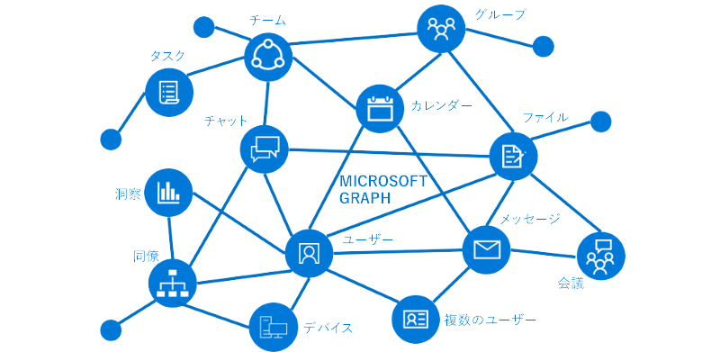

# Microsoft Graph の概要Overview of Microsoft Graph

Microsoft Graph は、Microsoft 365 のデータとインテリジェンスにアクセスするための入り口です。Microsoft Graph is the gateway to data and intelligence in Microsoft 365. Microsoft Graph は、Office 365、Enterprise Mobility + Security、および Windows 10 の大量のデータを活用するために使用できる統合型プログラミング モデルを提供します。Microsoft Graph provides a unified programmability model that you can use to take advantage of the tremendous amount of data in Office 365, Enterprise Mobility + Security, and Windows 10. 

Microsoft Graph API を使用して、数百万人のユーザーのデータを操作する組織やコンシューマー向けのアプリを作成できます。You can use the Microsoft Graph API to build apps for organizations and consumers that interact with the data of millions of users. Microsoft Graph では、1 つのエンドポイント (`https://graph.microsoft.com`) を介して豊富なリソース、リレーションシップ、およびインテリジェンスのすべてに接続できます。With Microsoft Graph, you can connect to a wealth of resources, relationships, and intelligence, all through a single endpoint: `https://graph.microsoft.com`.

## Graph の内容What's in the graph?
Microsoft Graph は、次のデータにアクセスするための REST API とクライアント ライブラリを公開しています。Microsoft Graph exposes REST APIs and client libraries to access data on the following:

- Azure Active DirectoryAzure Active Directory
- Office 365 サービス: SharePoint、OneDrive、Outlook/Exchange、Microsoft Teams、OneNote、Planner、および ExcelOffice 365 services: SharePoint, OneDrive, Outlook/Exchange, Microsoft Teams, OneNote, Planner, and Excel
- Enterprise Mobility + Security サービス: Identity Manager、Intune、Advanced Threat Analytics、および Advanced Threat Protection。Enterprise Mobility and Security services: Identity Manager, Intune, Advanced Threat Analytics, and Advanced Threat Protection.
- Windows 10 サービス: アクティビティとデバイスWindows 10 services: activities and devices
- 教育Education

詳細については、「[Microsoft Graph の主要なサービスおよび機能](overview-major-services.md)」を参照してください。To find out more, see [Major services and features in Microsoft Graph](overview-major-services.md).

Microsoft Graph は、リレーションシップを使用してこれらのサービス間ですべてのリソースを接続します。Microsoft Graph connects all the resources across these services using relationships. たとえば、ユーザーは [memberOf](/graph/api/user-list-memberof?view=graph-rest-1.0) リレーションシップを介してグループに接続したり、[manager](/graph/api/user-list-manager?view=graph-rest-1.0) リレーションシップを介して別のユーザーに接続したりできます。For example, a user can be connected to a group through a [memberOf](/graph/api/user-list-memberof?view=graph-rest-1.0) relationship, and to another user through a [manager relationship](/graph/api/user-list-manager?view=graph-rest-1.0). アプリはこれらのリレーションシップをスキャンして、これらの接続されたリソースにアクセスし、API を介してそれらのアクションを実行することができます。Your app can traverse these relationships to access these connected resources and perform actions on them through the API.

また、Microsoft Graph のデータに関する貴重なインサイトとインテリジェンスを得ることもできます。You can also get valuable insights and intelligence about the data from Microsoft Graph. たとえば、特定のユーザーに人気のあるファイルを[人気上昇中](/graph/api/resources/insights-trending?view=graph-rest-beta)にしたり、ユーザーに最も関連性の高い[人物](/graph/api/user-list-people?view=graph-rest-beta)を取得したりできます。For example, you can get the popular files [trending around](/graph/api/resources/insights-trending?view=graph-rest-beta) a particular user, or [get the most relevant people](/graph/api/user-list-people?view=graph-rest-beta) around a user.

Microsoft Graph のリレーションシップが持つ可能性を見つけてください。Discover the possibilities in the relationships within Microsoft Graph.

## Microsoft Graph でできることWhat can you do with Microsoft Graph? 

Microsoft Graph を使用すると、ユーザーの固有のコンテキストに関するエクスペリエンスを構築し、生産性を高めることができます。次のアプリを想像してみてください。You can use Microsoft Graph to build experiences around the user's unique context to help them be more productive. Imagine an app that...

- 出席者にプロファイル情報を提供することで、次の会議の調査や準備に役立ちます。情報には、出席者の役職や仕事仲間、作業中の最新のドキュメントやプロジェクトに関する情報などが含まれます。Looks at your next meeting and helps you prepare for it by providing profile information for attendees, including their job titles and who they work with, as well as information about the latest documents and projects they're working on.
- 予定表をスキャンして、次のチームミーティングに最適な時間を提案します。Scans your calendar, and suggests the best times for the next team meeting.
- OneDrive の Excel ファイルから最新の売上予測チャートを取得し、リアルタイムで予測を更新します。これらをすべて携帯電話から行います。Fetches the latest sales projection chart from an Excel file in your OneDrive and lets you update the forecast in real time, all from your phone.
- 予定表の変更に対応し、会議に時間がかかりすぎているときに警告を送信したり、出席者との関連度に基づいて、見逃しや委任が可能な会議を提示したりします。Subscribes to changes in your calendar, sends you an alert when you’re spending too much time in meetings, and provides recommendations for the ones you can miss or delegate based on how relevant the attendees are to you.
- たとえば、個人の OneDrive に送信する必要のある写真と OneDrive for Business に送信する必要のあるビジネスの領収書を分類するなどにより、携帯電話で個人情報や仕事情報を整理するのに役立ちます。Helps you sort out personal and work information on your phone; for example, by categorizing pictures that should go to your personal OneDrive and business receipts that should go to your OneDrive for Business.

Microsoft Graph API を使用すると、これ以上のことができます。You can do all this and more with the Microsoft Graph API.

>**注:** Microsoft Graph API を使用する場合、「[Microsoft Graph 使用条件](https://developer.microsoft.com/graph/docs/misc/terms-of-use)」と「[Microsoft のプライバシーに関する声明](https://go.microsoft.com/fwlink/?LinkId=521839)」に同意することになります。**Note:** When you use the Microsoft Graph API, you agree to the [Microsoft Graph Terms of Use](https://developer.microsoft.com/graph/docs/misc/terms-of-use) and the [Microsoft Privacy Statement](https://go.microsoft.com/fwlink/?LinkId=521839).

### 一般的な要求Popular requests

Microsoft Graph API を使用するための一般的なシナリオをいくつか確認します。Check out some of these common scenarios for working with the Microsoft Graph API. リンクから [Graph エクスプローラー](https://developer.microsoft.com/graph/graph-explorer)に移動できます。The links take you to the [Graph Explorer](https://developer.microsoft.com/graph/graph-explorer).

| **操作****Operation** | **URL****URL** |
|:--------------------------|:----------------------------------------|
|   自分のプロファイルの取得GET my profile |    [`https://graph.microsoft.com/v1.0/me`](https://developer.microsoft.com/graph/graph-explorer/?request=me&version=v1.0) |
|   自分のファイルの取得GET my files | [`https://graph.microsoft.com/v1.0/me/drive/root/children`](https://developer.microsoft.com/graph/graph-explorer/?request=me%2Fdrive%2Froot%2Fchildren&version=v1.0) |
|   自分の写真の取得	GET my photo | [`https://graph.microsoft.com/v1.0/me/photo/$value`](https://developer.microsoft.com/graph/graph-explorer/?request=me%2Fphoto%2F%24value&version=v1.0) |
|   自分のメールの取得GET my mail |   [`https://graph.microsoft.com/v1.0/me/messages`](https://developer.microsoft.com/graph/graph-explorer/?request=me%2Fmessages&version=v1.0) |
|   自分にとって重要度の高いメールの取得GET my high importance email | [`https://graph.microsoft.com/v1.0/me/messages?$filter=importance%20eq%20'high'`](https://developer.microsoft.com/graph/graph-explorer/?request=me%2Fmessages%3F%24filter%3Dimportance%2520eq%2520'high'&version=v1.0) |
|   自分の予定表イベントの取得GET my calendar events |    [`https://graph.microsoft.com/v1.0/me/events`](https://developer.microsoft.com/graph/graph-explorer/?request=me%2Fevents&version=v1.0) |
|   自分の上司の取得GET my manager  | [`https://graph.microsoft.com/v1.0/me/manager`](https://developer.microsoft.com/graph/graph-explorer/?request=me%2Fmanager&version=v1.0) |
|   foo.txt ファイルを最後に変更したユーザーの取得GET last user to modify file foo.txt |  [`https://graph.microsoft.com/v1.0/me/drive/root/children/foo.txt/lastModifiedByUser`](https://developer.microsoft.com/graph/graph-explorer/?request=me%2Fdrive%2Froot%2Fchildren%2Ffoo.txt%2FlastModifiedByUser&version=v1.0) |
|   自分がメンバーになっている Office365 グループの取得GET Office365 groups I’m member of| [`https://graph.microsoft.com/v1.0/me/memberOf/$/microsoft.graph.group?$filter=groupTypes/any(a:a%20eq%20'unified')`](https://developer.microsoft.com/graph/graph-explorer/?request=me%2FmemberOf%2F%24%2Fmicrosoft.graph.group%3F%24filter%3DgroupTypes%2Fany(a%3Aa%2520eq%2520'unified')&version=v1.0) |
|   自分の所属組織のユーザーの取得GET users in my organization     | [`https://graph.microsoft.com/v1.0/users`](https://developer.microsoft.com/graph/graph-explorer/?request=users&version=v1.0) |
|   自分の組織内のグループの取得GET groups in my organization | [`https://graph.microsoft.com/v1.0/groups`](https://developer.microsoft.com/graph/graph-explorer/?request=groups&version=v1.0) |
|   自分に関連付けられたユーザーの取得GET people related to me    | [`https://graph.microsoft.com/v1.0/me/people`](https://developer.microsoft.com/graph/graph-explorer/?request=me%2Fpeople&version=beta)  |
|   自分の周りで人気上昇中の項目の取得GET items trending around me |  [`https://graph.microsoft.com/beta/me/insights/trending`](https://developer.microsoft.com/graph/graph-explorer/?request=me%2Finsights%2Ftrending&version=beta) |
|   自分のノートの取得GET my notes |  [`https://graph.microsoft.com/v1.0/me/onenote/notebooks`](https://developer.microsoft.com/graph/graph-explorer/?request=me%2Fonenote%2Fnotebooks&version=beta) |

## Microsoft Graph への大量アクセスAccess Microsoft Graph at scale

Microsoft Graph データ接続では、Office 365 のデータに対して、従来のトランザクション単位ではなく一括でのアクセスが可能です。Microsoft Graph Data Connect enables bulk - rather than the traditional transactional - access to Office 365 data. Office 365 のバルク データでは、Azure ツールを使用して、次を実行するインテリジェントなアプリを構築できます。With the bulk Office 365 data, you can use Azure tools to build intelligent apps that:

- 組織内にいる、あなたのトピックに関する専門家で、場所が最も近い人を探すFind you the closest expert on a topic to you in your organization 
- ナレッジ ベース作成を自動化するAutomate knowledge base creation
- 会議室の使用状況に関する洞察を得るために、会議出席依頼を分析するAnalyze meeting requests to provide insights into conference room utilization
- 生産性および通信のデータから不正行為を検出するDetect fraud with productivity and communication data

## Microsoft Graph データ接続を使用するタイミングWhen should I use Microsoft Graph Data Connect?

Microsoft Graph データ接続は、Microsoft Graph API を通じて利用可能なデータとやりとりする新たな方法を提供します。Microsoft Graph Data Connect provides a new way for you to interact with the data that's available through Microsoft Graph APIs. Office 365 データへのスケーラブルなアクセスの提供に加え、Microsoft Graph データ接続は、インテリジェントなアプリケーションの構築を効率化する独自の各種機能を備えています。これらの機能はすべて Microsoft クラウド内で使用できます。In addition to providing scalable access to Office 365 data, Microsoft Graph Data Connect also provides a unique set of capabilities that streamline the building of intelligent applications, all within the Microsoft cloud.

|**機能****Feature**| **Microsoft Graph API****Microsoft Graph API** | **Microsoft Graph データ接続****Microsoft Graph Data Connect** |
|:----------|:------------------------|:--------------------------------------|
| **アクセス スコープ****Access scope** | 1 人のユーザーまたはテナント全体Single user or entire tenant | 多数のユーザーまたはグループMany users or groups |
| **アクセス パターン****Access pattern** | リアルタイムReal time | 定期的なスケジュールRecurrent schedule |
| **データ操作****Data operations** | データ マスターに対する操作Operates on data master | データのキャッシュに対する操作Operates on a cache of the data |
| **データ保護****Data protection** | データは Microsoft 365 内にある間は保護されるData is protected while in Microsoft 365 | データ保護対象は Azure サブスクリプション内のデータのキャッシュにも拡大されるData protection is extended to the cache of data in your Azure subscription |
| **ユーザーの同意****User consent** | 自分Self リソースの種類Resource types | なしNone |
| **管理者の同意****Admin consent** | 組織全体Entire organization リソースの種類Resource types | ユーザーのグループを選択Select groups of users リソースの種類とプロパティResource types and properties ユーザーを除外Excludes users |
| **アクセス ツール****Access tools** | RESTful Web クエリRESTful web queries | Azure Data FactoryAzure Data Factory |

Microsoft Graph データ接続の詳細については、[Microsoft Graph データ接続](data-connect-overview.md)を参照してください。For more information about Microsoft Graph Data Connect, see [Microsoft Graph Data Connect](data-connect-overview.md). 使用を開始するには、[Microsoft Graph データ接続の概要](data-connect-concept-overview.md)を参照してください。To get started, see [Overview of Microsoft Graph Data Connect](data-connect-concept-overview.md). 

## 次のステップNext steps

- [おすすめのシナリオ](https://developer.microsoft.com/graph/examples)を確認します。Check out some [featured scenarios](https://developer.microsoft.com/graph/examples).
- [Graph エクスプローラー](https://developer.microsoft.com/graph/graph-explorer)でサンプルの要求を試します。Try a sample request in the [Graph Explorer](https://developer.microsoft.com/graph/graph-explorer).
- [クイック スタート](https://developer.microsoft.com/graph/quick-start)を使用して、すぐに実行できるサンプル アプリをセットアップします。Use the [quick start](https://developer.microsoft.com/graph/quick-start) to set up a ready-to-run sample app.
- 目次の「**詳細情報**」を見て、さまざまなシナリオで使用できるサービスや機能についての詳細情報を参照します。Look under **Learn** in the table of contents to read about services and features that you can use in your scenarios. 
- アプリで[認証トークンを取得する](auth-overview.md)方法を検索します。Find out how to [get an auth token](auth-overview.md) in your app.
- [API の使用](use-the-api.md)を開始します。Start [using the API](use-the-api.md).

## フィードバックFeedback?

お客様からのフィードバックを重視しています。[スタック オーバーフロー](https://stackoverflow.com/questions/tagged/office365+or+microsoftgraph)でご連絡いただけます。ご質問には {MicrosoftGraph} のタグを付けてください。Your feedback is important to us. Connect with us on [Stack Overflow](https://stackoverflow.com/questions/tagged/office365+or+microsoftgraph). Tag your questions with {MicrosoftGraph}.

