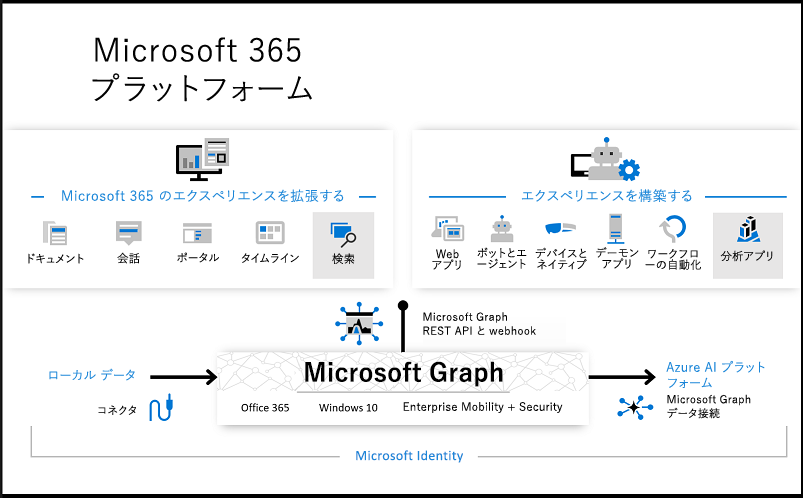

# Microsoft Graph の概要

Microsoft Graph は、Microsoft 365 のデータとインテリジェンスにアクセスするための入り口です。 これは、Office 365、Windows 10、およびEnterprise Mobility + Securityの大量のデータにアクセスする際に使用できる統合型プログラミング モデルを提供します。 Microsoft Graph の豊富なデータを使用して、数百万人のユーザーを操作する組織やコンシューマー向けのアプリを作成できます。

## Microsoft 365 プラットフォームの向上

Microsoft 365 プラットフォームでは、主に次の 3 つのコンポーネントがデータへのアクセスとフローを容易にします。

- Microsoft Graph API は、Microsoft 365 サービスのリソースとして公開されている豊富なユーザー中心のデータおよび分析情報にアクセスできるように単一のエンドポイントである `https://graph.microsoft.com` を提供します。 REST API または SDK を使用して、エンドポイントにアクセスし、生産性、コラボレーション、教育、セキュリティ、ID、アクセス、デバイス管理などのシナリオをサポートするアプリを構築できます。
- [Microsoft Graph データ接続](#access-microsoft-graph-data-at-scale-using-microsoft-graph-data-connect)は、一般的な Azure データ ストアへの Microsoft Graph データの安全かつスケーラブルな配信を合理化できるツール セットを提供します。 このキャッシュされたデータは、インテリジェントなアプリケーションを構築する際に使用できる Azure 開発ツールのデータ ソースとして機能します。
- Microsoft Graph コネクタ (プライベート プレビュー) は着信方向に機能し、外部データを Microsoft Graph サービスおよびアプリケーションに提供し、カスタム エクスペリエンスを向上させます。

Microsoft Graph API、データ接続、およびコネクタ (プライベート プレビュー) を組み合わせて Microsoft 365 プラットフォームを向上させます。 Microsoft Graph データおよびその他のデータセットにアクセスして洞察と分析を導き出すことで、Microsoft 365 のエクスペリエンスを拡張したり、独自のインテリジェントなアプリケーションを構築したりすることができます。

> [!NOTE]
> Microsoft Graph コネクタは、プライベート プレビューに表示されます。 プレビュー プログラムへの参加は招待のみ可能です。 コネクタの詳細については、「[ビルド 2019: Microsoft Graph でMicrosoft 365 プラットフォームを向上する](https://aka.ms/microsoftgraphbuild2019)」を参照してください。

## Microsoft Graph の内容

Microsoft Graph は、次の Microsoft 365 services のデータにアクセスするための REST API とクライアント ライブラリを公開しています。

- Office 365 サービス: Delve、Excel、Microsoft Bookings、Microsoft Teams、OneDrive、OneNote、Outlook/Exchange、Planner、およびSharePoint
- Enterprise Mobility + Security サービス: Advanced Threat Analytics、Advanced Threat Protection、Azure Active Directory、Identity Manager、およびIntune
- Windows 10 サービス: アクティビティ、デバイス、および通知
- Dynamics 365 Business Central

詳細については、「[Microsoft Graph の主要なサービスおよび機能](overview-major-services.md)」を参照してください。

## Microsoft Graph でできること

> [!VIDEO https://www.youtube-nocookie.com/embed/PI9NO5rayiY]

Microsoft Graph を使用すると、ユーザーの固有のコンテキストに関するエクスペリエンスを構築し、生産性を高めることができます。 次のアプリを想像してみてください。

- 出席者にプロファイル情報を提供することで、次の会議の調査や準備に役立ちます。情報には、出席者の役職やマネージャー、作業中の最新のドキュメントおよび共同作業する人に関する情報などが含まれます。
- 予定表をスキャンして、次のチームミーティングに最適な時間を提案します。
- OneDrive の Excel ファイルから最新の売上予測チャートを取得し、リアルタイムで予測を更新します。これらをすべて携帯電話から行います。
- 予定表の変更に対応し、会議に時間がかかりすぎているときに警告を送信したり、出席者との関連度に基づいて、見逃しや委任が可能な会議を提示したりします。
- たとえば、個人の OneDrive に送信する必要のある写真と OneDrive for Business に送信する必要のあるビジネスの領収書を分類するなどにより、携帯電話で個人情報や仕事情報を整理するのに役立ちます。
- 意思決定者がビジネス生産性を向上させる時間の割り当てとコラボレーション パターンに関する貴重な洞察を引き出すことができるように、大規模な Office 365 データを分析します。
- カスタム ビジネス データを Microsoft Graph に取り込み、インデックスを作成して Microsoft 365 サービスからのデータと共に検索できるようにします。

例として、会議出席者の調査に関する最初のシナリオを選択してください。 Microsoft Graph API を使用すると、次のことが可能になります。

1. [会議イベント](/graph/api/resources/event?view=graph-rest-1.0)参加者のメール アドレスを取得します。
2. [プロファイル情報](/graph/api/user-get?view=graph-rest-1.0)を取得するには、Azure Active Directory の[ユーザー](/graph/api/resources/user?view=graph-rest-1.0)として個別に検索します。

次に関係を使用して他のリソースに移動できます。

- [マネージャーとの関係](/graph/api/user-list-manager?view=graph-rest-1.0)を通してマネージャーと接続します。
- ユーザー[周辺](/graph/api/resources/insights-trending?view=graph-rest-beta)の一般的なファイルなど、貴重な分析情報やインテリジェンスを取得します。
- ユーザー周辺の[最も関連性のある人を取得します](/graph/api/user-list-people?view=graph-rest-beta)。
- [memberOf](/graph/api/user-list-memberof?view=graph-rest-1.0) 関係を通してユーザー グループにアクセスするようにシナリオを拡張する
- [各グループ内の他のメンバーに連絡します](/graph/api/group-list-members?view=graph-rest-1.0)。
- [教育](education-concept-overview.md)や[チームワーク](teams-concept-overview.md)など、[グループ](office365-groups-concept-overview.md)で有効になっている他のシナリオを活用します。

Microsoft Graph は、適切なアクセス許可がある場合に限り、開発者向けに Microsoft 365 プラットフォームを継続的に公開します。

> [!NOTE]
> Microsoft Graph API を使用する場合、「[Microsoft API 使用条件](/legal/microsoft-apis/terms-of-use?context=/graph/context)」と「[Microsoft のプライバシーに関する声明](https://go.microsoft.com/fwlink/?LinkId=521839)」に同意することになります。

### 一般的な API 要求

Microsoft Graph API を使用するための一般的なシナリオをいくつか確認します。 リンクから [Graph エクスプローラー](https://developer.microsoft.com/graph/graph-explorer)に移動できます。

| **操作** | **URL** |
|:--------------------------|:----------------------------------------|
|   自分のプロファイルの取得 | [`https://graph.microsoft.com/v1.0/me`](https://developer.microsoft.com/graph/graph-explorer/?request=me&version=v1.0) |
|   自分のファイルの取得 | [`https://graph.microsoft.com/v1.0/me/drive/root/children`](https://developer.microsoft.com/graph/graph-explorer/?request=me%2Fdrive%2Froot%2Fchildren&version=v1.0) |
|   自分の写真の取得	 | [`https://graph.microsoft.com/v1.0/me/photo/$value`](https://developer.microsoft.com/graph/graph-explorer/?request=me%2Fphoto%2F%24value&version=v1.0) |
|   自分のメールの取得 | [`https://graph.microsoft.com/v1.0/me/messages`](https://developer.microsoft.com/graph/graph-explorer/?request=me%2Fmessages&version=v1.0) |
|   自分にとって重要度の高いメールの取得 | [`https://graph.microsoft.com/v1.0/me/messages?$filter=importance%20eq%20'high'`](https://developer.microsoft.com/graph/graph-explorer/?request=me%2Fmessages%3F%24filter%3Dimportance%2520eq%2520'high'&version=v1.0) |
|   自分の予定表イベントの取得 | [`https://graph.microsoft.com/v1.0/me/events`](https://developer.microsoft.com/graph/graph-explorer/?request=me%2Fevents&version=v1.0) |
|   自分の上司の取得 | [`https://graph.microsoft.com/v1.0/me/manager`](https://developer.microsoft.com/graph/graph-explorer/?request=me%2Fmanager&version=v1.0) |
|   foo.txt ファイルを最後に変更したユーザーの取得 | [`https://graph.microsoft.com/v1.0/me/drive/root/children/foo.txt/lastModifiedByUser`](https://developer.microsoft.com/graph/graph-explorer/?request=me%2Fdrive%2Froot%2Fchildren%2Ffoo.txt%2FlastModifiedByUser&version=v1.0) |
|   自分がメンバーになっている Office365 グループの取得| [`https://graph.microsoft.com/v1.0/me/memberOf/$/microsoft.graph.group?$filter=groupTypes/any(a:a%20eq%20'unified')`](https://developer.microsoft.com/graph/graph-explorer/?request=me%2FmemberOf%2F%24%2Fmicrosoft.graph.group%3F%24filter%3DgroupTypes%2Fany(a%3Aa%2520eq%2520'unified')&version=v1.0) |
|   自分の所属組織のユーザーの取得  | [`https://graph.microsoft.com/v1.0/users`](https://developer.microsoft.com/graph/graph-explorer/?request=users&version=v1.0) |
|   自分の組織内のグループの取得 | [`https://graph.microsoft.com/v1.0/groups`](https://developer.microsoft.com/graph/graph-explorer/?request=groups&version=v1.0) |
|   自分に関連付けられたユーザーの取得 | [`https://graph.microsoft.com/v1.0/me/people`](https://developer.microsoft.com/graph/graph-explorer/?request=me%2Fpeople&version=beta)  |
|   自分の周りで人気上昇中の項目の取得 | [`https://graph.microsoft.com/beta/me/insights/trending`](https://developer.microsoft.com/graph/graph-explorer/?request=me%2Finsights%2Ftrending&version=beta) |
|   自分のノートの取得 | [`https://graph.microsoft.com/v1.0/me/onenote/notebooks`](https://developer.microsoft.com/graph/graph-explorer/?request=me%2Fonenote%2Fnotebooks&version=beta) |

## Microsoft Graph データ接続を使用して 大規模な Microsoft Graph データにアクセス

Microsoft Graph データ接続は、Microsoft Graph 上の大規模なデータにアクセスできるようにツール セットを提供します。また、管理者は Microsoft Graph データの同意対象の細分化と完全な管理ができます。 データ接続により、このデータの Microsoft Azure への配信が効率化されます。

Azure ツールを使用すると、次のようなインテリジェント アプリを構築できます。

- 組織内にいる、あなたのトピックに関する専門家で、場所が最も近い人を探す
- ナレッジ ベース作成を自動化する
- 会議室の使用状況に関する洞察を得るために、会議出席依頼を分析する
- 生産性および通信のデータから不正行為を検出する

## Microsoft Graph API またはデータ接続を使用するタイミング

Microsoft Graph データ接続は、Microsoft Graph API を通じて利用可能なデータとやりとりする新たな方法を提供します。 データ接続は、Microsoft クラウド内でインテリジェントなアプリケーションの構築を効率化する独自のツール セットを提供します。

|**機能**| **Microsoft Graph API** | **Microsoft Graph データ接続** |
|:----------|:------------------------|:--------------------------------------|
| **アクセス スコープ** | 1 人のユーザーまたはテナント全体 | 多数のユーザーまたはグループ |
| **アクセス パターン** | リアルタイム | 定期的なスケジュール |
| **データ操作** | データ マスターに対する操作 | データのキャッシュに対する操作 |
| **データ保護** | データは Microsoft 365 内にある間は保護される | データ保護対象は Azure サブスクリプション内のデータのキャッシュにも拡大される |
| **ユーザーの同意** | 自分 リソースの種類 | なし |
| **管理者の同意** | 組織全体 リソースの種類 | ユーザーのグループを選択 リソースの種類とプロパティ ユーザーを除外 |
| **アクセス ツール** | RESTful Web クエリ | Azure Data Factory |

 詳細については、「[Microsoft Graph データ接続](data-connect-overview.md)」を参照して、[Microsoft Graph データ接続の使用を開始します](data-connect-concept-overview.md)。

## 次の手順

- [おすすめのシナリオ](https://developer.microsoft.com/graph/examples)を確認します。
- [Graph エクスプローラー](https://developer.microsoft.com/graph/graph-explorer)でサンプルの要求を試します。
- [クイック スタート](https://developer.microsoft.com/graph/quick-start)を使用して、すぐに実行できるサンプル アプリをセットアップします。
- 目次の「**詳細情報**」を見て、さまざまなシナリオで使用できるサービスや機能についての詳細情報を参照します。
- アプリで[認証トークンを取得する](auth/auth-concepts.md)方法を検索します。
- [API の使用](use-the-api.md)を開始します。
