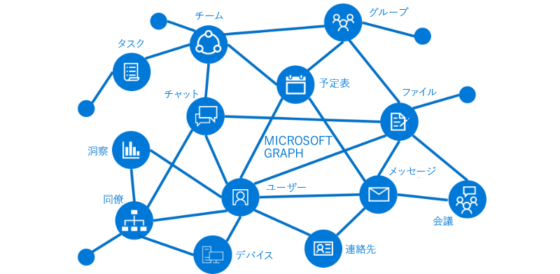

# Microsoft Graph の概要

Microsoft Graph API を使用すると、Microsoft クラウド内にいるユーザーの、数百万のデータと対話できます。Microsoft Graph を使用して、豊富なリソース、リレーションシップ、インテリジェンスに接続する、組織やコンシューマー向けのアプリケーションを、すべて 1 つのエンドポイントを介して構築します: `https://graph.microsoft.com`。

## Graph の内容

Microsoft Graph は、リレーションシップによって接続されたリソースで構成されています。たとえば、ユーザーは [memberOf](../api-reference/v1.0/api/user_list_memberof.md) リレーションシップを介してグループに、[manager](../api-reference/v1.0/api/user_list_manager.md) リレーションシップを介して別のユーザーに接続できます。アプリはこれらのリレーションシップをスキャンして、これらの接続されたリソースにアクセスし、API を介してそれらのアクションを実行することができます。

また、Microsoft Graph のデータに関する貴重な洞察とインテリジェンスを得ることもできます。たとえば、特定のユーザーで人気のあるファイルを[トレンド](../api-reference/beta/resources/insights_trending.md)にしたり、ユーザーに最も関連性の高い[人](../api-reference/beta/api/user_list_people.md)を取得したりすることができます。

Microsoft Graph のリレーションシップが持つ可能性を見つけてください。

## Microsoft Graph でできること 

Microsoft Graph を使用すると、ユーザーの固有のコンテキストに関するエクスペリエンスを構築し、生産性を高めることができます。次のアプリを想像してみてください。

- 出席者にプロファイル情報を提供することで、次の会議の調査や準備に役立ちます。情報には、出席者の役職や仕事仲間、作業中の最新のドキュメントやプロジェクトに関する情報などが含まれます。
- 予定表をスキャンして、次のチームミーティングに最適な時間を提案します。
- OneDrive の Excel ファイルから最新の売上予測チャートを取得し、リアルタイムで予測を更新します。これらをすべて携帯電話から行います。
- 予定表の変更を購読したり、会議に時間がかかりすぎているときに警告を送信したり、出席者との関連度に基づいて、見逃しや委任が可能な推奨事項を提示したりします。
- たとえば、個人の OneDrive に送信する必要のある写真と OneDrive for Business に送信する必要のあるビジネスの領収書を分類するなどにより、携帯電話で個人情報や仕事情報を整理するのに役立ちます。

Microsoft Graph API を使用すると、これ以上のことができます。

>**注:** Microsoft Graph API を使用する場合、[Microsoft Graph の使用条件](../misc/terms-of-use.md)と[Microsoft プライバシーに関する声明](https://go.microsoft.com/fwlink/?LinkId=521839)に同意することになります。

## 次の手順

- [おすすめのシナリオ](../concepts/featured_scenarios.md)を確認します。
- [Graph エクスプローラー](https://developer.microsoft.com/graph/graph-explorer)でサンプルの要求を試します。
- [クイック スタート](https://developer.microsoft.com/graph/quick-start)を使用して、すぐに実行できるサンプル アプリをセットアップします。
- アプリで[認証トークンを取得する](../concepts/auth_overview.md)方法を検索します。
- [API の使用](../concepts/use_the_api.md)を開始します。

## フィードバック

お客様からのフィードバックを重視しています。[スタック オーバーフロー](http://stackoverflow.com/questions/tagged/office365+or+microsoftgraph)でご連絡いただけます。ご質問には {MicrosoftGraph} のタグを付けてください。

