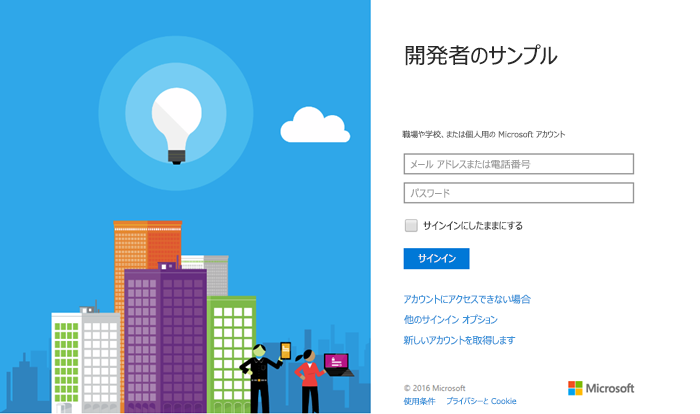

# <a name="get-started-with-microsoft-graph-in-a-php-app"></a><span data-ttu-id="107f5-101">PHP アプリで Microsoft Graph を使ってみる</span><span class="sxs-lookup"><span data-stu-id="107f5-101">Get started with Microsoft Graph in a PHP app</span></span>

<span data-ttu-id="107f5-p101">この記事では、Azure AD v2.0 エンドポイントからアクセス トークンを取得し、Microsoft Graph を呼び出すために必要なタスクについて説明します。ここでは、[PHP 用接続サンプル (REST)](https://github.com/microsoftgraph/php-connect-rest-sample) のビルドの手順と、Microsoft Graph を使用するために実装する主要な概念について説明します。また、REST 呼び出しを使用して Microsoft Graph にアクセスする方法についても説明します。</span><span class="sxs-lookup"><span data-stu-id="107f5-p101">This article describes the tasks required to get an access token from the Azure AD v2.0 endpoint and call  Microsoft Graph. It walks you through building the [Connect Sample for PHP (REST)](https://github.com/microsoftgraph/php-connect-rest-sample) and explains the main concepts that you implement to use Microsoft Graph. The article also describes how to access Microsoft Graph by using REST calls.</span></span>

<span data-ttu-id="107f5-p102">PHP アプリで Microsoft Graph を使用するには、ユーザーに Microsoft のサインイン ページを表示する必要があります。次のスクリーン ショットは、Microsoft アカウントのサインイン ページを示しています。</span><span class="sxs-lookup"><span data-stu-id="107f5-p102">To use Microsoft Graph in your PHP app, you need to show the Microsoft sign in page to your users. The following screenshot shows a sign in page for Microsoft accounts.</span></span>



<span data-ttu-id="107f5-108">**アプリを作成してみたくありませんか?**</span><span class="sxs-lookup"><span data-stu-id="107f5-108">**Don't feel like building an app?**</span></span> <span data-ttu-id="107f5-109">この記事で取り扱っている [PHP 用接続サンプル (REST)](https://github.com/microsoftgraph/php-connect-rest-sample) をダウンロードすれば、簡単に開始できます。</span><span class="sxs-lookup"><span data-stu-id="107f5-109">Get up and running fast by downloading the [Connect Sample for PHP (REST)](https://github.com/microsoftgraph/php-connect-rest-sample) that this article is based on.</span></span> <span data-ttu-id="107f5-110">または [PHP 用 Microsoft Graph ライブラリ](https://github.com/microsoftgraph/php-connect-sample) を使用する [PHP 用接続サンプル (SDK)](https://github.com/microsoftgraph/msgraph-sdk-php) バージョンをお試しください。</span><span class="sxs-lookup"><span data-stu-id="107f5-110">Or try out the [Connect Sample for PHP (SDK)](https://github.com/microsoftgraph/php-connect-sample) version that uses the [Microsoft Graph Library for PHP](https://github.com/microsoftgraph/msgraph-sdk-php).</span></span>


## <a name="prerequisites"></a><span data-ttu-id="107f5-111">前提条件</span><span class="sxs-lookup"><span data-stu-id="107f5-111">Prerequisites</span></span>

<span data-ttu-id="107f5-112">開始するには、次のものが必要です。</span><span class="sxs-lookup"><span data-stu-id="107f5-112">To get started, you'll need:</span></span> 

- <span data-ttu-id="107f5-113">[Microsoft アカウント](https://www.outlook.com/)か[職場または学校アカウント](https://docs.microsoft.com/en-us/office/developer-program/office-365-developer-program-faq#account-types)</span><span class="sxs-lookup"><span data-stu-id="107f5-113">A [Microsoft account](https://www.outlook.com/) or a [work or school account](https://docs.microsoft.com/en-us/office/developer-program/office-365-developer-program-faq#account-types)</span></span>
- <span data-ttu-id="107f5-114">PHP バージョン 5.5.9 以降</span><span class="sxs-lookup"><span data-stu-id="107f5-114">PHP version 5.5.9 or greater</span></span>
- [<span data-ttu-id="107f5-115">Composer</span><span class="sxs-lookup"><span data-stu-id="107f5-115">Composer</span></span>](https://getcomposer.org/)


## <a name="register-the-application"></a><span data-ttu-id="107f5-116">アプリケーションの登録</span><span class="sxs-lookup"><span data-stu-id="107f5-116">Register the application</span></span>
<span data-ttu-id="107f5-p104">Microsoft アプリケーション登録ポータルでアプリケーションを登録します。これにより、アプリの構成に使用するアプリ ID とパスワードが生成されます。</span><span class="sxs-lookup"><span data-stu-id="107f5-p104">Register an app on the Microsoft App Registration Portal. This generates the app ID and password that you'll use to configure the app.</span></span>

1. <span data-ttu-id="107f5-119">個人用アカウント、あるいは職場または学校アカウントのいずれかを使用して、[Microsoft アプリ登録ポータル](https://apps.dev.microsoft.com/)にサインインします。</span><span class="sxs-lookup"><span data-stu-id="107f5-119">Sign into the [Microsoft App Registration Portal](https://apps.dev.microsoft.com/) using either your personal or work or school account.</span></span>

2. <span data-ttu-id="107f5-120">**[アプリの追加]** を選択します。</span><span class="sxs-lookup"><span data-stu-id="107f5-120">Choose **Add an app**.</span></span>

3. <span data-ttu-id="107f5-121">アプリの名前を入力して、**[アプリケーションの作成]** を選択します。</span><span class="sxs-lookup"><span data-stu-id="107f5-121">Enter a name for the app, and choose **Create application**.</span></span> 
    
    <span data-ttu-id="107f5-122">登録ページが表示され、アプリのプロパティが一覧表示されます。</span><span class="sxs-lookup"><span data-stu-id="107f5-122">The registration page displays, listing the properties of your app.</span></span>

4. <span data-ttu-id="107f5-123">**[新しいパスワードを生成]** を選択します。</span><span class="sxs-lookup"><span data-stu-id="107f5-123">Choose **Generate New Password**.</span></span>

5. <span data-ttu-id="107f5-124">アプリケーション ID とパスワードをコピーします。</span><span class="sxs-lookup"><span data-stu-id="107f5-124">Copy the application ID and password.</span></span>

6. <span data-ttu-id="107f5-125">**[プラットフォームの追加]** および **[Web]** を選択します。</span><span class="sxs-lookup"><span data-stu-id="107f5-125">Choose **Add Platform** and **Web**.</span></span>

7. <span data-ttu-id="107f5-126">**[リダイレクト URI]** フィールドに `http://localhost:8000/oauth` と入力します。</span><span class="sxs-lookup"><span data-stu-id="107f5-126">In the **Redirect URI** field, type `http://localhost:8000/oauth`.</span></span>

8. <span data-ttu-id="107f5-127">**[保存]** を選択します。</span><span class="sxs-lookup"><span data-stu-id="107f5-127">Choose **Save**.</span></span>


## <a name="configure-the-project"></a><span data-ttu-id="107f5-128">プロジェクトを構成する</span><span class="sxs-lookup"><span data-stu-id="107f5-128">Configure the project</span></span>

<span data-ttu-id="107f5-p105">Composer を使用して、新しいプロジェクトを開始します。Laravel フレームワークを使用して新しい PHP プロジェクトを作成するには、次のコマンドを使用します。</span><span class="sxs-lookup"><span data-stu-id="107f5-p105">Start a new project using composer. To create a new PHP project using the Laravel framework, use the following command:</span></span>

```bash
composer create-project --prefer-dist laravel/laravel getstarted
```
 
<span data-ttu-id="107f5-131">これにより、このプロジェクトに使用できる **getstarted** フォルダーが作成されます。</span><span class="sxs-lookup"><span data-stu-id="107f5-131">This creates a **getstarted** folder that you can use for this project.</span></span>

> <span data-ttu-id="107f5-132">注:このチュートリアルのコーディング セクションに集中できるように、プロジェクト構成をサポートする[スターター プロジェクト](https://github.com/microsoftgraph/php-connect-rest-sample/tree/master/starter-project)も使用できます。</span><span class="sxs-lookup"><span data-stu-id="107f5-132">Note: You can also use the [Starter project](https://github.com/microsoftgraph/php-connect-rest-sample/tree/master/starter-project) that takes care of the project configuration so you can focus on the coding sections of this walkthrough.</span></span>

## <a name="authenticate-the-user-and-get-an-access-token"></a><span data-ttu-id="107f5-133">ユーザーの認証とアクセス トークンの取得</span><span class="sxs-lookup"><span data-stu-id="107f5-133">Authenticate the user and get an access token</span></span>
<span data-ttu-id="107f5-p106">OAuth ライブラリを使用して、認証プロセスを簡素化します。[PHP League](http://thephpleague.com/) により、このプロジェクトで使用できる [OAuth クライアント ライブラリ](https://github.com/thephpleague/oauth2-client)が作成されます。</span><span class="sxs-lookup"><span data-stu-id="107f5-p106">Use an OAuth library to simplify the authentication process. [The PHP League](http://thephpleague.com/) provides an [OAuth client library](https://github.com/thephpleague/oauth2-client) that you can use in this project.</span></span>

### <a name="add-the-dependency-to-composer"></a><span data-ttu-id="107f5-136">Composer に依存関係を追加する</span><span class="sxs-lookup"><span data-stu-id="107f5-136">Add the dependency to composer</span></span>

<span data-ttu-id="107f5-137">`composer.json` ファイルを開き、次の依存関係を**必須**セクションに組み込みます。</span><span class="sxs-lookup"><span data-stu-id="107f5-137">Open the `composer.json` file and include the following dependency in the **require** section:</span></span>

```json
"league/oauth2-client": "^1.4"
```

<span data-ttu-id="107f5-138">次のコマンドを実行して、依存関係を更新します。</span><span class="sxs-lookup"><span data-stu-id="107f5-138">Update the dependencies by running the following command:</span></span>

```bash
composer update
```

### <a name="start-the-authentication-flow"></a><span data-ttu-id="107f5-139">認証フローの開始</span><span class="sxs-lookup"><span data-stu-id="107f5-139">Start the authentication flow</span></span>

1. <span data-ttu-id="107f5-p107">**resources** > **views** > **welcome.blade.php** ファイルを開きます。**title** div 要素を次のコードに置き換えます。</span><span class="sxs-lookup"><span data-stu-id="107f5-p107">Open the **resources** > **views** > **welcome.blade.php** file. Replace the **title** div element with the following code.</span></span>
    ```html
    <div class="title" onClick="window.location='/oauth'">Sign in to Microsoft</div>
    ```
    
2. <span data-ttu-id="107f5-p108">**app** > **Http** > **routes.php** ファイルで `Illuminate\Http\Request` クラスの型ヒントを記述します。すべてのルート宣言の前に、次の行を追加します。</span><span class="sxs-lookup"><span data-stu-id="107f5-p108">Type-hint the `Illuminate\Http\Request` class on the **app** > **Http** > **routes.php** file. Add the following line before any route declaration.</span></span>
    ```php
    use Illuminate\Http\Request;
    ```
    
3. <span data-ttu-id="107f5-p109">*/oauth* ルートを **app** > **Http** > **routes.php** ファイルに追加します。ルートを追加するには、以下のコードを既定のルート宣言の後に追加します。アプリの**アプリケーション ID** および**パスワード**を、**\<YOUR_APPLICATION_ID\>** および **\<YOUR_PASSWORD\>** とマークされているプレースホルダーにそれぞれ挿入します。</span><span class="sxs-lookup"><span data-stu-id="107f5-p109">Add an */oauth* route to the **app** > **Http** > **routes.php** file. To add the route, copy the following code after the default route declaration. Insert the **application ID** and **password** of your app in the placeholder marked with **\<YOUR_APPLICATION_ID\>** and **\<YOUR_PASSWORD\>** respectively.</span></span>
    ```php
    Route::get('/oauth', function (Request $request) {
        $provider = new \League\OAuth2\Client\Provider\GenericProvider([
            'clientId'                => '<YOUR_APPLICATION_ID>',
            'clientSecret'            => '<YOUR_PASSWORD>',
            'redirectUri'             => 'http://localhost:8000/oauth',
            'urlAuthorize'            => 'https://login.microsoftonline.com/common/oauth2/v2.0/authorize',
            'urlAccessToken'          => 'https://login.microsoftonline.com/common/oauth2/v2.0/token',
            'urlResourceOwnerDetails' => '',
            'scopes'                  => 'openid mail.send'
        ]);

        if (!$request->has('code')) {
            return redirect($provider->getAuthorizationUrl());
        }
    });
    ```
    
<span data-ttu-id="107f5-p110">この時点で、*"Microsoft にサインイン"* と表示している PHP アプリができたはずです。テキストをクリックすると、アプリに Microsoft のサインイン ページが表示されます。次の手順は、認証サーバーがリダイレクト URI にコードを送信してアクセス トークンと交換する作業です。</span><span class="sxs-lookup"><span data-stu-id="107f5-p110">At this point, you should have a PHP app that displays *Sign in to Microsoft*. If you click the text, the app presents the Microsoft sign-in page. The next step is to handle the code that the authorization server sends to the redirect URI and exchange it for an access token.</span></span>

### <a name="exchange-the-authorization-code-for-an-access-token"></a><span data-ttu-id="107f5-150">認証コードとアクセス トークンの交換</span><span class="sxs-lookup"><span data-stu-id="107f5-150">Exchange the authorization code for an access token</span></span>

<span data-ttu-id="107f5-151">アクセス トークンと交換できるコードが含まれている認証サーバーの応答を処理する必要があります。</span><span class="sxs-lookup"><span data-stu-id="107f5-151">You need to handle the authorization server response, which contains a code that you can exchange for an access token.</span></span>

<span data-ttu-id="107f5-p111">*/oauth* ルートを更新して、認証コードでアクセス トークンを取得できるようにします。これを行うには、**app** > **Http** > **routes.php** ファイルを開き、以下の *else* 条件付き句を既存の *if* ステートメントに追加します。</span><span class="sxs-lookup"><span data-stu-id="107f5-p111">Update the */oauth* route so it can get an access token with the authorization code. To do this, open the **app** > **Http** > **routes.php** file and add the following *else* conditional clause to the existing *if* statement.</span></span>

```php
if (!$request->has('code')) {
    ...
    // add the following lines
} else {
    $accessToken = $provider->getAccessToken('authorization_code', [
        'code'     => $request->input('code')
    ]);
    exit($accessToken->getToken());
}
```
    
<span data-ttu-id="107f5-p112">この行 `exit($accessToken->getToken());` にアクセス トークンがあることにご注意ください。これで、Microsoft Graph を呼び出すためのコードを追加する準備が整いました。</span><span class="sxs-lookup"><span data-stu-id="107f5-p112">Note that you have an access token in this line: `exit($accessToken->getToken());`. Now you're ready to add code to call Microsoft Graph.</span></span> 

## <a name="call-microsoft-graph-using-rest"></a><span data-ttu-id="107f5-156">REST を使用して Microsoft Graph を呼び出す</span><span class="sxs-lookup"><span data-stu-id="107f5-156">Call Microsoft Graph using REST</span></span>
<span data-ttu-id="107f5-p113">REST を使用して Microsoft Graph を呼び出すことができます。行 `exit($accessToken->getToken());` を次のコードに置き換えます。**\<YOUR_EMAIL_ADDRESS\>** とマークされているプレースホルダーに電子メール アドレスを挿入します。</span><span class="sxs-lookup"><span data-stu-id="107f5-p113">You can call Microsoft Graph using REST. Replace the line `exit($accessToken->getToken());` with the following code. Insert your email address in the placeholder marked with **\<YOUR_EMAIL_ADDRESS\>**.</span></span>

```php
$client = new \GuzzleHttp\Client();

$email = "{
    Message: {
    Subject: 'Sent using the Microsoft Graph REST API',
    Body: {
        ContentType: 'text',
        Content: 'This is the email body'
    },
    ToRecipients: [
        {
            EmailAddress: {
            Address: '<YOUR_EMAIL_ADDRESS>'
            }
        }
    ]
    }}";

$response = $client->request('POST', 'https://graph.microsoft.com/v1.0/me/sendmail', [
    'headers' => [
        'Authorization' => 'Bearer ' . $accessToken->getToken(),
        'Content-Type' => 'application/json;odata.metadata=minimal;odata.streaming=true'
    ],
    'body' => $email
]);
if($response.getStatusCode() === 201) {
    exit('Email sent, check your inbox');
} else {
    exit('There was an error sending the email. Status code: ' . $response.getStatusCode());
}
```

## <a name="run-the-app"></a><span data-ttu-id="107f5-160">アプリの実行</span><span class="sxs-lookup"><span data-stu-id="107f5-160">Run the app</span></span>
<span data-ttu-id="107f5-161">PHP アプリを試す準備ができました。</span><span class="sxs-lookup"><span data-stu-id="107f5-161">You're ready to try your PHP app.</span></span>

1. <span data-ttu-id="107f5-162">シェルで、次のコマンドを入力します。</span><span class="sxs-lookup"><span data-stu-id="107f5-162">In your shell, type the following command:</span></span>
    ```bash
    php artisan serve
    ```
    
2. <span data-ttu-id="107f5-163">Web ブラウザーで `http://localhost:8000` にアクセスします。</span><span class="sxs-lookup"><span data-stu-id="107f5-163">Go to `http://localhost:8000` in your web browser.</span></span>
3. <span data-ttu-id="107f5-164">**[Microsoft にサインイン]** を選びます。</span><span class="sxs-lookup"><span data-stu-id="107f5-164">Choose **Sign in to Microsoft**.</span></span>
4. <span data-ttu-id="107f5-165">個人用あるいは職場または学校アカウントでサインインし、要求されたアクセス許可を付与します。</span><span class="sxs-lookup"><span data-stu-id="107f5-165">Sign in with your personal or work or school account and grant the requested permissions.</span></span>

<span data-ttu-id="107f5-p114">["REST を使用して Microsoft Graph を呼び出す"](#call-microsoft-graph-using-rest) で構成した電子メール アドレスの受信トレイを確認します。アプリへのサインインに使用したアカウントからのメールを受信しているはずです。</span><span class="sxs-lookup"><span data-stu-id="107f5-p114">Check the inbox of the email address that you configured in [Call the Microsoft Graph using REST](#call-microsoft-graph-using-rest) section. You should have an email from the account that you used to sign in to the app.</span></span>

## <a name="next-steps"></a><span data-ttu-id="107f5-168">次の手順</span><span class="sxs-lookup"><span data-stu-id="107f5-168">Next steps</span></span>
- <span data-ttu-id="107f5-169">[Microsoft Graph エクスプローラー](https://developer.microsoft.com/graph/graph-explorer)を試してみる。</span><span class="sxs-lookup"><span data-stu-id="107f5-169">Try out the [Microsoft Graph explorer](https://developer.microsoft.com/graph/graph-explorer).</span></span>


## <a name="see-also"></a><span data-ttu-id="107f5-170">関連項目</span><span class="sxs-lookup"><span data-stu-id="107f5-170">See also</span></span>
* [<span data-ttu-id="107f5-171">Azure AD v2.0 のプロトコル</span><span class="sxs-lookup"><span data-stu-id="107f5-171">Azure AD v2.0 protocols</span></span>](https://azure.microsoft.com/en-us/documentation/articles/active-directory-v2-protocols/)
* [<span data-ttu-id="107f5-172">Azure AD v2.0 のトークン</span><span class="sxs-lookup"><span data-stu-id="107f5-172">Azure AD v2.0 tokens</span></span>](https://azure.microsoft.com/en-us/documentation/articles/active-directory-v2-tokens/)
