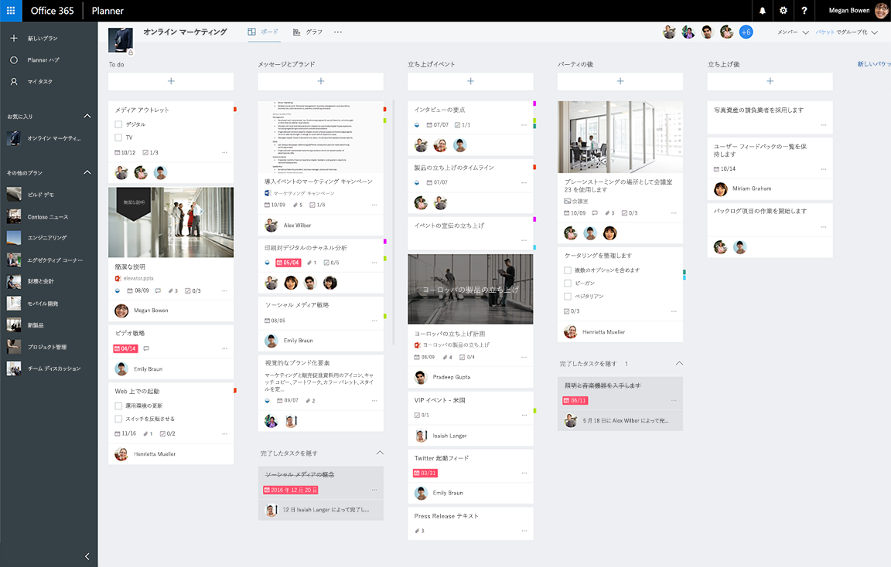

# Planner のタスクおよびプラン API の概要Planner tasks and plans API overview
Planner は、チームが作業を組織するためのシンプルかつビジュアルな手段を提供します。Planner provides a simple and visual way for teams to organize their work. 顧客は Planner を使用することにより、プランを作成したり、タスクを組織して割り当てたり、進捗状況を共有したり、コンテンツに対して共同作業をしたりできます。Customers can use Planner to create plans, organize and assign tasks, share progress, and collaborate on content.  Planner は、タスク ボード、グラフ ページ、スケジュール ビューなどのインタラクティブなエクスペリエンスを提供し、Office 365 を通じた機能統合を実現します。Planner provides several interactive experiences including a task board, a charts page, and a schedule view, as well as integrations throughout Office 365.

**Office 365 Planner タスク ボード****Office 365 Planner task board**

## Planner タスクを統合する理由Why integrate with Planner tasks?
Planner は、Office 365 でのコラボレーション エクスペリエンスのためのタスク追跡機能を提供します。Planner provides task tracking capabilities for collaboration experiences in Office 365. エンド ユーザーのチームやグループのためのタスク追跡機能や作業を組織する機能が必要な場合、Planner が最適です。If your scenarios require tracking tasks and organizing work for a team or group of end users, Planner is the right service for you. Planner 統合は、Office 365 でコラボレーションする何百万というユーザーに達するのに役立ちます。Planner integration can help you reach the millions of users collaborating on Office 365. 

### チームの作業を組織するOrganize your team’s work
Planner は、チームを立ち上げ、[タスクを作成し](/graph/api/planner-post-tasks?view=graph-rest-1.0)、それをチームの他のメンバーに割り当てるための共有スペースを提供します。Planner provides a shared space where you can build a team, [create tasks](/graph/api/planner-post-tasks?view=graph-rest-1.0), and assign them to others on the team. Planner を利用すれば、誰が何をしているのかを容易に把握でき、順調に事が進んでいるかどうかを確認できます。期限、進捗状況、説明などの追加情報によりタスクを更新し、カスタマイズ可能なバケットとカテゴリ ラベルによりタスクを詳細に組織することができます。Planner makes it easy for everyone to know who’s doing what and if things are on track. You can update tasks with additional information like due dates, progress, and descriptions, and then further organize tasks with customizable buckets and category labels.   

### Office 365 を通じた共同作業Collaborate across Office 365
Planner は、Office 365 を通じてコラボレーション エクスペリエンスに統合されています。Planner integrates into collaboration experiences across Office 365. Planner の Web およびモバイル クライアントに加えて、ユーザーは Planner のプランやタスクを SharePoint および Microsoft Teams から表示したり更新したりできます。In addition to Planner web and mobile clients, users can view and update Planner plans and tasks from within SharePoint and Microsoft Teams.  

Planner 自体でも Microsoft Graph および Office 365 のグループ サービスが利用されています。Planner itself is also powered by the Microsoft Graph and the Office 365 group service. アップロードして Planner タスクに添付するファイルは、SharePoint に保存されます。Files that you upload and attach to Planner tasks are stored in SharePoint. Planner のコメントは、Outlook のグループ会話に基づいています。Planner comments are based on Outlook group conversations.

<!-- Add image
Note: Put an image here showing the relationship between Planner and other things
-->

### プランおよびタスクの作成の自動化Automate the creation of plans and tasks
繰り返されるプロセスやプロジェクト タイプの作業をしていますか。Are you working on repeated process or project type? Planner API を使用することにより、プランやタスク リストの作成を自動化できます。You can use the Planner API to automate the creation of a plan and a list of tasks.  
 
## Planner API のトップ タスクTop Planner API tasks

|操作Operation|URLURL|
|:--------|:--|
|グループの[プラン](/graph/api/resources/plannerplan?view=graph-rest-beta)をすべて表示See all the [plans](/graph/api/resources/plannerplan?view=graph-rest-beta) for a group|GET [https://graph.microsoft.com/v1.0/groups/{id}/planner/plans](https://developer.microsoft.com/graph/graph-explorer?request=groups/{id}/planner/plans&version=v1.0)GET [https://graph.microsoft.com/v1.0/groups/{id}/planner/plans](https://developer.microsoft.com/graph/graph-explorer?request=groups/{id}/planner/plans&version=v1.0)|
|プラン内の[タスク](/graph/api/resources/plannertask?view=graph-rest-beta)を表示See [tasks](/graph/api/resources/plannertask?view=graph-rest-beta) in a plan|GET [https://graph.microsoft.com/v1.0/planner/plans/{id}/tasks](https://developer.microsoft.com/graph/graph-explorer?request=planner/plans/{id}/tasks&version=v1.0)GET [https://graph.microsoft.com/v1.0/planner/plans/{id}/tasks](https://developer.microsoft.com/graph/graph-explorer?request=planner/plans/{id}/tasks&version=v1.0)|
|複数のプランを通じて自分に割り当てられている[マイ タスク](/graph/api/planneruser-list-tasks?view=graph-rest-beta)をすべて表示See all [my tasks](/graph/api/planneruser-list-tasks?view=graph-rest-beta) assigned to me across plans|GET [https://graph.microsoft.com/v1.0/me/planner/tasks/](https://developer.microsoft.com/graph/graph-explorer?request=me/planner/tasks/&version=v1.0)GET [https://graph.microsoft.com/v1.0/me/planner/tasks/](https://developer.microsoft.com/graph/graph-explorer?request=me/planner/tasks/&version=v1.0)|
|[新しいタスクを作成Create a new task](/graph/api/planner-post-tasks?view=graph-rest-1.0)|POST [https://graph.microsoft.com/v1.0/planner/tasks](https://developer.microsoft.com/graph/graph-explorer?request=groups/{id}/planner/plans&version=v1.0)POST [https://graph.microsoft.com/v1.0/planner/tasks](https://developer.microsoft.com/graph/graph-explorer?request=groups/{id}/planner/plans&version=v1.0)|
|[タスクを更新Update a task](/graph/api/plannertask-update?view=graph-rest-1.0)|PATCH [https://graph.microsoft.com/v1.0/planner/tasks/{task-id}](https://developer.microsoft.com/graph/graph-explorer?request=groups/{id}/planner/plans&version=v1.0)PATCH [https://graph.microsoft.com/v1.0/planner/tasks/{task-id}](https://developer.microsoft.com/graph/graph-explorer?request=groups/{id}/planner/plans&version=v1.0)|
|[タスクを削除Delete a task](/graph/api/plannertask-delete?view=graph-rest-1.0)|DELETE [https://graph.microsoft.com/v1.0/planner/tasks/{id}](https://developer.microsoft.com/graph/graph-explorer?request=groups/{id}/planner/plans&version=v1.0)DELETE [https://graph.microsoft.com/v1.0/planner/tasks/{id}](https://developer.microsoft.com/graph/graph-explorer?request=groups/{id}/planner/plans&version=v1.0)|

## API リファレンスAPI reference
このサービスの API リファレンスをお探しですか?Looking for the API reference for this service?

- [Microsoft Graph v1.0 の Planner APIPlanner API in Microsoft Graph v1.0](/graph/api/resources/planner-overview?view=graph-rest-1.0)
- [Microsoft Graph ベータ版の Planner APIPlanner API in Microsoft Graph beta](/graph/api/resources/planner-overview?view=graph-rest-beta)

## 次のステップNext steps

- [Planner API を使用するUse the Planner API](/graph/api/resources/planner-overview?view=graph-rest-1.0)
- [プランを操作するWork with plans](/graph/api/resources/planner-overview?view=graph-rest-1.0#plans)
- [タスクを操作するWork with tasks](/graph/api/resources/planner-overview?view=graph-rest-1.0#tasks)
