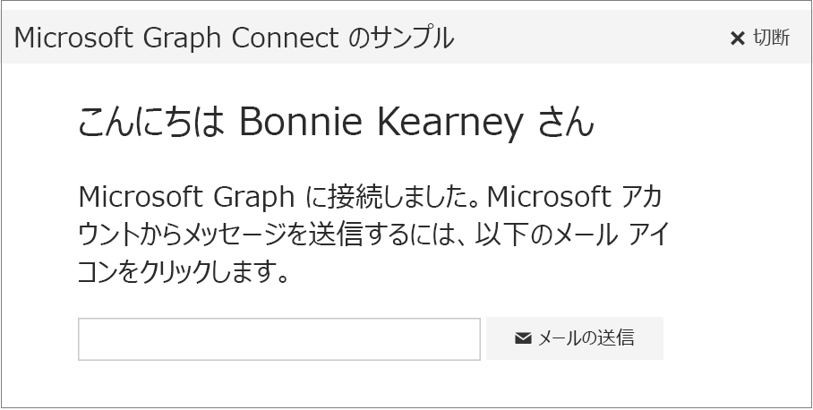

# <a name="get-started-with-microsoft-graph-in-a-ruby-on-rails-app"></a><span data-ttu-id="08773-101">Ruby on Rails アプリで Microsoft Graph を使ってみる</span><span class="sxs-lookup"><span data-stu-id="08773-101">Get started with Microsoft Graph in a Ruby on Rails app</span></span>

<span data-ttu-id="08773-p101">この記事では、Azure AD v2.0 エンドポイントからアクセス トークンを取得し、Microsoft Graph を呼び出すために必要なタスクについて説明します。ここでは、[Microsoft Graph Ruby on Rails Connect のサンプル](https://github.com/microsoftgraph/ruby-connect-rest-sample)を構築する手順と、Microsoft Graph を使用するために実装する主要な概念について説明します。また、直接 REST 呼び出しを使用して Microsoft Graph にアクセスする方法についても説明します。</span><span class="sxs-lookup"><span data-stu-id="08773-p101">This article describes the tasks required to get an access token from the Azure AD v2.0 endpoint and call Microsoft Graph. It walks you through building the [Microsoft Graph Ruby on Rails Connect Sample](https://github.com/microsoftgraph/ruby-connect-rest-sample) and explains the main concepts that you implement to use the Microsoft Graph. The article also describes how to access Microsoft Graph by using direct REST calls.</span></span>

<span data-ttu-id="08773-105">Azure AD エンドポイントを使用するバージョンの Connect サンプルをダウンロードするには、「[Microsoft Graph Ruby on Rails Connect サンプル](https://github.com/microsoftgraph/ruby-connect-rest-sample/tree/last_v1_auth)」を参照してください。</span><span class="sxs-lookup"><span data-stu-id="08773-105">To download a version of the Connect sample that uses the Azure AD endpoint, see [Microsoft Graph Ruby on Rails Connect Sample](https://github.com/microsoftgraph/ruby-connect-rest-sample/tree/last_v1_auth).</span></span>

<span data-ttu-id="08773-106">次の画像は、作成するアプリを示しています。</span><span class="sxs-lookup"><span data-stu-id="08773-106">The following image shows the app you'll create.</span></span> 



<span data-ttu-id="08773-p102">**アプリを作成してみたくありませんか。**[Microsoft Graph クイック スタート](https://graph.microsoft.io/en-us/getting-started)を使用してすぐに使い始めるか、またはこの記事で取り扱っている [Ruby REST Connect サンプル](https://github.com/microsoftgraph/ruby-connect-rest-sample)をダウンロードしてください。</span><span class="sxs-lookup"><span data-stu-id="08773-p102">**Don't feel like building an app?** Use the [Microsoft Graph quick start](https://graph.microsoft.io/en-us/getting-started) to get up and running fast, or download the [Ruby REST Connect sample](https://github.com/microsoftgraph/ruby-connect-rest-sample) that this article is based on.</span></span>


## <a name="prerequisites"></a><span data-ttu-id="08773-110">前提条件</span><span class="sxs-lookup"><span data-stu-id="08773-110">Prerequisites</span></span>

<span data-ttu-id="08773-111">開始するには、次のものが必要です。</span><span class="sxs-lookup"><span data-stu-id="08773-111">To get started, you'll need:</span></span> 

- <span data-ttu-id="08773-112">開発サーバー上でサンプルを実行する Ruby 2.1。</span><span class="sxs-lookup"><span data-stu-id="08773-112">Ruby 2.1 to run the sample on a development server.</span></span>
- <span data-ttu-id="08773-113">Rails フレームワーク (このサンプルは Rails 4.2 でテストされています)。</span><span class="sxs-lookup"><span data-stu-id="08773-113">Rails framework (the sample has been tested on Rails 4.2).</span></span>
- <span data-ttu-id="08773-114">Bundler 依存関係マネージャー。</span><span class="sxs-lookup"><span data-stu-id="08773-114">Bundler dependency manager.</span></span>
- <span data-ttu-id="08773-115">Ruby 用の Rack Web サーバー インターフェイス。</span><span class="sxs-lookup"><span data-stu-id="08773-115">Rack web server interface for Ruby.</span></span>
- <span data-ttu-id="08773-116">[Microsoft アカウント](https://www.outlook.com/)か[職場または学校アカウント](https://docs.microsoft.com/en-us/office/developer-program/office-365-developer-program-faq#account-types)</span><span class="sxs-lookup"><span data-stu-id="08773-116">A [Microsoft account](https://www.outlook.com/) or a [work or school account](https://docs.microsoft.com/en-us/office/developer-program/office-365-developer-program-faq#account-types)</span></span>
- <span data-ttu-id="08773-p103">Ruby on Rails 用の Microsoft Graph Connect スターター プロジェクト。[Microsoft Graph Ruby on Rails Connect サンプル](https://github.com/microsoftgraph/ruby-connect-rest-sample)をダウンロードします。スタート プロジェクトはスターター フォルダー内にあります。__</span><span class="sxs-lookup"><span data-stu-id="08773-p103">The Microsoft Graph Connect Starter Project for Ruby on Rails. Download the [Microsoft Graph Ruby on Rails Connect Sample](https://github.com/microsoftgraph/ruby-connect-rest-sample). The starter project is located in the _starter_ folder.</span></span>


## <a name="register-the-application"></a><span data-ttu-id="08773-120">アプリケーションの登録</span><span class="sxs-lookup"><span data-stu-id="08773-120">Register the application</span></span>

<span data-ttu-id="08773-p104">Microsoft アプリケーション登録ポータルでアプリケーションを登録します。これにより、アプリの認証構成に使用するアプリ ID とシークレットが生成されます。</span><span class="sxs-lookup"><span data-stu-id="08773-p104">Register an app on the Microsoft App Registration Portal. This generates the app ID and secret that you'll use to configure the app for authentication.</span></span>

1. <span data-ttu-id="08773-123">個人用アカウント、あるいは職場または学校アカウントのいずれかを使用して、[Microsoft アプリ登録ポータル](https://apps.dev.microsoft.com/)にサインインします。</span><span class="sxs-lookup"><span data-stu-id="08773-123">Sign into the [Microsoft App Registration Portal](https://apps.dev.microsoft.com/) using either your personal or work or school account.</span></span>

2. <span data-ttu-id="08773-124">**[アプリの追加]** を選択します。</span><span class="sxs-lookup"><span data-stu-id="08773-124">Choose **Add an app**.</span></span>

3. <span data-ttu-id="08773-125">アプリの名前を入力して、**[アプリケーションの作成]** を選択します。</span><span class="sxs-lookup"><span data-stu-id="08773-125">Enter a name for the app, and choose **Create application**.</span></span>

    <span data-ttu-id="08773-126">登録ページが表示され、アプリのプロパティが一覧表示されます。</span><span class="sxs-lookup"><span data-stu-id="08773-126">The registration page displays, listing the properties of your app.</span></span>

4. <span data-ttu-id="08773-p105">アプリケーション ID をコピーします。これは、アプリの一意識別子です。</span><span class="sxs-lookup"><span data-stu-id="08773-p105">Copy the application ID. This is the unique identifier for your app.</span></span>

5. <span data-ttu-id="08773-p106">**[アプリケーション シークレット]** で、**[新しいパスワードを生成する]** を選択します。**[新しいパスワードが生成されました]** ダイアログからアプリ シークレットをコピーします。</span><span class="sxs-lookup"><span data-stu-id="08773-p106">Under **Application Secrets**, choose **Generate New Password**. Copy the app secret from the **New password generated** dialog.</span></span>

    <span data-ttu-id="08773-131">アプリを構成するには、アプリケーション ID とアプリ シークレットを使用します。</span><span class="sxs-lookup"><span data-stu-id="08773-131">You'll use the application ID and app secret to configure the app.</span></span>

6. <span data-ttu-id="08773-132">**[プラットフォーム]** で、**[プラットフォームの追加]** > **[Web]** の順に選択します。</span><span class="sxs-lookup"><span data-stu-id="08773-132">Under **Platforms**, choose **Add platform** > **Web**.</span></span>

7. <span data-ttu-id="08773-133">**[暗黙的フローを許可する]** のチェック ボックスが選択されていることを確認して、リダイレクト URI として *http://localhost:3000/auth/microsoft_v2_auth/callback* を入力します。</span><span class="sxs-lookup"><span data-stu-id="08773-133">Make sure the **Allow Implicit Flow** check box is selected, and enter *http://localhost:3000/auth/microsoft_v2_auth/callback* as the Redirect URI.</span></span>

    <span data-ttu-id="08773-p107">[暗黙的フローを許可する] オプションにより、OpenID Connect ハイブリッド フローが有効になります。これにより、認証時にアプリはサインイン情報 (id_token) と成果物 (この場合は認証コード) の両方を受け取れるようになり、アプリはアクセス トークンを取得するときにこれらを使用できます。</span><span class="sxs-lookup"><span data-stu-id="08773-p107">The Allow Implicit Flow option enables the OpenID Connect hybrid flow. During authentication, this enables the app to receive both sign-in info (the id_token) and artifacts (in this case, an authorization code) that the app uses to obtain an access token.</span></span>

    <span data-ttu-id="08773-136">リダイレクト URI *http://localhost:3000/auth/microsoft_v2_auth/callback* は、認証要求が処理されたときに OmniAuth ミドルウェアが使用するように構成される値です。</span><span class="sxs-lookup"><span data-stu-id="08773-136">The redirect URI *http://localhost:3000/auth/microsoft_v2_auth/callback* is the value that the OmniAuth middleware is configured to use once it has processed the authentication request.</span></span>

8. <span data-ttu-id="08773-137">**[保存]** を選択します。</span><span class="sxs-lookup"><span data-stu-id="08773-137">Choose **Save**.</span></span>

## <a name="configure-the-project"></a><span data-ttu-id="08773-138">プロジェクトを構成する</span><span class="sxs-lookup"><span data-stu-id="08773-138">Configure the project</span></span>

1. <span data-ttu-id="08773-p108">[Microsoft Graph Ruby on Rails Connect サンプル](https://github.com/microsoftgraph/ruby-connect-rest-sample)をダウンロードするか、複製を作成します。任意のエディターで、スターター フォルダーを開きます。__</span><span class="sxs-lookup"><span data-stu-id="08773-p108">Download or clone the [Microsoft Graph Ruby on Rails Connect Sample](https://github.com/microsoftgraph/ruby-connect-rest-sample). Open the _starter_ folder in the editor of your choice.</span></span>
1. <span data-ttu-id="08773-141">Bundler と Rack がない場合は、次のコマンドでインストールできます。</span><span class="sxs-lookup"><span data-stu-id="08773-141">If you don't already have bundler and rack, you can install them with the following command.</span></span>

    ```
    gem install bundler rack
    ```
2. <span data-ttu-id="08773-142">config/environment.rb ファイルで、次を実行します。</span><span class="sxs-lookup"><span data-stu-id="08773-142">In the config/environment.rb file, do the following:</span></span>
    - <span data-ttu-id="08773-143">*ENTER_YOUR_CLIENT_ID* を登録済みのアプリケーションのクライアント ID と置き換えます。</span><span class="sxs-lookup"><span data-stu-id="08773-143">Replace *ENTER_YOUR_CLIENT_ID* with the client ID of your registered  application.</span></span>
    - <span data-ttu-id="08773-144">*ENTER_YOUR_SECRET* を登録済みのアプリケーションのキーと置き換えます。</span><span class="sxs-lookup"><span data-stu-id="08773-144">Replace *ENTER_YOUR_SECRET* with the key of your registered application.</span></span>

3. <span data-ttu-id="08773-145">次のコマンドを使って、Rails アプリケーションと依存関係をインストールします。</span><span class="sxs-lookup"><span data-stu-id="08773-145">Install the Rails application and dependencies with the following command.</span></span>

    ```
    bundle install
    ```

## <a name="authenticate-the-user-and-get-an-access-token"></a><span data-ttu-id="08773-146">ユーザーの認証とアクセス トークンの取得</span><span class="sxs-lookup"><span data-stu-id="08773-146">Authenticate the user and get an access token</span></span>

<span data-ttu-id="08773-p109">このアプリは、委任されたユーザー ID で認証コードの付与フローを使用します。Web アプリケーションのフローでは、登録したアプリのアプリケーション ID、シークレット、およびリダイレクト URI が必要です。</span><span class="sxs-lookup"><span data-stu-id="08773-p109">This app uses the authorization code grant flow with a delegated user identity. For a web application, the flow requires the application ID, secret, and redirect URI from the registered app.</span></span> 

<span data-ttu-id="08773-149">認証フローは、以下の基本的な手順に分けることができます。</span><span class="sxs-lookup"><span data-stu-id="08773-149">The auth flow can be broken down into these basic steps:</span></span>

1. <span data-ttu-id="08773-150">認証と同意のためにユーザーをリダイレクトする</span><span class="sxs-lookup"><span data-stu-id="08773-150">Redirect the user for authentication and consent</span></span>
2. <span data-ttu-id="08773-151">認証コードを取得する</span><span class="sxs-lookup"><span data-stu-id="08773-151">Get an authorization code</span></span>
3. <span data-ttu-id="08773-152">認証コードをアクセス トークンに交換する</span><span class="sxs-lookup"><span data-stu-id="08773-152">Redeem the authorization code for an access token</span></span>

><span data-ttu-id="08773-153">この認証フローの詳細については、Azure AD のドキュメントにある「[Web アプリケーション対 Web API](https://azure.microsoft.com/en-us/documentation/articles/active-directory-authentication-scenarios/#web-application-to-web-api)」および「[OpenID Connect を使用した Microsoft ID と Microsoft Graph の Web アプリケーションへの統合](https://azure.microsoft.com/en-us/documentation/samples/active-directory-dotnet-webapp-openidconnect-v2/)」を参照してください。</span><span class="sxs-lookup"><span data-stu-id="08773-153">For more information about this auth flow, see [Web application to web API](https://azure.microsoft.com/en-us/documentation/articles/active-directory-authentication-scenarios/#web-application-to-web-api) and  [Integrate Microsoft identity and the Microsoft Graph into a web application using OpenID Connect](https://azure.microsoft.com/en-us/documentation/samples/active-directory-dotnet-webapp-openidconnect-v2/) in the Azure AD documentation.</span></span>

<span data-ttu-id="08773-154">[Rack](http://rack.github.io/) ミドルウェアの積み重ねられた 3 つのピースを使用して、アプリが Microsoft Graph に対して認証できるようにします。</span><span class="sxs-lookup"><span data-stu-id="08773-154">We'll be using a stack of three pieces of [Rack](http://rack.github.io/) middleware to enable the app to authenticate against the Microsoft Graph:</span></span>

- <span data-ttu-id="08773-155">[OmniAuth](https://rubygems.org/gems/omniauth): 複数プロバイダー認証用の汎用 Rack フレームワーク。</span><span class="sxs-lookup"><span data-stu-id="08773-155">[OmniAuth](https://rubygems.org/gems/omniauth), a generalized Rack framework for multiple-provider authentication.</span></span>
- <span data-ttu-id="08773-156">[Omniauth oauth2](https://rubygems.org/gems/omniauth-oauth2): OmniAuth 用の抽象的な OAuth2 戦略。</span><span class="sxs-lookup"><span data-stu-id="08773-156">[Omniauth-oauth2](https://rubygems.org/gems/omniauth-oauth2), an abstract OAuth2 strategy for OmniAuth.</span></span> 
- <span data-ttu-id="08773-p110">omniauth-microsoft_v2_auth: 特に Azure AD v2.0 エンドポイントに対する認証を提供するために Omniauth-oauth2 をカスタマイズする OmniAuth 戦略。このプロジェクトにはコード サンプルが含まれます。</span><span class="sxs-lookup"><span data-stu-id="08773-p110">omniauth-microsoft_v2_auth, an OmniAuth strategy that customizes Omniauth-oauth2 to specifically provide authentication against the Azure AD v2.0 endpoint. This project is included in the code sample.</span></span>

### <a name="specify-gem-dependencies-for-authentication"></a><span data-ttu-id="08773-159">認証に対して gem 依存関係を指定します。</span><span class="sxs-lookup"><span data-stu-id="08773-159">Specify gem dependencies for authentication</span></span>

<span data-ttu-id="08773-160">Gemfile では、次の gem のコメントを解除して、依存関係として追加します。</span><span class="sxs-lookup"><span data-stu-id="08773-160">In Gemfile, uncomment the following gems to add them as dependencies.</span></span>

    ```
    gem 'omniauth'
    gem 'omniauth-oauth2'
    gem 'omniauth-microsoft_v2_auth', path: './omniauth-microsoft_v2_auth'
    ```

<span data-ttu-id="08773-161">はアプリ プロジェクトに含まれ、指定したパスからインストールされることに注意してください。`omniauth-microsoft_v2_auth`</span><span class="sxs-lookup"><span data-stu-id="08773-161">Note that `omniauth-microsoft_v2_auth` is included in the app project, and will be installed from the path specified.</span></span> 

### <a name="configure-the-authentication-middleware"></a><span data-ttu-id="08773-162">アプリケーション ミドルウェアを構成する</span><span class="sxs-lookup"><span data-stu-id="08773-162">Configure the authentication middleware</span></span>

<span data-ttu-id="08773-163">で、次の行のコメントを解除します。`config/initializers/omniauth-microsoft_v2_auth.rb`</span><span class="sxs-lookup"><span data-stu-id="08773-163">In `config/initializers/omniauth-microsoft_v2_auth.rb`, uncomment the following lines.</span></span>

    ```
    Rails.application.config.middleware.use OmniAuth::Builder do
      provider :microsoft_v2_auth,
      ENV['CLIENT_ID'],
      ENV['CLIENT_SECRET'],
      :scope => ENV['SCOPE']
    end
    ```
<span data-ttu-id="08773-p111">これにより、使用するアプリ ID とアプリ シークレットの指定、またユーザーの要求範囲など、OmniAuth ミドルウェアが構成されます。これらは `config/environment.rb` で以前指定した値です。</span><span class="sxs-lookup"><span data-stu-id="08773-p111">This configures the OmniAuth middleware, including specifying the app ID and app secret to use, as well as the scopes to request for the user. These are the values you specified earlier in `config/environment.rb`.</span></span>

### <a name="specify-routes-for-authentication"></a><span data-ttu-id="08773-166">認証のルートを指定する</span><span class="sxs-lookup"><span data-stu-id="08773-166">Specify routes for authentication</span></span>

<span data-ttu-id="08773-p112">ここで、認証フローに必要な 2 つのルートを指定する必要があります。最初のルートは認証要求を OmniAuth ミドルウェアに転送し、2 つめのルートは認証が実行されたときに OmniAuth がリダイレクトするアプリ内の場所を指定します。</span><span class="sxs-lookup"><span data-stu-id="08773-p112">Now we need to specify two routes necessary for the authentication flow. The first route forwards the authentication request to the OmniAuth middleware, and the second specifies the location in the app to which OmniAuth should redirect once authentication has occurred.</span></span>

<span data-ttu-id="08773-169">で、次のルート ディレクティブのコメントを解除します。`config/routes.rb`</span><span class="sxs-lookup"><span data-stu-id="08773-169">In `config/routes.rb`, uncomment the following route directive.</span></span>

    get '/login', to: 'pages#login'

<span data-ttu-id="08773-170">これにより、ログイン要求がページ コントローラーの `login` メソッドに転送され、さらに要求が omniauth-microsoft_v2_auth  ミドルウェアにリダイレクトされます。</span><span class="sxs-lookup"><span data-stu-id="08773-170">This directs login requests to the pages controller's `login` method, which in turn redirects the request to the omniauth-microsoft_v2_auth middleware.</span></span>

    def login
        redirect_to '/auth/microsoft_v2_auth'
    end

<span data-ttu-id="08773-p113">次に、認証が実行されたときに OmniAuth がリダイレクトするアプリ内の場所を指定する必要があります。次のルートのコメントを解除します。</span><span class="sxs-lookup"><span data-stu-id="08773-p113">Next, we need to specify where in the app OmniAuth should redirect once authentication has occurred. Uncomment the following route.</span></span>

    match '/auth/:provider/callback', to: 'pages#callback', via: [:get, :post]

<span data-ttu-id="08773-173">OmniAuth がユーザーの認証を完了すると、アプリ登録で指定したダイレクト URL を呼び出します。この例では、*http://localhost:3000/auth/microsoft_v2_auth/callback* です。</span><span class="sxs-lookup"><span data-stu-id="08773-173">When OmniAuth has finished authenticating the user, it calls the redirect URL specified in the app registration; in this case, *http://localhost:3000/auth/microsoft_v2_auth/callback*.</span></span> <span data-ttu-id="08773-174">上記のルート パターンはその URL に一致するので、要求はページ コントローラーの `callback` メソッドにルーティングされます。</span><span class="sxs-lookup"><span data-stu-id="08773-174">The route pattern above matches that URL and so routes the request to the page controller's `callback` method.</span></span>

### <a name="get-an-access-token"></a><span data-ttu-id="08773-175">アクセス トークンを取得する</span><span class="sxs-lookup"><span data-stu-id="08773-175">Get an access token</span></span>

<span data-ttu-id="08773-176">次に、認証プロセスを実際に開始し、ユーザーが正常にサインインするとアクセス トークンを取得するコードを追加します。</span><span class="sxs-lookup"><span data-stu-id="08773-176">Next, we'll add the code that actually starts the authentication process, and retrieves the access token once the user has successfully signed in.</span></span>

<span data-ttu-id="08773-p115">サイト ルートのビューである、`app/views/pages/index.html.erb` を確認してください。ビューには、ユーザーがサインインできるようにする 1 つのボタンが含まれています。</span><span class="sxs-lookup"><span data-stu-id="08773-p115">Take a look at `app/views/pages/index.html.erb`, the view for the site root. The view includes a single button, which enables users to sign in.</span></span>

    <button class="ms-Button" onclick="window.location.href = '/login'">
        <span class="ms-Button-label"><%= t('connect_button') %></span>
    </button>

<span data-ttu-id="08773-p116">前述のように、ログイン メソッドにより OmniAuth ミドルウェアにリダイレクトされます。このミドルウェアは、アプリ ID とアプリ シークレットに加えて、ユーザーの要求範囲で構成されています。ユーザーが正常に認証されると、OmniAuth は、アクセス トークンと他のユーザー情報と一緒にハッシュをアプリに返します。</span><span class="sxs-lookup"><span data-stu-id="08773-p116">As shown earlier, the login method redirects to the OmniAuth middleware, which has been configured with the app ID and app secret, as well as the scopes to request for the user. Once the user is successfully authenticated, OmniAuth returns a hash with the access token and other user information to the app.</span></span>

<span data-ttu-id="08773-181">それでは、OmniAuth コールバックを処理するコードを追加して、そのハッシュから情報を取得しましょう。</span><span class="sxs-lookup"><span data-stu-id="08773-181">Now let's add code to handle the OmniAuth callback, and retrieve information from that hash.</span></span> 

<span data-ttu-id="08773-182">で、空の `callback` メソッドを次のコードに置き換えます。`app/controllers/pages_controller.rb`</span><span class="sxs-lookup"><span data-stu-id="08773-182">In `app/controllers/pages_controller.rb`, replace the empty `callback` method with the following code.</span></span>

    ```
    def callback
        # Access the authentication hash for omniauth
        # and extract the auth token, user name, and email
        data = request.env['omniauth.auth']
    
        @email = data[:extra][:raw_info][:userPrincipalName]
        @name = data[:extra][:raw_info][:displayName]

        # Associate token/user values to the session
        session[:access_token] = data['credentials']['token']
        session[:name] = @name
        session[:email] = @email
        
        # Debug logging
        logger.info "Name: #{@name}"
        logger.info "Email: #{@email}"
        logger.info "[callback] - Access token: #{session[:access_token]}"
    end

    ```

<span data-ttu-id="08773-183">このメソッドは認証ハッシュを取得し、現在のセッションのアクセス トークン、ユーザー名、および電子メールを保存します。</span><span class="sxs-lookup"><span data-stu-id="08773-183">This method retrieves the authentication hash, and then stores the access token, user name, and email in the current session.</span></span>

> <span data-ttu-id="08773-p117">**注:** このプロジェクトでの簡易認証とトークンの処理は例示のみを目的として示されています。運用アプリでは、セキュリティで保護されたトークンの処理およびトークンの更新など、認証を処理するためのより信頼性の高い方法を構築する可能性があります。</span><span class="sxs-lookup"><span data-stu-id="08773-p117">**Note:** The simple authentication  and token handling in this project is presented for illustrative purposes only. In a production app, you would likely construct a more robust way of handling authentication, including secure token handling and token refresh.</span></span>

## <a name="call-microsoft-graph"></a><span data-ttu-id="08773-186">Microsoft Graph を呼び出す</span><span class="sxs-lookup"><span data-stu-id="08773-186">Call Microsoft Graph</span></span>

<span data-ttu-id="08773-187">これで、Microsoft Graph を呼び出すためのコードを追加する準備が整いました。</span><span class="sxs-lookup"><span data-stu-id="08773-187">Now you're ready to add code to call Microsoft Graph.</span></span> 

<span data-ttu-id="08773-p118">メソッド (`app/views/pages/callback.html.erb`) で表示されるビューには、ボタン 1 つの簡単なフォームが含まれています。フォームは、`send_mail` に投稿するものであり、対象の受信者の電子メール アドレスである、1 つのパラメーターが含まれています。`callback`</span><span class="sxs-lookup"><span data-stu-id="08773-p118">The view rendered by the `callback` method (`app/views/pages/callback.html.erb`) includes a simple form with a single button. The form posts to  `send_mail`, and includes a single parameter, the email address of the intended recipient.</span></span>
    
    ``` 
    <form action="../../send_mail" method="post">
      <div class="ms-Grid-col ms-u-mdPush1 ms-u-md9 ms-u-lgPush1 ms-u-lg6">
        ...
            <div class="ms-TextField">
               <input class="ms-TextField-field" name="specified_email" value="<%= @email %>">
            </div>
            <button class="ms-Button">
            <span class="ms-Button-label"><i class="ms-Icon ms-Icon--mail" aria-hidden="true"></i><%= t('send_mail_button') %></span>
            </button> 
        ...
    ```

<span data-ttu-id="08773-190">で、空の `send_mail` メソッドを次のコードに置き換えます。`app/controllers/pages_controller.rb`</span><span class="sxs-lookup"><span data-stu-id="08773-190">In `app/controllers/pages_controller.rb`, replace the empty `send_mail` method with the following code.</span></span>

    ```
    def send_mail
        logger.debug "[send_mail] - Access token: #{session[:access_token]}"
        
        # Used in the template
        @name = session[:name]
        @email = params[:specified_email]
        @recipient = params[:specified_email]
        @mail_sent = false
        
        send_mail_endpoint = URI("#{GRAPH_RESOURCE}#{SENDMAIL_ENDPOINT}")
        content_type = CONTENT_TYPE
        http = Net::HTTP.new(send_mail_endpoint.host, send_mail_endpoint.port)
        http.use_ssl = true
        
        # If you want to use a sniffer tool, like Fiddler, to see the request
        # you might need to add this line to tell the engine not to verify the
        # certificate or you might see a "certificate verify failed" error
        # http.verify_mode = OpenSSL::SSL::VERIFY_NONE
        
        email_body = File.read('app/assets/MailTemplate.html')
        email_body.sub! '{given_name}', @name
        email_subject = t('email_subject')
        
        logger.debug email_body
    
        email_message = "{
            Message: {
            Subject: '#{email_subject}',
            Body: {
                ContentType: 'HTML',
                Content: '#{email_body}'
            },
            ToRecipients: [
                {
                    EmailAddress: {
                        Address: '#{@recipient}'
                    }
                }
            ]
            },
            SaveToSentItems: true
            }"
            
        response = http.post(
            SENDMAIL_ENDPOINT,
            email_message,
            'Authorization' => "Bearer #{session[:access_token]}",
            'Content-Type' => content_type
        )
        
        logger.debug "Code: #{response.code}"
        logger.debug "Message: #{response.message}"
        
        # The send mail endpoint returns a 202 - Accepted code on success
        if response.code == '202'
            @mail_sent = true
        else
            @mail_sent = false
            flash[:httpError] = "#{response.code} - #{response.message}"
        end
        
        render 'callback'
    end
    ```

<span data-ttu-id="08773-191">このコードは HTTP 要求を作成して、電子メールの書式を設定し、電子メールを送信する Microsoft Graph を呼び出します。</span><span class="sxs-lookup"><span data-stu-id="08773-191">This code constructs the HTTP request, formats the email, and then calls Microsoft Graph to send the email.</span></span>

<span data-ttu-id="08773-p119">電子メールを作成するために、コードはセッション トークンからユーザー名と、フォームから渡されたパラメーターから受信者の電子メール アドレスを取得します。次に、コードはプロジェクトに含まれるテンプレートから電子メールの本文を読み取り、ユーザー名と電子メール アドレスを補間し、HTTP 要求の本文として電子メールのテキストを添付します。</span><span class="sxs-lookup"><span data-stu-id="08773-p119">To create the email, the code pulls the user name from the session token and the recipient email address from the parameters passed from the form. The code then reads the email body from a template included in the project, interpolates the user name and email address, and attaches the email text as the HTTP request body.</span></span>

<span data-ttu-id="08773-194">電子メールを送信するために、コードは HTTP 要求を作成し、認証ヘッダーとしてアクセス トークンを添付し、電子メール送信のエンドポイントに要求を投稿します。</span><span class="sxs-lookup"><span data-stu-id="08773-194">To send the email, the code constructs the HTTP request, attaches the access token as an authorization header, and then posts the request to the send email endpoint.</span></span>

<span data-ttu-id="08773-195">最後に、コードは電子メールが成功したかどうかをユーザーに通知するために返される HTTP 応答コードを使用します。</span><span class="sxs-lookup"><span data-stu-id="08773-195">Finally, the code uses the HTTP response code returned to notify the user whether or not the email was successful.</span></span>

## <a name="run-the-app"></a><span data-ttu-id="08773-196">アプリの実行</span><span class="sxs-lookup"><span data-stu-id="08773-196">Run the app</span></span>

1. <span data-ttu-id="08773-197">次のコマンドを使って、Rails アプリケーションと依存関係をインストールします。</span><span class="sxs-lookup"><span data-stu-id="08773-197">Install the Rails application and dependencies with the following command.</span></span>

    ```
    bundle install
    ```
2. <span data-ttu-id="08773-198">Rails アプリケーションを起動するには、次のコマンドを入力します。</span><span class="sxs-lookup"><span data-stu-id="08773-198">To start the Rails application, type the following command.</span></span>

    ```
    rackup -p 3000
    ```
3. <span data-ttu-id="08773-199">Web ブラウザーで `http://localhost:3000` にアクセスします。</span><span class="sxs-lookup"><span data-stu-id="08773-199">Go to `http://localhost:3000` in your web browser.</span></span>

## <a name="see-also"></a><span data-ttu-id="08773-200">関連項目</span><span class="sxs-lookup"><span data-stu-id="08773-200">See also</span></span>
- <span data-ttu-id="08773-201">[Graph エクスプローラー](https://developer.microsoft.com/graph/graph-explorer)を使用して REST API を試してみます。</span><span class="sxs-lookup"><span data-stu-id="08773-201">Try out the REST API using the [Graph explorer](https://developer.microsoft.com/graph/graph-explorer).</span></span>
- <span data-ttu-id="08773-202">GitHub の他の [Microsoft Graph サンプル](https://github.com/microsoftgraph)を探索します。</span><span class="sxs-lookup"><span data-stu-id="08773-202">Explore our other [Microsoft Graph samples](https://github.com/microsoftgraph) on GitHub.</span></span>


