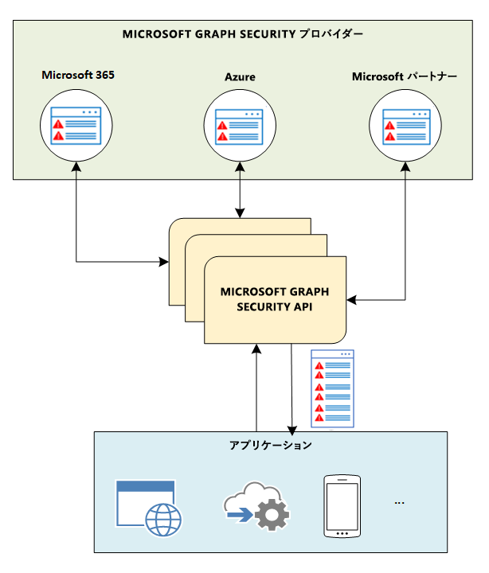

# Microsoft Graph セキュリティ API の概要Microsoft Graph Security API overview

Microsoft Graph セキュリティ API を使用して Microsoft のセキュリティ製品、サービス、パートナーに接続することで、セキュリティ運用の効率化を図り、脅威の防止、検出、対処の各機能を向上させることができます。You can use the Microsoft Graph Security API to connect Microsoft security products, services, and partners to streamline security operations and improve threat protection, detection, and response capabilities. Microsoft Graph セキュリティ API は、単一のプログラム インターフェイスで複数の [Microsoft Graph セキュリティ プロバイダー](/graph/api/resources/securityvendorinformation?view=graph-rest-1.0) (セキュリティ プロバイダーまたはプロバイダーとも呼ばれる) を接続できる中継サービス (ブローカー) です。The Microsoft Graph Security API is an intermediary service (or broker) that provides a single programmatic interface to connect multiple [Microsoft Graph Security providers](/graph/api/resources/securityvendorinformation?view=graph-rest-1.0) (also called security providers or providers). Microsoft Graph セキュリティ API に対する要求は、適用可能なすべてのセキュリティ プロバイダーにフェデレーションされます。Requests to the Microsoft Graph Security API are federated to all applicable security providers. 次の図に示すように、結果は集計され、要求元のアプリケーションに共通のスキーマで返されます。The results are aggregated and returned to the requesting application in a common schema, as shown in the following diagram. 詳細については、「[Microsoft Graph セキュリティ API のデータ フロー](security-dataflow.md)」を参照してください。For details, see [Microsoft Graph Security API data flow](security-dataflow.md).

承認については、「[承認と Microsoft Graph セキュリティ API](security-authorization.md)」を参照してください。For information about authorization, see [Authorization and the Microsoft Graph Security API](security-authorization.md). 代理アクセス許可やアプリケーションのアクセス許可などのアクセス許可については、「[アクセス許可](permissions-reference.md#security-permissions)」を参照してください。For information about permissions, including delegated and application permissions, see [Permissions](permissions-reference.md#security-permissions).

> [!VIDEO https://www.youtube-nocookie.com/embed/ZXkKjkxdrB4]

## Microsoft Graph セキュリティ API を使用する理由Why use the Microsoft Graph Security API?

[Microsoft Graph Security API](/graph/api/resources/security-api-overview?view=graph-rest-1.0) を使用すると、Microsoft とパートナーのセキュリティ ソリューションとの接続を簡単に行えるようになります。The [Microsoft Graph Security API](/graph/api/resources/security-api-overview?view=graph-rest-1.0) makes it easy to connect with security solutions from Microsoft and partners. これにより、それらのソリューションの実現がさらに容易になり、その価値も高まります。It allows you to more readily realize and enrich the value of these solutions. 要件に応じて、次のいずれかの方法を使用することにより、Microsoft Graph Security API に簡単に接続できます。You can connect easily with the Microsoft Graph Security API by using one of the following approaches, depending on your requirements:

- [コードを記述](https://aka.ms/graphsecuritysdk) – C#、Java、NodeJS などの[コード サンプル](https://aka.ms/graphsecurityapicode)を見つけます。[Write code](https://aka.ms/graphsecuritysdk) – Find [code samples](https://aka.ms/graphsecurityapicode) in C#, Java, NodeJS, and more.
- [スクリプトを使用して接続](https://aka.ms/graphsecuritypowershellsampleblog) – [PowerShell サンプル](https://aka.ms/graphsecuritypowershellsample)を見つけます。[Connect using scripts](https://aka.ms/graphsecuritypowershellsampleblog) – Find [PowerShell samples](https://aka.ms/graphsecuritypowershellsample).
- [ワークフローとプレイブックにドラッグ アンド ドロップ](https://aka.ms/graphsecurityconnectorsblogpost) – [Azure Logic Apps](https://docs.microsoft.com/azure/logic-apps/logic-apps-overview)、[Microsoft Flow](https://flow.microsoft.com/)、[PowerApps](https://powerapps.microsoft.com/) 用の [Microsoft Graph セキュリティ コネクタ](https://aka.ms/graphsecurityconnectors)を使用します。[Drag and drop into workflows and playbooks](https://aka.ms/graphsecurityconnectorsblogpost) – Use [Microsoft Graph Security connectors](https://aka.ms/graphsecurityconnectors) for [Azure Logic Apps](https://docs.microsoft.com/azure/logic-apps/logic-apps-overview), [Microsoft Flow](https://flow.microsoft.com/), and [PowerApps](https://powerapps.microsoft.com/).
- [レポートとダッシュ ボードにデータを取得する](https://aka.ms/graphsecuritypowerbiconnectorblogpost) – [Power BI 用の Microsoft Graph セキュリティ コネクタ](https://aka.ms/graphsecuritypowerbiconnectordoc)を使用します。[Get data into reports and dashboards](https://aka.ms/graphsecuritypowerbiconnectorblogpost) – Use the [Microsoft Graph Security connector for Power BI](https://aka.ms/graphsecuritypowerbiconnectordoc).
- [Jupyter ノートブックを使用して接続](https://jupyter.org/) – [Jupyter ノートブック サンプル](https://aka.ms/graphsecurityjupyternotebooks)を検索します。[Connect using Jupyter notebooks](https://jupyter.org/) – Find [Jupyter notebook samples](https://aka.ms/graphsecurityjupyternotebooks).  

### 警告追跡の統合と標準化Unify and standardize alert tracking

1 回接続すれば、Microsoft Graph 統合セキュリティ ソリューションからの警告を統合し、すべてのソリューション間で警告の状態と割り当ての同期を維持します。Connect once to integrate alerts from any Microsoft Graph-integrated security solution and keep alert status and assignments in sync across all solutions. また、[Azure Monitor](https://docs.microsoft.com/ja-JP/azure/monitoring-and-diagnostics/monitor-stream-monitoring-data-event-hubs#what-can-i-do-with-the-monitoring-data-being-sent-to-my-event-hub) を使用して、Spluk や IBM QRadar などのセキュリティ情報およびイベント管理 (SIEM) ソリューションに警告をストリーミングすることができます。You can also stream alerts to security information and event management (SIEM) solutions, such as Splunk and IBM QRadar, via [Azure Monitor](https://docs.microsoft.com/en-us/azure/monitoring-and-diagnostics/monitor-stream-monitoring-data-event-hubs#what-can-i-do-with-the-monitoring-data-being-sent-to-my-event-hub). SIEM とセキュリティ API エンティティとの統合の詳細については、「[SIEM との統合](security-siemintegration.md)」を参照してください。For details about SIEM integration with the security API entities, see [Integrate with a SIEM](security-siemintegration.md).

### セキュリティの警告を関連付け、脅威の予防と対処を向上させるCorrelate security alerts to improve threat protection and response

複数のセキュリティ ソリューション間の警告を、統合された警告スキーマに簡単に関連付けることができます。Correlate alerts across security solutions more easily with a unified alert schema. これにより、操作可能な警告情報を受け取れるだけでなく、セキュリティ アナリストがピボット分析を行い、資産やユーザーの情報で警告の質を高めることもでき、脅威への迅速な対処や資産保護を可能にします。This not only allows you to receive actionable alert information but allows security analysts to pivot and enrich alerts with asset and user information, enabling faster response to threats and asset protection.  

### 警告のタグ、状態、割り当てを更新するUpdate alert tags, status, and assignments

警告にタグ付けしてコンテキストや脅威インテリジェンスを追加し、対応や修復の情報を提供します。Tag alerts with additional context or threat intelligence to inform response and remediation. 警告へのコメントやフィードバックが確実にキャプチャされ、すべてのワークフローから参照できるようにします。Ensure that comments and feedback on alerts are captured for visibility to all workflows. 警告の状態と割り当ての同期状態を維持することで、すべての統合ソリューションに最新の状態が反映されます。Keep alert status and assignments in sync so that all integrated solutions reflect the current state. 変更の通知を受け取るには、Webhook サブスクリプションを使用します。Use webhook subscriptions to get notified of changes.  

### セキュリティ コンテキストのロックを解除して調査を促進Unlock security context to drive investigation

関連するセキュリティ関連インベントリ (ユーザー、ホスト、アプリなど) を深く掘り下げ、Microsoft Graph の他のプロバイダー (Azure AD、Microsoft Intune、Office 365) からの組織コンテキストを追加することにより、ビジネス コンテキストとセキュリティ コンテキストをまとめて、脅威への対応を向上させます。Dive deep into related security-relevant inventory (like users, hosts, and apps), then add organizational context from other Microsoft Graph providers (Azure AD, Microsoft Intune, Office 365) to bring business and security contexts together and improve threat response.

### セキュリティ ワークフローとレポート作成を自動化Automate security workflows and reporting

セキュリティ管理、監視、調査を自動化し、運用効率と応答時間を向上させます。Automate security management, monitoring, and investigations to improve operational efficiencies-and response times. Microsoft Graph セキュリティをレポートとダッシュ ボードに統合することによって、より深い分析情報とコンテキストが得られます。Get deeper insights and context by integrating Microsoft Graph Security into your reports and dashboards.

### 深い分析情報を取得し、セキュリティ ソリューションをトレーニングするGet deep insights to train security solutions

組織で実行されている異なるセキュリティ製品にわたるデータを視覚化し、セキュリティに関するより深い分析情報を取得します。Visualize your data across different security products running in your organization to get deeper security insights. データから学習し、セキュリティ ソリューションをトレーニングする機会を発見してください。Discover opportunities to learn from the data and train your security solutions. スキーマはピボット分析の対象となる複数のプロパティを提供し、セキュリティ データを使用して豊富な予備的なデータセットをビルドします。The schema provides multiple properties to pivot on to build rich exploratory datasets using your security data.

### Microsoft のセキュリティ ソリューション (プレビュー) で、自分の脅威インテリジェンスを活用するUtilize your threat intelligence in Microsoft security solutions (preview)

脅威インジケーターを Microsoft のセキュリティ ソリューションに自動的に送信し、`alert`、`block`、`allow` アクションを有効にします。Automatically send your threat indicators to Microsoft security solutions to enable `alert`, `block`, or `allow` actions. Microsoft Graph Security API を直接使用するか、最新の脅威インテリジェンス プラットフォームとの統合を活用します。Use the Microsoft Graph Security API directly or take advantage of integrations with leading threat intelligence platforms.

### 新たな脅威に対してすばやく対応する (プレビュー)Act quickly in response to new threats (preview)

新たな脅威に対して迅速な防御アクション (ファイル、URL、ドメイン、IP アドレスをブロックする操作など) をセキュリティ ツールおよびワークフロー内から行えるようにします。Enable swift action to defend against new threats, such as actions to block files, URLs, domains, or IP addresses from within your security tools and workflows.

### セキュリティ リスクをプロアクティブに管理 (プレビュー)Proactively manage security risks (preview)

Microsoft Secure Score (プレビュー) を使用すると、組織のセキュリティ ニーズを視覚化して、セキュリティの強化方法に関する提案を受け取り、それを導入した後に見られるスコアの向上を予測することができます。Use the Microsoft Secure Score (preview) to provide visibility into your organization’s security needs and get suggestions for how to improve it, and project an improved score after those suggestions are incorporated. 経時的な進捗状況を簡単に計測し、スコアの向上につながる特定の変更について分析情報を取得できます。Easily measure your progress over time and get insights on specific changes that led to improvement in your score.

## Microsoft Graph セキュリティ API を使用するメリットBenefits of using the Microsoft Graph Security API

次の表は、さまざまなセキュリティ ソリューションが Microsoft Graph セキュリティ API と統合することによって得られる利点の一覧を示します。The following table lists the benefits that different security solutions can access by integrating with the Microsoft Graph Security API.  

|**領域****Area**     | **メリット****Benefits**|
|:---------------|:---------|
|**マネージド セキュリティ サービス プロバイダー (MSSP)****Managed Security Service Providers (MSSPs)**|<ul><li>セキュリティ運用ツール、ワークフロー、レポート作成の効率的な統合。Streamlined integration with security operations tools, workflows, and reporting.</li> <li>展開および保守の時間と労力の削減。Reduced deployment and maintenance time and efforts.</li> <li>脅威に対するアクションを実行する、警告への自動応答。Automated response to alerts by taking action on threats.</li> <li>MSSP ユーザーにより多くの価値を提供。Ability to deliver more value to MSSP customers.</li></ul>|
|**SIEM と IT リスク管理ソリューション****SIEM and IT Risk management solutions**|<ul><li>Microsoft のセキュリティ ソリューションおよびエコシステム パートナーとのスムーズな統合。Smooth integration with Microsoft security solutions and ecosystem partners.</li> <li>豊富な警告メタデータ。Rich alert metadata.</li> <li>警告の関連付けの向上。Better alert correlation.</li></ul>|
|**アプリケーション****Applications**  (脅威インテリジェンス、モバイル、クラウド、IoT、不正検出、ID とアクセス、リスクとコンプライアンス、ファイアウォールなど)(Threat intelligence, mobile, cloud, IOT, fraud detection, identity & access, risk & compliance, firewall, and so on)|<ul><li>さまざまなセキュリティ ソリューション全体で統合された脅威の管理と予防、リスク管理。Unified threat management, prevention, and risk management across various security solutions.</li> <li>Microsoft Graph を通じて公開される警告、アクション、顧客の脅威インテリジェンス。Alerts, actions, and customer threat intelligence exposed through Microsoft Graph.</li> <li>Microsoft Graph 対応ソリューションのクイック統合。Instant integration with Microsoft Graph-enabled solutions.</li> <li>他のセキュリティ ソリューションをトレーニングするための深いセキュリティ分析情報の取得。Gain deep security insights to train other security solutions.</li> </ul>|

## API リファレンスAPI reference
このサービスの API リファレンスが必要な場合Looking for the API reference for this service?

- [Microsoft Graph v1.0 のセキュリティ APISecurity API in Microsoft Graph v1.0](/graph/api/resources/security-api-overview?view=graph-rest-1.0)
- [Microsoft Graph ベータ版のセキュリティ APISecurity API in Microsoft Graph beta](/graph/api/resources/security-api-overview?view=graph-rest-beta)

## 次のステップNext steps

- [Microsoft Graph セキュリティ API を使用するUse the Microsoft Graph Security API](/graph/api/resources/security-api-overview?view=graph-rest-1.0)
- セキュリティ プロバイダーに関心がある場合、Interested in becoming a security provider? [Graphsecfeedback](mailto:graphsecfeedback@microsoft.com)にお問い合わせください。Reach out to [graphsecfeedback](mailto:graphsecfeedback@microsoft.com).
