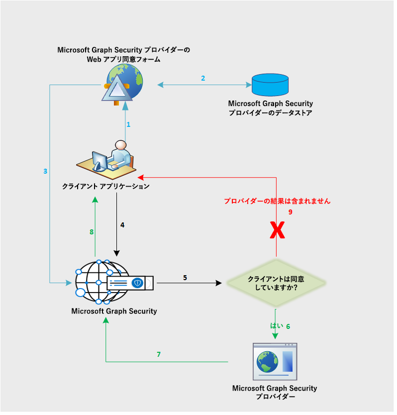

# Microsoft Graph セキュリティ API データ フローMicrosoft Graph Security API data flow

Microsoft Graph セキュリティ API は、Microsoft Graph セキュリティ エコシステムの全プロバイダーに対して要求をフェデレーションします。The Microsoft Graph Security API federates requests to all providers in the Microsoft Graph Security ecosystem. これは、次の図に示すように、アプリケーションによって提供されるセキュリティ プロバイダー同意に基づいています。This is based on the security provider consent provided by the application, as shown in the following diagram. 同意ワークフローは、Microsoft 以外のプロバイダーにのみ適用されます。The consent workflow only applies to non-Microsoft providers.

フローの説明を次に示します。The following is a description of the flow:

1. アプリケーションのユーザーは、プロバイダーのアプリケーションにサインインして、プロバイダーからの同意書を表示します。The application user signs in to the provider application to view the consent form from the provider. この同意書機能または UI はプロバイダーが所有するものであり、Microsoft 以外のプロバイダーが、Microsoft Graph セキュリティ API へ要求を送信することへの明示的な同意を顧客から得るためにのみ、適用されます。This consent form experience or UI is owned by the provider and applies to non-Microsoft providers only to get explicit consent from their customers to send requests to Microsoft Graph Security API.
2. クライアントの同意はプロバイダー側に保存されます。The client consent is stored on the provider side.
3. プロバイダーの同意サービスが Microsoft Graph セキュリティ API を呼び出し、各顧客の同意を知らせます。The provider consent service calls the Microsoft Graph Security API to inform consent approval for the respective customer.
4. アプリケーションが、Microsoft Graph セキュリティ API に要求を送信します。The application sends a request to the Microsoft Graph Security API.
5. Microsoft Graph セキュリティ API は、さまざまなプロバイダーにマップされているこの顧客の同意情報を確認します。The Microsoft Graph Security API checks for the consent information for this customer mapped to various providers.
6. Microsoft Graph セキュリティ API は、顧客が明示的な同意をプロバイダーの同意機能により示したすべてのプロバイダーを呼び出します。The Microsoft Graph Security API calls all those providers the customer has given explicit consent to via the provider consent experience.
7. そのクライアントのすべての同意済みプロバイダーから、応答が返されます。The response is returned from all the consented providers for that client.
8. 結果セットの応答がアプリケーションに返されます。The result set response is returned to the application.
9. 顧客が同意していないプロバイダーが存在する場合、そのプロバイダーからの結果は応答に含まれません。If the customer has not consented to any provider, no results from those providers are included in the response.
