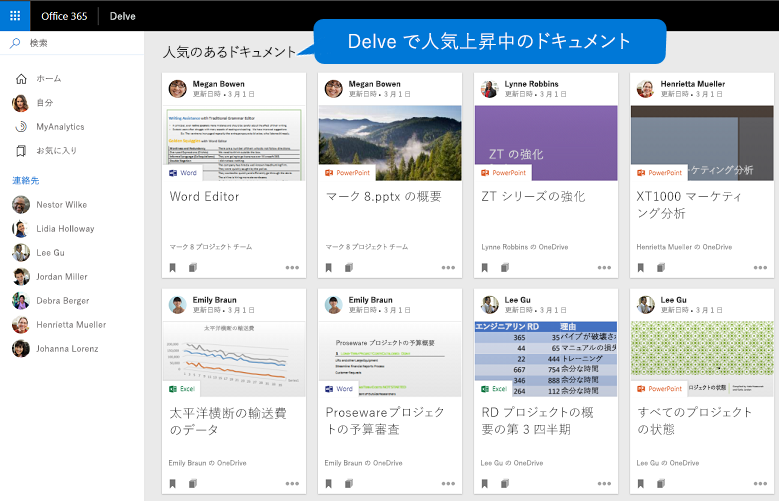
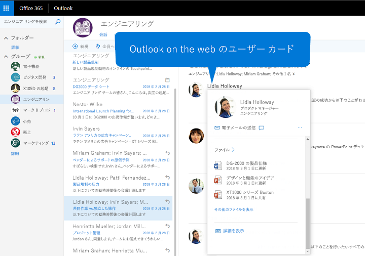

# <a name="overview-of-social-intelligence-and-analytics-in-microsoft-graph"></a><span data-ttu-id="56730-101">Microsoft Graph におけるソーシャル インテリジェンスと分析の概要</span><span class="sxs-lookup"><span data-stu-id="56730-101">Overview of social intelligence and analytics in Microsoft Graph</span></span>

<span data-ttu-id="56730-102">Microsoft Graph では、Microsoft 365 のクラウド サービスを使用する何千万人ものユーザーが中核的な役割を果たします。</span><span class="sxs-lookup"><span data-stu-id="56730-102">The hundreds of millions of users of Microsoft 365 cloud services form part of the core of Microsoft Graph.</span></span> <span data-ttu-id="56730-103">ユーザーのデータは、慎重に管理、保護されており、適切な権限があれば、Microsoft Graph サービスでビジネスの生産性や創造性を促進するために利用できます。</span><span class="sxs-lookup"><span data-stu-id="56730-103">The users' data is carefully managed, protected, and with proper authorization, made available by Microsoft Graph services to drive productivity and creativity in businesses.</span></span> <span data-ttu-id="56730-104">ユーザーのデータは Microsoft Graph のあらゆる部分に存在しますが、ユーザーの社会的な交流から得られたデータは特に興味深いものがあります。</span><span class="sxs-lookup"><span data-stu-id="56730-104">As ubiquitous the user's data is in Microsoft Graph, data derived from the user's social interactions is particularly interesting.</span></span> <span data-ttu-id="56730-105">たとえば、次のような質問への答えを導く知的なインサイトを得ることができます。</span><span class="sxs-lookup"><span data-stu-id="56730-105">It provides intelligent insights that can answer questions such as the following:</span></span>

- <span data-ttu-id="56730-106">「このユーザーはこのトピックの情報を誰に問い合わせればよいか?」</span><span class="sxs-lookup"><span data-stu-id="56730-106">"Who should this user contact for information on this topic?"</span></span>
- <span data-ttu-id="56730-107">「このユーザーにとって最も関心があるドキュメントはどれか?」</span><span class="sxs-lookup"><span data-stu-id="56730-107">"Which documents are most interesting to this person?"</span></span>

<span data-ttu-id="56730-108">Microsoft Graph では、People API と Insights API を使用してユーザーに関連する人物とドキュメントにアクセスできる、よりスマートなアプリを構築できます。</span><span class="sxs-lookup"><span data-stu-id="56730-108">You can use the people API and insights API in Microsoft Graph to build smarter apps that can, respectively, access the relevant people and documents for a user.</span></span>

<span data-ttu-id="56730-109">People API は、人物をユーザーとの関連性が高い順に返します。これらの人物は、そのユーザーの連絡先、ソーシャル ネットワーク、組織の人名簿、およびメールや Skype で行われた最近のコミュニケーションに基づいて収集されます。</span><span class="sxs-lookup"><span data-stu-id="56730-109">The people API returns people ordered by relevance to a user, based on that user's contacts, social networks, organization directory, and recent communications on email and Skype.</span></span> <span data-ttu-id="56730-110">これは、人物を選択するシナリオで特に有用です。</span><span class="sxs-lookup"><span data-stu-id="56730-110">This is particularly useful for people-picking scenarios.</span></span>

<span data-ttu-id="56730-111">Insights API は、高度な分析と機械学習を使用して、ユーザーが 1 日の作業時間を通して必要とする最も関連性の高いファイルを提供します。</span><span class="sxs-lookup"><span data-stu-id="56730-111">The insights API uses advanced analytics and machine learning to provide the most relevant files users need throughout their work day.</span></span> <span data-ttu-id="56730-112">この API により、Office Delve、SharePoint ホーム、OneDrive for Business の [Discover] ビュー、Outlook on the web などの使い慣れた Office 365 のエクスペリエンスが強化されます。</span><span class="sxs-lookup"><span data-stu-id="56730-112">The API powers familiar Office 365 experiences, including Office Delve, SharePoint Home, the Discover view in OneDrive for Business, and Outlook on the web.</span></span>


## <a name="why-integrate-with-people-data"></a><span data-ttu-id="56730-114">人物のデータと統合する理由</span><span class="sxs-lookup"><span data-stu-id="56730-114">Why integrate with people data?</span></span>

<span data-ttu-id="56730-115">People API は、1 つのエンティティ ([person](../api-reference/v1.0/resources/person.md)) のデータを返します。このエンティティには、今日のビジネスの世界における個人の一般的なデータが含まれています。</span><span class="sxs-lookup"><span data-stu-id="56730-115">The people API returns data of a single entity, [person](../api-reference/v1.0/resources/person.md), which includes typical data of an individual in today's business world.</span></span> <span data-ttu-id="56730-116">Microsoft Graph ユーザーにとって、この **person** データを特に便利なものにしているのが、その_関連性_です。</span><span class="sxs-lookup"><span data-stu-id="56730-116">What makes this **person** data especially useful is its _relevance_ with respect to a Microsoft Graph user.</span></span> <span data-ttu-id="56730-117">関連性は、ユーザーのコミュニケーションやコラボレーションのパターン、およびビジネス リレーションシップに基づいて計算される各人物の関連性スコアで示されます。</span><span class="sxs-lookup"><span data-stu-id="56730-117">Relevance is noted in a relevance score of each person, calculated based on the user's communication and collaboration patterns and business relationships.</span></span> <span data-ttu-id="56730-118">この_関連性_データの用途には 3 つのタイプがあります。</span><span class="sxs-lookup"><span data-stu-id="56730-118">There are 3 main types of application of this _relevance_ data.</span></span>

### <a name="browse-people-by-relevance"></a><span data-ttu-id="56730-119">関連性による人物の参照</span><span class="sxs-lookup"><span data-stu-id="56730-119">Browse people by relevance</span></span>

<span data-ttu-id="56730-120">適切な[権限](people_example.md#authorization)を取得すると、サインインしているユーザー、またはサインインしているユーザーの組織内の他のユーザーに関連する人物を参照できます。</span><span class="sxs-lookup"><span data-stu-id="56730-120">You can browse people who are related to the signed-in user or to some other user in the signed-in user's organization, provided you have got the appropriate [authorization](people_example.md#authorization).</span></span> <span data-ttu-id="56730-121">ユーザーは、関連性の順に並べられた **person** オブジェクトのコレクションを取得します。</span><span class="sxs-lookup"><span data-stu-id="56730-121">You get a collection of **person** objects that are ordered by relevance.</span></span> <span data-ttu-id="56730-122">応答で返された **person** オブジェクトのコレクションは、クエリ パラメーター `top`、`skip`、`orderby`、`select`、および `filter` を指定することでさらに[カスタマイズ](people_example.md#browse-people)できます。</span><span class="sxs-lookup"><span data-stu-id="56730-122">You can further [customize](people_example.md#browse-people) the collection of **person** objects that is returned in the response by specifying the query parameters `top`, `skip`, `orderby`, `select`, and `filter`.</span></span>

### <a name="fuzzy-searches-based-on-people-criteria"></a><span data-ttu-id="56730-123">人物の抽出条件に基づくあいまい検索</span><span class="sxs-lookup"><span data-stu-id="56730-123">Fuzzy searches based on people criteria</span></span>

<span data-ttu-id="56730-124">アプリがサインインしているユーザーによるアクセス許可を取得している場合は、People API でそのユーザーに関連する人物を検索できます </span><span class="sxs-lookup"><span data-stu-id="56730-124">The people API lets you search for people relevant to the signed-in user, provided that your app has got permissions by that user.</span></span> <span data-ttu-id="56730-125">(詳細については、「[People のアクセス許可](permissions_reference.md#people-permissions)」を参照してください)。</span><span class="sxs-lookup"><span data-stu-id="56730-125">(Read more on [people permissions](permissions_reference.md#people-permissions).)</span></span>

<span data-ttu-id="56730-126">あいまい検索により、完全に一致する項目と、検索目的の推論に基づく結果が返されます。</span><span class="sxs-lookup"><span data-stu-id="56730-126">They will return results based on an exact match and also on inferences about the intent of the search.</span></span> <span data-ttu-id="56730-127">これを具体的に示す次の例では、サインインしているユーザーに関連し、名前_またはメール アドレス_に「j」で始まる単語が含まれている **person** オブジェクトが返されます。</span><span class="sxs-lookup"><span data-stu-id="56730-127">To illustrate this, the following example returns **person** objects relevant to the signed-in user whose name, _or email address_, contains a word that starts with 'j'.</span></span>

<!-- { "blockType": "ignored" } -->
```http
GET /me/people/?$search=j
```

### <a name="fuzzy-searches-based-on-topic-criteria"></a><span data-ttu-id="56730-128">トピックの抽出条件に基づくあいまい検索</span><span class="sxs-lookup"><span data-stu-id="56730-128">Fuzzy searches based on topic criteria</span></span>

<span data-ttu-id="56730-129">People API では、サインインしているユーザーに関連し、そのユーザーと特定の「トピック」についてやり取りしたいと言っている人物を検索することもできます。</span><span class="sxs-lookup"><span data-stu-id="56730-129">You can also perform searches for people who are relevant to the signed-in user and have expressed an interest in communicating with that user over topics such as pizzas in the following example:</span></span> <span data-ttu-id="56730-130">トピックとは、ユーザーが電子メールの会話で最もよく使用している単語のことです。</span><span class="sxs-lookup"><span data-stu-id="56730-130">Topics in this context are just words that have been used most by users in email conversations.</span></span> <span data-ttu-id="56730-131">Microsoft はそのような単語を抽出し、コンテキストを取り除き、そのデータのインデックスを作成してあいまい検索を容易にします。</span><span class="sxs-lookup"><span data-stu-id="56730-131">Microsoft extracts such words and creates an index for this data to facilitate fuzzy searches.</span></span>

<span data-ttu-id="56730-132">次の例は、「カブトムシ」というトピックの検索目的の推論を示しています。</span><span class="sxs-lookup"><span data-stu-id="56730-132">The following example illustrates inferences about the intent of a search on the topic "beetle":</span></span>

<!-- { "blockType": "ignored" } -->
```http
GET /me/people/?$search="topic:beetle" 
```

<span data-ttu-id="56730-133">トピック データのインデックスのあいまい検索により、昆虫のカブトムシ、フォルクス ワーゲンの象徴的な車であるビートル、バンドのビートルズ、およびその他の定義のインスタンスが返されます。</span><span class="sxs-lookup"><span data-stu-id="56730-133">A fuzzy search in the topic data index return instances that mean the beetle insect, the iconic Volkswagen Beetle car, the Beatles band, and other definitions.</span></span>


## <a name="why-integrate-with-document-based-insights-preview"></a><span data-ttu-id="56730-134">ドキュメントベースのインサイト (プレビュー) と統合する理由</span><span class="sxs-lookup"><span data-stu-id="56730-134">Why integrate with document-based insights (preview)?</span></span>

### <a name="use-intelligence-to-improve-collaboration"></a><span data-ttu-id="56730-135">インテリジェンスを使用したコラボレーションの改善</span><span class="sxs-lookup"><span data-stu-id="56730-135">Use intelligence to improve collaboration</span></span>

<span data-ttu-id="56730-136">ユーザーは多くの場合、通常の 1 日の作業時間中に、多くのドキュメントに保存されている大量の情報を操作し、さまざまな方法で他のユーザーと共同作業を行います。</span><span class="sxs-lookup"><span data-stu-id="56730-136">During a typical work day, users often interact with large amounts of information stored across many documents and collaborate with other users in many different ways.</span></span> <span data-ttu-id="56730-137">必要な情報が必要なときに常に見つかることが重要です。</span><span class="sxs-lookup"><span data-stu-id="56730-137">It's important that they can always can find what they need, when they need it.</span></span>

<span data-ttu-id="56730-138">[trending](../api-reference/beta/resources/insights_trending.md)、[shared](../api-reference/beta/resources/insights_shared.md)、および [used](../api-reference/beta/resources/insights_used.md) API を含む Insights API を使用して、ユーザーの現在のコンテキストとニーズに基づいて Office 365 全体からファイルを抽出することにより、ユーザーの生産性が向上し、組織内のコラボレーションが改善されます。</span><span class="sxs-lookup"><span data-stu-id="56730-138">You can use the insights API, which includes the [trending](../api-reference/beta/resources/insights_trending.md), [shared](../api-reference/beta/resources/insights_shared.md), and [used](../api-reference/beta/resources/insights_used.md) APIs, to surface files from across Office 365 based on your users' current context and needs, making users more productive and improving collaboration in your organization.</span></span>

<span data-ttu-id="56730-139">アプリでは、Insights API の結果を簡単にレンダリングできます。</span><span class="sxs-lookup"><span data-stu-id="56730-139">It is easy to render the results from the insights API in your app.</span></span> <span data-ttu-id="56730-140">すべての結果には、プレビュー イメージの URL やプレビュー テキストなどの一般的な視覚化プロパティのセットが付属しています。</span><span class="sxs-lookup"><span data-stu-id="56730-140">Every result comes with a set of common visualization properties, like a preview image URL or preview text.</span></span>

### <a name="make-relevant-content-visible"></a><span data-ttu-id="56730-141">関連するコンテンツの視覚化</span><span class="sxs-lookup"><span data-stu-id="56730-141">Make relevant content visible</span></span>

<span data-ttu-id="56730-142">Office 365 の Delve では、_trending_ のインサイトを使用して、ユーザーが現在最も興味を持っているドキュメントを見つけることができます。</span><span class="sxs-lookup"><span data-stu-id="56730-142">In Office 365, Delve uses the _trending_ insight to help users discover the documents that are most interesting to them right now.</span></span> <span data-ttu-id="56730-143">図 1 を参照してください。</span><span class="sxs-lookup"><span data-stu-id="56730-143">See figure 1.</span></span>

<span data-ttu-id="56730-144">プログラムの中で Insights API の [trending](../api-reference/beta/resources/insights_trending.md) エンティティを使用すると、アプリの顧客に同じようなエクスペリエンスを提供できます。</span><span class="sxs-lookup"><span data-stu-id="56730-144">Programmatically, you can use the [trending](../api-reference/beta/resources/insights_trending.md) entity in the insights API to provide your app customers a similar experience.</span></span> <span data-ttu-id="56730-145">**trending** エンティティを使用して、ユーザーが最近話題にしているドキュメントやユーザーに関連するドキュメントに接続します。</span><span class="sxs-lookup"><span data-stu-id="56730-145">Use the **trending** entity to connect to documents that are trending around and relevant to the user.</span></span> <span data-ttu-id="56730-146">[人気上昇中のドキュメントの一覧表示](../api-reference/beta/api/insights_list_trending.md)では、OneDrive または SharePoint のチーム サイトに保存されているファイルが、関連性の最も高いものから順に並べ替えて返されます。</span><span class="sxs-lookup"><span data-stu-id="56730-146">[Listing trending documents](../api-reference/beta/api/insights_list_trending.md) returns those files stored on OneDrive or SharePoint team sites, sorted by relevance with the most important ones first.</span></span> 

<span data-ttu-id="56730-147">**図 1 あるユーザーに人気のあるドキュメントが表示されている Office 365 の Delve**</span><span class="sxs-lookup"><span data-stu-id="56730-147">**Figure 1. Delve in Office 365 showing popular documents for a user**</span></span>



### <a name="allow-users-to-collaborate-and-get-back-to-work"></a><span data-ttu-id="56730-149">ユーザーが共同作業の後で作業に戻れるようにする</span><span class="sxs-lookup"><span data-stu-id="56730-149">Allow users to collaborate and get back to work</span></span>

<span data-ttu-id="56730-150">新しい Office 365 の人物カードは、_used_ および _shared_ のインサイトを利用して人物と知識単位を結びます。</span><span class="sxs-lookup"><span data-stu-id="56730-150">The new Office 365 people cards tap into the _used_ and _shared_ insights to connect the dots between people and units of knowledge.</span></span> <span data-ttu-id="56730-151">人物カードは、あるユーザーに関連するドキュメントを識別し、表示します。</span><span class="sxs-lookup"><span data-stu-id="56730-151">The people card identifies and displays relevant documents about a person.</span></span> <span data-ttu-id="56730-152">ユーザーは、Outlook on the web など、スイート全体で人物カードを表示できます。</span><span class="sxs-lookup"><span data-stu-id="56730-152">Users can see people cards across the suite, for example, in Outlook on the web.</span></span> <span data-ttu-id="56730-153">図 2 を参照してください。</span><span class="sxs-lookup"><span data-stu-id="56730-153">See figure 2.</span></span>

<span data-ttu-id="56730-154">Insights API は、[used](../api-reference/beta/resources/insights_used.md) および [shared](../api-reference/beta/resources/insights_shared.md) エンティティと同様の機能を提供します。</span><span class="sxs-lookup"><span data-stu-id="56730-154">The insights API provides a similar functionality with the [used](../api-reference/beta/resources/insights_used.md) and [shared](../api-reference/beta/resources/insights_shared.md) entities.</span></span> <span data-ttu-id="56730-155">Office 365 で、あるユーザーが最近表示または操作したもの、または同僚が最近そのユーザーと共有したものが返されます。</span><span class="sxs-lookup"><span data-stu-id="56730-155">They return what a user has been viewing or working on most recently, or what colleagues have shared with the user most recently in Office 365.</span></span>

<span data-ttu-id="56730-156">**図 2 あるユーザーの人物カードが表示されている Outlook on the web**</span><span class="sxs-lookup"><span data-stu-id="56730-156">**Figure 2. Outlook on the web showing a people card for a user**</span></span>



## <a name="next-steps"></a><span data-ttu-id="56730-158">次の手順</span><span class="sxs-lookup"><span data-stu-id="56730-158">Next steps</span></span>

* <span data-ttu-id="56730-159">[Graph エクスプローラー](https://developer.microsoft.com/ja-JP/graph/graph-explorer)を使用して、自分のファイルで People および Insights API を試してみてください。</span><span class="sxs-lookup"><span data-stu-id="56730-159">Use the [Microsoft Graph Explorer](https://developer.microsoft.com/ja-JP/graph/graph-explorer) to try out the OneNote APIs with your own OneNote notebooks.</span></span> <span data-ttu-id="56730-160">サインインして、左側の列の**サンプルをさらに表示**を選択します。</span><span class="sxs-lookup"><span data-stu-id="56730-160">Sign in, and choose **Show more samples** in the column on the left.</span></span> <span data-ttu-id="56730-161">メニューを使用して **People** と **Insights (beta)** を有効にします。</span><span class="sxs-lookup"><span data-stu-id="56730-161">Use the menu to turn on **People** and **Insights (beta)**.</span></span>
* <span data-ttu-id="56730-162">詳細については、[People API](people_example.md) および [person](../api-reference/v1.0/resources/person.md) エンティティを参照してください。</span><span class="sxs-lookup"><span data-stu-id="56730-162">Find more about the [people API](people_example.md) and the [person](../api-reference/v1.0/resources/person.md) entity.</span></span>
* <span data-ttu-id="56730-163">Insights API を使い始めるには、「[Insights API を使用する](../api-reference/beta/resources/insights.md)」を参照してください。</span><span class="sxs-lookup"><span data-stu-id="56730-163">To get started with insights API, see [Use the insights API](../api-reference/beta/resources/insights.md).</span></span>
