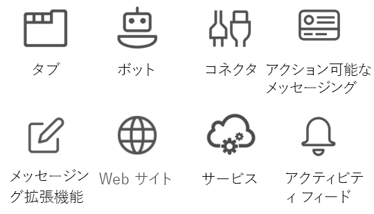

# Microsoft Teams API の概要 (プレビュー)Microsoft Teams teamwork API overview

Microsoft Teams は、チームワークおよびインテリジェントな通信のための究極のハブです。Microsoft Teams is the ultimate hub for teamwork and intelligent communications. 1 億 2 千万人を超えるユーザーが利用する Office 365 のパワーと規模に基づいて構築されている Microsoft Teams は、チャット ベースのコラボレーション、会議、通話、およびエンタープライズ ボイスのさまざまな機能を提供します。Built on the strength and scale of Office 365 with over 120 million users, Microsoft Teams delivers chat-based collaboration, meetings, calling, and enterprise voice features.

## Microsoft Teams を統合する理由Why integrate with Microsoft Teams?

Microsoft Teams を統合することにより、独自のサービスやアプリを構築したり、何百万というエンタープライズ ユーザーに達したり、共同作業を支援したりすることが容易になります。Integrating with Microsoft Teams makes it easy for you to build your own services and apps, reaching millions of enterprise users and helping people get work done together. Microsoft Graph を使用することによって、チーム、チャネル、メッセージなどを作成し、管理することができます。You can use Microsoft Graph to create and manage teams, channels, messages, and more.

### あらゆる種類のアプリで Microsoft Graph を使用するUse Microsoft Graph in any kind of app

Microsoft Graph 上に構築された Microsoft Teams アプリは、コラボレーションの生産性を向上させ、コラボレーションをさらに推進するための新たなツールを作業グループに提供します。Microsoft Teams apps built on Microsoft Graph give work groups a new tool to make collaboration a more productive and compelling experience. Microsoft Teams を使用することにより作業グループのユーザーは、資産を共有したり、チャットで対話したり、チームの予定表でイベントの予定を管理したりできます。Using Microsoft Teams, work group users share assets, interact through chat, and schedule events on the team calendar. Microsoft Teams API に基づくアプリを通じてチーム、チャネル、および会話の自動化機能を追加することにより、Microsoft Teams の価値をさらに高めてください。Enhance the value of Microsoft Teams by adding team, channel, and conversation automation via apps based on the Microsoft Teams API.

Web サイト、サービス、およびネイティブ プラットフォーム アプリケーションは、Microsoft Teams のユーザー エクスペリエンス内では実行されませんが、Microsoft Teams の自動化シナリオを有効にする Microsoft Teams API を呼び出すために使用することができます。Websites, services, and native platform applications are not run within the Microsoft Teams user experience but can be used to call the Microsoft Teams APIs that enable Microsoft Teams automation scenarios.

**Microsoft Teams 対応のアプリの種類****Types of apps enabled for Microsoft Teams**

これらのコラボレーション ツールには、Microsoft Teams 内部で実行される Microsoft Graph 対応のタブまたはボット アプリが含まれます。These collaboration tools include Microsoft Graph-enabled tab or bot apps running inside Microsoft Teams. また、Web サイトまたは Web サービスからなど、Microsoft Teams アプリの外部で Microsoft Graph を呼び出すこともできます。You can also call Microsoft Graph outside of a Microsoft Teams app, such as from a website or a web service. すでに Web サイトが Microsoft Graph 対応になっている場合、[Microsoft Teams デベロッパー プラットフォーム](https://docs.microsoft.com/en-us/microsoftteams/platform/#pivot=home&panel=home-all)を使用して、既存の Web サイト コードを使用するタブ アプリを作成することにより、そのサイトの機能を Microsoft Teams のために使用することができます。If you've already enabled your website for Microsoft Graph, you can use that work for Microsoft Teams by using the [Microsoft Teams developer platform](https://docs.microsoft.com/en-us/microsoftteams/platform/#pivot=home&panel=home-all) to create a tab app that uses the existing website code.

Microsoft Teams タブまたはボット アプリがシナリオに適したものではない場合は、アプリの種類として次のいずれかを選んでください。If a Microsoft Teams tab or bot app is not the ideal way to complete your scenario, choose one of the following app types.

|アプリの種類App type|シナリオの説明Scenario description|
|:-------|:-------------------|
|タブTabs|Microsoft Teams 内での拡張コンテンツを表示します。Surface enhanced content within Microsoft Teams.|
|コネクタConnectors|拡張更新内容をチャネルに投稿します。Post enhanced updates to channels.|
|アクション可能なメッセージングActionable messaging|拡張対話機能をコネクタ カードに追加します。Add enhanced interaction to your connector cards.|
|Web サイトWebsites|Web ページに拡張コンテンツを表示します。Surface enhanced content in your web pages.|
|ボットBots|会話の中でタスクを実行するようユーザーを支援します。Help users get tasks done in conversations.|
|アクティビティ フィードActivity feed|フィード通知によりユーザーの参加を促します。Engage users via feed notifications.|
|メッセージング拡張機能Messaging extensions|ユーザーが会話の中で拡張カードに関するクエリを実行したり共有したりできるようにします。Allow users to query and share enhanced cards in conversations.|
|サービスServices|Web サービスによりクライアント アプリケーションを拡張して Microsoft Graph データを使用できるようにします。Enhance your client applications with Microsoft Graph data via your web service.|

### 複数のチームおよびチャネルを作成するCreate multiple teams and channels

顧客が、アプリにリンクした新しい[チーム](../api-reference/beta/resources/team.md)および[チャネル](../api-reference/beta/resources/channel.md)を作成できるようにします。Allow your customers to create new [teams](../api-reference/beta/resources/team.md) and [channels](../api-reference/beta/resources/channel.md) linked to your app. Microsoft Teams API の使用により、数多くのチームの作成やそこへのユーザーとチャネルの登録の作業を容易にします。Make creating large numbers of teams and populating them with users and channels easy by using the Microsoft Teams API.

### チーム ライフサイクルを自動化するAutomate team lifecycles

Microsoft Graph を使用することにより、業務上の新しい問題が発生した場合に新しい仮想チームを作成し、適切な人を[チームに登録](../api-reference/v1.0/api/group_post_members.md)し、チャネルによりチームを構成します。Use Microsoft Graph to create a new virtual team when a new business issue arises, [populate the team](../api-reference/v1.0/api/group_post_members.md) with the right people, and configure the team with channels. 業務上の新しい問題に関するチーム チャネル ディスカッションを開始するには、新しいチーム メンバーに対する歓迎メッセージを投稿するための新しい会話スレッドをチャネルで開始することができます。To start a team channel discussion around the new business issue, you can seed the channel with a new conversation thread to post a welcome message to new team members. 新しいチームで業務上の問題について話し合うには、新しいイベントをチーム予定表に追加し、チームのメンバーをそのイベントに招待します。If you want to get the new team together to discuss the business issue, add a new event to the team calendar and then invite the members of the team to the event.

業務上の問題が解決し、その仮想チームが不要になったら、Microsoft Teams API を使用してチームを破棄します。When the business issue is resolved and you no longer need the virtual team, use the Microsoft Teams API to tear down the team. 仮想チームを作成する時点で最大期間がわかっている場合は、そのチームについて [Office 365 グループ有効期限ポリシー](https://support.office.com/en-us/article/office-365-group-expiration-policy-8d253fe5-0e09-4b3c-8b5e-f48def064733?ui=en-US&rs=en-US&ad=US)を設定することにより、そのポリシーに従ってチームが自動で削除されます。If you know the maximum duration of the virtual team when you create it, set an [Office 365 group expiration policy](https://support.office.com/en-us/article/office-365-group-expiration-policy-8d253fe5-0e09-4b3c-8b5e-f48def064733?ui=en-US&rs=en-US&ad=US) for the team that automatically removes the team according to the policy.

## 次の手順Next steps

- [Microsoft Teams API の使用](../api-reference/beta/resources/teams_api_overview.md)方法を確認する。Learn how to [use the Microsoft Teams API](../api-reference/beta/resources/teams_api_overview.md).
- [チーム](../api-reference/beta/resources/team.md)、[チャネル](../api-reference/beta/resources/channel.md)、および [グループ](../api-reference/v1.0/resources/group.md)のリソースのメソッド、プロパティ、およびリレーションシップについて詳しく調べる。Drill down on the methods, properties, and relationships of the [team](../api-reference/beta/resources/team.md), [channel](../api-reference/beta/resources/channel.md), and [group](../api-reference/v1.0/resources/group.md) resources.
- [Graph エクスプローラー](https://developer.microsoft.com/en-us/graph/graph-explorer)で API をお試しください。Try the API in the [Graph Explorer](https://developer.microsoft.com/en-us/graph/graph-explorer).
- [Microsoft Teams プログラミング モデル](https://docs.microsoft.com/en-us/microsoftteams/platform/concepts/concepts-overview)に関する詳細を読む。Read more about the [Microsoft Teams programming model](https://docs.microsoft.com/en-us/microsoftteams/platform/concepts/concepts-overview).
- [サンプル コード](https://github.com/OfficeDev/microsoft-teams-sample-graph)を試す。Get a jump-start with [sample code](https://github.com/OfficeDev/microsoft-teams-sample-graph).
