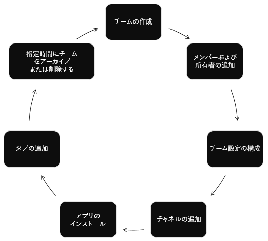

# Microsoft Teams API の概要

[Microsoft Teams](https://products.office.com/microsoft-teams) は、チームワークおよびインテリジェントな通信のための究極のハブです。 1 億 2 千万人を超えるユーザーが利用する [Office 365](https://products.office.com/) のパワーと規模に基づいて構築されている Microsoft Teams は、チャット ベースのコラボレーション、会議、通話、およびエンタープライズ ボイスのさまざまな機能を提供します。

## Microsoft Teams を統合する理由

### チーム ライフサイクルを自動化する

Microsoft Graph を使用することにより、業務上の新しい問題が発生した場合に[新しい仮想チームを作成](/graph/api/team-put-teams?view=graph-rest-1.0)し、チームに[適切な人を追加](/graph/api/group-post-members?view=graph-rest-1.0)し、チームに[チャネル](/graph/api/channel-post?view=graph-rest-1.0)、[タブ](/graph/api/teamstab-add?view=graph-rest-1.0)、[アプリ](/graph/api/teamsappinstallation-add?view=graph-rest-1.0)を構成します。
新しいチームで業務上の問題について話し合うには、チーム予定表に[新しいイベント](/graph/api/group-post-events?view=graph-rest-1.0)を追加します。

業務上の問題が解決し、そのチームが不要になったら、Microsoft Teams API を使用してチームを[アーカイブ](/graph/api/team-archive?view=graph-rest-1.0)または[削除](/graph/api/group-delete?view=graph-rest-1.0)します。 チームを作成する時点で最大期間がわかっている場合は、そのチームについて [Office 365 グループ有効期限ポリシー](https://support.office.com/en-us/article/office-365-group-expiration-policy-8d253fe5-0e09-4b3c-8b5e-f48def064733?ui=en-US&rs=en-US&ad=US)を設定することにより、そのポリシーに従ってチームが自動で削除されます。

### 誰もいない場合でも作業を完了する

[アプリケーションのアクセス許可](permissions-reference.md)を使用することにより、人による操作なしで[チーム](/graph/api/resources/team?view=graph-rest-1.0)、[チャネル](/graph/api/resources/channel?view=graph-rest-1.0)、[タブ](/graph/api/resources/teamstab?view=graph-rest-1.0)に関する作業を実行します。 顧客から注文を受けたときに、新しいチャネルを作成します。
学校の新年度が始まるときにクラスのチームを自動的に作成し、年度末にそのチームを自動的にアーカイブします。

### アプリにリンクされたチームを作成する

顧客に新しい[チーム](/graph/api/resources/team?view=graph-rest-1.0)と[チャネル](/graph/api/resources/channel?view=graph-rest-1.0)を作成してもらうことができます。 
その新しいチームに、[Teams アプリ](https://docs.microsoft.com/ja-JP/microsoftteams/platform/#pivot=home&panel=home-all)を[インストール](/graph/api/teamsappinstallation-add?view=graph-rest-1.0)します。 
その新しいチャネルの[タブにアプリをピン留め](/graph/api/teamstab-add?view=graph-rest-1.0)します。 
Web サイトまでリンクしているそのチャネルに[メッセージを送信](/graph/api/channel-post-chatmessage?view=graph-rest-beta)します。

### 複数のチームとチャネルを作成および管理する

Microsoft Graph を使用して、[チーム](/graph/api/resources/team?view=graph-rest-1.0)、[チャネル](/graph/api/resources/channel?view=graph-rest-1.0)、[タブ](/graph/api/resources/teamstab?view=graph-rest-1.0)、[アプリ](/graph/api/resources/teamsapp?view=graph-rest-1.0)を自動的に作成および管理することにより、多数のチームを作成してユーザーとチャネルを登録することを簡単に行うことができます。
Microsoft Graph を使用して、もう使用していないチームを[検索](teams-list-all-teams.md)して[アーカイブ](/graph/api/team-archive?view=graph-rest-1.0)することもできます。 この API は、[Microsoft Teams 管理センター](https://docs.microsoft.com/ja-JP/microsoftteams/enable-features-office-365)と [Teams PowerShell コマンドレット](https://docs.microsoft.com/ja-JP/microsoftteams/teams-powershell-overview)の構築に使用された API と同じものです。

### チームにアプリを展開する

[テナント内のチームのリストを作成](teams-list-all-teams.md)し、そのチームに[アプリをインストール](/graph/api/teamsappinstallation-add?view=graph-rest-1.0)します。 
ユーザーがアプリに簡単にアクセスすることができるよう、チャネルに[タブを作成](/graph/api/teamstab-add?view=graph-rest-1.0)します。

### あらゆる種類のアプリで Microsoft Graph を使用する

Microsoft Teams アプリは、コラボレーションの生産性を向上させ、コラボレーションをさらに推進するための新たなツールを作業グループに提供します。 これらのアプリを使用することにより作業グループのユーザーは、資産を共有したり、チャットで対話したり、チームの予定表でイベントの予定を管理したりできます。 また、これらのアプリでは、チーム、チャネル、会話の作成を自動化することができるため、Microsoft Teams の価値がより高まります。

Microsoft Teams ユーザー エクスペリエンスの外部で実行する Web サイト、サービス、ネイティブ プラットフォーム アプリケーションを作成し、Teams API を呼び出して Teams での作業を自動化することができます。

**Microsoft Teams 対応のアプリの種類**

これらのコラボレーション ツールには、Microsoft Teams アプリ内部で実行される Microsoft Graph 対応のタブまたはボットが含まれます。 また、Web サイトまたは Web サービスからなど、Microsoft Teams アプリの外部で Microsoft Graph を呼び出すこともできます。 既に Web サイトが Microsoft Graph 対応になっている場合、[Microsoft Teams デベロッパー プラットフォーム](https://docs.microsoft.com/ja-JP/microsoftteams/platform/#pivot=home&panel=home-all)を使用して、既存の Web サイト コードを使用する[タブを作成](https://docs.microsoft.com/ja-JP/microsoftteams/platform/concepts/tabs/tabs-overview)することにより、そのサイトの機能を Microsoft Teams のために使用することができます。

Microsoft Teams API は、Teams 内部および外部のどちらのアプリも拡張することができます。

|アプリの種類|シナリオの説明|
|:-------|:-------------------|
| [タブ](https://docs.microsoft.com/ja-JP/microsoftteams/platform/concepts/tabs/tabs-overview) |Microsoft Teams でコンテンツを表示します。|
| [ボット](https://docs.microsoft.com/ja-JP/microsoftteams/platform/concepts/bots/bots-overview) |会話の中でタスクを実行するようユーザーを支援します。|
| [コネクタ](https://docs.microsoft.com/ja-JP/microsoftteams/platform/concepts/connectors/connectors) |外部サービスからチャネルに対して更新情報を投稿します。|
| [アクション可能なメッセージング](https://docs.microsoft.com/ja-JP/microsoftteams/platform/concepts/cards/cards) |拡張対話機能をコネクタ カードに追加します。|
| [メッセージング拡張機能](https://docs.microsoft.com/ja-JP/microsoftteams/platform/concepts/messaging-extensions) |ユーザーが会話の中で情報に関するクエリを実行したり共有したりできるようにします。|
|Web サイト| Web ページに拡張コンテンツを表示します。|
|サービス|Web サービスによりクライアント アプリケーションを拡張して Microsoft Graph データを使用できるようにします。|
| [アクティビティ フィード](https://docs.microsoft.com/ja-JP/microsoftteams/platform/concepts/activity-feed)|フィード通知によりユーザーの参加を促します。|
| [通話とオンライン会議 (プレビュー)](/graph/api/resources/calls-api-overview?view=graph-rest-beta) |音声/ビデオ通話を開始して参加することができるボットで Microsoft Teams アプリを作成し、対話型音声応答 (IVR) フローに基づいて通話をルーティング/転送し、オンライン会議に参加します。|

## API リファレンス

このサービスの API リファレンスをお探しですか?

「[Microsoft Graph の Teams API](/graph/api/resources/teams-api-overview?view=graph-rest-1.0)」を参照してください。

## 次のステップ

- [概要ビデオ](https://aka.ms/teamsgraph/v1/video)を見る。
- [Microsoft Teams API の使用](/graph/api/resources/teams-api-overview?view=graph-rest-1.0)方法を確認する。
- [チーム](/graph/api/resources/team?view=graph-rest-1.0)、[チャネル](/graph/api/resources/channel?view=graph-rest-1.0)、および [グループ](/graph/api/resources/group?view=graph-rest-1.0)のリソースのメソッド、プロパティ、およびリレーションシップについて詳しく調べる。
- [Graph エクスプローラー](https://developer.microsoft.com/graph/graph-explorer)で API をお試しください。
- [Microsoft Teams プログラミング モデル](https://docs.microsoft.com/ja-JP/microsoftteams/platform/concepts/concepts-overview)に関する詳細を読む。
- [通話およびオンライン会議 API](/graph/api/resources/calls-api-overview?view=graph-rest-beta)を調べる。
- サンプル コードですぐに開始する: [Contoso エアライン](https://github.com/microsoftgraph/contoso-airlines-teams-sample)、[C# ミニサンプル](https://github.com/microsoftgraph/csharp-teams-sample-graph)
