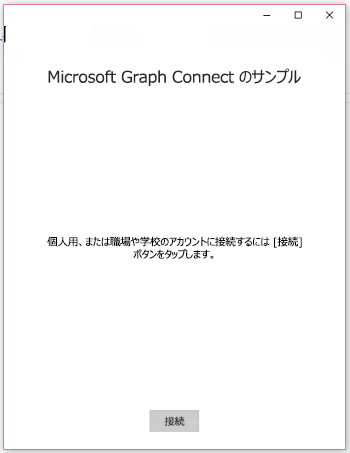
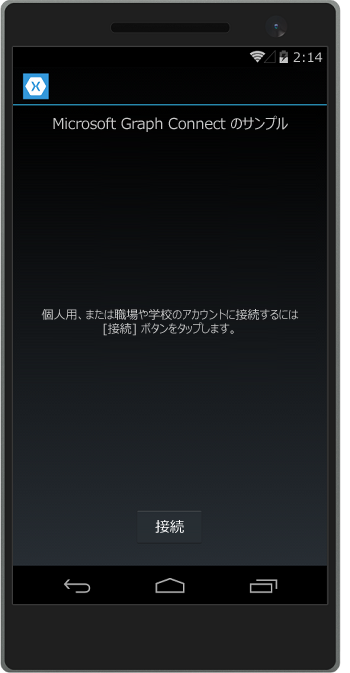
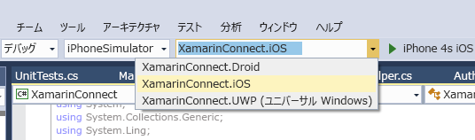

# <a name="get-started-with-microsoft-graph-in-a-xamarin-forms-app"></a>Xamarin Forms アプリで Microsoft Graph を使ってみる

> **エンタープライズのお客様向けにアプリを作成していますか?**エンタープライズのお客様が、<a href="https://azure.microsoft.com/documentation/articles/active-directory-conditional-access-device-policies/" target="_newtab">条件付きのデバイスへのアクセス</a>のようなエンタープライズ モビリティ セキュリティの機能をオンにしている場合、アプリが動作しない可能性があります。その場合、気がつかないまま、お客様の側でエラーが発生してしまう可能性があります。 

この記事では、[Azure AD v2.0 エンドポイント](https://developer.microsoft.com/graph/docs/concepts/converged_auth)からアクセス トークンを取得し、Microsoft Graph を呼び出すために必要なタスクについて説明します。ここでは、[Xamarin Forms 用 Microsoft Graph Connect サンプル](https://github.com/microsoftgraph/xamarin-csharp-connect-sample) のサンプル内のコードを説明し、Microsoft Graph を使用するアプリで実装する必要のある主要な概念について説明します。また、この記事では、[Microsoft Graph クライアント ライブラリ](http://www.nuget.org/packages/Microsoft.Graph/)を使用して Microsoft Graph にアクセスする方法についても説明します。

次のアプリを作成します。

| UWP | Android | iOS |
| --- | ------- | ----|
|  |  |  |

**アプリを作成してみたくありませんか。**[Microsoft Graph クイック スタート](https://developer.microsoft.com/graph/quick-start)を使用してすぐに使い始めるか、またはこの記事で取り扱っている [Xamarin Forms 用 Microsoft Graph Connect サンプル](https://github.com/microsoftgraph/xamarin-csharp-connect-sample)をダウンロードしてください。

## <a name="prerequisites"></a>前提条件

開始するには、次のものが必要です。 

- [Microsoft アカウント](https://www.outlook.com/)か[職場または学校アカウント](http://dev.office.com/devprogram)
- Visual Studio 2015 
- [Xamarin for Visual Studio](https://www.xamarin.com/visual-studio)
- Windows 10 ([開発モードが有効](https://msdn.microsoft.com/library/windows/apps/xaml/dn706236.aspx))
- [Xamarin Forms 用の Microsoft Graph Connect スターター プロジェクト](https://github.com/microsoftgraph/xamarin-csharp-connect-sample/tree/master/starter)。このテンプレートには、コード追加先のいくつかのクラスが含まれています。完全なビューおよびリソース文字列も含まれています。このプロジェクトを取得するには、[Xamarin Forms 用 Microsoft Graph Connect のサンプル](https://github.com/microsoftgraph/xamarin-csharp-connect-sample) を複製またはダウンロードして、**スターター** フォルダー内の **XamarinConnect** ソリューションを開きます。 

このサンプルで iOS プロジェクトを実行する場合は、以下のものが必要です:

- 最新の iOS SDK
- 最新バージョンの Xcode
- Mac OS X Sierra(10.12) 以上 
- [Xamarin.iOS](https://docs.microsoft.com/visualstudio/mac/installation)
- [Visual Studio に接続されている Xamarin Mac エージェント](https://developer.xamarin.com/guides/ios/getting_started/installation/windows/connecting-to-mac/)


## <a name="register-the-app"></a>アプリを登録する
 
1. 個人用アカウントか職場または学校アカウントのいずれかを使用して、[アプリ登録ポータル](https://apps.dev.microsoft.com/)にサインインします。
2. **[アプリの追加]** を選択します。
3. アプリの名前を入力して、**[作成]** を選択します。
    
    登録ページが表示され、アプリのプロパティが一覧表示されます。
 
4. **[プラットフォーム]** で、**[プラットフォームの追加]** を選択します。
5. **[ネイティブ アプリケーション]** を選択します。
6. **[ネイティブ アプリケーション]** プラットフォームを追加したときに作成されたアプリケーション ID の値とカスタム リダイレクト URI の値 (**[ネイティブ アプリケーション]** ヘッダーの下) をコピーします。この URI は、お客様のアプリケーション ID の値が含まれており、次の形式である必要があります。`msal[Application Id]://auth` サンプル アプリにこれらの値を入力する必要があります。

    アプリ ID は、アプリの一意識別子です。 

7. **[保存]** を選びます。

## <a name="configure-the-project"></a>プロジェクトを構成する

1. Visual Studio でスターター プロジェクトのソリューション ファイルを開きます。
2. **XamarinConnect (ポータブル)** プロジェクト内にある **App.cs** ファイルを開き、`ClientId` フィールドを検索します。アプリケーション ID のプレースホルダーを、登録したアプリのアプリケーション ID と置き換えます。

    ```
    public static string ClientID = "ENTER_YOUR_CLIENT_ID";
    public static string RedirectUri = "msal" + ClientID + "://auth";
    public static string[] Scopes = { "User.Read", "Mail.Send", "Files.ReadWrite" };
    ```
    `Scopes` 値は、ユーザーが認証を行うときにアプリが要求する必要のある Microsoft Graph のアクセス許可スコープを保存します。`App` クラス コンストラクターが、ClientID 値を使用して MSAL `PublicClientApplication` クラスのインスタンスをインスタンス化する点に注意してください。ユーザーを認証するために後でこのクラスを使用します。
    
    ```
    IdentityClientApp = new PublicClientApplication(ClientID);
    ```

3. UserDetailsClient.iOS\info.plist ファイルをテキスト エディターで開きます。残念ながらこのファイルは Visual Studio では編集できません。`<string>msalENTER_YOUR_CLIENT_ID</string>` 要素を `CFBundleURLSchemes` キーの下に配置します。

4. `ENTER_YOUR_CLIENT_ID` を、アプリの登録時に取得したアプリケーション ID の値と置き換えます。アプリケーション ID の前に `msal` を保持してください。結果の文字列値は、次のようになります: `<string>msal[application id]</string>`。

5. UserDetailsClient.Droid\Properties\AndroidManifest.xml ファイルを開きます。次の要素を検索します: `<data android:scheme="msalENTER_YOUR_CLIENT_ID" android:host="auth" />`。

6. `ENTER_YOUR_CLIENT_ID` を、アプリの登録時に取得したアプリケーション ID の値と置き換えます。アプリケーション ID の前に `msal` を保持してください。結果の文字列値は、次のようになります: `<data android:scheme="msal[application id]" android:host="auth" />`。

## <a name="send-an-email-with-microsoft-graph"></a>Microsoft Graph を使用して電子メールを送信する

スターター プロジェクトの MailHelper.cs ファイルを開きます。このファイルには、電子メールを作成して送信するコードが含まれています。それは、POST 要求を作成して **https://graph.microsoft.com/v1.0/me/microsoft.graph.SendMail** エンドポイントに送信する単一のメソッド (``ComposeAndSendMailAsync``) で構成されています。 

``ComposeAndSendMailAsync`` メソッドは、MainPage.xaml.cs ファイルによって渡される``subject``、``bodyContent``、および``recipients`` の 3 つの文字列の値を取ります。``subject`` および ``bodyContent`` の文字列は、その他のすべての UI 文字列とともに AppResources.resx ファイルに格納されます。``recipients`` の文字列はアプリのインターフェイスにあるアドレス ボックスのものです。 

**宣言の使用**

ファイルの先頭にこれらの宣言があることを確認します。

```
using System;
using System.Collections.Generic;
using System.Linq;
using System.Reflection;
using System.Threading.Tasks;
using Microsoft.Graph;
```

``ComposeAndSendMailAsync`` メソッド内の最初のタスクでは、Microsoft Graph から現在のユーザーの写真を取得します。この行は、スタブアウトした `GetCurrentUserPhotoStreamAsync` メソッドを呼び出します。

```
            // Get current user photo
            Stream photoStream = await GetCurrentUserPhotoStreamAsync();
```

完全な `GetCurrentUserPhotoStreamAsync` メソッドは、次のようになります。

```
        // Gets the stream content of the signed-in user's photo. 
        // This snippet doesn't work with consumer accounts.
        public async Task<Stream> GetCurrentUserPhotoStreamAsync()
        {
            Stream currentUserPhotoStream = null;

            try
            {
                var graphClient = AuthenticationHelper.GetAuthenticatedClient();
                currentUserPhotoStream = await graphClient.Me.Photo.Content.Request().GetAsync();

            }

            // If the user account is MSA (not work or school), the service will throw an exception.
            catch (ServiceException)
            {
                return null;
            }

            return currentUserPhotoStream;

        }
```

ユーザーが写真を持っていない場合、このロジックでは、プロジェクトに含まれている別のイメージ ファイルを取得します。

```
            // If the user doesn't have a photo, or if the user account is MSA, we use a default photo

            if (photoStream == null)
            {
                var assembly = typeof(MailHelper).GetTypeInfo().Assembly;
                photoStream = assembly.GetManifestResourceStream("XamarinConnect.test.jpg");
            }
```

イメージ ストリームを取得したら、スタブアウトした `UploadFileToOneDriveAsync` メソッドを呼び出してファイルを OneDrive にアップロードできます。

```
            MemoryStream photoStreamMS = new MemoryStream();
            // Copy stream to MemoryStream object so that it can be converted to byte array.
            photoStream.CopyTo(photoStreamMS);

            DriveItem photoFile = await UploadFileToOneDriveAsync(photoStreamMS.ToArray());
```

完全な `UploadFileToOneDriveAsync` メソッドは、次のようになります。

```
        // Uploads the specified file to the user's root OneDrive directory.
        public async Task<DriveItem> UploadFileToOneDriveAsync(byte[] file)
        {
            DriveItem uploadedFile = null;

            try
            {
                var graphClient = AuthenticationHelper.GetAuthenticatedClient();
                MemoryStream fileStream = new MemoryStream(file);
                uploadedFile = await graphClient.Me.Drive.Root.ItemWithPath("me.png").Content.Request().PutAsync<DriveItem>(fileStream);

            }


            catch (ServiceException)
            {
                return null;
            }

            return uploadedFile;
        }
```

このストリームは、次のメッセージとともに渡すことができる `MessageAttachmentsCollectionPage` オブジェクトの作成にも使用できます。

```
            MessageAttachmentsCollectionPage attachments = new MessageAttachmentsCollectionPage();
            attachments.Add(new FileAttachment
            {
                ODataType = "#microsoft.graph.fileAttachment",
                ContentBytes = photoStreamMS.ToArray(),
                ContentType = "image/png",
                Name = "me.png"
            });
```

スタブアウトした `GetSharingLinkAsync` メソッドを呼び出して、新しくアップロードした OneDrive ファイルの共有リンクを取得できます。`bodyContent` 文字列には、共有リンクのプレースホルダーが含まれています。

```
            // Get the sharing link and insert it into the message body.
            Permission sharingLink = await GetSharingLinkAsync(photoFile.Id);
            string bodyContentWithSharingLink = String.Format(bodyContent, sharingLink.Link.WebUrl);
```

完全な `GetSharingLinkAsync` メソッドは、次のようになります。

```
        public static async Task<Permission> GetSharingLinkAsync(string Id)
        {
            Permission permission = null;

            try
            {
                var graphClient = AuthenticationHelper.GetAuthenticatedClient();
                permission = await graphClient.Me.Drive.Items[Id].CreateLink("view").Request().PostAsync();
            }

            catch (ServiceException)
            {
                return null;
            }

            return permission;
        }
```

複数のアドレスを渡すことができるため、次は、``recipients`` 文字列を一連の `EmailAddress` オブジェクトに分割します。それは、`Recipients` オブジェクトの一覧を作成するために使用され、そのオブジェクトは要求の POST 本文に入れて渡されます。

```
            // Prepare the recipient list
            string[] splitter = { ";" };
            var splitRecipientsString = recipients.Split(splitter, StringSplitOptions.RemoveEmptyEntries);
            List<Recipient> recipientList = new List<Recipient>();

            foreach (string recipient in splitRecipientsString)
            {
                recipientList.Add(new Recipient { EmailAddress = new EmailAddress { Address = recipient.Trim() } });
            }
```

最後に、`Message` オブジェクトを作成し、`GraphServiceClient` を使用して **me/microsoft.graph.SendMail** エンドポイントに送信します。``bodyContent`` の文字列は HTML 文書であるため、要求によって HTML に **ContentType** 値が設定されます。

```
            try
            {
                var graphClient = AuthenticationHelper.GetAuthenticatedClient();

                var email = new Message
                {
                    Body = new ItemBody
                    {
                        Content = bodyContentWithSharingLink,
                        ContentType = BodyType.Html,
                    },
                    Subject = subject,
                    ToRecipients = recipientList,
                    Attachments = attachments
                };

                try
                {
                    await graphClient.Me.SendMail(email, true).Request().PostAsync();
                }
                catch (ServiceException exception)
                {
                    throw new Exception("We could not send the message: " + exception.Error == null ? "No error message returned." : exception.Error.Message);
                }


            }

            catch (Exception e)
            {
                throw new Exception("We could not send the message: " + e.Message);
            }
```

完全なクラスは、次のようになります。

```
    public class MailHelper
    {
        /// <summary>
        /// Compose and send a new email.
        /// </summary>
        /// <param name="subject">The subject line of the email.</param>
        /// <param name="bodyContent">The body of the email.</param>
        /// <param name="recipients">A semicolon-separated list of email addresses.</param>
        /// <returns></returns>
        public async Task ComposeAndSendMailAsync(string subject,
                                                            string bodyContent,
                                                            string recipients)
        {

            // Get current user photo
            Stream photoStream = await GetCurrentUserPhotoStreamAsync();


            // If the user doesn't have a photo, or if the user account is MSA, we use a default photo

            if (photoStream == null)
            {
                var assembly = typeof(MailHelper).GetTypeInfo().Assembly;
                photoStream = assembly.GetManifestResourceStream("XamarinConnect.test.jpg");
            }

            MemoryStream photoStreamMS = new MemoryStream();
            // Copy stream to MemoryStream object so that it can be converted to byte array.
            photoStream.CopyTo(photoStreamMS);

            DriveItem photoFile = await UploadFileToOneDriveAsync(photoStreamMS.ToArray());

            MessageAttachmentsCollectionPage attachments = new MessageAttachmentsCollectionPage();
            attachments.Add(new FileAttachment
            {
                ODataType = "#microsoft.graph.fileAttachment",
                ContentBytes = photoStreamMS.ToArray(),
                ContentType = "image/png",
                Name = "me.png"
            });

            // Get the sharing link and insert it into the message body.
            Permission sharingLink = await GetSharingLinkAsync(photoFile.Id);
            string bodyContentWithSharingLink = String.Format(bodyContent, sharingLink.Link.WebUrl);


            // Prepare the recipient list
            string[] splitter = { ";" };
            var splitRecipientsString = recipients.Split(splitter, StringSplitOptions.RemoveEmptyEntries);
            List<Recipient> recipientList = new List<Recipient>();

            foreach (string recipient in splitRecipientsString)
            {
                recipientList.Add(new Recipient { EmailAddress = new EmailAddress { Address = recipient.Trim() } });
            }

            try
            {
                var graphClient = AuthenticationHelper.GetAuthenticatedClient();

                var email = new Message
                {
                    Body = new ItemBody
                    {
                        Content = bodyContentWithSharingLink,
                        ContentType = BodyType.Html,
                    },
                    Subject = subject,
                    ToRecipients = recipientList,
                    Attachments = attachments
                };

                try
                {
                    await graphClient.Me.SendMail(email, true).Request().PostAsync();
                }
                catch (ServiceException exception)
                {
                    throw new Exception("We could not send the message: " + exception.Error == null ? "No error message returned." : exception.Error.Message);
                }


            }

            catch (Exception e)
            {
                throw new Exception("We could not send the message: " + e.Message);
            }
        }

        // Gets the stream content of the signed-in user's photo. 
        // This snippet doesn't work with consumer accounts.
        public async Task<Stream> GetCurrentUserPhotoStreamAsync()
        {
            Stream currentUserPhotoStream = null;

            try
            {
                var graphClient = AuthenticationHelper.GetAuthenticatedClient();
                currentUserPhotoStream = await graphClient.Me.Photo.Content.Request().GetAsync();

            }

            // If the user account is MSA (not work or school), the service will throw an exception.
            catch (ServiceException)
            {
                return null;
            }

            return currentUserPhotoStream;

        }

        // Uploads the specified file to the user's root OneDrive directory.
        public async Task<DriveItem> UploadFileToOneDriveAsync(byte[] file)
        {
            DriveItem uploadedFile = null;

            try
            {
                var graphClient = AuthenticationHelper.GetAuthenticatedClient();
                MemoryStream fileStream = new MemoryStream(file);
                uploadedFile = await graphClient.Me.Drive.Root.ItemWithPath("me.png").Content.Request().PutAsync<DriveItem>(fileStream);

            }


            catch (ServiceException)
            {
                return null;
            }

            return uploadedFile;
        }

        public static async Task<Permission> GetSharingLinkAsync(string Id)
        {
            Permission permission = null;

            try
            {
                var graphClient = AuthenticationHelper.GetAuthenticatedClient();
                permission = await graphClient.Me.Drive.Items[Id].CreateLink("view").Request().PostAsync();
            }

            catch (ServiceException)
            {
                return null;
            }

            return permission;
        }


    }
``` 

これで、Microsoft Graph と対話するために必要な、アプリの登録、ユーザーの認証、および要求の作成の 3 つの手順が完了しました。 

## <a name="run-the-app"></a>アプリの実行
1. 実行するプロジェクトを選びます。ユニバーサル Windows プラットフォームのオプションを選択すると、ローカル コンピューターでサンプルを実行できます。iOS プロジェクトを実行する場合は、[Xamarin ツールがインストールされた Mac](https://developer.xamarin.com/guides/ios/getting_started/installation/windows/connecting-to-mac/) に接続する必要があります。(また、このソリューションを Mac 上の Xamarin Studio で開いて、そこからサンプルを直接実行することもできます。)Android プロジェクトを実行する場合は、[Visual Studio Emulator for Android](https://www.visualstudio.com/features/msft-android-emulator-vs.aspx) を使用できます。 

    

2. F5 キーを押して、ビルドとデバッグを実行します。　ソリューションを実行し、個人用アカウント、あるいは職場または学校のアカウントのいずれかでサインインします。
    > **注** ビルド構成マネージャーを開いて、ビルドと展開の手順が UWP プロジェクトに対して選択されていることを確認することが必要な場合があります。 

3. 個人用あるいは職場または学校アカウントでサインインし、要求されたアクセス許可を付与します。

4. **[メールの送信]** ボタンを選びます。メールが送信されると、成功メッセージが表示されます。このメール メッセージには添付ファイルとして写真が含まれており、OneDrive にアップロードされたファイルへの共有リンクも提供します。

## <a name="next-steps"></a>次の手順
- [Graph エクスプローラー](https://developer.microsoft.com/graph/graph-explorer)を使用して REST API を試してみます。
- [Xamarin.Forms 用 Microsoft Graph SDK スニペット ライブラリ](https://github.com/microsoftgraph/xamarin-csharp-snippets-sample) で一般的な操作の例を検索するか、または GitHub 上のその他の [Xamarin サンプル](https://github.com/microsoftgraph?utf8=%E2%9C%93&query=xamarin) を探してください。

## <a name="see-also"></a>関連項目
- [Microsoft Graph .NET クライアント ライブラリ](https://github.com/microsoftgraph/msgraph-sdk-dotnet)
- [Microsoft Graph を呼び出すためのトークンの取得](https://developer.microsoft.com/en-us/graph/docs/concepts/auth_overview)
- [ユーザーの代わりにアクセスを取得](https://developer.microsoft.com/en-us/graph/docs/concepts/auth_v2_user)
- [ユーザーなしでアクセスを取得](https://developer.microsoft.com/en-us/graph/docs/concepts/auth_v2_service)
