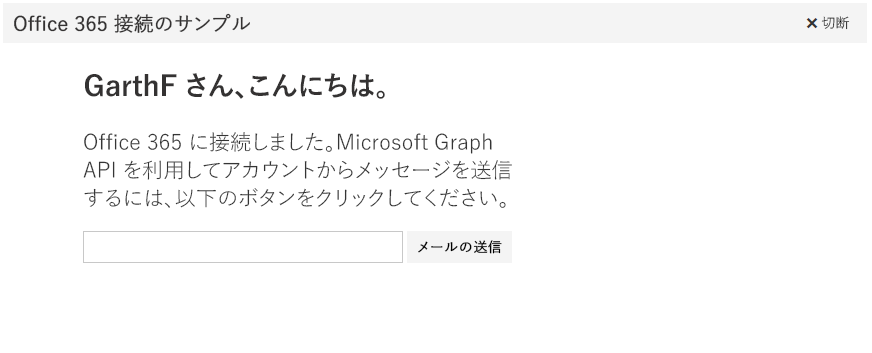

# <a name="get-started-with-microsoft-graph-in-a-python-app"></a>Python アプリで Microsoft Graph を使ってみる 

この記事では、Azure AD からアクセス トークンを取得し、Microsoft Graph を呼び出すために必要なタスクについて説明します。ここでは、[Python 用 Microsoft Graph Connect のサンプル](https://github.com/microsoftgraph/python3-connect-rest-sample)の手順と、Microsoft Graph API を使用するために実装する主要な概念について説明します。直接 REST 呼び出しを使用して Microsoft Graph にアクセスする方法について説明します。



##  <a name="prerequisites"></a>前提条件

* [Python 3.5.2](https://www.python.org/downloads/)
* [Flask-OAuthlib](https://github.com/lepture/flask-oauthlib)
* [Flask-Script 0.4](http://flask-script.readthedocs.io/en/latest/)
* [Microsoft アカウント](https://www.outlook.com/)または[ビジネス向けの Office 365 アカウント](https://msdn.microsoft.com/en-us/office/office365/howto/setup-development-environment#bk_Office365Account)
* [Python 用 Microsoft Graph Connect のサンプル](https://github.com/microsoftgraph/python3-connect-rest-sample)

## <a name="register-the-application-in-azure-active-directory"></a>Azure Active Directory にアプリケーションを登録する

最初に、アプリケーションを登録し、Microsoft Graph のサービスを使用するアクセス許可を設定する必要があります。これにより、ユーザーが職場または学校アカウントでアプリケーションにサインインできるようになります。

## <a name="register-the-application"></a>アプリケーションの登録

Microsoft アプリ登録ポータルでアプリを登録します。これにより、認証するアプリの構成に使用するアプリ ID とパスワードが生成されます。

1. 個人用アカウント、あるいは職場または学校アカウントのいずれかを使用して、[Microsoft アプリ登録ポータル](https://apps.dev.microsoft.com/)にサインインします。

2. **[アプリの追加]** を選択します。

3. アプリの名前を入力して、**[アプリケーションの作成]** を選択します。

    登録ページが表示され、アプリのプロパティが一覧表示されます。

4. アプリケーション ID をコピーします。これは、アプリの一意識別子です。

5. **[アプリケーション シークレット]** で、**[新しいパスワードを生成する]** を選択します。**[新しいパスワードが生成されました]** ダイアログからアプリ シークレットをコピーします。

    アプリを構成するには、アプリケーション ID とアプリ シークレットを使用します。

6. **[プラットフォーム]** で、**[プラットフォームの追加]** > **[Web]** の順に選択します。

7. **[暗黙的フローを許可する]** チェック ボックスが選ばれていることを確認して、リダイレクト URI として *http://localhost:5000/login/authorized* を入力します。

    **[暗黙的フローを許可する]** オプションにより、OpenID Connect ハイブリッド フローが有効になります。これにより、認証時にアプリはサインイン情報 (**id_token**) と成果物 (この場合は認証コード) の両方を受け取れるようになり、アプリはアクセス トークンを取得するときにこれらを使用できます。

    リダイレクト URI *http://localhost:5000/login/authorized* は、認証要求が処理されたときに OmniAuth ミドルウェアが使用するように構成される値です。

8. **[保存]** を選びます。

## <a name="create-oauth-client"></a>OAuth クライアントを作成する

OAuth フローを開始し、アクセス トークンを取得するために使用する Flask-OAuth クライアントのインスタンスをアプリに登録する必要があります。 

Connect サンプルでは、次のコード ([*connect/__init__.py*](https://github.com/microsoftgraph/python3-connect-rest-sample/blob/master/connect/__init__.py) にある) を使用し、ユーザーの認証に使用するアプリケーション ID (client_id)、アプリケーション シークレット (client_secret)、および認証 URL といったすべての必要な値を指定してクライアントを登録します。

```python
    # Put your consumer key and consumer secret into a config file
    # and don't check it into github!!
    microsoft = oauth.remote_app(
        'microsoft',
        consumer_key=client_id,
        consumer_secret=client_secret,
        request_token_params={'scope': 'User.Read Mail.Send'},
        base_url='https://graph.microsoft.com/v1.0/',
        request_token_url=None,
        access_token_method='POST',
        access_token_url='https://login.microsoftonline.com/common/oauth2/v2.0/token',
        authorize_url='https://login.microsoftonline.com/common/oauth2/v2.0/authorize'
    )
```

<!--<a name="authCode"></a>-->
## <a name="receive-an-authorization-code-in-your-reply-url-page"></a>応答 URL ページで認証コードを受け取る

ユーザーがサインインすると、ブラウザーは返信 URL ([*connect/__init__.py*](https://github.com/microsoftgraph/python3-connect-rest-sample/blob/master/connect/__init__.py) の ```login/authorized``` ルーティング) にリダイレクトされます。応答にはアクセス トークンが含まれます。サンプルでは、トークンはセッション変数として格納されます。

```python
    @app.route('/login/authorized')
    def authorized():
        response = microsoft.authorized_response()
    
        if response is None:
            return "Access Denied: Reason=%s\nError=%s" % (
                request.args['error'], 
                request.args['error_description']
            )
    
        # Check response for state
        if str(session['state']) != str(request.args['state']):
            raise Exception('State has been messed with, end authentication')
        # Remove state session variable to prevent reuse.
        session['state'] = ""
            
        # Okay to store this in a local variable, encrypt if it's going to client
        # machine or database. Treat as a password. 
        session['microsoft_token'] = (response['access_token'], '')
        # Store the token in another session variable for easy access
        session['access_token'] = response['access_token']
        meResponse = microsoft.get('me')
        meData = json.dumps(meResponse.data)
        me = json.loads(meData)
        userName = me['displayName']
        userEmailAddress = me['userPrincipalName']
        session['alias'] = userName
        session['userEmailAddress'] = userEmailAddress
        return redirect('main')
```

<!--<a name="request"></a>-->
## <a name="use-the-access-token-in-a-request-to-the-microsoft-graph-api"></a>Microsoft Graph API への要求にアクセス トークンを使用する

アクセス トークンを使用することにより、あなたのアプリは Microsoft Graph API へ認証された要求を行うことができます。アプリで各要求の **Authorization** ヘッダーにアクセス トークンを追加する必要があります。

接続サンプルは、Microsoft Graph API で ```me/microsoft.graph.sendMail``` エンドポイントを使用してメールを送信します。コードは [*connect/graph_service.py*](https://github.com/microsoftgraph/python3-connect-rest-sample/blob/master/connect/graph_service.py) ファイル内の ```call_sendMail_endpoint``` 関数に記述されています。これは、Authorization ヘッダーにアクセス コードを付加する方法を示すコードです。

```python
    # Set request headers.
    headers = { 
      'User-Agent' : 'python_tutorial/1.0',
      'Authorization' : 'Bearer {0}'.format(access_token),
      'Accept' : 'application/json',
      'Content-Type' : 'application/json'
    }
```

> **注**: 要求は **Content-Type** ヘッダーに `application/json` など、Graph API に受け入れられる値も指定して送信します。

Microsoft Graph API は、あらゆる種類の Microsoft データとの対話に使用できる、非常に強力な統合 API です。API リファレンスを参照し、Microsoft Graph で何を行うことができるかを調べてください。